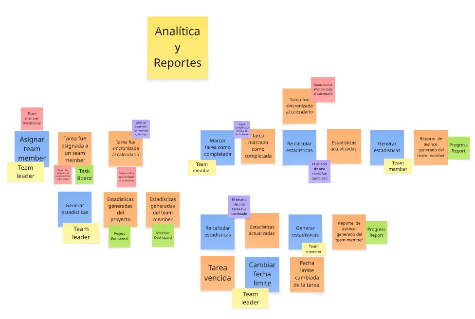
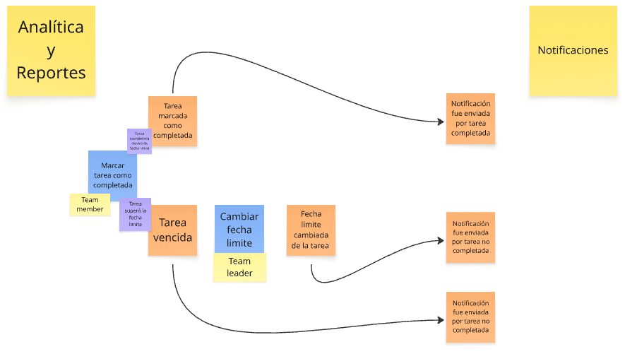
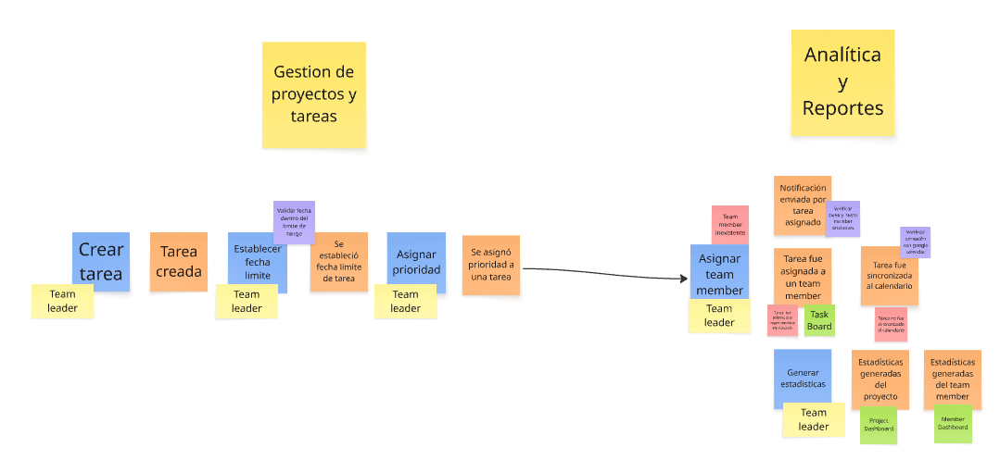
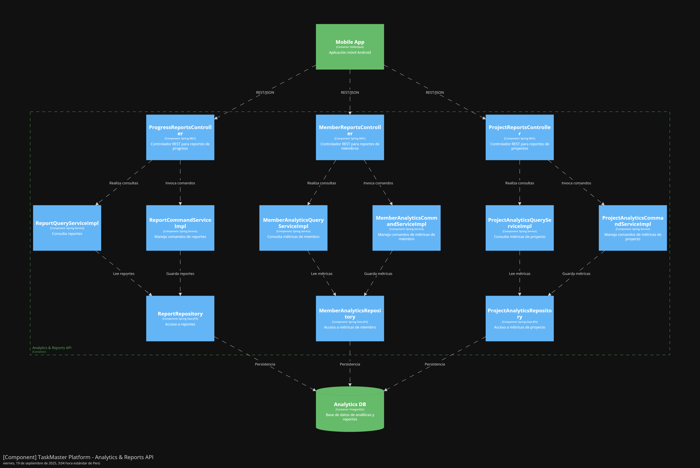

<h3 align ="center">
Universidad Peruana de Ciencias Aplicadas
</h3>

  

<h3 align="center">
Nombre del curso: Aplicaciones para Dispositivos Móviles
     
Carrera: Ingeniería de Software
     
Nombre del profesor: Eduardo Martin Reyes Rodriguez
     
NRC: 1813
     
"Informe de Trabajo Final"
     
Nombre de la Startup: WorkHub
     
Nombre del Producto: TaskMaster
     

     --Integrantes--

| 
Alumno
 | 
Código
 |
|:-------------------------------------------:|:-------------------------------------------:|
|Bejarano Martínez Alvaro Leandro| U202311640|
|Luquillas Asto Omar| U20211G641|
|Olivera Barzola Eric Marlon |U202315032|
|Sandoval Paiva Valentino |U20211a962|
|Sarmiento Medina Loreley |U202310005|
Septiembre de 2025
</h3>

## Registro de Versiones del Informe
| Versión | Fecha      | Autor | Descripción de modificación |
|---------|------------|-------|------------------------------|
| TB1     | 08/09/2025 | Bejarano Martínez Alvaro Leandro      |   **Completar**|
| TB1     | 08/09/2025 |Luquillas Asto Omar| |
| TB1     | 08/09/2025 |     Olivera Barzola Eric Marlon    |   |
| TB1     | 08/09/2025 |Sandoval Paiva Valentino||
| TB1     | 08/09/2025 |Sarmiento Medina Loreley||
## Project Report Collaboration Insights

|  URL del repositorio del reporte  |
| :-----------------------------------: |
| [https://github.com/CC238-Aplicaciones-Moviles/Report-Repository.git](https://github.com/CC238-Aplicaciones-Moviles/Report-Repository.git) |

TB1:

S

e presenta capturas 
en imagen de los analíticos de colaboración y commits en GitHub para el repositorio 
del informe, realizados por los miembros del equipo

## Contenido

- [Student Outcome](#student-outcome)

- [Objetivos SMART](#objetivos-SMART)

- [Capítulo I: Presentación](#capítulo-i-presentacion)
  - [1.1. Startup Profile](#11-startup-profile)
    - [1.1.1. Descripción de la Startup](#111-descripción-de-la-startup)
    - [1.1.2. Perfiles de integrantes del equipo](#112-perfiles-de-integrantes-del-equipo)
  - [1.2. Solution Profile](#12-solution-profile)
    - [1.2.1. Antecedentes y problemática](#121-antecedentes-y-problemática)
    - [1.2.2. Lean UX Process](#122-lean-ux-process)
      - [1.2.2.1. Lean UX Problem Statements](#1221-lean-ux-problem-statements)
      - [1.2.2.2. Lean UX Assumptions](#1222-lean-ux-assumptions)
      - [1.2.2.3. Lean UX Hypothesis Statements](#1223-lean-ux-hypothesis-statements)
      - [1.2.2.4. Lean UX Canvas](#1224-lean-ux-canvas)
  - [1.3. Segmentos Objetivo](#13-segmentos-objetivo)
- [Capítulo II: Requirements Elicitation & Analysis](#capítulo-ii-requirements-elicitation--analysis)
  - [2.1. Competidores](#21-competidores)
    - [2.1.1. Análisis competitivo](#211-análisis-competitivo)
    - [2.1.2. Estrategias y tácticas frente a competidores](#212-estrategias-y-tácticas-frente-a-competidores)
  - [2.2. Entrevistas](#22-entrevistas)
    - [2.2.1. Diseño de entrevistas](#221-diseño-de-entrevistas)
    - [2.2.2. Registro de entrevistas](#222-registro-de-entrevistas)
    - [2.2.3. Análisis de entrevistas](#223-análisis-de-entrevistas)
  - [2.3. Needfinding](#23-needfinding)
    - [2.3.1. User Personas](#231-user-personas)
    - [2.3.2. User Task Matrix](#232-user-task-matrix)
    - [2.3.3. User Journey Mapping](#233-user-journey-mapping)
    - [2.3.4. Empathy Mapping](#234-empathy-mapping)
    - [2.3.5. Ubiquitous Language](#235-ubiquitous-language)
  - [2.4. Requirements specification](#24-requirements-specification)
    - [2.4.1. User Stories](#241-user-stories)
    - [2.4.2. Impact Mapping](#242-impact-mapping)
    - [2.4.3. Product Backlog](#243-product-backlog)
  - [2.5. Strategic-Level Domain-Driven Design](#25-strategic-level-domain-driven-design)
     - [2.5.1. EventStorming](#251-eventstorming)
       - [2.5.1.1. Candidate Context Discovery](#2511-candidate-context-discovery)
       - [2.5.1.2. Domain Message Flows Modeling](#2512-domain-message-flows-modeling)
       - [2.5.1.3. Bounded Context Canvases](#2513-bounded-context-canvases)
    - [2.5.2. Context Mapping](#252-context-mapping)
    - [2.5.3. Software Architecture](#253-software-architecture)
      - [2.5.3.1. Software Architecture Context Level Diagrams](#2531-software-architecture-context-level-diagrams)
      - [2.5.3.2. Software Architecture Container Level Diagrams](#2532-software-architecture-container-level-diagrams)
      - [2.5.3.3. Software Architecture Deployment Level Diagrams](#2533-software-architecture-deployment-level-diagrams)
  - [2.6. Tactical-Level Domain-Driven Design](#26-tactical-level-domain-driven-design)
    - [2.6.1. Bounded Context: Gestión de Proyectos y Tareas](#261-bounded-context-gestión-de-proyectos-y-tareas)
      - [2.6.1.1. Domain Layer](#2611-domain-layer)
      - [2.6.1.2. Interface Layer](#2612-interface-layer)
      - [2.6.1.3. Application Layer](#2613-application-layer)
      - [2.6.1.4. Infrastructure Layer](#2613-infrastructure-layer)
      - [2.6.1.5. Bounded Context Software Architecture Component Level Diagrams](#2613-bounded-context-software-architecture-component-level-diagrams)
      - [2.6.1.6. Bounded Context Software Architecture Code Level Diagrams](#2613-bounded-context-software-architecture-code-level-diagrams)
           -[2.6.1.6.1. Bounded Context Domain Layer Class Diagrams](#2613-bounded-context-domain-layer-class-diagrams)
           -[2.6.1.6.2. Bounded Context Database Design Diagrams](#2613-bounded-context-database-design-diagrams)
    - [2.6.2. Bounded Context: Analítica y Reportes](#262-bounded-context-analítica-y-reportes)
      - [2.6.2.1. Domain Layer](#2621-domain-layer)
      - [2.6.2.2. Interface Layer](#2622-interface-layer)
      - [2.6.2.3. Application Layer](#2623-application-layer)
      - [2.6.2.4. Infrastructure Layer](#2624-infrastructure-layer)
      - [2.6.2.5. Bounded Context Software Architecture Component Level Diagrams](#2625-bounded-context-software-architecture-component-level-diagrams)
      - [2.6.2.6. Bounded Context Software Architecture Code Level Diagrams](#2626-bounded-context-software-architecture-code-level-diagrams)
           -[2.6.2.6.1. Bounded Context Domain Layer Class Diagrams](#26261-bounded-context-domain-layer-class-diagrams)
           -[2.6.2.6.2. Bounded Context Database Design Diagrams](#26262-bounded-context-database-design-diagrams)
    - [2.6.3. Bounded Context: Visualización y Seguimiento](#263-bounded-context-visualización-y-seguimiento)
      - [2.6.3.1. Domain Layer](#2631-domain-layer)
      - [2.6.3.2. Interface Layer](#2632-interface-layer)
      - [2.6.3.3. Application Layer](#2633-application-layer)
      - [2.6.3.4. Infrastructure Layer](#2634-infrastructure-layer)
      - [2.6.3.5. Bounded Context Software Architecture Component Level Diagrams](#2635-bounded-context-software-architecture-component-level-diagrams)
      - [2.6.3.6. Bounded Context Software Architecture Code Level Diagrams](#2636-bounded-context-software-architecture-code-level-diagrams)
           -[2.6.3.6.1. Bounded Context Domain Layer Class Diagrams](#26361-bounded-context-domain-layer-class-diagrams)
           -[2.6.3.6.2. Bounded Context Database Design Diagrams](#26362-bounded-context-database-design-diagrams)
    - [2.6.4. Bounded Context: Registro y Autenticación de Usuario](#264-bounded-context-registro-y-autenticación-de-usuario)
      - [2.6.4.1. Domain Layer](#2641-domain-layer)
      - [2.6.4.2. Interface Layer](#2642-interface-layer)
      - [2.6.4.3. Application Layer](#2643-application-layer)
      - [2.6.4.4. Infrastructure Layer](#2644-infrastructure-layer)
      - [2.6.4.5. Bounded Context Software Architecture Component Level Diagrams](#2645-bounded-context-software-architecture-component-level-diagrams)
      - [2.6.4.6. Bounded Context Software Architecture Code Level Diagrams](#2646-bounded-context-software-architecture-code-level-diagrams)
           -[2.6.4.6.1. Bounded Context Domain Layer Class Diagrams](#26461-bounded-context-domain-layer-class-diagrams)
           -[2.6.4.6.2. Bounded Context Database Design Diagrams](#26462-bounded-context-database-design-diagrams)
    - [2.6.5. Bounded Context: Notificaciones](#265-bounded-context-notificaciones)
      - [2.6.5.1. Domain Layer](#2651-domain-layer)
      - [2.6.5.2. Interface Layer](#2652-interface-layer)
      - [2.6.5.3. Application Layer](#2653-application-layer)
      - [2.6.5.4. Infrastructure Layer](#2654-infrastructure-layer)
      - [2.6.5.5. Bounded Context Software Architecture Component Level Diagrams](#2655-bounded-context-software-architecture-component-level-diagrams)
      - [2.6.5.6. Bounded Context Software Architecture Code Level Diagrams](#2656-bounded-context-software-architecture-code-level-diagrams)
           -[2.6.5.6.1. Bounded Context Domain Layer Class Diagrams](#26561-bounded-context-domain-layer-class-diagrams)
           -[2.6.5.6.2. Bounded Context Database Design Diagrams](#26562-bounded-context-database-design-diagrams)
- [Conclusiones](#conclusiones)
- [Bibliografía](#bibliografía)
- [Anexos](#anexos)

## Student Outcome
El curso contribuye al cumplimiento del Student Outcome ABET:
**ABET - EAC - Student Outcome 7 Criterio**: La capacidad de adquirir y aplicar nuevos conocimientos según sea
necesario, utilizando estrategias deaprendizaje apropiadas.
En elsiguiente cuadro se describe las accionesrealizadas y enunciados de conclusiones por parte del grupo, que permiten sustentar el haber alcanzado los criterios especificos.
  
| Criterio específico | Acciones realizadas | Conclusiones |
|---------------------|---------------------|--------------|
| Actualiza conceptos y conocimientos necesarios para su desarrollo profesional y en especial para su proyecto en soluciones de software.|- **Bejarano Martínez, Álvaro Leandro** **TB1** - Luquillas Asto, Omar **TB1** - Olivera Barzola, Eric Marlon **TB1** -Sandoval Paiva Valentino **TB1** -Sarmiento Medina, Loreley **TB1**                      |              |
|Reconoce la necesidad del aprendizaje permanente para el desempeño profesional y el desarrollo de proyectos en soluciones de software.|- **Bejarano Martínez, Álvaro Leandro** **TB1** - Luquillas Asto, Omar **TB1** - Olivera Barzola, Eric Marlon **TB1** -Sandoval Paiva Valentino **TB1** -Sarmiento Medina, Loreley **TB1**                        |              |
|

## Objetivos SMART
ncorporar una sección en una nueva página, situada después de la sección Student 
Outcome, donde cada miembro del equipo de trabajo formule un plan que incluya al 
menos dos objetivos SMART. Estos objetivos deben centrarse en el desarrollo 
profesional de cada estudiante una vez finalizada su carrera. El propósito es que los 
objetivos reflejen de manera clara y medible cómo cada integrante planea alcanzar un 
crecimiento profesional continuo tras su graduación. 

<h3>Eric Marlon Olivera Barzola
  - Esto falta completar
  - dasdasdas

## Capítulo I: Presentación  
### 1.1. Startup Profile  

En muchas empresas, los proyectos se gestionan de manera desordenada utilizando múltiples herramientas desconectadas como Excel, correos y chats. Esto genera duplicidad de esfuerzos, falta de visibilidad del progreso y dificultades para controlar los recursos financieros. Frente a esta realidad, nace nuestra startup, una organización que busca transformar la forma en que los equipos trabajan y colaboran, brindándoles soluciones tecnológicas que simplifiquen la gestión de proyectos.

Nuestra propuesta surge también de la necesidad de que la gestión empresarial sea más accesible y flexible, especialmente en un entorno donde los profesionales están cada vez más conectados desde sus dispositivos móviles. Por ello, creemos firmemente que la gestión de proyectos debe poder realizarse desde la palma de la mano, sin depender únicamente de un escritorio u oficina.

#### 1.1.1. Descripción de la Startup  

Nuestra empresa se dedica al desarrollo de soluciones digitales que transformen la manera en que los equipos gestionan sus proyectos y recursos. Nos enfocamos en pequeñas y medianas empresas que necesitan herramientas accesibles y efectivas, evitando la complejidad y los altos costos de otras alternativas.

Por ello, desarrollamos TaskMaster, una plataforma digital de gestión de proyectos colaborativos empresariales diseñada para optimizar la organización, asignación y supervisión de tareas en equipos de trabajo. Integra herramientas visuales como tableros Kanban, calendarios y métricas de desempeño, además de un módulo financiero que permite controlar presupuestos, gastos y pagos en tiempo real.

**Objetivo:**
Brindar a las empresas una solución centralizada que facilite la planificación, ejecución y control de proyectos, mejorando la eficiencia, la colaboración entre equipos y la gestión de recursos.

**Misión**
Facilitar a las organizaciones la gestión de proyectos mediante una plataforma intuitiva y colaborativa que integre tanto la productividad del equipo como el control financiero, impulsando la eficiencia y la transparencia.

**Visión**
Convertirnos en la organización líder en Latinoamérica en el desarrollo de soluciones móviles de gestión de proyectos empresariales, reconocida por su capacidad de simplificar la colaboración y aportar valor estratégico en la toma de decisiones.

#### 1.1.2. Perfiles de integrantes del equipo  
|                             | Miembros del equipo        | Codigo Estudiante |          Descripcion            |
|------------------| ----------------------------------------------- | ----------------- | ---------------------- |
|      |Eric Marlon Olivera Barzola | U202315032|     |
|      |                            |       |         |
|      |                            |       |         |
|      |                            |       |         |
|      | Loreley Sarmiento Medina   | U202310005 | Me interesa el desarrollo frontend, principalmente con Angular, creando interfaces dinámicas y centradas en el usuario. Utilizo herramientas como GitHub para organizar proyectos y colaborar en equipo, y me motiva aprender constantemente nuevas tecnologías que fortalezcan mis capacidades técnicas.Además, destaco por mis habilidades blandas, como el trabajo en equipo, la adaptabilidad y la comunicación efectiva, que me permiten integrarme fácilmente en proyectos multidisciplinarios. Soy una persona responsable, proactiva y creativa, cualidades que me impulsan a asumir retos y aportar soluciones que sumen al desarrollo integral del producto. |

### 1.2. Solution Profile 

En muchas empresas, los proyectos se gestionan de manera desordenada utilizando múltiples herramientas desconectadas (Excel, correos, chats). Esto genera duplicidad de esfuerzos, falta de visibilidad del progreso y dificultades para controlar los recursos financieros asociado.

- **La solución debe abordar principalmente:**

  - Elaboración de la gestión de proyectos: unificar tareas, cronogramas y comunicación en un solo espacio.
  - Colaboración en tiempo real: permitir que los miembros actualicen avances y reciban notificaciones inmediatas.
  - Asignación de responsabilidades: con roles definidos (jefes de proyecto y miembros).
  - Seguimiento del progreso: mediante tableros visuales y calendarios.

- **Restricciones y Alcance**

  - Restricciones técnicas: la plataforma debe ser accesible desde dispositivos móvile, con una interfaz intuitiva y adaptable.
  - Alcance inicial: orientada a pequeñas y medianas empresas que requieren optimizar la gestión de proyectos sin recurrir a soluciones costosas y complejas.
  - Limitación funcional inicial: el módulo financiero se centrará en presupuestos y pagos básicos, con posibilidad de ampliación en futuras versiones.

#### 1.2.1. Antecedentes y problemática  

En el entorno empresarial actual, las organizaciones suelen depender de múltiples herramientas dispersas —como hojas de cálculo, correos electrónicos, aplicaciones de mensajería y sistemas separados para finanzas o planificación— lo que genera una gestión de proyectos fragmentada. Esta dispersión provoca una pérdida considerable de tiempo, disminución de productividad y, en muchos casos, pérdida de ingresos. Un informe de Quickbase (2023) encontró que los sistemas fragmentados son responsables de graves impactos en la eficiencia organizacional y los resultados financieros. Además, Atlassian (2024) observa que el 56 % de los trabajadores del conocimiento sufren flujos de trabajo desconectados por variaciones en la forma de seguimiento del trabajo, lo que obstaculiza la visibilidad y la colaboración eficaz.

**1. What / ¿QUÉ?**

¿Cuál es el problema?  
Las empresas utilizan múltiples herramientas desconectadas como Excel, correos, mensajería instantánea para gestionar proyectos. Esto genera fragmentación, duplicidad de información, retrasos y pérdida de visibilidad sobre el progreso y los costos.

¿Cuál es la relación con la persona en cuestión?  
Los líderes de proyecto enfrentan dificultad para coordinar tareas y controlar recursos, mientras que los colaboradores gastan tiempo buscando información y actualizando manualmente avances en distintas plataformas.

**2. When / ¿CUÁNDO?**

¿Cuándo sucede el problema?  
De forma constante durante el ciclo de vida de los proyectos, especialmente en la planificación, el seguimiento de avances y el control financiero.

¿Cuándo utiliza el cliente el producto?  
El cliente (líder o miembro de equipo) utiliza TaskMaster diariamente, tanto en la asignación/ejecución de tareas como en la revisión de métricas y reportes.

**3. Where / ¿DÓNDE?**

¿Dónde está el cliente cuando usa el producto?  
En entornos de oficina, en modalidad híbrida o trabajo remoto. El producto se usa principalmente desde computadoras y dispositivos móviles.

¿Dónde surge el problema?  
En la dispersión digital: cuando la información está repartida en varias aplicaciones no integradas.

**4. Who / ¿QUIÉN?**

¿Quiénes se ven involucrados en el problema? 

Jefes de proyecto → responsables de coordinar equipos y controlar resultados.
Miembros de equipo → encargados de ejecutar tareas y reportar avances.

¿Cuáles son las causas del problema? 
  - Uso de demasiadas aplicaciones sin integración.
  - Dependencia de procesos manuales.
  - Falta de visibilidad centralizada en la gestión de proyectos.

**5. Why / ¿POR QUÉ?**
¿Por qué sucede el problema? 

Porque las empresas suelen adoptar herramientas aisladas que resuelven problemas específicos (calendarios, chats, finanzas, gestión de tareas), pero no integran toda la operación en un mismo ecosistema.

Esto genera duplicidad, trabajo extra y decisiones basadas en información incompleta.

**6. How / ¿CÓMO?**

¿En qué condiciones los clientes usan nuestro producto?   
En entornos de proyectos colaborativos, con equipos distribuidos, necesidad de comunicación rápida y presión por cumplir plazos y presupuestos.

¿Cómo se diferencia el problema del estado normal (óptimo)?   
En un estado óptimo, la gestión debería ser fluida, centralizada y con datos actualizados en tiempo real. Actualmente, existe fricción por la fragmentación de sistemas.

**7. How Much / ¿CUÁNTO?**

¿Cuántos problemas se dan en un día, una semana o un mes?   
Según Quickbase (2023), el 70 % de los empleados pierde hasta 20 horas por semana debido a sistemas fragmentados. Esto equivale a medio tiempo laboral desperdiciado por cada trabajador.

¿Cuánto dinero están implicando?   
Atlassian (2024) reporta que las organizaciones con ecosistemas desconectados tienen un 37 % menos probabilidad de cumplir sus metas de ingresos. Además, Forrester (2024) encontró que el 76 % de las PMOs usan cinco o más herramientas por proyecto, generando pérdidas de hasta un 23 % del tiempo semanal en tareas redundantes.

#### 1.2.2. Lean UX Process  

Según Pragma (2021), el proceso Lean UX es la mezcla de metodologías ágiles y temas de usabilidad, donde se prioriza la experiencia de usuario por la creación de un producto. Teniendo en cuenta ello, hemos elaborado nuestro Lean UX process basándonos en sus cuatro pilares principales: problem statements, assumptions, hypothesis y canvas.

##### 1.2.2.1. Lean UX Problem Statements

**Problem Statement #1 – Jefes de Proyecto**

Nuestra plataforma busca brindar a los jefes de proyecto una herramienta centralizada que integre la asignación de tareas, el seguimiento de avances y la gestión financiera, garantizando mayor control y visibilidad en sus proyectos.Hemos identificado que los jefes de proyecto enfrentan dificultades para coordinar equipos cuando la información está dispersa en múltiples herramientas (hojas de cálculo, correos, chats y sistemas financieros independientes). Esta situación provoca retrasos, duplicación de esfuerzos, falta de transparencia en el uso de recursos y complicaciones en la toma de decisiones.

Ante este desafío, surge la pregunta clave: ¿Cómo podemos garantizar que los jefes de proyecto tengan un espacio centralizado para coordinar equipos, supervisar avances y controlar finanzas de manera eficiente y en tiempo real?

**Problem Statement #2 – Miembros de Equipo**

Nuestra plataforma busca ofrecer a los miembros de equipo un espacio único y sencillo donde puedan visualizar sus tareas, plazos y prioridades, colaborando de forma más ágil y organizada.
Hemos identificado que los colaboradores suelen perder tiempo al cambiar entre diferentes canales de comunicación y hojas de cálculo, lo que genera confusión en responsabilidades, olvidos de plazos y baja productividad. Esta dispersión afecta el rendimiento individual y colectivo, además de impactar negativamente en la satisfacción y el clima laboral.

Ante este desafío, surge la pregunta clave: ¿Cómo podemos brindar a los miembros de equipo una herramienta unificada que simplifique la organización de tareas, reduzca la confusión y fomente la colaboración efectiva en los proyectos?

##### 1.2.2.2. Lean UX Assumptions

**Business Assumptions (Suposiciones de Negocio)**

- Creo que mis clientes tienen la necesidad de: Centralizar la gestión de proyectos en una sola plataforma, evitando el uso disperso de herramientas como Excel, correos y chats.
- Estas necesidades se pueden resolver con: Una plataforma digital colaborativa que integre tableros Kanban, calendarios, asignación de tareas, métricas de desempeño y un módulo financiero básico.
- Mis clientes iniciales son (o serán): Pequeñas y medianas empresas con equipos de desarrollo o áreas de proyectos que buscan mejorar la organización y el control de sus recursos.
- El valor principal que los clientes quieren obtener de mi servicio es: Mayor eficiencia y visibilidad en la planificación y ejecución de proyectos.
Beneficios adicionales que también pueden obtener: Mejor colaboración entre miembros, reducción de errores, control de presupuestos y reportes para decisiones estratégicas.
- Adquiriré a la mayoría de mis clientes a través de: Estrategias de marketing digital (redes sociales, LinkedIn), demostraciones gratuitas de la plataforma y recomendaciones entre contactos en el sector empresarial.
- Ganaré dinero mediante: Un modelo de licenciamiento, con una versión gratuita limitada y planes de pago según el tamaño de la empresa o número de miembros y sus necesidades.
- Mi principal competencia en el mercado será: Algunas competencias serán las plataformas similares como Trello, Asana, o Jira.
Los superaremos debido a: Un enfoque en la integración financiera simple, precios más accesibles para pymes y una interfaz intuitiva que no requiera mucha capacitación.
- Mi mayor riesgo de producto es: Que las empresas perciban a TaskMaster como una herramienta redundante frente a soluciones ya conocidas.
Lo resolveremos mediante: Diferenciación en la propuesta de valor (finanzas integradas + simplicidad) y versiones de prueba gratuitas para demostrar beneficios reales.
- Otras suposiciones que, si resultan falsas, harán que nuestro proyecto fracase:
  - Que las pymes estén dispuestas a pagar por una solución digital en lugar de continuar con herramientas gratuitas.
  - Que los usuarios puedan adoptar rápidamente la plataforma sin necesidad de largos procesos de capacitación.

**User Assumptions (Suposiciones de Usuario)**

- ¿Quién es el usuario?: Nuestros usuarios serán líderes o gerentes de empresas como Product Owners, Scrum Masters o jefes de proyectos y los miembros de equipos de desarrollo o colaboradores en proyectos empresariales.
- ¿Dónde encaja nuestro producto en su trabajo o vida?: Dentro del entorno laboral, como herramienta diaria de planificación, asignación y seguimiento de tareas.
- ¿Qué problemas resuelve nuestro producto?: Nuestro producto resuelve los siguientes problemas.
  -	La dispersión de información entre múltiples canales.
  -	La falta de visibilidad sobre el progreso del proyecto.
  -	Las dificultades para controlar recursos financieros y plazos.
- ¿Cuándo y cómo se usa nuestro producto?: Se utiliza de forma continua durante la jornada laboral, principalmente desde computadoras o dispositivos móviles, para registrar avances, asignar tareas y revisar métricas de desempeño.
- ¿Qué características son importantes?: Las características más importantes de nuestro producto son.
  -	Seguimiento del progreso mediante tableros Kanban.
  -	Asignación clara de tareas y roles.
  -	Colaboración en tiempo real.
  -	Reportes de progreso y métricas.
  -	Módulo financiero básico (presupuestos y pagos).
- ¿Cómo debería verse y comportarse nuestro producto?: Debe tener una interfaz moderna, intuitiva y fácil de aprender, con navegación clara, diseño adaptable (responsive) y elementos visuales que permitan identificar avances y pendientes de un vistazo.

##### 1.2.2.3. Lean UX Hypothesis Statements

Hypothesis Statement 01:

- Creemos que centralizar las tareas, cronogramas y comunicación en una sola plataforma para pymes aumentará la eficiencia de sus equipos de trabajo.
- Sabremos que estamos en lo correcto cuando veamos que más del 70 % de los usuarios reporten menos uso de herramientas externas como Excel o chats dispersos.

Hypothesis Statement 02:

- Creemos que implementar tableros Kanban y calendarios interactivos para líderes de proyectos mejorará la visibilidad del progreso.
- Sabremos que estamos en lo correcto cuando recibamos retroalimentación positiva en encuestas y un aumento en la frecuencia de consulta de estos módulos.

Hypothesis Statement 03:

- Creemos que ofrecer un módulo financiero básico (presupuestos y pagos) para gerentes facilitará el control de recursos.
- Sabremos que estamos en lo correcto cuando observemos que al menos el 60 % de los clientes activos utilizan regularmente el módulo financiero.

Hypothesis Statement 04:

- Creemos que una interfaz intuitiva y fácil de usar acelerará la adopción de la plataforma.
- Sabremos que estamos en lo correcto cuando nuevos usuarios completen su primera tarea en menos de 10 minutos de uso.

Hypothesis Statement 05:

- Creemos que ofrecer una versión de prueba gratuita aumentará la tasa de conversión a clientes de pago.
- Sabremos que estamos en lo correcto cuando al menos el 30 % de los usuarios de prueba pasen a un plan de suscripción.

Hypothesis Statement 06:

- Creemos que integrar métricas de desempeño para líderes de proyectos mejorará la toma de decisiones estratégicas.
- Sabremos que estamos en lo correcto cuando los usuarios reporten mayor confianza al presentar reportes a sus superiores.

Hypothesis Statement 07:

- Creemos que la posibilidad de asignar roles claros (jefe de proyecto, miembro) aumentará la organización interna.
- Sabremos que estamos en lo correcto cuando disminuya el número de tareas duplicadas o sin responsable asignado.

Hypothesis Statement 08:

- Creemos que permitir el acceso desde dispositivos móviles incrementará la frecuencia de uso diario.
- Sabremos que estamos en lo correcto cuando veamos que más del 50 % de las sesiones provienen de smartphones o tablets.

Hypothesis Statement 09:

- Creemos que un precio accesible y escalable atraerá a pequeñas y medianas empresas frente a competidores más costosos.
- Sabremos que estamos en lo correcto cuando los clientes comparen TaskMaster favorablemente con Asana o Jira en entrevistas cualitativas.

Hypothesis Statement 10:

- Creemos que brindar reportes automáticos de avance reducirá la carga administrativa de los líderes.
- Sabremos que estamos en lo correcto cuando los usuarios indiquen que ya no necesitan generar reportes manuales en Excel.

Hypothesis Statement 11:

- Creemos que el diseño visual atractivo y moderno motivará un uso más constante de la plataforma.
- Sabremos que estamos en lo correcto cuando los usuarios activos se conecten al menos 3 veces por semana.

Hypothesis Statement 12:

- Creemos que los recordatorios automáticos de vencimientos ayudarán a reducir retrasos en los proyectos.
- Sabremos que estamos en lo correcto cuando el porcentaje de tareas finalizadas en fecha aumente mes a mes.

Hypothesis Statement 13:

- Creemos que el soporte técnico rápido y accesible aumentará la satisfacción del cliente.
- Sabremos que estamos en lo correcto cuando la calificación promedio de soporte sea superior a 4/5.

Hypothesis Statement 14:

- Creemos que la segmentación de proyectos por áreas o departamentos facilitará la organización en empresas con varios equipos.
- Sabremos que estamos en lo correcto cuando las empresas medianas gestionen más de 2 proyectos simultáneamente en la plataforma.

Hypothesis Statement 15:

- Creemos que la seguridad en el manejo de datos financieros incrementará la confianza de los clientes.
- Sabremos que estamos en lo correcto cuando no tengamos reportes de incidentes graves y los usuarios destaquen positivamente la seguridad en encuestas.

##### 1.2.2.4. Lean UX Canvas  
### 1.3. Segmentos Objetivo

**Segmento Objetivo 1: Líder o Gerente de Empresa**

Este segmento corresponde a profesionales que ocupan cargos de liderazgo dentro de organizaciones del sector tecnológico o empresarial, tales como gerentes de proyectos, jefes de innovación o líderes de área. Su rol principal consiste en tomar decisiones estratégicas, gestionar recursos y coordinar equipos en proyectos de desarrollo ágil.

- **Características Demográficas:**

En general, suelen encontrarse en el rango de edad de 30 a 50 años, cuentan con estudios universitarios o de posgrado, y residen principalmente en centros urbanos como Lima, Arequipa o Trujillo, donde se concentra la mayor cantidad de empresas con proyectos tecnológicos.

- **Información Estadística de Sustento:**

Según el Informe del INEI (2023), el 65 % de las empresas medianas y grandes del Perú se ubican en Lima Metropolitana, siendo estas las que mayormente adoptan metodologías de gestión de proyectos ágiles. Asimismo, un estudio de Everis y EY (2022) señala que más del 40 % de las empresas peruanas del sector financiero y tecnológico ya han implementado roles asociados a Scrum Master y Product Owner, lo que refleja la creciente relevancia de este segmento para proyectos de desarrollo ágil.

**Segmento Objetivo 2: Equipo de Desarrollo de Proyectos**

Este segmento está conformado por profesionales que se desempeñan como programadores, diseñadores, analistas de sistemas o testers. Su rol es implementar soluciones técnicas, colaborar en la construcción de software y adaptarse a metodologías ágiles bajo la guía de los líderes de proyecto.

- **Características Demográficas:**

En su mayoría, son profesionales jóvenes entre 22 y 35 años, muchos de ellos egresados recientes o estudiantes de los últimos ciclos de carreras de ingeniería de software, sistemas o afines. Están ubicados principalmente en Lima y en regiones con polos tecnológicos como Cusco, Arequipa y La Libertad. Se caracterizan por un alto nivel de adopción tecnológica y el uso frecuente de herramientas colaborativas.

- **Información Estadística de Sustento:**

De acuerdo con el Banco Interamericano de Desarrollo (BID, 2021), en el Perú se proyecta una demanda de más de 30,000 profesionales de tecnologías de la información hacia el 2025. Asimismo, la Encuesta Nacional de Innovación en la Industria (INEI, 2022) señala que un 37 % de las empresas que desarrollan proyectos de innovación tecnológica han incorporado equipos de desarrollo de software en su estructura, lo cual evidencia la importancia de este grupo como segmento objetivo.

## Capítulo II: Requirements Elicitation & Analysis
### 2.1. Competidores  

En esta sección se expone un análisis de los principales competidores de WorkHub, poniendo el foco en aquellos que operan bajo modelos de negocio digitales similares o que, aunque no coincida por completo, ofrecen productos o servicios que se solapan parcialmente con nuestra propuesta. Se consideran tanto los competidores directos, que actúan en el mismo segmento de mercado, como los indirectos, que abarcan ámbitos relacionados con la organización de tareas, la planificación de actividades y la gestión colaborativa de equipos.

**1. Wrike**

**Descripción:**

Wrike es una plataforma de gestión de proyectos y trabajo colaborativo diseñada para equipos de distintos tamaños. Permite planificar, priorizar y dar seguimiento a tareas en tiempo real, con funcionalidades orientadas a mejorar la visibilidad del flujo de trabajo y la comunicación entre los miembros del equipo.

**Características principales:**
- Organización de proyectos mediante diagramas de Gantt, tableros Kanban, calendarios y listas.

- Creación de tareas, subtareas y dependencias para una planificación detallada.

- Colaboración centralizada con comentarios, menciones, archivos adjuntos y aprobaciones en línea.

- Automatización de flujos de trabajo y recordatorios para reducir tareas repetitivas.

- Reportes personalizables con métricas de desempeño y paneles de control en tiempo real.

- Integraciones con más de 400 herramientas, incluyendo Slack, Salesforce, Microsoft Teams y Google Workspace.

- Aplicación móvil con acceso a tareas, notificaciones y actualización de proyectos desde cualquier lugar.

**2. Trello**

**Descripción:**

Trello es una herramienta de gestión de proyectos basada en tableros Kanban, diseñada para facilitar la organización visual de tareas y proyectos. Su interfaz intuitiva y flexible lo convierte en una opción popular para equipos que buscan simplicidad y colaboración en tiempo real.

**Características principales:**

- Tableros, listas y tarjetas para organizar proyectos y tareas de forma visual.

- Personalización de tarjetas con etiquetas, fechas de vencimiento, checklists y archivos adjuntos.

- Colaboración en equipo mediante comentarios, menciones y notificaciones.

- Automatización de tareas con Butler (reglas, recordatorios y acciones automáticas).

- Integraciones con herramientas como Slack, Google Drive, Jira, Dropbox y más.

- Plantillas predefinidas para distintos tipos de proyectos y flujos de trabajo.

- Aplicación móvil con acceso completo a tableros y colaboración en cualquier lugar.

**3. ClickUp**

**Descripción:**

ClickUp es una plataforma de productividad y gestión de proyectos todo en uno que busca centralizar tareas, documentos, comunicación y seguimiento de objetivos en un solo lugar. Está pensada para equipos que necesitan una solución flexible y personalizable, adaptándose tanto a proyectos simples como a flujos de trabajo complejos.

**Características principales:**

- Organización de proyectos mediante listas, tableros Kanban, calendarios, cronogramas y diagramas de Gantt.

-Gestión detallada de tareas con subtareas, prioridades, dependencias y asignaciones múltiples.

- Colaboración en tiempo real con comentarios, menciones, chat integrado y documentos compartidos.

- Paneles de control e informes personalizables para monitorear productividad y avances.

- Funcionalidades de seguimiento de tiempo y estimaciones de esfuerzo.

- Automatización de procesos para reducir tareas repetitivas.

- Amplia integración con herramientas como Slack, GitHub, Zoom, Google Workspace, entre otras.

- Aplicación móvil y de escritorio con sincronización completa para trabajar desde cualquier dispositivo.

#### 2.1.1. Análisis competitivo  

| **Categoría** | **Nombre de las Startups o Empresas** | **Nuestra Startup** | **Competidor 1** | **Competidor 2** | **Competidor 3** |
|---------------|----------------------------------------|-------------|-----------|------------|-------------|
| **Perfil** | Overview | **WorkHub**   | **Wrike**  | **Trello**  | **ClickUp**  |
|  | Ventaja competitiva (valor para el cliente) | Interfaz intuitiva y sencilla, diseñada para ser usada antes, durante y después del ciclo de vida del desarrollo de software. | Análisis predictivos, automatización avanzada y colaboración en tiempo real para mejorar productividad y visibilidad de proyectos. | Interfaz visual e intuitiva, ideal para equipos pequeños y startups que buscan simplicidad. | Plataforma altamente personalizable, integra gestión de tareas, tiempo y recursos en un solo lugar. |
| **Perfil de Marketing** | Mercado Objetivo | Startups de tecnología que buscan eficiencia y colaboración en equipos de desarrollo. | Empresas medianas y grandes con proyectos complejos que requieren integración avanzada. | Equipos pequeños y startups que necesitan gestión visual y simple de proyectos. | Startups, pymes y empresas que buscan una solución flexible y completa de gestión. |
|  | Estrategias de Marketing | Marketing digital dirigido a comunidades tecnológicas, pruebas gratuitas y asociaciones estratégicas. | Posicionamiento como herramienta robusta y flexible, demostraciones personalizadas y enfoque en integraciones. | Estrategia enfocada en simplicidad y accesibilidad, resaltando su facilidad de uso e integraciones populares. | Estrategia como alternativa económica y todo-en-uno, con fuerte enfoque en personalización y escalabilidad. |
| **Perfil del Producto** | Productos y servicios | Plataforma colaborativa en tiempo real, con edición simultánea de documentos y un espacio de trabajo unificado. | Herramientas de gestión de proyectos completas: planificación, ejecución, paneles de control, cronogramas de Gantt y flujos automatizados. | Tableros Kanban para gestión visual de proyectos, con listas, etiquetas y archivos adjuntos. | Gestión de tareas, seguimiento de tiempo, automatización de flujos y colaboración integrada. |
|  | Precios y Costos | Planes escalables desde versión gratuita para startups en etapas iniciales. | Plan gratuito limitado + planes premium desde $9.80 por usuario/mes. | Plan gratuito limitado + planes premium desde $5 por usuario/mes. | Plan gratuito robusto + planes pagos desde $5 por usuario/mes. |
|  | Canales de distribución (Web y/o Móvil) | SaaS en la nube accesible desde navegador, con integraciones como Slack y Google Workspace. | Distribución vía web oficial, apps móviles y con integraciones (Microsoft Teams, Salesforce). | Distribución vía web oficial y apps móviles (iOS, Android). | Distribución vía web, apps móviles y extensiones para navegador. |
| **Análisis SWOT** | Fortalezas | Innovación en colaboración en tiempo real, enfoque en startups. | Funcionalidad robusta, integraciones empresariales, análisis predictivo. | Interfaz simple e intuitiva, accesibilidad amplia, múltiples integraciones. | Altamente personalizable, buena relación calidad-precio, integración fuerte. |
|  | Debilidades | Base de usuarios inicial limitada. | Curva de aprendizaje pronunciada. | Pocas funciones avanzadas para proyectos complejos. | Puede ser abrumador por tantas funciones. |
|  | Oportunidades | Expansión en mercados emergentes y nuevas tecnologías. | Nuevas funciones de IA y expansión global. | Nuevas integraciones y funciones para equipos grandes. | Crecimiento global, mejoras en automatización e inteligencia artificial. |
|  | Amenazas | Competencia con herramientas más establecidas y necesidad de mantenerse actualizado. | Competencia de herramientas más accesibles y económicas. | Competencia con herramientas más completas al mismo costo. | Competencia con plataformas con base de usuarios fiel. |

#### 2.1.2. Estrategias y tácticas frente a competidores  

Nuestra estrategia se basará en potenciar nuestras fortalezas y capitalizar las debilidades de la competencia, mientras aprovechamos las oportunidades del mercado y mitigamos las amenazas identificadas.

**Fortalezas propias y cómo las aprovecharemos:**

- **Interfaz intuitiva y colaboración en tiempo real:** destacaremos estas características como diferenciadores frente a competidores más complejos como Wrike y ClickUp, posicionándonos como la opción más ágil y accesible para startups tecnológicas.

- **Enfoque en startups:** dirigiremos nuestras campañas de marketing digital hacia comunidades tecnológicas, incubadoras y hubs de innovación, donde nuestro producto puede generar mayor impacto inicial.

**Debilidades de la competencia y tácticas para aprovecharlas:**

- La curva de aprendizaje de Wrike y la complejidad de ClickUp representan una barrera para nuevos usuarios; en contraste, resaltaremos nuestra simplicidad y eficiencia.

- Trello, aunque intuitivo, tiene limitaciones en funciones avanzadas, lo que nos permite diferenciarnos con un sistema que combina facilidad de uso con integraciones relevantes.

**Oportunidades del mercado y acciones concretas:**

- Aprovecharemos el crecimiento de las startups tecnológicas y de los equipos distribuidos, ofreciendo planes escalables y accesibles, desde versiones gratuitas hasta opciones premium.

- Incorporaremos integraciones con herramientas ampliamente utilizadas (Slack, Google Workspace, Microsoft Teams), fortaleciendo la conectividad con el ecosistema digital de nuestros clientes.

- Implementaremos mejoras continuas basadas en retroalimentación, con especial foco en automatización de tareas y en el desarrollo de funcionalidades innovadoras que mantengan vigente nuestra propuesta.

**Amenazas y medidas de mitigación:**

- Frente a la fuerte competencia de plataformas consolidadas, mantendremos precios flexibles y competitivos que atraigan a equipos en crecimiento.

- Para contrarrestar la lealtad de usuarios hacia otras herramientas, nos enfocaremos en ofrecer una experiencia de usuario excepcional y soporte cercano, creando una comunidad que impulse la fidelización.

- Adoptaremos un enfoque proactivo de innovación para mantenernos al día con las tendencias del sector y responder rápidamente a cambios en las demandas del mercado.

Con este enfoque integral, WorkHub podrá diferenciarse en el mercado, consolidar su presencia entre startups y escalar progresivamente hacia segmentos más amplios, garantizando relevancia y competitividad sostenida.

### 2.2. Entrevistas  
#### 2.2.1. Diseño de entrevistas  

**Segmentos encontrados:**

- Líder o Gerente de Empresa (Product Owner y Scrum Master)

- Equipo de Desarrollo de proyectos

Antes de poder realizar las entrevistas, consideramos prudente poder concretar un análisis previo para poder realizar las entrevistas de una mejor manera. Es por ello, que para cada uno de nuestros segmentos proponemos estas preguntas para poder conocer un poco más sobre nuestro público objetivo.

Preguntas :

preguntas ordenadas para entrevistar a los dos segmentos objetivos de la startup **"TASKMASTER"**:

**Segmento: Líder o Gerente de Empresa (Product Owner y Scrum Master)**

**Principales:**

1. **Introducción al Rol**: ¿Podría describir su rol en la empresa y las principales responsabilidades que tiene en el área e?

2. **Contexto Empresarial**: ¿Cuál es el enfoque principal de su empresa en términos de productos o servicios de software?

3. **Crecimiento y Desafíos**: ¿Cuáles son los mayores desafíos que enfrenta su empresa actualmente en términos de crecimiento y gestión de proyectos?

4. **Experiencias Pasadas**: ¿Ha tenido alguna experiencia negativa con las herramientas actuales de gestión de proyectos que utiliza?

5. **Necesidades Específicas**: ¿Qué características considera esenciales en una herramienta de gestión de proyectos para apoyar el crecimiento y la eficiencia de su equipo?

6. **Colaboración y Comunicación**: ¿Cómo maneja actualmente la colaboración y la comunicación entre los diferentes equipos dentro de su empresa?

7. **Evaluación de Soluciones Actuales**: ¿Siente que las herramientas actuales limitan su capacidad para innovar y liderar en su sector?

8. **Visión Futura**: ¿Cómo imagina la evolución de sus procesos de gestión de proyectos en los próximos 5 años?

9. **Interés en Nuevas Soluciones**: ¿Qué tan abierto estaría a explorar y adoptar una nueva herramienta de gestión de proyectos que ofrezca características avanzadas y personalizables?

10. **Experiencia con Proveedores Externos**: ¿Cuál ha sido su experiencia al trabajar con proveedores externos de soluciones de software? ¿Qué busca en un socio estratégico?

11. **Expectativas a Largo Plazo**: ¿Qué expectativas tendría para una colaboración a largo plazo con una empresa que ofrezca soluciones de gestión de proyectos?

12. **Adaptabilidad y Personalización**: ¿Qué tan importante es para usted que una herramienta de gestión se adapte específicamente a las necesidades y procesos de su empresa?

13. **Consideraciones de Seguridad**: ¿Qué preocupaciones o requisitos de seguridad tiene al implementar nuevas herramientas de software?

14. **Disposición a Colaborar**: Si encuentra que una herramienta cumple con sus expectativas, ¿estaría dispuesto a colaborar con la empresa desarrolladora para ajustar la herramienta a las necesidades emergentes de su equipo?

**Complementarias:**

1. **Integración con Herramientas Existentes**: ¿Qué tan importante es para usted que la nueva herramienta de gestión de proyectos se integre sin problemas con las herramientas de software que ya utiliza su equipo?

2. **Medición del Éxito del Proyecto**: ¿Cuáles son los indicadores clave que utiliza para medir el éxito de un proyecto? ¿Cómo una nueva herramienta podría ayudar a mejorar estos indicadores?

3. **Gestión de Riesgos**: ¿Cómo maneja actualmente los riesgos en los proyectos de desarrollo de software? ¿Qué características le gustaría ver en una herramienta de gestión para facilitar este proceso?

4. **Personalización de Flujos de Trabajo**: ¿Qué tan crucial es para usted la capacidad de personalizar los flujos de trabajo dentro de una herramienta de gestión de proyectos?

5. **Soporte y Actualizaciones**: ¿Qué expectativas tiene respecto al soporte técnico y la frecuencia de actualizaciones de una herramienta de gestión de proyectos?

**Segmento: Equipo de Desarrollo de proyectos**

**Principales:**

1. **Introducción al Rol**: ¿Podría compartirnos un poco sobre su rol en el equipo de desarrollo y las tareas diarias que realiza?

2. **Contexto del Equipo**: ¿Cómo describiría la estructura de su equipo y el tipo de proyectos en los que trabajan habitualmente?

3. **Desafíos en el Desarrollo**: ¿Cuáles son los principales desafíos que enfrenta su equipo en la gestión del flujo de trabajo y la colaboración?

4. **Experiencias Pasadas**: ¿Han tenido alguna experiencia negativa con las herramientas actuales que utilizan para la gestión de proyectos?

5. **Necesidades Específicas**: ¿Qué funcionalidades cree que le facilitarían a su equipo la colaboración y la gestión del trabajo diario?

6. **Impacto en la Productividad**: ¿Cómo afecta la falta de herramientas adecuadas en la eficiencia y productividad del equipo?

7. **Visibilidad y Supervisión**: ¿Qué tan importante es para su equipo tener visibilidad sobre el progreso de los proyectos y el trabajo de cada miembro?

8. **Satisfacción con Soluciones Actuales**: ¿Sienten que las herramientas actuales limitan su capacidad de entregar proyectos de alta calidad en tiempo y forma?

9. **Visión Futura**: ¿Cómo imagina que podrían mejorar los procesos de desarrollo con una herramienta que optimice la gestión y la colaboración?

10. **Evaluación de Nuevas Soluciones**: ¿Qué factores considera cruciales al evaluar una nueva herramienta de gestión para su equipo?

11. **Experiencia con Proveedores Externos**: ¿Han trabajado anteriormente con proveedores de herramientas de software? ¿Cómo fue esa experiencia?

12. **Expectativas a Largo Plazo**: ¿Qué espera de una colaboración a largo plazo con un proveedor de soluciones de gestión de proyectos?

13. **Personalización y Flexibilidad**: ¿Qué tan importante es para su equipo que una herramienta de gestión sea flexible y personalizable según sus necesidades?

14. **Disposición a Adoptar Nuevas Herramientas**: Si una nueva herramienta satisface las necesidades del equipo, ¿estaría dispuesto a adoptarla y colaborar con la empresa desarrolladora para su mejora continua?

**Complementarias:**

1. **Interfaz de Usuario**: ¿Qué tan importante es para usted que la interfaz de la herramienta de gestión sea intuitiva y fácil de usar? ¿Cómo influiría esto en la adopción por parte del equipo?

2. **Colaboración entre Equipos**: ¿Cómo podría una nueva herramienta de gestión mejorar la colaboración no solo dentro de su equipo, sino también con otros departamentos de la empresa?

3. **Manejo de Prioridades**: ¿Cómo maneja actualmente su equipo las prioridades de tareas y proyectos? ¿Qué funcionalidades en una herramienta de gestión podrían facilitar este proceso?

4. **Capacitación y Adaptación**: ¿Qué tan fácil o difícil le resulta a su equipo adaptarse a nuevas herramientas? ¿Qué tipo de soporte o capacitación considera necesario para una transición exitosa?

5. **Retroalimentación Continua**: ¿Cómo se maneja actualmente la retroalimentación dentro del equipo? ¿Qué tan útil sería una herramienta que facilite la retroalimentación continua sobre el progreso y la calidad del trabajo?

#### 2.2.2. Registro de entrevistas  

**Segmento 1:** **Líder o Gerente de Empresa (Product Owner y Scrum Master)**

| **ENTREVISTA 1** | |
|------------------|----------------------------|
| **Nombre entrevistado** |  Juan de la Cruz  |
| **Edad** | 25 |
| **Profesión** | Ingeniero de Software |
| **Departamento** | Lima  |
| **Inicio del video** | 0:00 |
| **Fin del video** |  |
| **Link del video** |  |
| **Foto entrevista** |  |
| **Resumen** | La entrevista con Juan de la Cruz, lidel del Grupo JPSP, reveló aspectos clave sobre la gestión de proyectos y el impacto de las herramientas que existen actualmente. El destacó que su principal responsabilidad es supervisar al equipo de desarrollo para cumplir con los plazos y estándares de calidad, mientras maneja el crecimiento rápido y los desafíos de integración tecnológica. Aunque también menciono que ha tenido experiencias mixtas con las herramientas actuales, principalmente debido a problemas de integración y personalización, considera esencial que las nuevas soluciones ofrezcan flexibilidad, integración fluida y capacidades avanzadas. La incorporación de tecnologías emergentes es vista como crucial para mejorar la eficiencia y la toma de decisiones. Además, se busca una solución que facilite la colaboración y la comunicación centralizada, y que esté dispuesta a adaptarse a las necesidades cambiantes del equipo. El entrevistado enfatiza la importancia de la seguridad y prioriza a los proveedores que brindan soporte confiable y pueden adaptar sus soluciones a los requisitos individuales. En el futuro, se espera una evolución hacia mayor automatización y herramientas que se adapten rápidamente a los cambios en los proyectos. |

| **ENTREVISTA 2** | |
|------------------|----------------------------|
| **Nombre entrevistado** | Carlos Medina Domingues |
| **Edad** | 54 |
| **Profesión** | Ingeniero de Sistemas  |
| **Departamento** | Lima |
| **Inicio del video** |  |
| **Fin del video** |  |
| **Link del video** |  |
| **Foto entrevista** |  |
| **Resumen** | Durante la entrevista, Carlos, gerente de desarrollo de aplicaciones y servicios en Atentus, explicó que trabaja principalmente de forma remota, coordinando equipos con empleados en distintas partes del mundo. Para la gestión utiliza metodologías ágiles como Agile y Scrum, junto con herramientas como Jira para organizar sprints y el product backlog. Destacó que una de sus principales necesidades es que las herramientas de gestión puedan integrarse con sistemas ya existentes, ya que ninguna empresa empieza desde cero y resulta esencial migrar progresivamente sin afectar la operatividad. También recalcó la importancia de que estas herramientas sean capaces de adaptarse a los horarios y dinámicas de trabajo de un equipo global, pues la coordinación en contextos remotos es clave. Finalmente, resaltó que, en un mercado altamente competitivo, es necesario innovar constantemente, y afirmó estar abierto a probar nuevas soluciones siempre que aporten valor y se ajusten a las necesidades reales de la empresa. |

| **ENTREVISTA 3** | |
|------------------|----------------------------|
| **Nombre entrevistado** | Alejandro David Bejarano Medina |
| **Edad** | 55 |
| **Profesión** | Ingeniero Electrico  |
| **Departamento** | Lima |
| **Inicio del video** |  |
| **Fin del video** |  |
| **Link del video** |  |
| **Foto entrevista** |  |
| **Resumen** | El entrevistado, líder de empresa orientada principalmente a las ventas y servicios, destacó que actualmente enfrentan limitaciones al gestionar sus procesos de forma manual con herramientas básicas como Office, lo que retrasa la eficiencia y dificulta la innovación. Entre los principales desafíos mencionó la competencia en un mercado en crecimiento y la necesidad de optimizar la gestión de proyectos y servicios. Considera esencial contar con un sistema integral que abarque tanto la parte administrativa como todo el ciclo de servicios, con características avanzadas, personalizables y seguras, que restrinjan accesos indebidos. Además, valora la integración con herramientas existentes, la colaboración fluida entre equipos y el cumplimiento de plazos de entrega por parte de socios estratégicos. Ve la adopción de una nueva herramienta como clave para un cambio total en los próximos años, permitiendo un mejor control en tiempo real de actividades, inversiones y logística, lo cual impactaría directamente en la competitividad y crecimiento de la empresa. |

| **Duración total de las entrevistas** |   |
|---------------------------------------|---|
| **Link general del video**            |   |

**Segmento 2: Equipo de Desarrollo de proyectos**

| **ENTREVISTA 1** |  |
|------------------|----------------------------|
| **Nombre entrevistado** | Eric Espinoza Perez |
| **Edad** | 24 |
| **Profesión** | Ingeniero de Sistemas |
| **Departamento** | Lima |
| **Inicio del video** |  0:01|
| **Fin del video** | 7:12 |
| **Link del video** | https://www.youtube.com/watch?v=chsyvcs7MOw |
| **Foto entrevista** |  |
| **Resumen** | El entrevistado, de 24 años y parte de un equipo de desarrollo de proyectos multidisciplinario en psicología, señaló que su rol se centra en analizar necesidades, coordinar entregables y apoyar la organización del flujo de trabajo. Su equipo trabaja en proyectos digitales con participación de desarrolladores, diseñadores y administradores, pero enfrenta dificultades en la gestión debido a la dispersión de información entre múltiples canales (correos, chats, hojas de cálculo), lo que provoca retrasos, duplicidad de esfuerzos y una menor eficiencia en la colaboración. Además, mencionó experiencias negativas con herramientas poco intuitivas y rígidas, que limitan la capacidad de cumplir plazos con calidad. En cuanto a necesidades, destacó la importancia de contar con una plataforma centralizada que integre tableros visuales, calendarios compartidos, notificaciones claras. |

| **ENTREVISTA 2** | |
|------------------|----------------------------|
| **Nombre entrevistado** | Jhon Chuchon |
| **Edad** | 22 |
| **Profesión** | Ingeniero de Software |
| **Departamento** | Lima |
| **Inicio del video** |  |
| **Fin del video** |  |
| **Link del video** |  |
| **Foto entrevista** |  |
| **Resumen** | El entrevistado forma parte de un equipo de desarrollo de proyectos, donde apoya en la programación de módulos y pruebas de nuevas funcionalidades. Su equipo está conformado por programadores juniors y seniors, diseñadores UX, QA testers y analistas de requerimientos, trabajando bajo metodologías ágiles. Entre los principales desafíos mencionó la comunicación, ya que al trabajar de forma remota no siempre están conectados al mismo tiempo, así como los cambios repentinos de prioridades que generan desorden al pausar tareas en curso. Sobre herramientas anteriores como Trello, Slack, Excel y Drive, señaló que fueron un dolor de cabeza porque la información estaba dispersa y en ocasiones se duplicaban tareas por falta de claridad. Considera que sería de gran ayuda contar con una plataforma unificada que les permita ahorrar tiempo, ser más eficientes, automatizar procesos con alertas, y que además sea fácil de aprender, rápida, ligera e integrable con aplicaciones externas. |

| **ENTREVISTA 3** | |
|------------------|----------------------------|
| **Nombre entrevistado** | Andres Santos Espinoza |
| **Edad** | 20 |
| **Profesión** | Ingeniero de Software |
| **Departamento** | Lima |
| **Inicio del video** |  |
| **Fin del video** |  |
| **Link del video** |  |
| **Foto entrevista** |  |
| **Resumen** |El entrevistado, miembro de un equipo multidisciplinario de desarrollo de proyectos digitales, desempeña tareas de programación, pruebas, análisis y coordinación del flujo de trabajo. Señaló que los principales desafíos son la comunicación remota y los cambios repentinos de prioridades, lo que genera desorden y retrasos. Su experiencia con herramientas como Trello, Slack, Excel y Drive fue negativa por la dispersión de información y duplicidad de tareas. Considera clave contar con una plataforma unificada, intuitiva, ligera y flexible, que integre tableros visuales, calendarios, notificaciones claras y automatización con alertas. Resaltó que la falta de herramientas adecuadas disminuye la productividad y limita la calidad de las entregas, mientras que una solución optimizada mejoraría la eficiencia, la visibilidad del progreso y la colaboración entre áreas, siempre que sea fácil de adoptar y permita personalización y soporte continuo.  |

| **Duración total de las entrevistas** |   |
|---------------------------------------|---|
| **Link general del video**            |   |

#### 2.2.3. Análisis de entrevistas  

**Análisis Segmento 1:** **Líder o Gerente de Empresa (Product Owner y Scrum Master)**

Las entrevistas con líderes de empresas destacan una urgente necesidad de modernizar las herramientas de gestión de proyectos. Un 75% de los entrevistados enfatiza la importancia de integrar tecnologías emergentes, mientras que 85% considera que estas herramientas deben ser intuitivas y adaptables a diversos dispositivos.

La mayoría de los líderes, aproximadamente 67%, ha tenido experiencias mixtas con las soluciones actuales, citando problemas de integración y personalización. La flexibilidad y una buena relación costo-beneficio son cruciales, con un 70% de los encuestados indicando que las nuevas soluciones deben adaptarse a las necesidades del equipo. Además, la seguridad de los datos es prioritaria para el 80%, quienes buscan proveedores confiables.

Los líderes están enfocados en encontrar herramientas modernas que no solo mejoren la eficiencia y la colaboración, sino que también respondan a las cambiantes demandas de los proyectos. La integración de la IA y la personalización de las herramientas son vistas como esenciales para el éxito futuro en sus organizaciones.

**Análisis Segmento 2: Equipo de Desarrollo de proyectos**

Las entrevistas con integrantes de equipos de desarrollo de proyectos revelan desafíos significativos con las herramientas de gestión actuales. Un 78% menciona la falta de flexibilidad y adaptabilidad, lo que limita la colaboración y la eficiencia. Estas herramientas son a menudo percibidas como poco intuitivas y difíciles de personalizar. Los entrevistados coinciden en que es crucial contar con herramientas innovadoras con una interfaz de usuario mejorada y seguimiento constante del progreso. Un 70% sostiene que las soluciones ideales deben ser precisas y adaptables a distintos modelos de negocio. Fabricio destaca que la falta de herramientas innovadoras afecta la colaboración. Agustín señala que herramientas como GitHub son poco intuitivas y que la comunicación podría mejorar con mejores programas de gestión. Rodrigo menciona que la falta de seguimiento y flexibilidad ralentiza el trabajo y espera que futuras herramientas integren tecnologías emergentes. En resumen, los equipos de desarrollo buscan soluciones que mejoren la eficiencia y la colaboración, priorizando la adaptabilidad y la facilidad de uso.

### 2.3. Needfinding  
#### 2.3.1. User Personas

A continuación, se presentan las User Personas que representan a nuestros dos segmentos principales.

**Semento 1: Líderes de projecto:**

**Semento 2: Equipo de Desarrollo de Proyectos:**

#### 2.3.2. User Task Matrix  

**Semento 1: Líderes de projecto:**

<table>
  <thead>
    <tr>
      <th>Actividades</th>
      <th colspan="2">Suno Quispe Huaman</th>
    </tr>
    <tr>
      <th></th>
      <th>Frecuencia</th>
      <th>Importancia</th>
    </tr>
  </thead>
  <tbody>
    <tr>
      <td>Supervisar avance de proyectos en tiempo real</td>
      <td>Diario</td>
      <td>Alta</td>
    </tr>
    <tr>
      <td>Asignar tareas y definir roles</td>
      <td>Diario/Semanal</td>
      <td>Alta</td>
    </tr>
    <tr>
      <td>Revisar reportes financieros (presupuestos, pagos básicos)</td>
      <td>Semanal</td>
      <td>Alta</td>
    </tr>
    <tr>
      <td>Coordinar comunicación entre áreas y equipos</td>
      <td>Diario</td>
      <td>Alta</td>
    </tr>
    <tr>
      <td>Generar reportes de progreso para la dirección</td>
      <td>Semanal/Mensual</td>
      <td>Alta</td>
    </tr>
    <tr>
      <td>Personalizar flujos de trabajo según el proyecto</td>
      <td>Según necesidad</td>
      <td>Media</td>
    </tr>
    <tr>
      <td>Recibir alertas de retrasos o riesgos en proyectos</td>
      <td>Diario</td>
      <td>Alta</td>
    </tr>
    <tr>
      <td>Evaluar desempeño del equipo mediante métricas</td>
      <td>Mensual</td>
      <td>Media</td>
    </tr>
  </tbody>
</table>

**Semento 2: Equipo de Desarrollo de Proyectos:**

<table>
  <thead>
    <tr>
      <th>Actividades</th>
      <th colspan="2">Diego Ramírez Tejeda</th>
    </tr>
    <tr>
      <th></th>
      <th>Frecuencia</th>
      <th>Importancia</th>
    </tr>
  </thead>
  <tbody>
    <tr>
      <td>Visualizar tareas asignadas en tableros Kanban</td>
      <td>Diario</td>
      <td>Alta</td>
    </tr>
    <tr>
      <td>Registrar avances y actualizar estado de tareas</td>
      <td>Diario</td>
      <td>Alta</td>
    </tr>
    <tr>
      <td>Revisar plazos en calendarios compartidos</td>
      <td>Diario/Semanal</td>
      <td>Alta</td>
    </tr>
    <tr>
      <td>Colaborar con otros miembros mediante comentarios/chat</td>
      <td>Diario</td>
      <td>Alta</td>
    </tr>
    <tr>
      <td>Recibir notificaciones de cambios en prioridades</td>
      <td>Diario</td>
      <td>Alta</td>
    </tr>
    <tr>
      <td>Gestionar prioridades personales de trabajo</td>
      <td>Diario/Semanal</td>
      <td>Alta</td>
    </tr>
    <tr>
      <td>Revisar entregables del equipo para asegurar calidad</td>
      <td>Semanal</td>
      <td>Media</td>
    </tr>
    <tr>
      <td>Adaptarse a nuevas herramientas o procesos internos</td>
      <td>Según necesidad</td>
      <td>Media</td>
    </tr>
    <tr>
      <td>Acceder a tutoriales o soporte técnico de la herramienta</td>
      <td>Según necesidad</td>
      <td>Media</td>
    </tr>
  </tbody>
</table>

#### 2.3.3. User Journey Mapping  

**Semento 1: Líderes de projecto:**

**Semento 2: Equipo de Desarrollo de Proyectos:**

#### 2.3.4. Empathy Mapping
El Empathy Map nos permite identificar las emociones, pensamientos y acciones de nuestros usuarios, para comprender mejor sus necesidades y motivaciones. Con este propósito, se elaboraron los siguientes cuadros para los segmentos objetivo definidos:

**Semento 1: Líderes de projecto:**
 
 

 
 

**Semento 2: Equipo de Desarrollo de Proyectos:**

 
 

 
 

#### 2.3.5 Ubiquitous Language  

En el nuestro proyecto, es fundamental contar con un lenguaje común que nos permita comunicarnos de manera clara y sin ambigüedades. Por ello, hemos definido un Ubiquitous Language, compuesto por términos clave que utilizaremos para describir tareas, roles y procesos. De esta forma, aseguramos que todos los involucrados compartan la misma comprensión y podamos trabajar de manera más organizada y eficiente.

| Término (Inglés)        | Traducción (Español)   | Definición                                                                 |
|--------------------------|------------------------|----------------------------------------------------------------------------|
| Project                 | Proyecto               | Conjunto de actividades planificadas con un objetivo específico, un tiempo definido y recursos asignados. |
| Task                    | Tarea                  | Actividad puntual asignada a un miembro del equipo, con fecha de inicio y vencimiento. |
| Task Board              | Tablero de tareas      | Vista visual tipo Trello que organiza y gestiona las tareas asignadas según su estado (pendiente, en progreso, completada). |
| Kanban Board            | Tablero Kanban         | Herramienta visual que organiza las tareas en columnas según su estado (pendiente, en progreso, completada). |
| Milestone               | Hito                   | Evento clave dentro del proyecto que marca un avance importante o un entregable crítico. |
| Budget                  | Presupuesto            | Estimación financiera destinada a la ejecución de un proyecto, que incluye gastos, pagos y recursos. |
| Expense                 | Gasto                  | Registro de salida de dinero asociada a un proyecto. |
| Team Member             | Miembro de equipo      | Profesional responsable de ejecutar tareas asignadas dentro del proyecto. |
| Team Leader             | Líder de proyecto      | Persona encargada de coordinar al equipo, supervisar el progreso y garantizar el cumplimiento de plazos y recursos. |
| Collaboration           | Colaboración           | Interacción en tiempo real entre los miembros del equipo para avanzar en el desarrollo del proyecto. |
| Progress Tracking       | Seguimiento del progreso | Monitoreo continuo de tareas, métricas y resultados para evaluar el avance del proyecto. |
| Notification            | Notificación           | Mensaje automático que informa a los usuarios sobre actualizaciones, vencimientos o cambios relevantes en el proyecto. |
| Report                  | Reporte                | Documento o visualización que muestra el estado de un proyecto, métricas de desempeño y cumplimiento de objetivos. |
| Project Dashboard       | Tablero del proyecto   | Vista de métricas y estadísticas globales del proyecto, accesible por el Team Leader. |
| Member Dashboard        | Tablero del miembro    | Vista de métricas y estadísticas individuales de los miembros, accesible por el Team Leader. |
| Progress Report         | Reporte de avance      | Documento solicitado por un Team Member que muestra su propio progreso en las tareas asignadas. |
| User List               | Lista de usuarios      | Vista que muestra todos los usuarios que forman parte de un proyecto, incluyendo su rol y estado de participación. |
| Personal Calendar       | Calendario personal    | Vista individual del calendario de un miembro, con sus tareas, fechas límite y hitos asignados. |
| Role                    | Rol                    | Función asignada dentro del proyecto (ejemplo: líder, miembro, supervisor). |
| Deadline                | Fecha límite           | Día y hora máxima en la que debe completarse una tarea o entregable. |
| Workspace               | Espacio de trabajo     | Área digital dentro de la plataforma donde un equipo gestiona sus proyectos y tareas. |
| Sprint                  | Iteración / Sprint     | Periodo corto de trabajo (1-4 semanas) en el que se completan entregables definidos dentro de metodologías ágiles. |
| Backlog                 | Lista de pendientes    | Conjunto priorizado de tareas, historias de usuario o requerimientos que deben desarrollarse en el proyecto. |
| User Story              | Historia de usuario    | Descripción breve y clara de una funcionalidad desde la perspectiva del usuario final. |
| Deliverable             | Entregable             | Resultado tangible o intangible que debe ser completado y entregado en el marco de un proyecto. |
| Dependency              | Dependencia            | Relación entre tareas o actividades en la que una no puede comenzar o finalizar hasta que otra se haya completado. |
| Project Board           | Tablero de proyectos   | Vista que muestra todos los proyectos en los que participa un usuario, con información resumida como nombre, estado, fecha límite y rol asignado. |

### 2.4. Requirements specification
En esta sección se definen los requisitos del producto digital a partir del análisis de la información obtenida. Se incluyen diferentes herramientas como User Stories, Impact Map y Product Backlog, que permiten organizar y priorizar las necesidades de los usuarios y del negocio.

#### 2.4.1. User Stories

| Story ID | User | Priority | Epic | Title | Description | Acceptance Criteria |
|----------|------|----------|------|-------|-------------|---------------------|
|          |      |          |      |       |             |                     |
|          |      |          |      |       |             |                     |
|          |      |          |      |       |             |                     |
|          |      |          |      |       |             |                     |

#### 2.4.2. Impact Mapping

#### 2.4.3. Product Backlog

### 2.5. Strategic-Level Domain-Driven Design

En esta sección se explica el enfoque utilizado para la toma de decisiones estratégicas en el desarrollo del sistema mediante Domain-Driven Design (DDD). El propósito fue identificar límites naturales del dominio y organizar la solución en Bounded Contexts. Para ello se aplicaron herramientas como Event Storming, que facilitó la exploración de eventos y flujos clave, y el Bounded Context Canvas, que permitió definir objetivos, responsabilidades y relaciones de cada contexto. Este proceso aseguró una visión clara y alineada entre negocio y tecnología.

#### 2.5.1. EventStorming

En esta sección contamos cómo llevamos a cabo la dinámica de EventStorming para tener una primera mirada al dominio. La sesión duró entre 1 y 2 horas, lo que nos ayudó a mantener el foco y aprovechar el tiempo sin que se vuelva pesado. Durante este espacio pudimos identificar los eventos más importantes, quiénes participan y qué acciones los detonan, logrando un mapa general que luego podremos detallar con más calma.

Durante la sesion se inicio una lluvia de ideas, estas ideas fueron escritas con pos-it naranjas, los cuales identificamos como eventos que pasaran en nuestra aplciacion:

##### 2.5.1.1. Candidate Context Discovery
Tras concluir la sesión de Event Storming, el equipo llevó a cabo un análisis de los eventos obtenidos para continuar con los Candidate Context. Este trabajo consistió en agrupar los eventos clave del negocio que indiquen cambios de estado entre diferentes partes del proceso de negocio según sus relaciones y dependencias, identificando patrones que marcan el inicio o fin de procesos clave en la aplicación.

En esta sección se presentan los flujos principales del negocio, que servirán como base para identificar los pivotal events y, a partir de ellos, delimitar los Bounded Contexts que estructurarán el dominio de manera más clara.

Una vez definidos y colocados los procesos principales en el tablero de Event Storming, se procedió a identificar e insertar los pain points o puntos de dolor.
Estos representan las fricciones, dudas y frustraciones que experimentan los usuarios y participantes dentro del flujo.

Una vez mapeados los distintos eventos de dominio, se procedió a destacar aquellos que representan hitos clave en el flujo de negocio. Estos eventos pivotales marcan el inicio o cierre de situaciones críticas, y permiten al equipo comprender cuáles son los puntos más sensibles del sistema. Su identificación resultó esencial, ya que en torno a ellos suelen girar múltiples interacciones e intereses de distintos actores.

Posteriormente, se identificaron los comandos que dan origen a los eventos, así como los actores responsables de dispararlos. Los actores pueden ser usuarios, sistemas externos o dispositivos que inician acciones dentro del flujo. Este ejercicio permitió clarificar quién inicia los cambios y cómo estos se reflejan en la dinámica del sistema, garantizando una alineación con los objetivos de negocio.

En esta etapa se reconocieron las políticas, entendidas como reacciones automáticas o manuales a determinados eventos de dominio. Asimismo, se definieron los invariantes de negocio, es decir, las reglas que deben cumplirse obligatoriamente para que un comando pueda ser procesado. Este análisis permitió visibilizar tanto las restricciones que aseguran la coherencia del sistema como las acciones derivadas de los eventos, generando mayor claridad en las condiciones de operación.

Se identificaron los modelos de lectura necesarios para apoyar la toma de decisiones dentro del sistema. Estos modelos representan el estado de la información consolidada en un momento dado y sirven como insumos para validar invariantes, generar reportes o alimentar interfaces de usuario. Su definición fue clave para asegurar que los distintos actores dispongan de la información adecuada y actualizada en cada punto del proceso.

Después de identificar los agregados en la sesión de Event Storming, analizamos cómo se relacionan entre ellos y también con los sistemas externos. A partir de esto, fuimos agrupando aquellos que tenían vínculos más cercanos y separamos los que apenas interactuaban, marcando así límites de consistencia más claros. 

##### 2.5.1.2. Domain Message Flows Modeling

Como paso siguiente, se trabajó en la interconexión de los bounded contexts identificados previamente, enfocándonos en reconocer los eventos que sirven como enlace y permiten la comunicación entre los distintos contextos.

Gestión de proyectos y tareas y Notificaciones:
Cada vez que se crea, modifica, elimina o cambia el estado/fecha de una tarea, se genera una notificación automática para los usuarios involucrados, asegurando visibilidad inmediata de los cambios.

Analítica y Reportes y Notificaciones:
Cuando una tarea es completada o vence su fecha límite, se envía una notificación al responsable o al líder de equipo, permitiendo reaccionar oportunamente a los hitos cumplidos o incumplidos.

Gestión de proyectos y tareas y Analítica y Reportes:
Los cambios en asignación de tareas, prioridades y estados alimentan la capa de analítica, donde se generan estadísticas de desempeño tanto a nivel de proyecto como de cada miembro del equipo.

Gestión de proyectos y tareas y Visualización y Seguimiento:
Al asignar tareas y actualizar su estado, la información se refleja en herramientas de visualización como tableros o calendarios, facilitando el monitoreo del progreso en tiempo real.

Analítica y Reportes y Visualización y Seguimiento:
Las métricas obtenidas de proyectos y miembros se proyectan en dashboards y reportes visuales, ofreciendo una vista consolidada del avance y de las áreas que requieren atención.

IAM y Gestión de proyectos y tareas:
Cuando un usuario se registra e inicia sesión correctamente, obtiene acceso para crear proyectos, asignar tareas y participar en la gestión de actividades dentro del sistema.

Gestión de proyectos y tareas y Visualización y Seguimiento:
Cada vez que se asigna un miembro, se crea una tarea o se actualiza su estado, esta información se refleja en tableros y calendarios, lo que permite a los usuarios dar seguimiento en tiempo real al progreso del proyecto.

Visualización y Seguimiento y Analítica y Reportes:
Los cambios en las tareas (como su finalización o vencimiento) alimentan la capa de analítica, donde se recalculan y generan estadísticas actualizadas sobre el rendimiento de los proyectos y de los miembros del equipo.

##### 2.5.1.3. Bounded Context Canvases

Con el fin de estructurar el dominio del sistema y delimitar responsabilidades claras, se diseñaron los Bounded Context Canvases que representan las principales áreas funcionales de la solución. Cada bounded context define su propósito, los mensajes que intercambia con otros contextos, el lenguaje ubicuo que emplea y las decisiones de negocio que gobiernan su comportamiento.

La separación en bounded contexts permite reducir la complejidad, facilitar la escalabilidad y mantener la coherencia del modelo, garantizando que cada parte del sistema responda a objetivos específicos sin generar dependencias innecesarias.

En este proyecto, los bounded contexts identificados fueron los siguientes:

-Registro y Autenticación de Usuario (IAM): encargado de la validación de identidades y la asignación de roles.

-Gestión de Proyectos y Tareas: núcleo operativo que organiza proyectos, tareas y asignaciones.

-Notificaciones: responsable de generar y distribuir avisos en tiempo real ante eventos relevantes.

-Visualización y Seguimiento: orientado a mostrar el estado de las tareas y proyectos en tableros y calendarios.

A-nalítica y Reportes: especializado en el procesamiento de datos y generación de métricas e informes.

Cada uno de estos bounded contexts se detalla a continuación a través de su canvas, explicando su descripción, clasificación estratégica, roles, comunicaciones entrantes y salientes, lenguaje ubicuo y decisiones de negocio clave.

### *Gestión de Proyectos y Tareas*
Es el núcleo operativo del sistema, ya que gestiona la creación, organización y asignación de proyectos y tareas. Permite a los Team Leaders definir plazos, prioridades y responsables, mientras que los Team Members pueden marcar tareas como completadas. Además, emite eventos clave como “tarea creada” o “tarea vencida”, que sirven como insumo para los bounded contexts de Visualización y Seguimiento, Analítica y Reportes y Notificaciones.

### *Analítica y Reportes*
Este bounded context se encarga de recopilar y procesar los datos generados en los proyectos y tareas para transformarlos en métricas y reportes. Su propósito principal es ofrecer a los Team Leaders una visión global del estado de los proyectos y a los Team Members un seguimiento de su propio rendimiento. Este contexto asegura la confiabilidad de la información, recalculando estadísticas automáticamente al recibir eventos de tareas completadas o vencidas, y enviando resultados hacia Notificaciones para mantener informados a los usuarios.

### *Visualización y Seguimiento*
Su objetivo es ofrecer a los miembros del equipo una vista clara del estado de las tareas y proyectos mediante tableros y calendarios sincronizados. Este bounded context recibe eventos de Gestión de Proyectos y Tareas (como tareas vencidas o completadas) y los organiza en interfaces visuales para facilitar el monitoreo. Además, se comunica con Analítica y Reportes para mostrar estadísticas y con Notificaciones para resaltar cambios críticos en el estado de las tareas.

### *Registro y Autenticación de Usuario*
Este bounded context asegura la autenticación y gestión de identidades. Permite el registro, inicio de sesión, validación de credenciales y asignación de roles a los usuarios. Su propósito es garantizar que solo usuarios válidos interactúen con el sistema y que cada acción pueda asociarse a un rol definido (Team Leader o Team Member). Se conecta con Gestión de Proyectos y Tareas, ya que solo un usuario autenticado puede crear o unirse a un proyecto.

### *Notificaciones*
Este bounded context actúa como un canal de comunicación entre el sistema y los usuarios. Recibe eventos de cambios importantes (como una tarea eliminada, un cambio de fecha límite o la asignación de un miembro) y los transforma en notificaciones enviadas en tiempo real. Su propósito es garantizar la transparencia y la trazabilidad de las acciones realizadas en los proyectos y tareas. Se conecta directamente con Gestión de Proyectos y Tareas y Visualización y Seguimiento, asegurando que los usuarios siempre estén informados.

#### 2.5.2. Context Mapping

#### 2.5.3. Software Architecture

En esta sección se presenta de forma breve la arquitectura del sistema TaskMaster: su organización en bounded contexts y contenedores, las responsabilidades principales de cada uno y cómo se comunican entre sí y con sistemas externos. El diseño usa un API Gateway como punto de entrada, servicios independientes para cada dominio (proyectos, visualización/seguimiento, reportes, notificaciones y autenticación) y una base de datos común, buscando modularidad, escalabilidad y facilidad de mantenimiento para el equipo de desarrollo.

##### 2.5.3.1. Software Architecture Context Level Diagrams

En el nivel de contexto se representa de manera general cómo el sistema TaskMaster se relaciona con los usuarios y con otros sistemas externos. En este diagrama se puede observar que los principales actores son el líder de equipo y el integrante de equipo, quienes interactúan con la plataforma a través de la aplicación móvil y la landing page. Además, el sistema mantiene comunicación con servicios externos como Gmail para el envío de notificaciones y Google Calendar para la gestión de plazos y eventos. Este nivel nos ayuda a entender la interacción global del software sin entrar en detalles técnicos complejos.

##### 2.5.3.2. Software Architecture Container Level Diagrams

En el nivel de contenedores se desglosan los principales componentes internos de TaskMaster, mostrando cómo está organizado el sistema a nivel tecnológico. Aquí se incluyen la aplicación móvil desarrollada en Kotlin con Jetpack Compose, la Landing Page, el API Gateway como punto central de comunicación, y los diferentes servicios que conforman los bounded contexts, tales como la gestión de proyectos y tareas, visualización y seguimiento, reportes, notificaciones, registro y autenticación de usuarios. Cada uno de estos contenedores cumple una función específica y se conecta entre sí a través de APIs y una base de datos común, lo que garantiza la integración y el correcto funcionamiento de la plataforma.

##### 2.5.3.3. Software Architecture Deployment Diagrams

### 2.6. Tactical-Level Domain-Driven Design

#### 2.6.2. Bounded Context: Notificaciones

##### 2.6.2.1. Domain Layer

##### 2.6.2.2. Interface Layer

##### 2.6.2.3. Application Layer

##### 2.6.2.4. Infrastructure Layer

##### 2.6.2.5. Bounded Context Software Architecture Component Level Diagrams

##### 2.6.2.6. Bounded Context Software Architecture Code Level Diagrams

###### 2.6.2.6.1. Bounded Context Domain Layer Class Diagrams

###### 2.6.2.6.2. Bounded Context Database Design Diagrams

#### 2.6.2. Bounded Context: Analítica y Reportes
#### 2.6.1.1. Domain Layer
Este bounded context consume datos de:
- **Gestión de proyectos y tareas**: `projectId`, `fechas de inicio/fin`, `presupuesto`, `lista de Miembros de equipo`, `lista de Tareas del proyecto (estado, prioridad, overdue, assignedAt, completedAt)`.
- **Registro y autenticación**: `Miembros de equipo con costo por hora`.

Con esa información calcula y expone:
- **Estadísticas por Proyecto** (Project Dashboard, visible para el Team Leader).
- **Estadísticas por Miembro** (Member Dashboard, visible para el Team Leader).
- **Progress Report** (reporte personal del Team Member).

Además genera **Reportes** de tipo `PROJECT`, `MEMBER` y `PROGRESS`.

A continuación se listan los **aggregates**, **entities**, **value objects**, **services** y **repositories**.

---

## 1. Aggregate: ProjectAnalytics
Reúne la información para entender el estado global del **Proyecto**: producción de tareas, tiempos promedio, uso de presupuesto y comparación de miembros.

**Atributos**

| Atributo            | Tipo                   | Visibilidad | Descripción |
|---------------------|------------------------|-------------|-------------|
| `projectId`         | int                    | Private     | Proyecto al que pertenecen las métricas. |
| `period`            | `DateRange`            | Private     | Rango de fechas considerado. |
| `taskStats`         | `TaskStats`            | Private     | Conteos por estado (incluye `overdue` y `total`). |
| `avgMetrics`        | List<`AverageMetric`>  | Private     | Horas promedio por estado o prioridad. |
| `budget`            | `BudgetUsage`          | Private     | Aprobado, usado y diferencia. |
| `members`           | List<`MemberSnapshot`> | Private     | Resumen por miembro (producción y costo). |
| `bestMemberId`      | int                    | Private     | Miembro destacado según criterio. |
| `worstMemberId`     | int                    | Private     | Miembro con menor desempeño. |
| `rankingReason`     | String                 | Private     | Motivo corto del ranking. |

**Métodos**

| Método                                   | Retorno        | Descripción |
|------------------------------------------|----------------|-------------|
| `ingestTasks(List<Task> tasks)`          | `void`         | Integra tareas del periodo y actualiza métricas. |
| `ingestMembers(List<MemberSnapshot>)`    | `void`         | Sincroniza datos de miembros. |
| `updateBudget(Money approved, Money usedDelta)` | `void`   | Ajusta el presupuesto aprobado y el usado. |
| `recalculateAverages()`                  | `void`         | Recalcula promedios por estado y prioridad. |
| `recalculateRanking(String criteria, String priorityCode, String statusCode)` | `void` | Determina `bestMemberId` y `worstMemberId`. |
| `toReportPayload()`                      | `ReportPayload`| Prepara los datos del **Project Report**. |
| `reset()`                                | `void`         | Limpia métricas derivadas para recalcular. |

**Reglas clave**
- Los conteos deben cuadrar con la suma de tareas por estado.
- El presupuesto usado no debe superar el presupuesto aprobado.

---

## 2. Aggregate: MemberAnalytics
Mide el desempeño de un Team Member en el proyecto.

**Atributos**

| Atributo            | Tipo                  | Visibilidad | Descripción |
|---------------------|-----------------------|-------------|-------------|
| `projectId`         | int                   | Private     | Proyecto al que pertenece. |
| `memberId`          | int                   | Private     | Miembro evaluado. |
| `period`            | `DateRange`           | Private     | Rango de fechas considerado. |
| `taskStats`         | `TaskStats`           | Private     | Conteos por estado del miembro. |
| `avgMetrics`        | List<`AverageMetric`> | Private     | Horas promedio por estado o prioridad. |
| `hourlyRate`        | `Money`               | Private     | Tarifa por hora. |
| `spentHours`        | Float                 | Private     | Horas invertidas. |
| `cost`              | `Money`               | Private     | Costo total del miembro. |

**Métodos**

| Método                               | Retorno       | Descripción |
|--------------------------------------|---------------|-------------|
| `ingestTasks(List<Task> tasks)`      | `void`        | Integra tareas del miembro y actualiza métricas. |
| `setHourlyRate(Money rate)`          | `void`        | Define o ajusta la tarifa por hora. |
| `recalculateHours()`                 | `float`       | Recalcula horas invertidas. |
| `recalculateCost()`                  | `Money`       | Recalcula el costo total del miembro. |
| `recalculateAverages()`              | `void`        | Recalcula promedios por estado y prioridad. |
| `velocity()`                         | `float`       | Velocidad del miembro. |
| `toReportPayload(String kind)`       | `ReportPayload` | Prepara datos para **Member** o **Progress Report**. |
| `reset()`                            | `void`        | Limpia métricas derivadas para recalcular. |

**Reglas clave**
- El costo total debe ser coherente con `tarifa × horas`.
- Las horas invertidas no pueden ser negativas.

---

## 3. Aggregate: Report
Guarda una foto del estado para historial y consulta.

**Atributos**

| Atributo      | Tipo          | Visibilidad | Descripción |
|---------------|---------------|-------------|-------------|
| `reportId`    | int           | Private     | Identificador del reporte. |
| `kind`        | String        | Private     | `PROJECT`, `MEMBER` o `PROGRESS`. |
| `generatedAt` | LocalDateTime | Private     | Momento de generación. |
| `period`      | `DateRange`   | Private     | Rango de fechas cubierto. |
| `payload`     | `ReportPayload` | Private   | Datos listos para la UI. |

**Métodos**

| Método                                            | Retorno  | Descripción |
|---------------------------------------------------|----------|-------------|
| `fromProject(ProjectAnalytics analytics)`         | `Report` | Crea un reporte **PROJECT**. |
| `fromMember(MemberAnalytics analytics, String kind)` | `Report` | Crea un **MEMBER** o **PROGRESS**. |
| `publish()`                                       | `void`   | Marca el reporte como definitivo. |
| `getPayload()`                                    | `ReportPayload` | Devuelve el contenido. |

**Reglas clave**
- Una vez publicado, el reporte no se modifica.

---

## 4. Entity: Task
Tarea tal como llega del otro BC.

| Campo          | Tipo          | Descripción |
|----------------|---------------|-------------|
| `taskId`       | int           | ID de la tarea. |
| `memberId`     | int           | ID del asignado. |
| `statusCode`   | String        | Código de estado externo. |
| `priorityCode` | String        | Código de prioridad externo. |
| `overdue`      | Boolean       | Si está vencida. |
| `assignedAt`   | LocalDateTime | Fecha/hora de asignación. |
| `completedAt`  | LocalDateTime?| Fecha/hora de finalización. |

---

## 5. Entity: MemberSnapshot
Tarjeta resumen para comparar desempeño y costo de un miembro.

| Campo                 | Tipo         | Descripción |
|----------------------|--------------|-------------|
| `memberId`           | int          | ID del miembro. |
| `taskStats`          | `TaskStats`  | Conteos por estado. |
| `avgCompletionHours` | Float        | Horas promedio por tarea. |
| `spentHours`         | Float        | Horas acumuladas. |
| `hourlyRate`         | `Money`      | Tarifa por hora. |
| `cost`               | `Money`      | Costo total. |

---

## 6. Value Object: DateRange
Ventana de tiempo usada para los cálculos.

| Atributo | Tipo      | Descripción |
|----------|-----------|-------------|
| `start`  | LocalDate | Inicio del rango (incluido). |
| `end`    | LocalDate | Fin del rango (incluido). |

**Reglas clave**
- La fecha de inicio debe ser anterior o igual a la fecha de fin.

---

## 7. Value Object: Money
Dinero con su moneda.

| Atributo   | Tipo            | Descripción |
|------------|-----------------|-------------|
| `amount`   | Decimal(12,2)   | Monto. |
| `currency` | String          | Moneda (ej.: `"USD"`). |

---

## 8. Value Object: TaskStats
Conteo rápido de cómo van las tareas.

| Atributo      | Tipo | Descripción |
|---------------|------|-------------|
| `total`       | Int  | Total de tareas. |
| `notStarted`  | Int  | No iniciadas. |
| `inProgress`  | Int  | En progreso. |
| `done`        | Int  | Completadas. |
| `overdue`     | Int  | Vencidas. |

**Reglas clave**
- El total debe coincidir con la suma de los estados.

---

## 9. Value Object: AverageMetric
Promedio de horas para un estado o prioridad.

| Atributo      | Tipo   | Descripción |
|---------------|--------|-------------|
| `dimension`   | String | STATUS o PRIORITY. |
| `code`        | String | Código de estado o prioridad. |
| `avgHours`    | Float  | Horas promedio. |

---

## 10. Value Object: BudgetUsage
Cómo va el presupuesto del proyecto.

| Atributo   | Tipo    | Descripción |
|------------|---------|-------------|
| `approved` | `Money` | Presupuesto aprobado. |
| `used`     | `Money` | Suma de costos utilizados. |
| `variance` | `Money` | Diferencia entre aprobado y usado. |

---

## 11. Value Object: ReportPayload
Paquete genérico de datos de reporte.

| Atributo | Tipo                | Descripción |
|----------|---------------------|-------------|
| `data`   | Map<String, Object> | Datos listos para la UI. |

---

## 12. Repository: ProjectAnalyticsRepository
Persistencia de `ProjectAnalytics`.

**Métodos**
- `findByProjectId(int projectId)` — Recupera las métricas del proyecto.  
- `save(ProjectAnalytics aggregate)` — Guarda o actualiza el agregado.

---

## 13. Repository: MemberAnalyticsRepository
Persistencia de `MemberAnalytics`.

**Métodos**
- `findByProjectIdAndMemberId(int projectId, int memberId)` — Recupera métricas de un miembro.  
- `save(MemberAnalytics aggregate)` — Guarda o actualiza el agregado.

---

## 14. Repository: ReportRepository
Persistencia de reportes de `Report`.

**Métodos**
- `findById(int reportId)` — Obtiene un reporte por su ID.  
- `save(Report report)` — Guarda un reporte.  
- `findLatestProjectReport(int projectId, DateRange period)` — Último **PROJECT** del periodo.  
- `findLatestMemberReport(int projectId, int memberId, String kind, DateRange period)` — Último **MEMBER/PROGRESS** del periodo.  
- `existsById(int reportId)` — Verifica si existe un reporte por su ID.

---

En la Domain Layer de Analítica y Reportes, este modelo recibe tareas y miembros desde otros bounded contexts, calcula conteos, promedios, costos y presupuesto **dentro de los Aggregates** (apoyado opcionalmente por `StatsCalculator`), consolida todo en `ProjectAnalytics` y `MemberAnalytics`, publica reportes con `Report` y persiste la información a través de Repositories para que el resto del sistema pueda visualizar dashboards y reportes de forma confiable.

#### 2.6.1.2. Interface Layer

La Interface Layer expone los endpoints HTTP (REST + JSON) que permiten al frontend solicitar la generación de estadísticas y obtener reportes para el Project Dashboard, Member Dashboard y Progress Report.  
En esta capa no hay reglas de negocio: los controladores reciben las peticiones, validan formato, convierten recursos a comandos/consultas y delegan en los servicios de la Application Layer.

---

## Controlador: **ProjectReportsController**

Gestiona endpoints del Proyecto para generar estadísticas, consultar métricas, ranking, presupuesto y emitir reportes tipo **PROJECT**.

### Métodos

| Método | Ruta | Descripción |
|---|---|---|
| `POST` | `/api/v1/projects/{projectId}/analytics/generate` | `generateProjectAnalytics()` — Dispara el cálculo/actualización de estadísticas del proyecto para un rango de fechas. |
| `GET`  | `/api/v1/projects/{projectId}/analytics` | `getProjectAnalytics()` — Retorna métricas actuales del proyecto (`ProjectAnalyticsDTO`) para un rango. |
| `POST` | `/api/v1/projects/{projectId}/ranking/recalculate` | `recalculateRanking()` — Recalcula el ranking con criterio y filtros opcionales. |
| `GET`  | `/api/v1/projects/{projectId}/ranking` | `getProjectRanking()` — Devuelve `bestMemberId`, `worstMemberId` y `rankingReason`. |
| `PATCH`| `/api/v1/projects/{projectId}/budget` | `updateProjectBudget()` — Actualiza presupuesto aprobado/usado. |
| `POST` | `/api/v1/projects/{projectId}/reports` | `generateProjectReport()` — Crea un reporte **PROJECT** y lo publica. |
| `GET`  | `/api/v1/projects/{projectId}/reports/latest` | `getLatestProjectReport()` — Obtiene el último reporte **PROJECT** (opcionalmente filtrado por rango). |
| `GET`  | `/api/v1/reports/{reportId}` | `getReportById()` — Recupera un reporte por su identificador. |

### Dependencias

- **Command Services**
  - `ProjectAnalyticsCommandService` — ejecuta *GenerateProjectAnalytics*, *RecalculateRanking*, *UpdateProjectBudget*.
  - `ReportCommandService` — ejecuta *GenerateProjectReport* y *DeleteReport*.
- **Query Services**
  - `ProjectAnalyticsQueryService` — obtiene `ProjectAnalytics`.
  - `ReportQueryService` — obtiene reportes por `id` o el *latest*.
- **Assemblers (Resources ↔ DTOs/Commands)**
  - `GenerateProjectAnalyticsCommandFromResourceAssembler`
  - `RecalculateRankingCommandFromResourceAssembler`
  - `UpdateProjectBudgetCommandFromResourceAssembler`
  - `ProjectAnalyticsDTOAssembler`
  - `RankingResponseAssembler`
  - `ReportDTOAssembler`

---

## Controlador: **MemberReportsController**

Gestiona endpoints de Miembro dentro de un proyecto: generar/consultar estadísticas y emitir reportes tipo **MEMBER** (consumidos por el Team Leader).

### Métodos

| Método | Ruta | Descripción |
|---|---|---|
| `POST` | `/api/v1/projects/{projectId}/members/{memberId}/analytics/generate` | `generateMemberAnalytics()` — Calcula/actualiza métricas del miembro para un rango. |
| `GET`  | `/api/v1/projects/{projectId}/members/{memberId}/analytics` | `getMemberAnalytics()` — Retorna métricas del miembro (`MemberAnalyticsDTO`). |
| `PATCH`| `/api/v1/projects/{projectId}/members/{memberId}/hourly-rate` | `setMemberHourlyRate()` — Define/actualiza la tarifa por hora del miembro. |
| `POST` | `/api/v1/projects/{projectId}/members/{memberId}/reports` | `generateMemberReport()` — Crea reporte **MEMBER** y lo publica. |
| `GET`  | `/api/v1/projects/{projectId}/members/{memberId}/reports/latest?kind=MEMBER|PROGRESS` | `getLatestMemberReport()` — Obtiene el último reporte del miembro. `kind` debe ser `MEMBER` o `PROGRESS`. |

### Dependencias

- **Command Services**
  - `MemberAnalyticsCommandService` — ejecuta *GenerateMemberAnalytics* y *SetMemberHourlyRate*.
  - `ReportCommandService` — ejecuta *GenerateMemberReport* y *DeleteReport*.
- **Query Services**
  - `MemberAnalyticsQueryService` — obtiene `MemberAnalytics`.
  - `ReportQueryService` — obtiene *latest* o por `id`.
- **Assemblers**
  - `GenerateMemberAnalyticsCommandFromResourceAssembler`
  - `SetMemberHourlyRateCommandFromResourceAssembler`
  - `MemberAnalyticsDTOAssembler`
  - `ReportDTOAssembler`

---

## Controlador: **ProgressReportsController**

Gestiona endpoints para que un Team Member genere y consulte su Progress Report (reporte personal).

### Métodos

| Método | Ruta | Descripción |
|---|---|---|
| `POST` | `/api/v1/projects/{projectId}/members/{memberId}/progress-reports` | `generateProgressReport()` — Genera y publica un reporte **PROGRESS** para el miembro. |
| `GET`  | `/api/v1/projects/{projectId}/members/{memberId}/progress-reports/latest` | `getLatestProgressReport()` — Obtiene el último **PROGRESS** del miembro. |
| `GET`  | `/api/v1/projects/{projectId}/members/{memberId}/progress-reports/{reportId}` | `getProgressReportById()` — Recupera un **PROGRESS** por id. |

### Dependencias

- **Command Services**
  - `ReportCommandService` — ejecuta *GenerateProgressReport* y *DeleteReport*.
- **Query Services**
  - `ReportQueryService` — obtiene *latest* o por `id`.
- **Assemblers**
  - `ProgressReportCommandFromResourceAssembler`
  - `ReportDTOAssembler`

---

## DTOs de Entrada/Salida 

- `DateRangeDTO { startDate, endDate }`
- `MoneyDTO { amount, currency }`
- `TaskStatsDTO { total, notStarted, inProgress, done, overdue }`
- `AverageMetricDTO[]` con elementos `{ dimension, code, avgHours }`
- `BudgetUsageDTO { approved, used, variance }`
- `MemberSnapshotDTO { memberId, taskStats, avgCompletionHours, spentHours, hourlyRate, cost }`
- `ProjectAnalyticsDTO { projectId, period, taskStats, avgMetrics, budget, members, bestMemberId, worstMemberId, rankingReason }`
- `MemberAnalyticsDTO { projectId, memberId, period, taskStats, avgMetrics, hourlyRate, spentHours, cost, velocity }`
- `ReportDTO { reportId, kind, generatedAt, period, payload }`

#### 2.6.1.3. Application Layer: Analítica y Reportes

La Application Layer coordina la lógica que se ejecuta frente a comandos y eventos  
Los CommandHandlers procesan solicitudes del usuario (generar estadísticas y reportes, actualizar presupuesto/tarifa).  
Los EventHandlers reaccionan a cambios del sistema (tareas asignadas/completadas/vencidas, cambios de presupuesto o tarifa) para mantener las métricas al día.

---

### Servicio (CommandHandler): ProjectAnalyticsCommandServiceImpl

Atiende comandos relacionados al Proyecto generación/actualización de métricas agregadas, ranking y presupuesto.

| Método | Descripción |
|---|---|
| `handle(GenerateProjectAnalyticsCommand)` | Calcula o refresca las métricas del proyecto para un periodo (conteos, promedios, costos por miembro) y persiste el resultado. |
| `handle(RecalculateRankingCommand)` | Recalcula `bestMember` y `worstMember` según el criterio/filtros solicitados y actualiza el agregado. |
| `handle(UpdateProjectBudgetCommand)` | Actualiza el presupuesto aprobado/usado y su varianza en las métricas del proyecto. |

---

### Servicio (CommandHandler): MemberAnalyticsCommandServiceImpl

 Atiende comandos del Team Member dentro de un proyecto.

| Método | Descripción |
|---|---|
| `handle(GenerateMemberAnalyticsCommand)` | Calcula o refresca las métricas del miembro (conteos, promedios, horas, costo, velocidad) y las persiste. |
| `handle(SetMemberHourlyRateCommand)` | Actualiza la tarifa por hora del miembro y recalcula su costo acumulado para el periodo. |

---

### Servicio (CommandHandler): ReportCommandServiceImpl

Genera y administra reportes.

| Método | Descripción |
|---|---|
| `handle(GenerateProjectReportCommand)` | Crea un **PROJECT Report** a partir de `ProjectAnalytics`, lo marca como publicado y lo almacena. |
| `handle(GenerateMemberReportCommand)` | Crea un **MEMBER** o **PROGRESS Report** a partir de `MemberAnalytics`, lo publica y lo almacena. |
| `handle(DeleteReportCommand)` | Elimina un reporte cuando la política de retención lo permite. |

---

### Servicio (EventHandler): AnalyticsEventHandler

Reacciona a eventos del BC de Gestión de Proyectos y Tareas para mantener las analíticas actualizadas.

| Método | Descripción |
|---|---|
| `handle(TaskAssignedEvent)` | Integra una nueva asignación de tarea; actualiza conteos del miembro y del proyecto. |
| `handle(TaskCompletedEvent)` | Registra una tarea completada; actualiza conteos y promedios de duración. |
| `handle(TaskMarkedOverdueEvent)` | Marca vencidas; ajusta métricas globales y del miembro. |
| `handle(DeadlineChangedEvent)` | Revalida vencimiento y recalcula promedios si corresponde. |
| `handle(ProjectBudgetChangedEvent)` | Sincroniza presupuesto aprobado/usado del proyecto. |
| `handle(MemberHourlyRateChangedEvent)` | Actualiza la tarifa del miembro y recalcula su costo. |

---
 
### Servicio (QueryHandler): ProjectAnalyticsQueryServiceImpl
Atiende consultas de métricas del Proyecto ya calculadas .
| Método                             | Descripción                                                              |
| ---------------------------------- | ------------------------------------------------------------------------ |
| `handle(GetProjectAnalyticsQuery)` | Retorna `ProjectAnalytics` del proyecto y periodo indicados (si existe). |
| `handle(GetProjectRankingQuery)`   | Devuelve `bestMember`, `worstMember` y el ranking actual del proyecto.   |

*Dependencias:*
-`ProjectAnalyticsRepository`

---

### Servicio (QueryHandler): MemberAnalyticsQueryServiceImpl

Atiende consultas de métricas del Team Member dentro de un proyecto.
| Método                            | Descripción                                                                 |
| --------------------------------- | --------------------------------------------------------------------------- |
| `handle(GetMemberAnalyticsQuery)` | Retorna `MemberAnalytics` para `projectId` y `memberId` en el periodo dado. |

*Dependencias:*
-`MemberAnalyticsRepository`

---
### Servicio (QueryHandler): ReportQueryServiceImpl

Atiende consultas de reportes
| Método                                 | Descripción                                                           |
| -------------------------------------- | --------------------------------------------------------------------- |
| `handle(GetReportByIdQuery)`           | Retorna un `Report` por su `reportId`.                                |
| `handle(GetLatestProjectReportQuery)`  | Retorna el último `Report` tipo **PROJECT** del periodo.              |
| `handle(GetLatestMemberReportQuery)`   | Retorna el último `Report` tipo **MEMBER** del miembro en el periodo. |
| `handle(GetLatestProgressReportQuery)` | Retorna el último `Report` tipo **PROGRESS** del miembro.             |

*Dependencias:*
-`ReportRepository`

#### 2.6.1.4. Infrastructure Layer: Analítica y Reportes

En la Infrastructure Layer se ubican las clases que interactúan con la ]base de datos] u otros servicios necesarios para persistir y recuperar información clave (métricas y reportes).  
Aquí se implementan las interfaces de Repositories definidas en el Domain Layer.

### Repository: ProjectAnalyticsRepositoryImpl

Implementación de acceso a datos para `ProjectAnalytics`.

| Método | Tipo de retorno | Visibilidad | Descripción |
|---|---|---|---|
| `findByProjectId(int projectId)` | `Optional<ProjectAnalytics>` | Public | Recupera las métricas agregadas del proyecto para su periodo activo o materializado. |
| `save(ProjectAnalytics aggregate)` | `void` | Public | Inserta o actualiza las métricas del proyecto (taskStats, avgMetrics, budget, ranking). |

---

### Repository: MemberAnalyticsRepositoryImpl

Implementación de acceso a datos para `MemberAnalytics`.

| Método | Tipo de retorno | Visibilidad | Descripción |
|---|---|---|---|
| `findByProjectIdAndMemberId(int projectId, int memberId)` | `Optional<MemberAnalytics>` | Public | Recupera las métricas del miembro dentro del proyecto. |
| `save(MemberAnalytics aggregate)` | `void` | Public | Inserta o actualiza las métricas del miembro (taskStats, avgMetrics, horas, costo, velocidad). |

---

### Repository: ReportRepositoryImpl

Implementación de acceso a datos para reportes de `Report`.

| Método | Tipo de retorno | Visibilidad | Descripción |
|---|---|---|---|
| `findById(int reportId)` | `Optional<Report>` | Public | Recupera un reporte por su identificador. |
| `save(Report report)` | `Report` | Public | Almacena un reporte publicado. |
| `findLatestProjectReport(int projectId, DateRange period)` | `Optional<Report>` | Public | Devuelve el último **PROJECT Report** dentro del periodo. |
| `findLatestMemberReport(int projectId, int memberId, String kind, DateRange period)` | `Optional<Report>` | Public | Devuelve el último **MEMBER/PROGRESS Report** del miembro dentro del periodo. |
| `existsById(int reportId)` | `Boolean` | Public | Verifica si un reporte existe por su ID. |

##### 2.6.1.5. Bounded Context Software Architecture Component Level Diagrams

##### 2.6.1.6. Bounded Context Software Architecture Code Level Diagrams

###### 2.6.1.6.1. Bounded Context Domain Layer Class Diagrams

###### 2.6.1.6.2. Bounded Context Database Design Diagrams

####  2.6.3. Bounded Context:Visualización y Seguimiento

##### 2.6.1.1. Domain Layer

##### 2.6.1.2. Interface Layer

##### 2.6.1.3. Application Layer

##### 2.6.1.4. Infrastructure Layer

##### 2.6.1.5. Bounded Context Software Architecture Component Level Diagrams

##### 2.6.1.6. Bounded Context Software Architecture Code Level Diagrams

###### 2.6.1.6.1. Bounded Context Domain Layer Class Diagrams

###### 2.6.1.6.2. Bounded Context Database Design Diagrams

#### 2.6.4. Bounded Context:Registro y Autenticación de Usuario

##### 2.6.1.1. Domain Layer

##### 2.6.1.2. Interface Layer

##### 2.6.1.3. Application Layer

##### 2.6.1.4. Infrastructure Layer

##### 2.6.1.5. Bounded Context Software Architecture Component Level Diagrams

##### 2.6.1.6. Bounded Context Software Architecture Code Level Diagrams

###### 2.6.1.6.1. Bounded Context Domain Layer Class Diagrams

###### 2.6.1.6.2. Bounded Context Database Design Diagrams

#### 2.6.5. Bounded Context: Notificaciones

##### 2.6.5.1. Domain Layer

En el Domain Layer del contexto de Notificaciones, los agregados principales son Notification y User.
Estos representan los elementos clave para la gestión de mensajes dentro de la plataforma, asegurando que los usuarios sean alertados, informados o recordados sobre eventos relevantes.

Las notificaciones (Notification) encapsulan la información necesaria para ser entregadas (tipo, contenido, estado de lectura, timestamp), mientras que las preferencias del usuario (User) permiten personalizar la forma en que estas se reciben.
La lógica de negocio central se concentra en el NotificationService, responsable de validar y enviar notificaciones de acuerdo con las reglas y preferencias configuradas.

Justificación:
Separar la creación, validación y entrega de notificaciones permite un manejo modular y reutilizable, garantizando coherencia y consistencia en la experiencia del usuario. El uso de un servicio de dominio asegura que todas las notificaciones respeten las reglas definidas y se envíen conforme a la configuración de cada usuario. 

Aggregate: Notification

| Atributo            | Tipo                      | Visibilidad | Descripción |
|---------------------|---------------------------|-------------|-------------|
| `notificationId`    | Int                      | Private     | Identificador único de la notificación. |
| `userId`            | Long                      | Private     | ID del usuario destinatario. |
| `title`        | String        | Private     | Título de la notificación. |
| `message`    | String     | Private     | Contenido principal del mensaje. |
| `type`       | NotificationType   | Private     | Tipo de notificación (INFO, TASK, REMINDER, ALERT). |
| `timestamp`     | LocalDateTime | Private     | Fecha y hora en que fue creada. |

Métodos

| Atributo            | Tipo                      | Visibilidad | Descripción |
|---------------------|---------------------------|-------------|-------------|
| `send()`    | void                      | Public     | Inicia el envío de la notificación según el canal configurado. |
| `isRead()`            | Boolean                      | Public     | Verifica si la notificación fue leída. |

Value Object: NotificationType

| Atributo        | Tipo               | Descripción |
|-----------------|--------------------|-------------|
| `INFO`  | String             | Notificación informativa general. |
| `TASK`  | String             | Relacionado con tareas asignadas o completadas. |
| `REMINDER`  | String             | Recordatorio de eventos o plazos próximos. |
| `ALERT`        | String | Mensaje de advertencia o situación importante. |

##### 2.6.5.2. Interface Layer

La Interface Layer expone los endpoints REST (JSON) que permiten a la interfaz web y otros módulos enviar, consultar y actualizar notificaciones.
En esta capa no hay reglas de negocio: los controladores reciben las peticiones, validan datos de entrada y delegan a la Application Layer.

Controlador: NotificationController

| Método        | Ruta               | Descripción |
|-----------------|--------------------|-------------|
| `POST`  | `/api/v1/users/{userId}/notifications`             | `sendNotification()` Envía una nueva notificación al usuario. |
| `GET`  | `/api/v1/users/{userId}/notifications`             | `getUserNotifications()` Lista todas las notificaciones del usuario (opcionalmente filtradas por estado o rango de fechas). |
| `GET`  | `//api/v1/notifications/{notificationId}`             | `getNotificationById()` Recupera una notificación por su identificador. |
| `DELETE`  | `/api/v1/notifications/{notificationId}`             | `deleteNotification()` Elimina una notificación existente. |

##### 2.6.5.3. Application Layer

La Application Layer coordina la lógica que se ejecuta frente a comandos (enviar, leer, eliminar) y consultas (obtener notificaciones, preferencias).
Los CommandHandlers procesan solicitudes explícitas, mientras que los EventHandlers reaccionan a eventos de otros bounded contexts (por ejemplo, creación de tareas o asignaciones de grupo).

Servicio (CommandHandler): NotificationCommandServiceImpl

| Método          |  Descripción |
|-----------------|---------------|
| `handle(SendNotificationCommand)`          | Crea y envía una notificación según el tipo y las preferencias del usuario. |
| `handle(DeleteNotificationCommand)`           | Elimina una notificación del repositorio. |

Servicio (QueryHandler): NotificationQueryServiceImpl

| Método          |  Descripción |
|-----------------|---------------|
| `handle(GetUserNotificationsQuery)`          | Retorna todas las notificaciones de un usuario. |
| `handle(GetNotificationByIdQuery)`           | Recupera una notificación específica. |

EventHandlers

TaskAssignedEventHandler — Envía una notificación al usuario asignado a una tarea.

GroupJoinedEventHandler — Notifica al coordinador cuando un nuevo miembro se une a un grupo.

##### 2.6.5.4. Infrastructure Layer

La Infrastructure Layer contiene las implementaciones concretas para persistir notificaciones y preferencias, así como adaptadores de envío a servicios externos (correo, push, etc.).

| Método        | Retorno               | Descripción |
|-----------------|--------------------|-------------|
| `findByUserId(userId: Int)`  | `List<Notification>`             | Recupera todas las notificaciones de un usuario. |
| `findById(notificationId: Int)`  | `List<Notification>`             | Busca una notificación por su identificador. |
| `save(notification: Notification)`  | void            | Persiste una nueva notificación. |
| `delete(notificationId: Int)`  | void           | Elimina una notificación. |

##### 2.6.5.5. Bounded Context Software Architecture Component Level Diagrams

##### 2.6.5.6. Bounded Context Software Architecture Code Level Diagrams

###### 2.6.5.6.1. Bounded Context Domain Layer Class Diagrams

###### 2.6.5.6.2. Bounded Context Database Design Diagrams

