<h3 align ="center">
Universidad Peruana de Ciencias Aplicadas
</h3>

  

<h3 align="center">
Nombre del curso: Aplicaciones para Dispositivos Móviles
     
Carrera: Ingeniería de Software
     
Nombre del profesor: Eduardo Martin Reyes Rodriguez
     
NRC: 1813
     
"Informe de Trabajo Final"
     
Nombre de la Startup: WorkHub
     
Nombre del Producto: TaskMaster
     

     --Integrantes--

| 
Alumno
 | 
Código
 |
|:-------------------------------------------:|:-------------------------------------------:|
|Bejarano Martínez Alvaro Leandro| U202311640|
|Luquillas Asto Omar| U20211G641|
|Olivera Barzola Eric Marlon |U202315032|
|Sandoval Paiva Valentino |U20211a962|
|Sarmiento Medina Loreley |U202310005|
Septiembre de 2025
</h3>

## Registro de Versiones del Informe
| Versión | Fecha      | Autor | Descripción de modificación |
|---------|------------|-------|------------------------------|
| TB1     | 08/09/2025 | Bejarano Martínez Alvaro Leandro      |   **Completar**|
| TB1     | 08/09/2025 |Luquillas Asto Omar| |
| TB1     | 08/09/2025 |     Olivera Barzola Eric Marlon    |   |
| TB1     | 08/09/2025 |Sandoval Paiva Valentino||
| TB1     | 08/09/2025 |Sarmiento Medina Loreley||
## Project Report Collaboration Insights

|  URL del repositorio del reporte  |
| :-----------------------------------: |
| [https://github.com/CC238-Aplicaciones-Moviles/Report-Repository.git](https://github.com/CC238-Aplicaciones-Moviles/Report-Repository.git) |

TB1:

S

e presenta capturas 
en imagen de los analíticos de colaboración y commits en GitHub para el repositorio 
del informe, realizados por los miembros del equipo

## Contenido

- [Student Outcome](#student-outcome)

- [Objetivos SMART](#objetivos-SMART)

- [Capítulo I: Presentación](#capítulo-i-presentacion)
  - [1.1. Startup Profile](#11-startup-profile)
    - [1.1.1. Descripción de la Startup](#111-descripción-de-la-startup)
    - [1.1.2. Perfiles de integrantes del equipo](#112-perfiles-de-integrantes-del-equipo)
  - [1.2. Solution Profile](#12-solution-profile)
    - [1.2.1. Antecedentes y problemática](#121-antecedentes-y-problemática)
    - [1.2.2. Lean UX Process](#122-lean-ux-process)
      - [1.2.2.1. Lean UX Problem Statements](#1221-lean-ux-problem-statements)
      - [1.2.2.2. Lean UX Assumptions](#1222-lean-ux-assumptions)
      - [1.2.2.3. Lean UX Hypothesis Statements](#1223-lean-ux-hypothesis-statements)
      - [1.2.2.4. Lean UX Canvas](#1224-lean-ux-canvas)
  - [1.3. Segmentos Objetivo](#13-segmentos-objetivo)
- [Capítulo II: Requirements Elicitation & Analysis](#capítulo-ii-requirements-elicitation--analysis)
  - [2.1. Competidores](#21-competidores)
    - [2.1.1. Análisis competitivo](#211-análisis-competitivo)
    - [2.1.2. Estrategias y tácticas frente a competidores](#212-estrategias-y-tácticas-frente-a-competidores)
  - [2.2. Entrevistas](#22-entrevistas)
    - [2.2.1. Diseño de entrevistas](#221-diseño-de-entrevistas)
    - [2.2.2. Registro de entrevistas](#222-registro-de-entrevistas)
    - [2.2.3. Análisis de entrevistas](#223-análisis-de-entrevistas)
  - [2.3. Needfinding](#23-needfinding)
    - [2.3.1. User Personas](#231-user-personas)
    - [2.3.2. User Task Matrix](#232-user-task-matrix)
    - [2.3.3. User Journey Mapping](#233-user-journey-mapping)
    - [2.3.4. Empathy Mapping](#234-empathy-mapping)
    - [2.3.5. Ubiquitous Language](#235-ubiquitous-language)
  - [2.4. Requirements specification](#24-requirements-specification)
    - [2.4.1. User Stories](#241-user-stories)
    - [2.4.2. Impact Mapping](#242-impact-mapping)
    - [2.4.3. Product Backlog](#243-product-backlog)
  - [2.5. Strategic-Level Domain-Driven Design](#25-strategic-level-domain-driven-design)
     - [2.5.1. EventStorming](#251-eventstorming)
       - [2.5.1.1. Candidate Context Discovery](#2511-candidate-context-discovery)
       - [2.5.1.2. Domain Message Flows Modeling](#2512-domain-message-flows-modeling)
       - [2.5.1.3. Bounded Context Canvases](#2513-bounded-context-canvases)
    - [2.5.2. Context Mapping](#252-context-mapping)
    - [2.5.3. Software Architecture](#253-software-architecture)
      - [2.5.3.1. Software Architecture Context Level Diagrams](#2531-software-architecture-context-level-diagrams)
      - [2.5.3.2. Software Architecture Container Level Diagrams](#2532-software-architecture-container-level-diagrams)
      - [2.5.3.3. Software Architecture Deployment Level Diagrams](#2533-software-architecture-deployment-level-diagrams)
  - [2.6. Tactical-Level Domain-Driven Design](#26-tactical-level-domain-driven-design)
- [Conclusiones](#conclusiones)
- [Bibliografía](#bibliografía)
- [Anexos](#anexos)

## Student Outcome
El curso contribuye al cumplimiento del Student Outcome ABET:
**ABET - EAC - Student Outcome 7 Criterio**: La capacidad de adquirir y aplicar nuevos conocimientos según sea
necesario, utilizando estrategias deaprendizaje apropiadas.
En elsiguiente cuadro se describe las accionesrealizadas y enunciados de conclusiones por parte del grupo, que permiten sustentar el haber alcanzado los criterios especificos.
  
| Criterio específico | Acciones realizadas | Conclusiones |
|---------------------|---------------------|--------------|
| Actualiza conceptos y conocimientos necesarios para su desarrollo profesional y en especial para su proyecto en soluciones de software.|- **Bejarano Martínez, Álvaro Leandro** **TB1** - Luquillas Asto, Omar **TB1** - Olivera Barzola, Eric Marlon **TB1** -Sandoval Paiva Valentino **TB1** -Sarmiento Medina, Loreley **TB1**                      |              |
|Reconoce la necesidad del aprendizaje permanente para el desempeño profesional y el desarrollo de proyectos en soluciones de software.|- **Bejarano Martínez, Álvaro Leandro** **TB1** - Luquillas Asto, Omar **TB1** - Olivera Barzola, Eric Marlon **TB1** -Sandoval Paiva Valentino **TB1** -Sarmiento Medina, Loreley **TB1**                        |              |
|

## Objetivos SMART
ncorporar una sección en una nueva página, situada después de la sección Student 
Outcome, donde cada miembro del equipo de trabajo formule un plan que incluya al 
menos dos objetivos SMART. Estos objetivos deben centrarse en el desarrollo 
profesional de cada estudiante una vez finalizada su carrera. El propósito es que los 
objetivos reflejen de manera clara y medible cómo cada integrante planea alcanzar un 
crecimiento profesional continuo tras su graduación. 

<h3>Eric Marlon Olivera Barzola
  - Esto falta completar
  - dasdasdas

## Capítulo I: Presentación  
### 1.1. Startup Profile  

En muchas empresas, los proyectos se gestionan de manera desordenada utilizando múltiples herramientas desconectadas como Excel, correos y chats. Esto genera duplicidad de esfuerzos, falta de visibilidad del progreso y dificultades para controlar los recursos financieros. Frente a esta realidad, nace nuestra startup, una organización que busca transformar la forma en que los equipos trabajan y colaboran, brindándoles soluciones tecnológicas que simplifiquen la gestión de proyectos.

Nuestra propuesta surge también de la necesidad de que la gestión empresarial sea más accesible y flexible, especialmente en un entorno donde los profesionales están cada vez más conectados desde sus dispositivos móviles. Por ello, creemos firmemente que la gestión de proyectos debe poder realizarse desde la palma de la mano, sin depender únicamente de un escritorio u oficina.

#### 1.1.1. Descripción de la Startup  

Nuestra empresa se dedica al desarrollo de soluciones digitales que transformen la manera en que los equipos gestionan sus proyectos y recursos. Nos enfocamos en pequeñas y medianas empresas que necesitan herramientas accesibles y efectivas, evitando la complejidad y los altos costos de otras alternativas.

Por ello, desarrollamos TaskMaster, una plataforma digital de gestión de proyectos colaborativos empresariales diseñada para optimizar la organización, asignación y supervisión de tareas en equipos de trabajo. Integra herramientas visuales como tableros Kanban, calendarios y métricas de desempeño, además de un módulo financiero que permite controlar presupuestos, gastos y pagos en tiempo real.

**Objetivo:**
Brindar a las empresas una solución centralizada que facilite la planificación, ejecución y control de proyectos, mejorando la eficiencia, la colaboración entre equipos y la gestión de recursos.

**Misión**
Facilitar a las organizaciones la gestión de proyectos mediante una plataforma intuitiva y colaborativa que integre tanto la productividad del equipo como el control financiero, impulsando la eficiencia y la transparencia.

**Visión**
Convertirnos en la organización líder en Latinoamérica en el desarrollo de soluciones móviles de gestión de proyectos empresariales, reconocida por su capacidad de simplificar la colaboración y aportar valor estratégico en la toma de decisiones.

#### 1.1.2. Perfiles de integrantes del equipo  
|                             | Miembros del equipo        | Código de Estudiante |          Descripción            |
|------------------| ----------------------------------------------- | ----------------- | ---------------------- |
|      |Eric Marlon Olivera Barzola | U202315032 |     |
|      |Omar Luquillas Asto         | U20211G641 | Soy estudiante de la carrera de Ingeniería de Software. Elegí esta carrera porque me apasiona la tecnología, el desarrollo de software y la programación. Tengo conocimientos en lenguajes de programación como C++, Python y Java. Me considero una persona investigadora, ya que me gusta aprender cosas nuevas y siempre estoy en busca de soluciones creativas e innovadoras que generen un impacto positivo en la vida de las personas. Además, valoro el trabajo en equipo, soy responsable y me comprometo a cumplir con mis tareas de manera eficiente. |
|      |                            |       |         |
|      |                            |       |         |
|      | Loreley Sarmiento Medina   | U202310005 | Me interesa el desarrollo frontend, principalmente con Angular, creando interfaces dinámicas y centradas en el usuario. Utilizo herramientas como GitHub para organizar proyectos y colaborar en equipo, y me motiva aprender constantemente nuevas tecnologías que fortalezcan mis capacidades técnicas.Además, destaco por mis habilidades blandas, como el trabajo en equipo, la adaptabilidad y la comunicación efectiva, que me permiten integrarme fácilmente en proyectos multidisciplinarios. Soy una persona responsable, proactiva y creativa, cualidades que me impulsan a asumir retos y aportar soluciones que sumen al desarrollo integral del producto. |

### 1.2. Solution Profile 

En muchas empresas, los proyectos se gestionan de manera desordenada utilizando múltiples herramientas desconectadas (Excel, correos, chats). Esto genera duplicidad de esfuerzos, falta de visibilidad del progreso y dificultades para controlar los recursos financieros asociado.

- **La solución debe abordar principalmente:**

  - Elaboración de la gestión de proyectos: unificar tareas, cronogramas y comunicación en un solo espacio.
  - Colaboración en tiempo real: permitir que los miembros actualicen avances y reciban notificaciones inmediatas.
  - Asignación de responsabilidades: con roles definidos (jefes de proyecto y miembros).
  - Seguimiento del progreso: mediante tableros visuales y calendarios.

- **Restricciones y Alcance**

  - Restricciones técnicas: la plataforma debe ser accesible desde dispositivos móvile, con una interfaz intuitiva y adaptable.
  - Alcance inicial: orientada a pequeñas y medianas empresas que requieren optimizar la gestión de proyectos sin recurrir a soluciones costosas y complejas.
  - Limitación funcional inicial: el módulo financiero se centrará en presupuestos y pagos básicos, con posibilidad de ampliación en futuras versiones.

#### 1.2.1. Antecedentes y problemática  

En el entorno empresarial actual, las organizaciones suelen depender de múltiples herramientas dispersas —como hojas de cálculo, correos electrónicos, aplicaciones de mensajería y sistemas separados para finanzas o planificación— lo que genera una gestión de proyectos fragmentada. Esta dispersión provoca una pérdida considerable de tiempo, disminución de productividad y, en muchos casos, pérdida de ingresos. Un informe de Quickbase (2023) encontró que los sistemas fragmentados son responsables de graves impactos en la eficiencia organizacional y los resultados financieros. Además, Atlassian (2024) observa que el 56 % de los trabajadores del conocimiento sufren flujos de trabajo desconectados por variaciones en la forma de seguimiento del trabajo, lo que obstaculiza la visibilidad y la colaboración eficaz.

**1. What / ¿QUÉ?**

¿Cuál es el problema?  
Las empresas utilizan múltiples herramientas desconectadas como Excel, correos, mensajería instantánea para gestionar proyectos. Esto genera fragmentación, duplicidad de información, retrasos y pérdida de visibilidad sobre el progreso y los costos.

¿Cuál es la relación con la persona en cuestión?  
Los líderes de proyecto enfrentan dificultad para coordinar tareas y controlar recursos, mientras que los colaboradores gastan tiempo buscando información y actualizando manualmente avances en distintas plataformas.

**2. When / ¿CUÁNDO?**

¿Cuándo sucede el problema?  
De forma constante durante el ciclo de vida de los proyectos, especialmente en la planificación, el seguimiento de avances y el control financiero.

¿Cuándo utiliza el cliente el producto?  
El cliente (líder o miembro de equipo) utiliza TaskMaster diariamente, tanto en la asignación/ejecución de tareas como en la revisión de métricas y reportes.

**3. Where / ¿DÓNDE?**

¿Dónde está el cliente cuando usa el producto?  
En entornos de oficina, en modalidad híbrida o trabajo remoto. El producto se usa principalmente desde computadoras y dispositivos móviles.

¿Dónde surge el problema?  
En la dispersión digital: cuando la información está repartida en varias aplicaciones no integradas.

**4. Who / ¿QUIÉN?**

¿Quiénes se ven involucrados en el problema? 

Jefes de proyecto → responsables de coordinar equipos y controlar resultados.
Miembros de equipo → encargados de ejecutar tareas y reportar avances.

¿Cuáles son las causas del problema? 
  - Uso de demasiadas aplicaciones sin integración.
  - Dependencia de procesos manuales.
  - Falta de visibilidad centralizada en la gestión de proyectos.

**5. Why / ¿POR QUÉ?**
¿Por qué sucede el problema? 

Porque las empresas suelen adoptar herramientas aisladas que resuelven problemas específicos (calendarios, chats, finanzas, gestión de tareas), pero no integran toda la operación en un mismo ecosistema.

Esto genera duplicidad, trabajo extra y decisiones basadas en información incompleta.

**6. How / ¿CÓMO?**

¿En qué condiciones los clientes usan nuestro producto?   
En entornos de proyectos colaborativos, con equipos distribuidos, necesidad de comunicación rápida y presión por cumplir plazos y presupuestos.

¿Cómo se diferencia el problema del estado normal (óptimo)?   
En un estado óptimo, la gestión debería ser fluida, centralizada y con datos actualizados en tiempo real. Actualmente, existe fricción por la fragmentación de sistemas.

**7. How Much / ¿CUÁNTO?**

¿Cuántos problemas se dan en un día, una semana o un mes?   
Según Quickbase (2023), el 70 % de los empleados pierde hasta 20 horas por semana debido a sistemas fragmentados. Esto equivale a medio tiempo laboral desperdiciado por cada trabajador.

¿Cuánto dinero están implicando?   
Atlassian (2024) reporta que las organizaciones con ecosistemas desconectados tienen un 37 % menos probabilidad de cumplir sus metas de ingresos. Además, Forrester (2024) encontró que el 76 % de las PMOs usan cinco o más herramientas por proyecto, generando pérdidas de hasta un 23 % del tiempo semanal en tareas redundantes.

#### 1.2.2. Lean UX Process  

Según Pragma (2021), el proceso Lean UX es la mezcla de metodologías ágiles y temas de usabilidad, donde se prioriza la experiencia de usuario por la creación de un producto. Teniendo en cuenta ello, hemos elaborado nuestro Lean UX process basándonos en sus cuatro pilares principales: problem statements, assumptions, hypothesis y canvas.

##### 1.2.2.1. Lean UX Problem Statements

**Problem Statement #1 – Jefes de Proyecto**

Nuestra plataforma busca brindar a los jefes de proyecto una herramienta centralizada que integre la asignación de tareas, el seguimiento de avances y la gestión financiera, garantizando mayor control y visibilidad en sus proyectos.Hemos identificado que los jefes de proyecto enfrentan dificultades para coordinar equipos cuando la información está dispersa en múltiples herramientas (hojas de cálculo, correos, chats y sistemas financieros independientes). Esta situación provoca retrasos, duplicación de esfuerzos, falta de transparencia en el uso de recursos y complicaciones en la toma de decisiones.

Ante este desafío, surge la pregunta clave: ¿Cómo podemos garantizar que los jefes de proyecto tengan un espacio centralizado para coordinar equipos, supervisar avances y controlar finanzas de manera eficiente y en tiempo real?

**Problem Statement #2 – Miembros de Equipo**

Nuestra plataforma busca ofrecer a los miembros de equipo un espacio único y sencillo donde puedan visualizar sus tareas, plazos y prioridades, colaborando de forma más ágil y organizada.
Hemos identificado que los colaboradores suelen perder tiempo al cambiar entre diferentes canales de comunicación y hojas de cálculo, lo que genera confusión en responsabilidades, olvidos de plazos y baja productividad. Esta dispersión afecta el rendimiento individual y colectivo, además de impactar negativamente en la satisfacción y el clima laboral.

Ante este desafío, surge la pregunta clave: ¿Cómo podemos brindar a los miembros de equipo una herramienta unificada que simplifique la organización de tareas, reduzca la confusión y fomente la colaboración efectiva en los proyectos?

##### 1.2.2.2. Lean UX Assumptions

**Business Assumptions (Suposiciones de Negocio)**

- Creo que mis clientes tienen la necesidad de: Centralizar la gestión de proyectos en una sola plataforma, evitando el uso disperso de herramientas como Excel, correos y chats.
- Estas necesidades se pueden resolver con: Una plataforma digital colaborativa que integre tableros Kanban, calendarios, asignación de tareas, métricas de desempeño y un módulo financiero básico.
- Mis clientes iniciales son (o serán): Pequeñas y medianas empresas con equipos de desarrollo o áreas de proyectos que buscan mejorar la organización y el control de sus recursos.
- El valor principal que los clientes quieren obtener de mi servicio es: Mayor eficiencia y visibilidad en la planificación y ejecución de proyectos.
Beneficios adicionales que también pueden obtener: Mejor colaboración entre miembros, reducción de errores, control de presupuestos y reportes para decisiones estratégicas.
- Adquiriré a la mayoría de mis clientes a través de: Estrategias de marketing digital (redes sociales, LinkedIn), demostraciones gratuitas de la plataforma y recomendaciones entre contactos en el sector empresarial.
- Ganaré dinero mediante: Un modelo de licenciamiento, con una versión gratuita limitada y planes de pago según el tamaño de la empresa o número de miembros y sus necesidades.
- Mi principal competencia en el mercado será: Algunas competencias serán las plataformas similares como Trello, Asana, o Jira.
Los superaremos debido a: Un enfoque en la integración financiera simple, precios más accesibles para pymes y una interfaz intuitiva que no requiera mucha capacitación.
- Mi mayor riesgo de producto es: Que las empresas perciban a TaskMaster como una herramienta redundante frente a soluciones ya conocidas.
Lo resolveremos mediante: Diferenciación en la propuesta de valor (finanzas integradas + simplicidad) y versiones de prueba gratuitas para demostrar beneficios reales.
- Otras suposiciones que, si resultan falsas, harán que nuestro proyecto fracase:
  - Que las pymes estén dispuestas a pagar por una solución digital en lugar de continuar con herramientas gratuitas.
  - Que los usuarios puedan adoptar rápidamente la plataforma sin necesidad de largos procesos de capacitación.

**User Assumptions (Suposiciones de Usuario)**

- ¿Quién es el usuario?: Nuestros usuarios serán líderes o gerentes de empresas como Product Owners, Scrum Masters o jefes de proyectos y los miembros de equipos de desarrollo o colaboradores en proyectos empresariales.
- ¿Dónde encaja nuestro producto en su trabajo o vida?: Dentro del entorno laboral, como herramienta diaria de planificación, asignación y seguimiento de tareas.
- ¿Qué problemas resuelve nuestro producto?: Nuestro producto resuelve los siguientes problemas.
  -	La dispersión de información entre múltiples canales.
  -	La falta de visibilidad sobre el progreso del proyecto.
  -	Las dificultades para controlar recursos financieros y plazos.
- ¿Cuándo y cómo se usa nuestro producto?: Se utiliza de forma continua durante la jornada laboral, principalmente desde computadoras o dispositivos móviles, para registrar avances, asignar tareas y revisar métricas de desempeño.
- ¿Qué características son importantes?: Las características más importantes de nuestro producto son.
  -	Seguimiento del progreso mediante tableros Kanban.
  -	Asignación clara de tareas y roles.
  -	Colaboración en tiempo real.
  -	Reportes de progreso y métricas.
  -	Módulo financiero básico (presupuestos y pagos).
- ¿Cómo debería verse y comportarse nuestro producto?: Debe tener una interfaz moderna, intuitiva y fácil de aprender, con navegación clara, diseño adaptable (responsive) y elementos visuales que permitan identificar avances y pendientes de un vistazo.

##### 1.2.2.3. Lean UX Hypothesis Statements

Hypothesis Statement 01:

- Creemos que centralizar las tareas, cronogramas y comunicación en una sola plataforma para pymes aumentará la eficiencia de sus equipos de trabajo.
- Sabremos que estamos en lo correcto cuando veamos que más del 70 % de los usuarios reporten menos uso de herramientas externas como Excel o chats dispersos.

Hypothesis Statement 02:

- Creemos que implementar tableros Kanban y calendarios interactivos para líderes de proyectos mejorará la visibilidad del progreso.
- Sabremos que estamos en lo correcto cuando recibamos retroalimentación positiva en encuestas y un aumento en la frecuencia de consulta de estos módulos.

Hypothesis Statement 03:

- Creemos que ofrecer un módulo financiero básico (presupuestos y pagos) para gerentes facilitará el control de recursos.
- Sabremos que estamos en lo correcto cuando observemos que al menos el 60 % de los clientes activos utilizan regularmente el módulo financiero.

Hypothesis Statement 04:

- Creemos que una interfaz intuitiva y fácil de usar acelerará la adopción de la plataforma.
- Sabremos que estamos en lo correcto cuando nuevos usuarios completen su primera tarea en menos de 10 minutos de uso.

Hypothesis Statement 05:

- Creemos que ofrecer una versión de prueba gratuita aumentará la tasa de conversión a clientes de pago.
- Sabremos que estamos en lo correcto cuando al menos el 30 % de los usuarios de prueba pasen a un plan de suscripción.

Hypothesis Statement 06:

- Creemos que integrar métricas de desempeño para líderes de proyectos mejorará la toma de decisiones estratégicas.
- Sabremos que estamos en lo correcto cuando los usuarios reporten mayor confianza al presentar reportes a sus superiores.

Hypothesis Statement 07:

- Creemos que la posibilidad de asignar roles claros (jefe de proyecto, miembro) aumentará la organización interna.
- Sabremos que estamos en lo correcto cuando disminuya el número de tareas duplicadas o sin responsable asignado.

Hypothesis Statement 08:

- Creemos que permitir el acceso desde dispositivos móviles incrementará la frecuencia de uso diario.
- Sabremos que estamos en lo correcto cuando veamos que más del 50 % de las sesiones provienen de smartphones o tablets.

Hypothesis Statement 09:

- Creemos que un precio accesible y escalable atraerá a pequeñas y medianas empresas frente a competidores más costosos.
- Sabremos que estamos en lo correcto cuando los clientes comparen TaskMaster favorablemente con Asana o Jira en entrevistas cualitativas.

Hypothesis Statement 10:

- Creemos que brindar reportes automáticos de avance reducirá la carga administrativa de los líderes.
- Sabremos que estamos en lo correcto cuando los usuarios indiquen que ya no necesitan generar reportes manuales en Excel.

Hypothesis Statement 11:

- Creemos que el diseño visual atractivo y moderno motivará un uso más constante de la plataforma.
- Sabremos que estamos en lo correcto cuando los usuarios activos se conecten al menos 3 veces por semana.

Hypothesis Statement 12:

- Creemos que los recordatorios automáticos de vencimientos ayudarán a reducir retrasos en los proyectos.
- Sabremos que estamos en lo correcto cuando el porcentaje de tareas finalizadas en fecha aumente mes a mes.

Hypothesis Statement 13:

- Creemos que el soporte técnico rápido y accesible aumentará la satisfacción del cliente.
- Sabremos que estamos en lo correcto cuando la calificación promedio de soporte sea superior a 4/5.

Hypothesis Statement 14:

- Creemos que la segmentación de proyectos por áreas o departamentos facilitará la organización en empresas con varios equipos.
- Sabremos que estamos en lo correcto cuando las empresas medianas gestionen más de 2 proyectos simultáneamente en la plataforma.

Hypothesis Statement 15:

- Creemos que la seguridad en el manejo de datos financieros incrementará la confianza de los clientes.
- Sabremos que estamos en lo correcto cuando no tengamos reportes de incidentes graves y los usuarios destaquen positivamente la seguridad en encuestas.

##### 1.2.2.4. Lean UX Canvas

### 1.3. Segmentos Objetivo

**Segmento Objetivo 1: Líder o Gerente de Empresa**

Este segmento corresponde a profesionales que ocupan cargos de liderazgo dentro de organizaciones del sector tecnológico o empresarial, tales como gerentes de proyectos, jefes de innovación o líderes de área. Su rol principal consiste en tomar decisiones estratégicas, gestionar recursos y coordinar equipos en proyectos de desarrollo ágil.

- **Características Demográficas:**

En general, suelen encontrarse en el rango de edad de 30 a 50 años, cuentan con estudios universitarios o de posgrado, y residen principalmente en centros urbanos como Lima, Arequipa o Trujillo, donde se concentra la mayor cantidad de empresas con proyectos tecnológicos.

- **Información Estadística de Sustento:**

Según el Informe del INEI (2023), el 65 % de las empresas medianas y grandes del Perú se ubican en Lima Metropolitana, siendo estas las que mayormente adoptan metodologías de gestión de proyectos ágiles. Asimismo, un estudio de Everis y EY (2022) señala que más del 40 % de las empresas peruanas del sector financiero y tecnológico ya han implementado roles asociados a Scrum Master y Product Owner, lo que refleja la creciente relevancia de este segmento para proyectos de desarrollo ágil.

**Segmento Objetivo 2: Equipo de Desarrollo de Proyectos**

Este segmento está conformado por profesionales que se desempeñan como programadores, diseñadores, analistas de sistemas o testers. Su rol es implementar soluciones técnicas, colaborar en la construcción de software y adaptarse a metodologías ágiles bajo la guía de los líderes de proyecto.

- **Características Demográficas:**

En su mayoría, son profesionales jóvenes entre 22 y 35 años, muchos de ellos egresados recientes o estudiantes de los últimos ciclos de carreras de ingeniería de software, sistemas o afines. Están ubicados principalmente en Lima y en regiones con polos tecnológicos como Cusco, Arequipa y La Libertad. Se caracterizan por un alto nivel de adopción tecnológica y el uso frecuente de herramientas colaborativas.

- **Información Estadística de Sustento:**

De acuerdo con el Banco Interamericano de Desarrollo (BID, 2021), en el Perú se proyecta una demanda de más de 30,000 profesionales de tecnologías de la información hacia el 2025. Asimismo, la Encuesta Nacional de Innovación en la Industria (INEI, 2022) señala que un 37 % de las empresas que desarrollan proyectos de innovación tecnológica han incorporado equipos de desarrollo de software en su estructura, lo cual evidencia la importancia de este grupo como segmento objetivo.

## Capítulo II: Requirements Elicitation & Analysis
### 2.1. Competidores  

En esta sección se expone un análisis de los principales competidores de WorkHub, poniendo el foco en aquellos que operan bajo modelos de negocio digitales similares o que, aunque no coincida por completo, ofrecen productos o servicios que se solapan parcialmente con nuestra propuesta. Se consideran tanto los competidores directos, que actúan en el mismo segmento de mercado, como los indirectos, que abarcan ámbitos relacionados con la organización de tareas, la planificación de actividades y la gestión colaborativa de equipos.

**1. Wrike**

**Descripción:**

Wrike es una plataforma de gestión de proyectos y trabajo colaborativo diseñada para equipos de distintos tamaños. Permite planificar, priorizar y dar seguimiento a tareas en tiempo real, con funcionalidades orientadas a mejorar la visibilidad del flujo de trabajo y la comunicación entre los miembros del equipo.

**Características principales:**
- Organización de proyectos mediante diagramas de Gantt, tableros Kanban, calendarios y listas.

- Creación de tareas, subtareas y dependencias para una planificación detallada.

- Colaboración centralizada con comentarios, menciones, archivos adjuntos y aprobaciones en línea.

- Automatización de flujos de trabajo y recordatorios para reducir tareas repetitivas.

- Reportes personalizables con métricas de desempeño y paneles de control en tiempo real.

- Integraciones con más de 400 herramientas, incluyendo Slack, Salesforce, Microsoft Teams y Google Workspace.

- Aplicación móvil con acceso a tareas, notificaciones y actualización de proyectos desde cualquier lugar.

**2. Trello**

**Descripción:**

Trello es una herramienta de gestión de proyectos basada en tableros Kanban, diseñada para facilitar la organización visual de tareas y proyectos. Su interfaz intuitiva y flexible lo convierte en una opción popular para equipos que buscan simplicidad y colaboración en tiempo real.

**Características principales:**

- Tableros, listas y tarjetas para organizar proyectos y tareas de forma visual.

- Personalización de tarjetas con etiquetas, fechas de vencimiento, checklists y archivos adjuntos.

- Colaboración en equipo mediante comentarios, menciones y notificaciones.

- Automatización de tareas con Butler (reglas, recordatorios y acciones automáticas).

- Integraciones con herramientas como Slack, Google Drive, Jira, Dropbox y más.

- Plantillas predefinidas para distintos tipos de proyectos y flujos de trabajo.

- Aplicación móvil con acceso completo a tableros y colaboración en cualquier lugar.

**3. ClickUp**

**Descripción:**

ClickUp es una plataforma de productividad y gestión de proyectos todo en uno que busca centralizar tareas, documentos, comunicación y seguimiento de objetivos en un solo lugar. Está pensada para equipos que necesitan una solución flexible y personalizable, adaptándose tanto a proyectos simples como a flujos de trabajo complejos.

**Características principales:**

- Organización de proyectos mediante listas, tableros Kanban, calendarios, cronogramas y diagramas de Gantt.

-Gestión detallada de tareas con subtareas, prioridades, dependencias y asignaciones múltiples.

- Colaboración en tiempo real con comentarios, menciones, chat integrado y documentos compartidos.

- Paneles de control e informes personalizables para monitorear productividad y avances.

- Funcionalidades de seguimiento de tiempo y estimaciones de esfuerzo.

- Automatización de procesos para reducir tareas repetitivas.

- Amplia integración con herramientas como Slack, GitHub, Zoom, Google Workspace, entre otras.

- Aplicación móvil y de escritorio con sincronización completa para trabajar desde cualquier dispositivo.

#### 2.1.1. Análisis competitivo  

| **Categoría** | **Nombre de las Startups o Empresas** | **Nuestra Startup** | **Competidor 1** | **Competidor 2** | **Competidor 3** |
|---------------|----------------------------------------|-------------|-----------|------------|-------------|
| **Perfil** | Overview | **WorkHub**   | **Wrike**  | **Trello**  | **ClickUp**  |
|  | Ventaja competitiva (valor para el cliente) | Interfaz intuitiva y sencilla, diseñada para ser usada antes, durante y después del ciclo de vida del desarrollo de software. | Análisis predictivos, automatización avanzada y colaboración en tiempo real para mejorar productividad y visibilidad de proyectos. | Interfaz visual e intuitiva, ideal para equipos pequeños y startups que buscan simplicidad. | Plataforma altamente personalizable, integra gestión de tareas, tiempo y recursos en un solo lugar. |
| **Perfil de Marketing** | Mercado Objetivo | Startups de tecnología que buscan eficiencia y colaboración en equipos de desarrollo. | Empresas medianas y grandes con proyectos complejos que requieren integración avanzada. | Equipos pequeños y startups que necesitan gestión visual y simple de proyectos. | Startups, pymes y empresas que buscan una solución flexible y completa de gestión. |
|  | Estrategias de Marketing | Marketing digital dirigido a comunidades tecnológicas, pruebas gratuitas y asociaciones estratégicas. | Posicionamiento como herramienta robusta y flexible, demostraciones personalizadas y enfoque en integraciones. | Estrategia enfocada en simplicidad y accesibilidad, resaltando su facilidad de uso e integraciones populares. | Estrategia como alternativa económica y todo-en-uno, con fuerte enfoque en personalización y escalabilidad. |
| **Perfil del Producto** | Productos y servicios | Plataforma colaborativa en tiempo real, con edición simultánea de documentos y un espacio de trabajo unificado. | Herramientas de gestión de proyectos completas: planificación, ejecución, paneles de control, cronogramas de Gantt y flujos automatizados. | Tableros Kanban para gestión visual de proyectos, con listas, etiquetas y archivos adjuntos. | Gestión de tareas, seguimiento de tiempo, automatización de flujos y colaboración integrada. |
|  | Precios y Costos | Planes escalables desde versión gratuita para startups en etapas iniciales. | Plan gratuito limitado + planes premium desde $9.80 por usuario/mes. | Plan gratuito limitado + planes premium desde $5 por usuario/mes. | Plan gratuito robusto + planes pagos desde $5 por usuario/mes. |
|  | Canales de distribución (Web y/o Móvil) | SaaS en la nube accesible desde navegador, con integraciones como Slack y Google Workspace. | Distribución vía web oficial, apps móviles y con integraciones (Microsoft Teams, Salesforce). | Distribución vía web oficial y apps móviles (iOS, Android). | Distribución vía web, apps móviles y extensiones para navegador. |
| **Análisis SWOT** | Fortalezas | Innovación en colaboración en tiempo real, enfoque en startups. | Funcionalidad robusta, integraciones empresariales, análisis predictivo. | Interfaz simple e intuitiva, accesibilidad amplia, múltiples integraciones. | Altamente personalizable, buena relación calidad-precio, integración fuerte. |
|  | Debilidades | Base de usuarios inicial limitada. | Curva de aprendizaje pronunciada. | Pocas funciones avanzadas para proyectos complejos. | Puede ser abrumador por tantas funciones. |
|  | Oportunidades | Expansión en mercados emergentes y nuevas tecnologías. | Nuevas funciones de IA y expansión global. | Nuevas integraciones y funciones para equipos grandes. | Crecimiento global, mejoras en automatización e inteligencia artificial. |
|  | Amenazas | Competencia con herramientas más establecidas y necesidad de mantenerse actualizado. | Competencia de herramientas más accesibles y económicas. | Competencia con herramientas más completas al mismo costo. | Competencia con plataformas con base de usuarios fiel. |

#### 2.1.2. Estrategias y tácticas frente a competidores  

Nuestra estrategia se basará en potenciar nuestras fortalezas y capitalizar las debilidades de la competencia, mientras aprovechamos las oportunidades del mercado y mitigamos las amenazas identificadas.

**Fortalezas propias y cómo las aprovecharemos:**

- **Interfaz intuitiva y colaboración en tiempo real:** destacaremos estas características como diferenciadores frente a competidores más complejos como Wrike y ClickUp, posicionándonos como la opción más ágil y accesible para startups tecnológicas.

- **Enfoque en startups:** dirigiremos nuestras campañas de marketing digital hacia comunidades tecnológicas, incubadoras y hubs de innovación, donde nuestro producto puede generar mayor impacto inicial.

**Debilidades de la competencia y tácticas para aprovecharlas:**

- La curva de aprendizaje de Wrike y la complejidad de ClickUp representan una barrera para nuevos usuarios; en contraste, resaltaremos nuestra simplicidad y eficiencia.

- Trello, aunque intuitivo, tiene limitaciones en funciones avanzadas, lo que nos permite diferenciarnos con un sistema que combina facilidad de uso con integraciones relevantes.

**Oportunidades del mercado y acciones concretas:**

- Aprovecharemos el crecimiento de las startups tecnológicas y de los equipos distribuidos, ofreciendo planes escalables y accesibles, desde versiones gratuitas hasta opciones premium.

- Incorporaremos integraciones con herramientas ampliamente utilizadas (Slack, Google Workspace, Microsoft Teams), fortaleciendo la conectividad con el ecosistema digital de nuestros clientes.

- Implementaremos mejoras continuas basadas en retroalimentación, con especial foco en automatización de tareas y en el desarrollo de funcionalidades innovadoras que mantengan vigente nuestra propuesta.

**Amenazas y medidas de mitigación:**

- Frente a la fuerte competencia de plataformas consolidadas, mantendremos precios flexibles y competitivos que atraigan a equipos en crecimiento.

- Para contrarrestar la lealtad de usuarios hacia otras herramientas, nos enfocaremos en ofrecer una experiencia de usuario excepcional y soporte cercano, creando una comunidad que impulse la fidelización.

- Adoptaremos un enfoque proactivo de innovación para mantenernos al día con las tendencias del sector y responder rápidamente a cambios en las demandas del mercado.

Con este enfoque integral, WorkHub podrá diferenciarse en el mercado, consolidar su presencia entre startups y escalar progresivamente hacia segmentos más amplios, garantizando relevancia y competitividad sostenida.

### 2.2. Entrevistas  
#### 2.2.1. Diseño de entrevistas  

**Segmentos encontrados:**

- Líder o Gerente de Empresa (Product Owner y Scrum Master)

- Equipo de Desarrollo de proyectos

Antes de poder realizar las entrevistas, consideramos prudente poder concretar un análisis previo para poder realizar las entrevistas de una mejor manera. Es por ello, que para cada uno de nuestros segmentos proponemos estas preguntas para poder conocer un poco más sobre nuestro público objetivo.

Preguntas :

preguntas ordenadas para entrevistar a los dos segmentos objetivos de la startup **"TASKMASTER"**:

**Segmento: Líder o Gerente de Empresa (Product Owner y Scrum Master)**

**Principales:**

1. **Introducción al Rol**: ¿Podría describir su rol en la empresa y las principales responsabilidades que tiene en el área e?

2. **Contexto Empresarial**: ¿Cuál es el enfoque principal de su empresa en términos de productos o servicios de software?

3. **Crecimiento y Desafíos**: ¿Cuáles son los mayores desafíos que enfrenta su empresa actualmente en términos de crecimiento y gestión de proyectos?

4. **Experiencias Pasadas**: ¿Ha tenido alguna experiencia negativa con las herramientas actuales de gestión de proyectos que utiliza?

5. **Necesidades Específicas**: ¿Qué características considera esenciales en una herramienta de gestión de proyectos para apoyar el crecimiento y la eficiencia de su equipo?

6. **Colaboración y Comunicación**: ¿Cómo maneja actualmente la colaboración y la comunicación entre los diferentes equipos dentro de su empresa?

7. **Evaluación de Soluciones Actuales**: ¿Siente que las herramientas actuales limitan su capacidad para innovar y liderar en su sector?

8. **Visión Futura**: ¿Cómo imagina la evolución de sus procesos de gestión de proyectos en los próximos 5 años?

9. **Interés en Nuevas Soluciones**: ¿Qué tan abierto estaría a explorar y adoptar una nueva herramienta de gestión de proyectos que ofrezca características avanzadas y personalizables?

10. **Experiencia con Proveedores Externos**: ¿Cuál ha sido su experiencia al trabajar con proveedores externos de soluciones de software? ¿Qué busca en un socio estratégico?

11. **Expectativas a Largo Plazo**: ¿Qué expectativas tendría para una colaboración a largo plazo con una empresa que ofrezca soluciones de gestión de proyectos?

12. **Adaptabilidad y Personalización**: ¿Qué tan importante es para usted que una herramienta de gestión se adapte específicamente a las necesidades y procesos de su empresa?

13. **Consideraciones de Seguridad**: ¿Qué preocupaciones o requisitos de seguridad tiene al implementar nuevas herramientas de software?

14. **Disposición a Colaborar**: Si encuentra que una herramienta cumple con sus expectativas, ¿estaría dispuesto a colaborar con la empresa desarrolladora para ajustar la herramienta a las necesidades emergentes de su equipo?

**Complementarias:**

1. **Integración con Herramientas Existentes**: ¿Qué tan importante es para usted que la nueva herramienta de gestión de proyectos se integre sin problemas con las herramientas de software que ya utiliza su equipo?

2. **Medición del Éxito del Proyecto**: ¿Cuáles son los indicadores clave que utiliza para medir el éxito de un proyecto? ¿Cómo una nueva herramienta podría ayudar a mejorar estos indicadores?

3. **Gestión de Riesgos**: ¿Cómo maneja actualmente los riesgos en los proyectos de desarrollo de software? ¿Qué características le gustaría ver en una herramienta de gestión para facilitar este proceso?

4. **Personalización de Flujos de Trabajo**: ¿Qué tan crucial es para usted la capacidad de personalizar los flujos de trabajo dentro de una herramienta de gestión de proyectos?

5. **Soporte y Actualizaciones**: ¿Qué expectativas tiene respecto al soporte técnico y la frecuencia de actualizaciones de una herramienta de gestión de proyectos?

**Segmento: Equipo de Desarrollo de proyectos**

**Principales:**

1. **Introducción al Rol**: ¿Podría compartirnos un poco sobre su rol en el equipo de desarrollo y las tareas diarias que realiza?

2. **Contexto del Equipo**: ¿Cómo describiría la estructura de su equipo y el tipo de proyectos en los que trabajan habitualmente?

3. **Desafíos en el Desarrollo**: ¿Cuáles son los principales desafíos que enfrenta su equipo en la gestión del flujo de trabajo y la colaboración?

4. **Experiencias Pasadas**: ¿Han tenido alguna experiencia negativa con las herramientas actuales que utilizan para la gestión de proyectos?

5. **Necesidades Específicas**: ¿Qué funcionalidades cree que le facilitarían a su equipo la colaboración y la gestión del trabajo diario?

6. **Impacto en la Productividad**: ¿Cómo afecta la falta de herramientas adecuadas en la eficiencia y productividad del equipo?

7. **Visibilidad y Supervisión**: ¿Qué tan importante es para su equipo tener visibilidad sobre el progreso de los proyectos y el trabajo de cada miembro?

8. **Satisfacción con Soluciones Actuales**: ¿Sienten que las herramientas actuales limitan su capacidad de entregar proyectos de alta calidad en tiempo y forma?

9. **Visión Futura**: ¿Cómo imagina que podrían mejorar los procesos de desarrollo con una herramienta que optimice la gestión y la colaboración?

10. **Evaluación de Nuevas Soluciones**: ¿Qué factores considera cruciales al evaluar una nueva herramienta de gestión para su equipo?

11. **Experiencia con Proveedores Externos**: ¿Han trabajado anteriormente con proveedores de herramientas de software? ¿Cómo fue esa experiencia?

12. **Expectativas a Largo Plazo**: ¿Qué espera de una colaboración a largo plazo con un proveedor de soluciones de gestión de proyectos?

13. **Personalización y Flexibilidad**: ¿Qué tan importante es para su equipo que una herramienta de gestión sea flexible y personalizable según sus necesidades?

14. **Disposición a Adoptar Nuevas Herramientas**: Si una nueva herramienta satisface las necesidades del equipo, ¿estaría dispuesto a adoptarla y colaborar con la empresa desarrolladora para su mejora continua?

**Complementarias:**

1. **Interfaz de Usuario**: ¿Qué tan importante es para usted que la interfaz de la herramienta de gestión sea intuitiva y fácil de usar? ¿Cómo influiría esto en la adopción por parte del equipo?

2. **Colaboración entre Equipos**: ¿Cómo podría una nueva herramienta de gestión mejorar la colaboración no solo dentro de su equipo, sino también con otros departamentos de la empresa?

3. **Manejo de Prioridades**: ¿Cómo maneja actualmente su equipo las prioridades de tareas y proyectos? ¿Qué funcionalidades en una herramienta de gestión podrían facilitar este proceso?

4. **Capacitación y Adaptación**: ¿Qué tan fácil o difícil le resulta a su equipo adaptarse a nuevas herramientas? ¿Qué tipo de soporte o capacitación considera necesario para una transición exitosa?

5. **Retroalimentación Continua**: ¿Cómo se maneja actualmente la retroalimentación dentro del equipo? ¿Qué tan útil sería una herramienta que facilite la retroalimentación continua sobre el progreso y la calidad del trabajo?

#### 2.2.2. Registro de entrevistas  

**Segmento 1:** **Líder o Gerente de Empresa (Product Owner y Scrum Master)**

| **ENTREVISTA 1** | |
|------------------|----------------------------|
| **Nombre entrevistado** |  Juan de la Cruz  |
| **Edad** | 25 |
| **Profesión** | Ingeniero de Software |
| **Departamento** | Lima  |
| **Inicio del video** | 0:00 |
| **Fin del video** |  |
| **Link del video** |  |
| **Foto entrevista** |  |
| **Resumen** | La entrevista con Juan de la Cruz, lidel del Grupo JPSP, reveló aspectos clave sobre la gestión de proyectos y el impacto de las herramientas que existen actualmente. El destacó que su principal responsabilidad es supervisar al equipo de desarrollo para cumplir con los plazos y estándares de calidad, mientras maneja el crecimiento rápido y los desafíos de integración tecnológica. Aunque también menciono que ha tenido experiencias mixtas con las herramientas actuales, principalmente debido a problemas de integración y personalización, considera esencial que las nuevas soluciones ofrezcan flexibilidad, integración fluida y capacidades avanzadas. La incorporación de tecnologías emergentes es vista como crucial para mejorar la eficiencia y la toma de decisiones. Además, se busca una solución que facilite la colaboración y la comunicación centralizada, y que esté dispuesta a adaptarse a las necesidades cambiantes del equipo. El entrevistado enfatiza la importancia de la seguridad y prioriza a los proveedores que brindan soporte confiable y pueden adaptar sus soluciones a los requisitos individuales. En el futuro, se espera una evolución hacia mayor automatización y herramientas que se adapten rápidamente a los cambios en los proyectos. |

| **ENTREVISTA 2** | |
|------------------|----------------------------|
| **Nombre entrevistado** | Carlos Medina Domingues |
| **Edad** | 54 |
| **Profesión** | Ingeniero de Sistemas  |
| **Departamento** | Lima |
| **Inicio del video** |  |
| **Fin del video** |  |
| **Link del video** |  |
| **Foto entrevista** |  |
| **Resumen** | Durante la entrevista, Carlos, gerente de desarrollo de aplicaciones y servicios en Atentus, explicó que trabaja principalmente de forma remota, coordinando equipos con empleados en distintas partes del mundo. Para la gestión utiliza metodologías ágiles como Agile y Scrum, junto con herramientas como Jira para organizar sprints y el product backlog. Destacó que una de sus principales necesidades es que las herramientas de gestión puedan integrarse con sistemas ya existentes, ya que ninguna empresa empieza desde cero y resulta esencial migrar progresivamente sin afectar la operatividad. También recalcó la importancia de que estas herramientas sean capaces de adaptarse a los horarios y dinámicas de trabajo de un equipo global, pues la coordinación en contextos remotos es clave. Finalmente, resaltó que, en un mercado altamente competitivo, es necesario innovar constantemente, y afirmó estar abierto a probar nuevas soluciones siempre que aporten valor y se ajusten a las necesidades reales de la empresa. |

| **ENTREVISTA 3** | |
|------------------|----------------------------|
| **Nombre entrevistado** |  |
| **Edad** |  |
| **Profesión** |  |
| **Departamento** |  |
| **Inicio del video** |  |
| **Fin del video** |  |
| **Link del video** |  |
| **Foto entrevista** |  |
| **Resumen** |  |

| **Duración total de las entrevistas** |   |
|---------------------------------------|---|
| **Link general del video**            |   |

**Segmento 2: Equipo de Desarrollo de proyectos**

| **ENTREVISTA 1** | |
|------------------|----------------------------|
| **Nombre entrevistado** | Eric Espinoza Perez |
| **Edad** | 24 |
| **Profesión** | Ingeniero de Sistemas |
| **Departamento** | Lima |
| **Inicio del video** |  0:01|
| **Fin del video** | 7:12 |
| **Link del video** | https://www.youtube.com/watch?v=chsyvcs7MOw |
| **Foto entrevista** |  |
| **Resumen** | El entrevistado, de 24 años y parte de un equipo de desarrollo de proyectos multidisciplinario en psicología, señaló que su rol se centra en analizar necesidades, coordinar entregables y apoyar la organización del flujo de trabajo. Su equipo trabaja en proyectos digitales con participación de desarrolladores, diseñadores y administradores, pero enfrenta dificultades en la gestión debido a la dispersión de información entre múltiples canales (correos, chats, hojas de cálculo), lo que provoca retrasos, duplicidad de esfuerzos y una menor eficiencia en la colaboración. Además, mencionó experiencias negativas con herramientas poco intuitivas y rígidas, que limitan la capacidad de cumplir plazos con calidad. En cuanto a necesidades, destacó la importancia de contar con una plataforma centralizada que integre tableros visuales, calendarios compartidos, notificaciones claras. |

| **ENTREVISTA 2** | |
|------------------|----------------------------|
| **Nombre entrevistado** | Jhon Chuchon |
| **Edad** | 22 |
| **Profesión** | Ingeniero de Software |
| **Departamento** | Lima |
| **Inicio del video** |  |
| **Fin del video** |  |
| **Link del video** |  |
| **Foto entrevista** |  |
| **Resumen** | El entrevistado forma parte de un equipo de desarrollo de proyectos, donde apoya en la programación de módulos y pruebas de nuevas funcionalidades. Su equipo está conformado por programadores juniors y seniors, diseñadores UX, QA testers y analistas de requerimientos, trabajando bajo metodologías ágiles. Entre los principales desafíos mencionó la comunicación, ya que al trabajar de forma remota no siempre están conectados al mismo tiempo, así como los cambios repentinos de prioridades que generan desorden al pausar tareas en curso. Sobre herramientas anteriores como Trello, Slack, Excel y Drive, señaló que fueron un dolor de cabeza porque la información estaba dispersa y en ocasiones se duplicaban tareas por falta de claridad. Considera que sería de gran ayuda contar con una plataforma unificada que les permita ahorrar tiempo, ser más eficientes, automatizar procesos con alertas, y que además sea fácil de aprender, rápida, ligera e integrable con aplicaciones externas. |

| **ENTREVISTA 3** | |
|------------------|----------------------------|
| **Nombre entrevistado** |  |
| **Edad** |  |
| **Profesión** |  |
| **Departamento** |  |
| **Inicio del video** |  |
| **Fin del video** |  |
| **Link del video** |  |
| **Foto entrevista** |  |
| **Resumen** |  |

| **Duración total de las entrevistas** |   |
|---------------------------------------|---|
| **Link general del video**            |   |

#### 2.2.3. Análisis de entrevistas  

**Análisis Segmento 1:** **Líder o Gerente de Empresa (Product Owner y Scrum Master)**

Las entrevistas con líderes de empresas destacan una urgente necesidad de modernizar las herramientas de gestión de proyectos. Un 75% de los entrevistados enfatiza la importancia de integrar tecnologías emergentes, mientras que 85% considera que estas herramientas deben ser intuitivas y adaptables a diversos dispositivos.

La mayoría de los líderes, aproximadamente 67%, ha tenido experiencias mixtas con las soluciones actuales, citando problemas de integración y personalización. La flexibilidad y una buena relación costo-beneficio son cruciales, con un 70% de los encuestados indicando que las nuevas soluciones deben adaptarse a las necesidades del equipo. Además, la seguridad de los datos es prioritaria para el 80%, quienes buscan proveedores confiables.

Los líderes están enfocados en encontrar herramientas modernas que no solo mejoren la eficiencia y la colaboración, sino que también respondan a las cambiantes demandas de los proyectos. La integración de la IA y la personalización de las herramientas son vistas como esenciales para el éxito futuro en sus organizaciones.

**Análisis Segmento 2: Equipo de Desarrollo de proyectos**

Las entrevistas con integrantes de equipos de desarrollo de proyectos revelan desafíos significativos con las herramientas de gestión actuales. Un 78% menciona la falta de flexibilidad y adaptabilidad, lo que limita la colaboración y la eficiencia. Estas herramientas son a menudo percibidas como poco intuitivas y difíciles de personalizar. Los entrevistados coinciden en que es crucial contar con herramientas innovadoras con una interfaz de usuario mejorada y seguimiento constante del progreso. Un 70% sostiene que las soluciones ideales deben ser precisas y adaptables a distintos modelos de negocio. Fabricio destaca que la falta de herramientas innovadoras afecta la colaboración. Agustín señala que herramientas como GitHub son poco intuitivas y que la comunicación podría mejorar con mejores programas de gestión. Rodrigo menciona que la falta de seguimiento y flexibilidad ralentiza el trabajo y espera que futuras herramientas integren tecnologías emergentes. En resumen, los equipos de desarrollo buscan soluciones que mejoren la eficiencia y la colaboración, priorizando la adaptabilidad y la facilidad de uso.

### 2.3. Needfinding  
#### 2.3.1. User Personas

A continuación, se presentan las User Personas que representan a nuestros dos segmentos principales.

**Semento 1: Líderes de projecto:**

**Semento 2: Equipo de Desarrollo de Proyectos:**

#### 2.3.2. User Task Matrix  

**Semento 1: Líderes de projecto:**

<table>
  <thead>
    <tr>
      <th>Actividades</th>
      <th colspan="2">Suno Quispe Huaman</th>
    </tr>
    <tr>
      <th></th>
      <th>Frecuencia</th>
      <th>Importancia</th>
    </tr>
  </thead>
  <tbody>
    <tr>
      <td>Supervisar avance de proyectos en tiempo real</td>
      <td>Diario</td>
      <td>Alta</td>
    </tr>
    <tr>
      <td>Asignar tareas y definir roles</td>
      <td>Diario/Semanal</td>
      <td>Alta</td>
    </tr>
    <tr>
      <td>Revisar reportes financieros (presupuestos, pagos básicos)</td>
      <td>Semanal</td>
      <td>Alta</td>
    </tr>
    <tr>
      <td>Coordinar comunicación entre áreas y equipos</td>
      <td>Diario</td>
      <td>Alta</td>
    </tr>
    <tr>
      <td>Generar reportes de progreso para la dirección</td>
      <td>Semanal/Mensual</td>
      <td>Alta</td>
    </tr>
    <tr>
      <td>Personalizar flujos de trabajo según el proyecto</td>
      <td>Según necesidad</td>
      <td>Media</td>
    </tr>
    <tr>
      <td>Recibir alertas de retrasos o riesgos en proyectos</td>
      <td>Diario</td>
      <td>Alta</td>
    </tr>
    <tr>
      <td>Evaluar desempeño del equipo mediante métricas</td>
      <td>Mensual</td>
      <td>Media</td>
    </tr>
  </tbody>
</table>

**Semento 2: Equipo de Desarrollo de Proyectos:**

<table>
  <thead>
    <tr>
      <th>Actividades</th>
      <th colspan="2">Diego Ramírez Tejeda</th>
    </tr>
    <tr>
      <th></th>
      <th>Frecuencia</th>
      <th>Importancia</th>
    </tr>
  </thead>
  <tbody>
    <tr>
      <td>Visualizar tareas asignadas en tableros Kanban</td>
      <td>Diario</td>
      <td>Alta</td>
    </tr>
    <tr>
      <td>Registrar avances y actualizar estado de tareas</td>
      <td>Diario</td>
      <td>Alta</td>
    </tr>
    <tr>
      <td>Revisar plazos en calendarios compartidos</td>
      <td>Diario/Semanal</td>
      <td>Alta</td>
    </tr>
    <tr>
      <td>Colaborar con otros miembros mediante comentarios/chat</td>
      <td>Diario</td>
      <td>Alta</td>
    </tr>
    <tr>
      <td>Recibir notificaciones de cambios en prioridades</td>
      <td>Diario</td>
      <td>Alta</td>
    </tr>
    <tr>
      <td>Gestionar prioridades personales de trabajo</td>
      <td>Diario/Semanal</td>
      <td>Alta</td>
    </tr>
    <tr>
      <td>Revisar entregables del equipo para asegurar calidad</td>
      <td>Semanal</td>
      <td>Media</td>
    </tr>
    <tr>
      <td>Adaptarse a nuevas herramientas o procesos internos</td>
      <td>Según necesidad</td>
      <td>Media</td>
    </tr>
    <tr>
      <td>Acceder a tutoriales o soporte técnico de la herramienta</td>
      <td>Según necesidad</td>
      <td>Media</td>
    </tr>
  </tbody>
</table>

#### 2.3.3. User Journey Mapping  

**Semento 1: Líderes de projecto:**

**Semento 2: Equipo de Desarrollo de Proyectos:**

#### 2.3.4. Empathy Mapping
El Empathy Map nos permite identificar las emociones, pensamientos y acciones de nuestros usuarios, para comprender mejor sus necesidades y motivaciones. Con este propósito, se elaboraron los siguientes cuadros para los segmentos objetivo definidos:

**Semento 1: Líderes de projecto:**
 
 

 
 

**Semento 2: Equipo de Desarrollo de Proyectos:**

 
 

 
 

#### 2.3.5 Ubiquitous Language  

En el nuestro proyecto, es fundamental contar con un lenguaje común que nos permita comunicarnos de manera clara y sin ambigüedades. Por ello, hemos definido un Ubiquitous Language, compuesto por términos clave que utilizaremos para describir tareas, roles y procesos. De esta forma, aseguramos que todos los involucrados compartan la misma comprensión y podamos trabajar de manera más organizada y eficiente.

| Término (Inglés)        | Traducción (Español)   | Definición                                                                 |
|--------------------------|------------------------|----------------------------------------------------------------------------|
| Project                 | Proyecto               | Conjunto de actividades planificadas con un objetivo específico, un tiempo definido y recursos asignados. |
| Task                    | Tarea                  | Actividad puntual asignada a un miembro del equipo, con fecha de inicio y vencimiento. |
| Kanban Board            | Tablero Kanban         | Herramienta visual que organiza las tareas en columnas según su estado (pendiente, en progreso, completada). |
| Milestone               | Hito                   | Evento clave dentro del proyecto que marca un avance importante o un entregable crítico. |
| Budget                  | Presupuesto            | Estimación financiera destinada a la ejecución de un proyecto, que incluye gastos, pagos y recursos. |
| Expense                 | Gasto                  | Registro de salida de dinero asociada a un proyecto. |
| Team Member             | Miembro de equipo      | Profesional responsable de ejecutar tareas asignadas dentro del proyecto. |
| Team Leader          | Líder de proyecto      | Persona encargada de coordinar al equipo, supervisar el progreso y garantizar el cumplimiento de plazos y recursos. |
| Collaboration           | Colaboración           | Interacción en tiempo real entre los miembros del equipo para avanzar en el desarrollo del proyecto. |
| Progress Tracking       | Seguimiento del progreso | Monitoreo continuo de tareas, métricas y resultados para evaluar el avance del proyecto. |
| Notification            | Notificación           | Mensaje automático que informa a los usuarios sobre actualizaciones, vencimientos o cambios relevantes en el proyecto. |
| Report                  | Reporte                | Documento o visualización que muestra el estado de un proyecto, métricas de desempeño y cumplimiento de objetivos. |
| Role                    | Rol                    | Función asignada dentro del proyecto (ejemplo: líder, miembro, supervisor). |
| Deadline                | Fecha límite           | Día y hora máxima en la que debe completarse una tarea o entregable. |
| Workspace               | Espacio de trabajo     | Área digital dentro de la plataforma donde un equipo gestiona sus proyectos y tareas. |
| Sprint                  | Iteración / Sprint     | Periodo corto de trabajo (1-4 semanas) en el que se completan entregables definidos dentro de metodologías ágiles. |
| Backlog                 | Lista de pendientes    | Conjunto priorizado de tareas, historias de usuario o requerimientos que deben desarrollarse en el proyecto. |
| User Story              | Historia de usuario    | Descripción breve y clara de una funcionalidad desde la perspectiva del usuario final. |
| Deliverable             | Entregable             | Resultado tangible o intangible que debe ser completado y entregado en el marco de un proyecto. |
| Dependency              | Dependencia            | Relación entre tareas o actividades en la que una no puede comenzar o finalizar hasta que otra se haya completado. |

### 2.4. Requirements specification
En esta sección se definen los requisitos del producto digital a partir del análisis de la información obtenida. Se incluyen diferentes herramientas como User Stories, Impact Map y Product Backlog, que permiten organizar y priorizar las necesidades de los usuarios y del negocio.

#### 2.4.1. User Stories

| **EPIC(ID)** | **Título**                              | **Descripción**                                                                                                                                                        |
| ------------ | --------------------------------------- | ---------------------------------------------------------------------------------------------------------------------------------------------------------------------- |
| **EP01**     | **Landing Page**                        | Como visitante, quiero acceder a una página de inicio clara que explique los beneficios de TaskMaster, para evaluar si es adecuado para mis necesidades.               |
| **EP02**     | **Gestión de Identidad y Acceso (IAM)** | Como trabajador, quiero registrarme y verificar mi identidad para acceder a TaskMaster, garantizando que solo personal autorizado pueda acceder a las funcionalidades. |
| **EP03**     | **Gestión de Proyectos y Tareas**       | Como líder de equipo, quiero gestionar proyectos y asignar tareas a los miembros del equipo para distribuir el trabajo de manera organizada.                           |
| **EP05**     | **Notificaciones**                      | Como miembro del equipo, quiero recibir notificaciones sobre tareas asignadas, actualizaciones y fechas límite, para mantenerme informado y priorizar mi trabajo.      |
| **EP06**     | **Visualización y Seguimiento**         | Como miembro del equipo, quiero poder ver el progreso de mis tareas en tiempo real para estar al tanto de mis responsabilidades.                                       |
| **EP07**     | **Analítica y Reportes**                | Como líder de equipo, quiero generar y visualizar reportes de desempeño del equipo para mejorar la productividad y tomar decisiones basadas en datos.                  |
| **EP08**     | **Integraciones Técnicas**              | Como desarrollador, quiero implementar un backend con servicios CRUD (crear, leer, actualizar y eliminar) para proyectos, tareas, usuarios y reportes, de modo que la lógica central de TaskMaster esté estructurada y mantenible  |
| **EP09**     | **Investigación y Validación Técnica**  | Como miembro del equipo de desarrollo, quiero validar la seguridad de TaskMaster mediante pruebas técnicas para garantizar la protección de los datos de los usuarios. |

| Story ID | User      | Priority | Epic | Title                                            | Description                                                                                                                                                               | Acceptance Criteria                                                                                                                                                                                                                                                                                      |
| -------- | --------- | -------- | ---- | ------------------------------------------------ | ------------------------------------------------------------------------------------------------------------------------------------------------------------------------- | -------------------------------------------------------------------------------------------------------------------------------------------------------------------------------------------------------------------------------------------------------------------------------------------------------- |
| US01     | Visitante | High     | EP01 | Información general sobre TaskMaster             | Como visitante, quiero entender rápidamente los beneficios y características de TaskMaster, para evaluar si se ajusta a mis necesidades.                                  | Escenario: Dado que el visitante accede a la página principal, cuando hace scroll hasta la sección Características clave, entonces el sistema muestra una lista visual destacada con las funciones principales de la aplicación.                                                                         |
| US02     | Visitante | High     | EP01 | Llamado a la acción para descargar la aplicación | Como visitante, quiero tener un botón de registro claro y accesible para descargar la aplicación.                                                                         | Escenario: Dado que un visitante accede a la landing page, cuando visualiza el botón de registro en la parte superior o en el pie de página y hace clic en él, entonces el sistema lo redirige a la app store.                                                                                           |
| US03     | Visitante | Medium   | EP01 | Testimonios de usuarios                          | Como visitante, quiero ver testimonios de usuarios reales de TaskMaster para confiar en su efectividad.                                                                   | Escenario: Dado que el visitante está en la página de inicio, cuando baja hasta la sección de testimonios, el sistema debe mostrar testimonios con texto y fotos de usuarios que han tenido éxito con la app.                                                                                            |
| US04     | Visitante | Medium   | EP01 | Muestra de planes y precios                      | Como visitante, quiero ver las opciones de planes y precios de TaskMaster para poder elegir el más adecuado.                                                              | Escenario: Dado que el visitante accede a la página principal, cuando navega hasta la sección de planes de suscripción, entonces el sistema muestra los distintos planes con sus características y un botón de comparar.                                                                                 |
| US05     | Visitante | Low      | EP01 | Adaptabilidad móvil                              | Como usuario móvil, quiero navegar la landing page sin problemas, para acceder a la información desde cualquier dispositivo.                                              | Escenario 1: Dado que el usuario accede desde el móvil, cuando hace clic en el ícono de menú, entonces se despliegan las opciones principales y el fondo se oscurece para mejor contraste.                                                                                                               |
| US06     | Visitante | Low      | EP01 | Navegación mediante Encabezado                   | Como usuario, quiero un menú de navegación claro en el encabezado, para acceder fácilmente a las diferentes secciones de la página.                                       | Escenario 1: Acceso a secciones desde el encabezado. Dado que un visitante explora la plataforma informativa cuando utiliza las opciones de navegación en el encabezado entonces puede desplazarse a las diferentes secciones informativas. El encabezado permanece accesible durante el desplazamiento. |
| US07     | Visitante | Medium   | EP01 | Misión y visión                                  | Como visitante interesado, quiero conocer la visión y misión de la empresa, para entender sus objetivos a largo plazo y su proyección de futuro.                          | Escenario 1: Visibilidad de la declaración de visión. Dado que un visitante navega por la sección sobre la empresa, cuando busca información sobre las metas futuras y actuales de la empresa entonces debe encontrar claramente destacada la declaración de visión y misión.                            |
| US08     | Visitante | High     | EP01 | About the team                                   | Como visitante quiero acceder a la sección About the Team para conocer quiénes son los integrantes y su rol en el proyecto.                                               | Dado que el visitante accede a la landing page, cuando hace scroll o selecciona el enlace "About the Team", entonces el sistema muestra la sección con nombres, fotos, roles y una breve descripción de cada integrante.                                                                                 |
| US09     | Visitante | Low      | EP01 | Pie de página                                    | Como visitante quiero visualizar un pie de página con enlaces a secciones clave para encontrar fácilmente información adicional y mantenerme conectado con la plataforma. | Dado que el visitante llega al final de la landing page, cuando visualiza el pie de página, entonces el sistema muestra enlaces a Contacto, Políticas, Términos y redes sociales, y al hacer clic en cada enlace redirige a la sección o recurso correspondiente.                                        |
| US10     | Visitante                 | High     | EP02 | Registro de usuario        | Como visitante quiero registrarme en la plataforma proporcionando mis datos básicos para crear una cuenta y acceder a las funcionalidades de TaskMaster. | Escenario 1: Dado que un visitante proporciona datos válidos, cuando completa el registro, entonces el sistema crea una nueva cuenta y permite el acceso.   Escenario 2: Dado que un visitante intenta registrarse con un correo ya existente, cuando completa el registro, entonces el sistema rechaza la acción e informa que el correo ya está en uso.                                           |
| US11     | Team Member / Team Leader | High     | EP02 | Inicio de sesión           | Como usuario registrado quiero autenticarme con mis credenciales para acceder a mi cuenta y gestionar mis proyectos.                                     | Escenario 1: Dado que un usuario proporciona credenciales válidas, cuando solicita autenticación, entonces el sistema valida los datos y concede acceso.   Escenario 2: Dado que un usuario proporciona credenciales inválidas, cuando solicita autenticación, entonces el sistema rechaza la acción e informa que los datos no son correctos.                                                      |
| US12     | Team Member / Team Leader | Medium   | EP02 | Recuperación de contraseña | Como usuario registrado quiero restablecer mi contraseña en caso de olvido para poder acceder nuevamente a la plataforma.                                | Escenario 1: Dado que un usuario solicita restablecer su contraseña con un correo válido, cuando el sistema verifica que está registrado, entonces envía un método de recuperación.   Escenario 2: Dado que un usuario solicita restablecer su contraseña con un correo no registrado, cuando el sistema valida la información, entonces rechaza la acción e informa que no existe cuenta asociada. |
| US13     | Team Member / Team Leader | Low      | EP02 | Cierre de sesión           | Como usuario registrado quiero finalizar mi sesión para garantizar la seguridad de mi cuenta en cualquier dispositivo.                                   | Escenario 1: Dado que un usuario tiene una sesión activa, cuando solicita cerrarla, entonces el sistema invalida las credenciales y finaliza la sesión.   Escenario 2: Dado que un usuario no tiene una sesión activa, cuando solicita cerrar sesión, entonces el sistema rechaza la acción e informa que no hay sesión activa.                                                                     |
| US14     | Team Leader| High     | EP02 | Invitación de usuarios con código de acceso       | Como Team Leader, quiero invitar a los usuarios a través de un código de acceso para que se registren y luego puedan ser asignados a tareas dentro de los proyectos, asegurando que solo los usuarios autorizados puedan colaborar. | **Escenario 1**: Dado que el Team Leader genera un código de acceso único, cuando el usuario recibe el código e ingresa a la plataforma, entonces el sistema permite que el usuario se registre y se una al proyecto.   **Escenario 2**: Dado que el usuario se ha unido al proyecto mediante el código, cuando el Team Leader desea asignar tareas, entonces solo puede seleccionar a los usuarios que han ingresado con el código para ser asignados a las tareas.   **Escenario 3**: Dado que el Team Leader intenta invitar a un usuario mediante un código, cuando el código es inválido o caduca, el sistema notifica que el código no es válido y evita el registro del usuario. |
| US015    | Team Leader | High     | EP03 | Registro de nuevos proyectos            | Como líder de equipo quiero crear un nuevo proyecto para organizar las tareas y asignar responsables de manera estructurada.                         | Escenario 1: Dado que el líder accede a la opción crear proyecto, cuando completa los campos requeridos (nombre, descripción y fechas) y confirma, entonces el sistema guarda el nuevo proyecto y lo muestra en su tablero.   Escenario 2: Dado que el líder intenta crear un proyecto sin nombre, cuando hace clic en guardar, entonces el sistema muestra un mensaje de error indicando que el nombre es obligatorio. |
| US016    | Team Leader | High     | EP03 | Asignación de usuarios a proyectos      | Como líder de equipo quiero asignar usuarios a un proyecto para que puedan colaborar en sus tareas y actividades.                                    | Escenario 1: Dado que el administrador abre la opción asignar usuarios, cuando selecciona varios usuarios y guarda, entonces el sistema asigna a esos usuarios al proyecto y los notifica.   Escenario 2: Dado que el administrador intenta asignar un usuario ya agregado, cuando guarda los cambios, entonces el sistema evita duplicados y mantiene la lista correcta.                                               |
| US017    | Team Leader | High     | EP03 | Asignar Tareas para los usuarios        | Como líder de equipo quiero asignar tareas específicas a los miembros para distribuir la carga de trabajo de forma clara.                            | Escenario 1: Dado que el líder selecciona una tarea, cuando asigna un usuario responsable y guarda, entonces el sistema registra la asignación y muestra el nombre del responsable en el tablero.   Escenario 2: Dado que el líder intenta asignar una tarea a un usuario inexistente, cuando confirma la acción, entonces el sistema muestra un mensaje de error y no guarda la asignación.                            |
| US018    | Team Leader | Medium   | EP03 | Establecer prioridad de tareas          | Como líder de equipo, quiero asignar prioridades a las tareas dentro de un proyecto para garantizar que las tareas más importantes se hagan primero. | Escenario: Dado que el usuario agrega una nueva tarea, cuando selecciona una prioridad entre alta, media o baja, entonces el sistema ordena las tareas en el tablero según su nivel de prioridad.                                                                                                                                                                                                                          |
| US019    | Team Member | High     | EP03 | Notificaciones de tareas asignadas      | Como miembro del equipo, quiero recibir una notificación cuando se me asigna una nueva tarea, para estar al tanto de mis responsabilidades.          | Escenario: Dado que el administrador asigna una tarea a un miembro del equipo, cuando la asignación se confirma, entonces el sistema envía una notificación en la aplicación y un correo electrónico al miembro correspondiente.                                                                                                                                                                                           |
| US020    | Team Leader | Medium   | EP03 | Modificación de fechas límite de tareas | Como líder de equipo quiero modificar la fecha límite de las tareas para ajustar los plazos según las necesidades del proyecto.                      | Escenario 1: Dado que el líder de equipo accede a una tarea existente, cuando modifica la fecha límite y guarda los cambios, entonces el sistema actualiza la fecha y notifica al usuario asignado.   Escenario 2: Dado que el líder intenta establecer una fecha límite anterior a la fecha actual, cuando confirma el cambio, entonces el sistema muestra un mensaje de error indicando que la fecha no es válida.    |
| US021    | Team Member | Medium   | EP03 | Modificación de la prioridad de tareas  | Como miembro del equipo quiero modificar la prioridad de una tarea para organizar mejor el trabajo según su urgencia e importancia.                  | Escenario 1: Dado que el usuario accede a la configuración de una tarea, cuando cambia la prioridad a alta, media o baja, entonces el sistema actualiza la prioridad y reordena las tareas en el tablero según este criterio.   Escenario 2: Dado que el usuario intenta guardar una tarea sin seleccionar prioridad, cuando confirma la acción, entonces el sistema asigna por defecto la prioridad “media”.           |
| US022    | Team Member | Medium   | EP03 | Actualización de estado de tareas       | Como miembro del equipo quiero actualizar el estado de una tarea a completada o pendiente para reflejar con precisión su progreso.                   | Escenario 1: Dado que un miembro del equipo accede a una tarea asignada, cuando marca la tarea como completada, entonces el sistema cambia su estado a “Completada” y lo refleja en el tablero.   Escenario 2: Dado que un miembro del equipo accede a una tarea, cuando la desmarca como completada, entonces el sistema cambia su estado a “Pendiente” y lo refleja en el tablero.                                    |
| US023    | Team Member | High     | EP04 | Ver progreso de tareas en tiempo real | Como miembro del equipo, quiero ver el progreso de las tareas asignadas en tiempo real para tener una visión clara del estado de los proyectos. | Escenario 1: Dado que el usuario accede al tablero de tareas, cuando consulta las tareas listadas, entonces el sistema muestra indicadores de estado (Pendiente, En progreso, Completada) y actualiza los avances de forma automática.   Escenario 2: Dado que un miembro del equipo cambia el estado de una tarea (por ejemplo, de "En progreso" a "Completada"), entonces el sistema actualiza el progreso en tiempo real para reflejar el cambio.     |
| US024    | Team Leader | High     | EP04 | Ver métricas de rendimiento           | Como líder de equipo, quiero ver métricas de rendimiento de cada tarea y miembro para evaluar el progreso y la productividad.                   | Escenario 1: Dado que el gerente de proyectos accede a la sección de métricas, cuando solicita un reporte de desempeño, entonces el sistema genera un gráfico o reporte con tareas completadas, retrasadas y porcentaje de avance de cada miembro y proyecto.   Escenario 2: Dado que el líder de equipo selecciona un periodo específico (por ejemplo, mensual), entonces el sistema genera métricas de rendimiento solo para ese período seleccionado. |
| US025    | Team Member | Medium   | EP04 | Visualizar calendario de tareas       | Como miembro del equipo, quiero ver un calendario con mis tareas y sus fechas límite, para organizar mejor mis entregas.                        | Escenario 1: Dado que un miembro tiene tareas con fechas límite, cuando consulta el calendario del proyecto, entonces el sistema muestra las tareas distribuidas según sus plazos.   Escenario 2: Dado que el miembro del equipo consulta el calendario, cuando pasa el ratón sobre una tarea, entonces el sistema muestra un resumen rápido de la tarea, incluyendo su nombre y fecha límite.                                                                      |
| US026    | Team Leader | High     | EP05 | Generar reporte de desempeño por miembro | Como líder de equipo, quiero generar un reporte de desempeño por cada miembro de equipo para identificar áreas de mejora.                     | **Escenario 1**: El usuario selecciona "Generar reporte de desempeño" y el sistema debe permitir visualizar las métricas de cada miembro, como tareas completadas, en progreso y retrasadas.   **Escenario 2**: Dado que el líder solicita el reporte de desempeño, cuando el reporte se genera, entonces el sistema permite exportarlo en formato PDF o Excel.                                                            |
| US027    | Team Leader | High     | EP05 | Reporte de tareas cumplidas y retrasadas | Como líder de equipo, quiero recibir un reporte de tareas cumplidas y retrasadas para saber qué aspectos del proyecto necesitan más atención. | **Escenario 1**: El sistema debe generar un reporte con un desglose de tareas cumplidas y retrasadas.   **Escenario 2**: El sistema debe permitir exportar el reporte en formato PDF o Excel para su distribución.                                                                                                                                                                                                         |
| US028    | Team Member | Medium   | EP05 | Visualizar resumen semanal de avances    | Como miembro del equipo, quiero ver un resumen semanal de mis avances para tener claridad sobre mi progreso en las tareas.                    | **Escenario 1**: Dado que el usuario accede a la sección de reportes, cuando selecciona "Resumen semanal", entonces el sistema muestra un reporte con el número de tareas completadas, en progreso y pendientes durante la última semana.   **Escenario 2**: Dado que el usuario selecciona un periodo específico (por ejemplo, de lunes a viernes), entonces el sistema ajusta el reporte según las fechas seleccionadas. |
| US29     | Team Member | High     | EP06 | Notificación de tarea asignada            | Como miembro del equipo, quiero recibir una notificación cuando se me asigne una nueva tarea para estar al tanto de mis responsabilidades.                                    | **Escenario 1**: Dado que un Team Leader asigna una nueva tarea, cuando la asignación se confirma, el sistema envía una notificación en la app y por correo electrónico al miembro.   **Escenario 2**: Dado que un Team Leader asigna una tarea, cuando revisa la bandeja de notificaciones, entonces el sistema muestra la tarea asignada y el nombre del miembro asignado.                                              |
| US30     | Team Member | High     | EP06 | Notificación de fecha límite cercana      | Como miembro del equipo, quiero recibir una notificación cuando la fecha límite de una tarea esté cerca para poder priorizarla.                                               | **Escenario 1**: Dado que una tarea tiene una fecha límite próxima, cuando la fecha límite se acerque a 24 horas, el sistema envía una notificación en la app y por correo.   **Escenario 2**: Dado que una tarea está cerca de su fecha límite, cuando el Team Leader ingresa al tablero de tareas, el sistema resalta las tareas cercanas a la fecha límite y envía una notificación.                                   |
| US31     | Team Leader | High     | EP06 | Notificación de tarea completada          | Como líder de equipo, quiero recibir una notificación cuando un miembro complete una tarea asignada para hacer un seguimiento del progreso.                                   | **Escenario 1**: Dado que un Team Member marca una tarea como completada, el sistema envía una notificación en la app y por correo electrónico al líder de equipo.   **Escenario 2**: Dado que un Team Member ha completado una tarea, cuando ingresa al tablero, el sistema marca la tarea como completada y envía una notificación de progreso.                                                                         |
| US32     | Team Member | Medium   | EP06 | Notificación de nuevo mensaje en proyecto | Como miembro del equipo, quiero recibir notificaciones cuando se agregue un nuevo mensaje en un proyecto para mantenerme actualizado.                                         | **Escenario 1**: Dado que un mensaje es agregado en el proyecto, cuando el Team Leader o otro miembro envía el mensaje, el sistema envía una notificación dentro de la app y por correo electrónico a los miembros.   **Escenario 2**: Dado que el Team Leader envía un mensaje, cuando el Team Member ingresa a la plataforma, el sistema marca el mensaje como leído y muestra una notificación de "nuevo mensaje".     |
| US33     | Team Member | Medium   | EP06 | Notificación de actualización de tareas   | Como miembro del equipo, quiero recibir notificaciones cuando se actualice una tarea asignada (como cambio de fecha, prioridad o estado) para estar informado de los cambios. | **Escenario 1**: Dado que el Team Leader actualiza una tarea, cuando el Team Member accede al proyecto, el sistema envía una notificación dentro de la app y por correo electrónico.   **Escenario 2**: Dado que el Team Leader actualiza una tarea (por ejemplo, cambia la fecha o la prioridad), cuando el Team Leader revisa el tablero, el sistema resalta las tareas actualizadas y muestra una notificación visual. |
| TS01     | Developer | High     | EP08 | Validación de seguridad en la API                | Como desarrollador, quiero verificar que la API de TaskMaster esté segura para proteger los datos de los usuarios.              | **Escenario**: El equipo de desarrollo realiza pruebas de seguridad para asegurarse de que las credenciales y datos sensibles de los usuarios están correctamente encriptados. |
| TS02     | Developer | High     | EP08 Optimización del rendimiento de la base de datos | Como desarrollador, quiero mejorar el rendimiento de las consultas en la base de datos para que TaskMaster funcione más rápido. | **Escenario**: El sistema realiza pruebas de carga y optimiza las consultas de la base de datos para garantizar tiempos de respuesta más rápidos.                              |
| TS03     | Developer   | Alta     | EP08  | Gestión de Proyectos     | Como desarrollador, quiero implementar la creación, modificación y eliminación de proyectos, para mantener la información organizada y coherente.       | Escenario: Dado que un usuario envía una solicitud válida para crear un proyecto, cuando la API procesa la petición, entonces el sistema registra el nuevo proyecto y lo devuelve en la respuesta.                                                     |
| TS04     | Developer   | Alta     | EP08  | Gestión de Tareas        | Como desarrollador, quiero implementar operaciones para registrar, actualizar estados o prioridades, y eliminar tareas, para reflejar el flujo de trabajo. | Escenario: Dado que un usuario actualiza el estado de una tarea, cuando la API procesa la solicitud, entonces el sistema guarda el cambio y refleja el nuevo estado en la base de datos.                                                                |
| TS05     | Developer   | Media    | EP08  | Administración de Usuarios | Como desarrollador, quiero implementar el manejo de alta, edición y baja de usuarios, para que roles y permisos se mantengan alineados con los proyectos. | Escenario: Dado que un administrador elimina un usuario, cuando la API procesa la solicitud, entonces el sistema desactiva el usuario y asegura que no tenga acceso a futuros proyectos.                                                               |
| TS06     | Developer   | Media    | EP08  | Manejo de Reportes       | Como desarrollador, quiero implementar la generación, actualización y almacenamiento de reportes, para que los líderes accedan a información consistente. | Escenario: Dado que un líder solicita un reporte de desempeño, cuando la API procesa la petición, entonces el sistema genera el documento con métricas actualizadas y lo devuelve en formato descargable (PDF o Excel).                               |
| SS1      | Team Member | High     | EP09 | Integración con herramientas de comunicación | Como miembro del equipo, quiero que TaskMaster se integre con Gmail para recibir actualizaciones sobre mis tareas, para mantenerme al tanto de los cambios importantes sin tener que acceder continuamente a la plataforma. | **Escenario**: El usuario vincula su cuenta de Slack con TaskMaster. Cuando una tarea se asigna o actualiza, el sistema debe enviar una notificación en el canal de Slack correspondiente. |
| SS2      | Team Member | High     | EP09 | Integración con Google Calendar              | Como miembro del equipo, quiero que TaskMaster sincronice mis tareas con Google Calendar para no olvidar mis plazos.                                                                                                        | **Escenario**: El usuario conecta su cuenta de Google Calendar. Las tareas con fechas establecidas se sincronizan automáticamente en su calendario.                                        |

#### 2.4.2. Impact Mapping

#### 2.4.3. Product Backlog

### 2.5. Strategic-Level Domain-Driven Design

En esta sección se explica el enfoque utilizado para la toma de decisiones estratégicas en el desarrollo del sistema mediante Domain-Driven Design (DDD). El propósito fue identificar límites naturales del dominio y organizar la solución en Bounded Contexts. Para ello se aplicaron herramientas como Event Storming, que facilitó la exploración de eventos y flujos clave, y el Bounded Context Canvas, que permitió definir objetivos, responsabilidades y relaciones de cada contexto. Este proceso aseguró una visión clara y alineada entre negocio y tecnología.

#### 2.5.1. EventStorming

En esta sección contamos cómo llevamos a cabo la dinámica de EventStorming para tener una primera mirada al dominio. La sesión duró entre 1 y 2 horas, lo que nos ayudó a mantener el foco y aprovechar el tiempo sin que se vuelva pesado. Durante este espacio pudimos identificar los eventos más importantes, quiénes participan y qué acciones los detonan, logrando un mapa general que luego podremos detallar con más calma.

Durante la sesion se inicio una lluvia de ideas, estas ideas fueron escritas con pos-it naranjas, los cuales identificamos como eventos que pasaran en nuestra aplciacion:

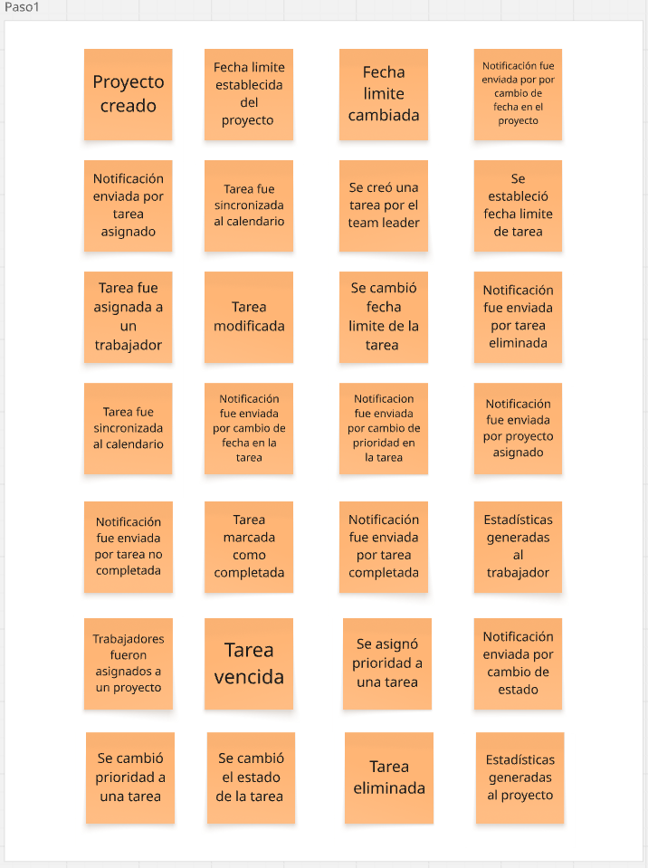

##### 2.5.1.1. Candidate Context Discovery
Tras concluir la sesión de Event Storming, el equipo llevó a cabo un análisis de los eventos obtenidos para continuar con los Candidate Context. Este trabajo consistió en agrupar los eventos clave del negocio que indiquen cambios de estado entre diferentes partes del proceso de negocio según sus relaciones y dependencias, identificando patrones que marcan el inicio o fin de procesos clave en la aplicación.

En esta sección se presentan los flujos principales del negocio, que servirán como base para identificar los pivotal events y, a partir de ellos, delimitar los Bounded Contexts que estructurarán el dominio de manera más clara.

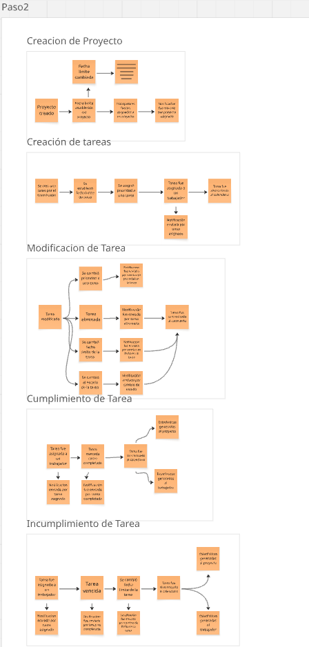

Estos fueron los flujos que se definieron:

##*Creación de Proyecto*
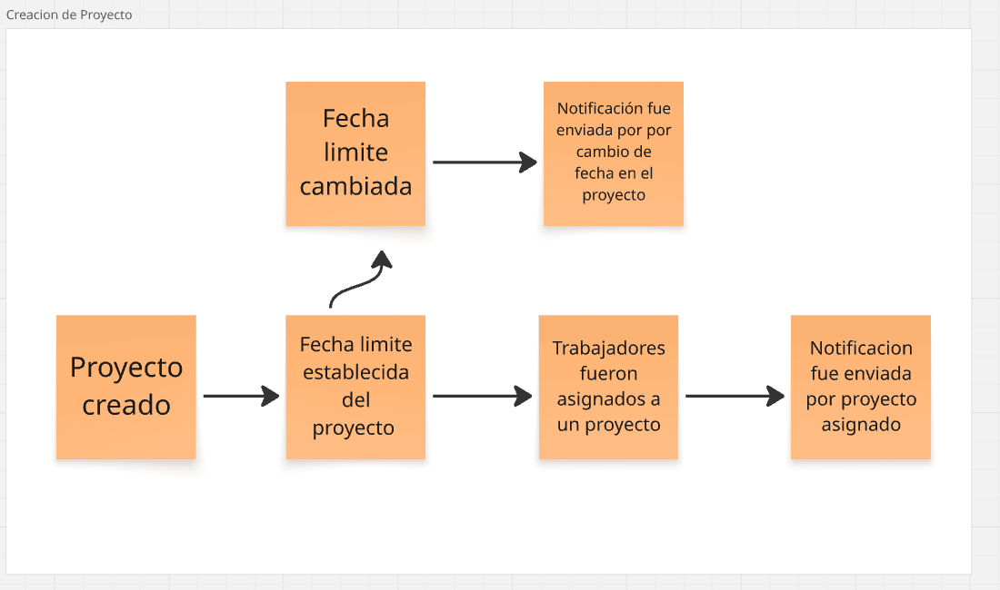
##*Creación de tareas*
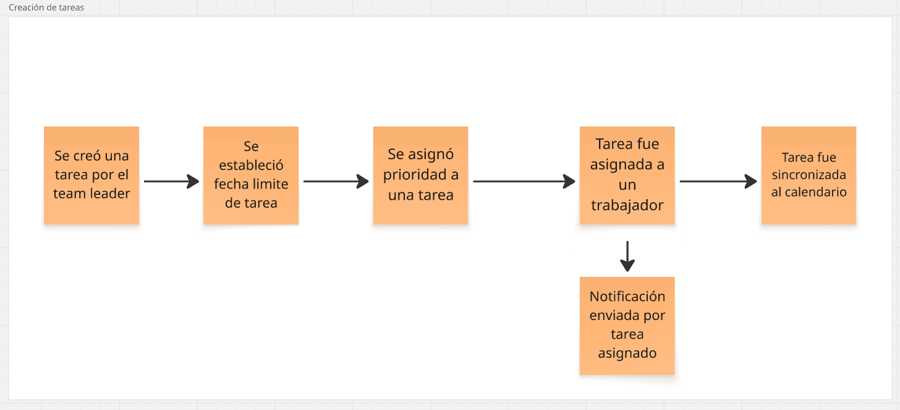
##*Modificación de Tarea*
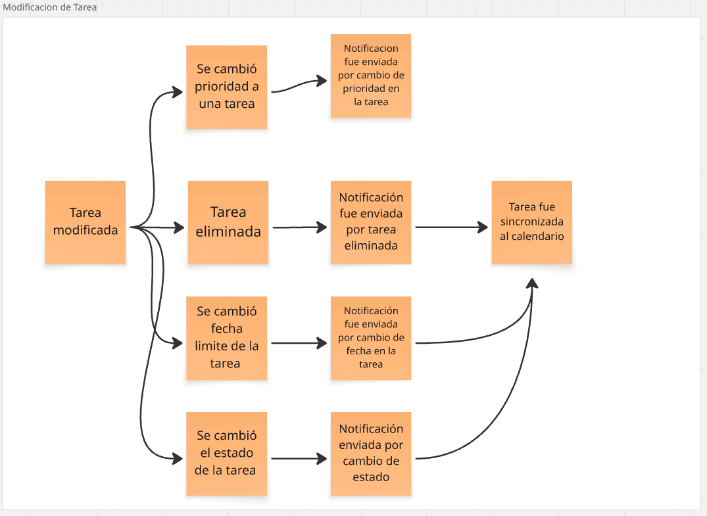
3#*Cumplimiento de Tarea*
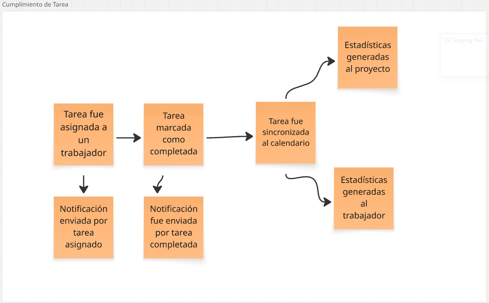
##*Incumplimiento de Tarea
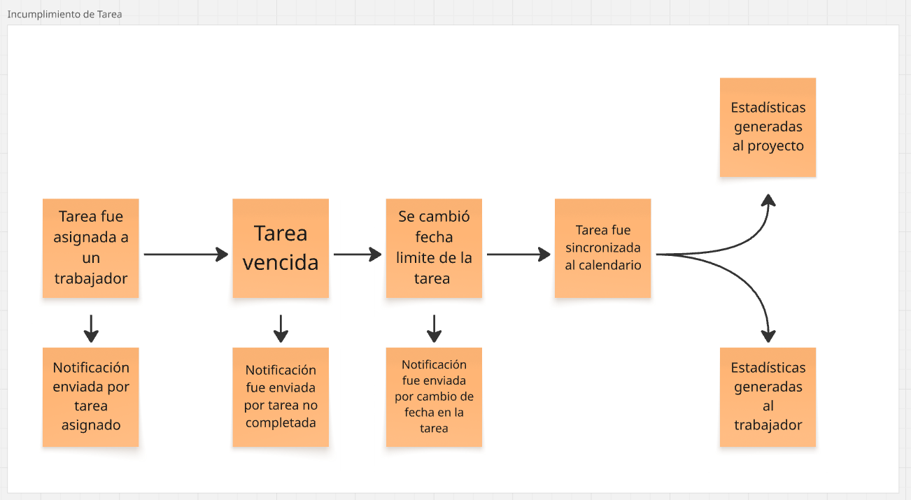

Una vez definidos y colocados los procesos principales en el tablero de Event Storming, se procedió a identificar e insertar los pain points o puntos de dolor.
Estos representan las fricciones, dudas y frustraciones que experimentan los usuarios y participantes dentro del flujo.

##*Creación de Proyecto*

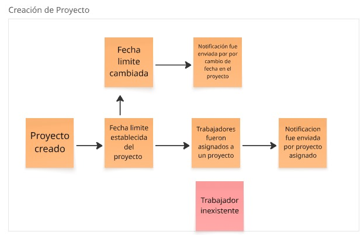

##*Creación de tareas*

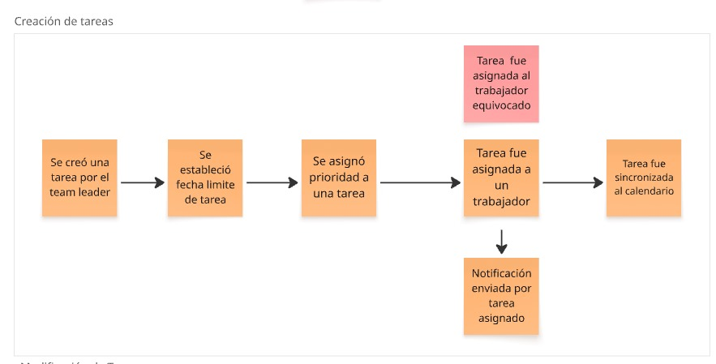

##*Modificación de Tarea*

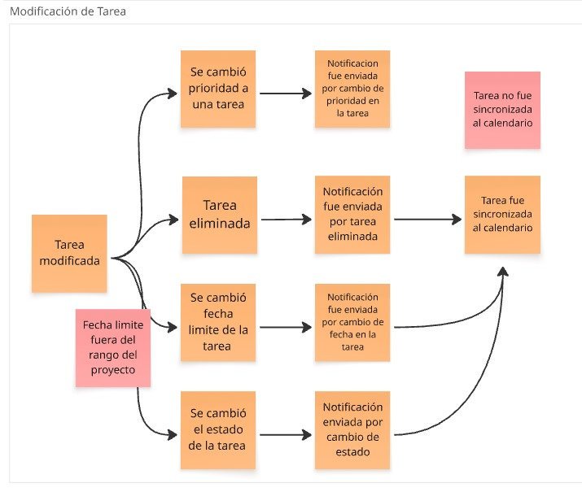

Una vez mapeados los distintos eventos de dominio, se procedió a destacar aquellos que representan hitos clave en el flujo de negocio. Estos eventos pivotales marcan el inicio o cierre de situaciones críticas, y permiten al equipo comprender cuáles son los puntos más sensibles del sistema. Su identificación resultó esencial, ya que en torno a ellos suelen girar múltiples interacciones e intereses de distintos actores.

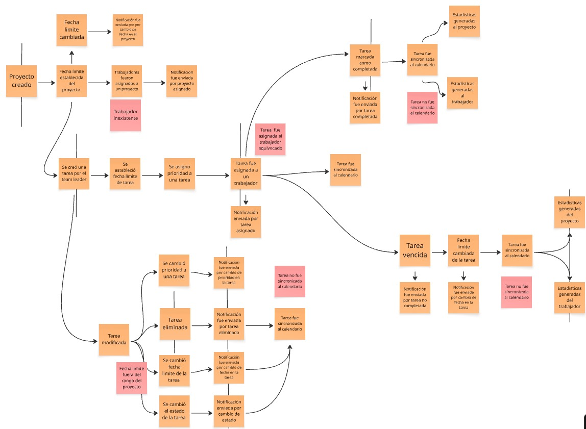

Posteriormente, se identificaron los comandos que dan origen a los eventos, así como los actores responsables de dispararlos. Los actores pueden ser usuarios, sistemas externos o dispositivos que inician acciones dentro del flujo. Este ejercicio permitió clarificar quién inicia los cambios y cómo estos se reflejan en la dinámica del sistema, garantizando una alineación con los objetivos de negocio.

En esta etapa se reconocieron las políticas, entendidas como reacciones automáticas o manuales a determinados eventos de dominio. Asimismo, se definieron los invariantes de negocio, es decir, las reglas que deben cumplirse obligatoriamente para que un comando pueda ser procesado. Este análisis permitió visibilizar tanto las restricciones que aseguran la coherencia del sistema como las acciones derivadas de los eventos, generando mayor claridad en las condiciones de operación.

Se identificaron los modelos de lectura necesarios para apoyar la toma de decisiones dentro del sistema. Estos modelos representan el estado de la información consolidada en un momento dado y sirven como insumos para validar invariantes, generar reportes o alimentar interfaces de usuario. Su definición fue clave para asegurar que los distintos actores dispongan de la información adecuada y actualizada en cada punto del proceso.

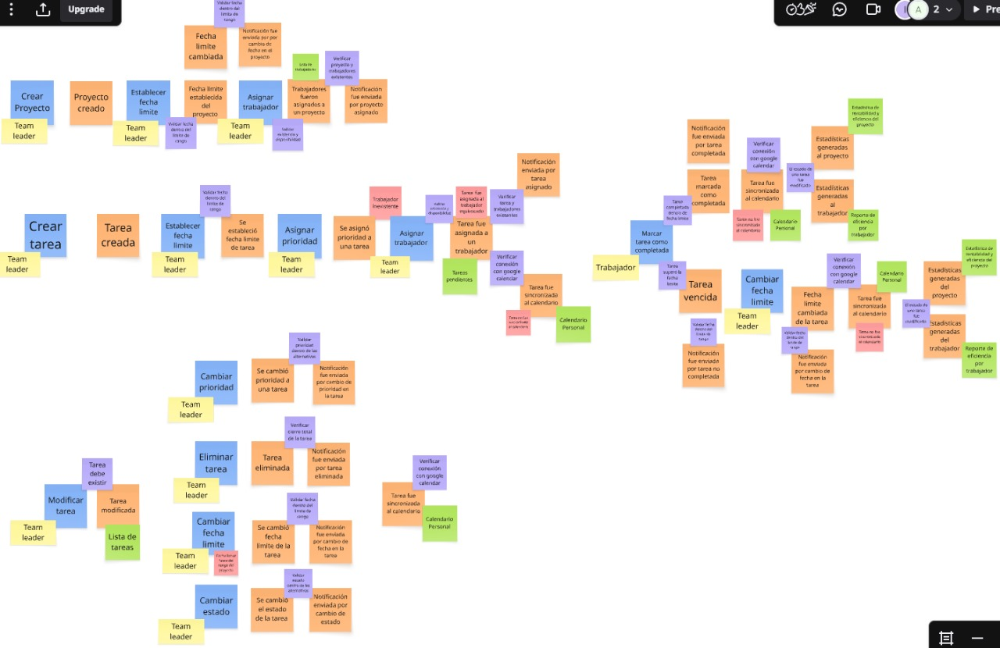

##### 2.5.1.2. Domain Message Flows Modeling

##### 2.5.1.3. Bounded Context Canvases

#### 2.5.2. Context Mapping

El Context Mapping es un proceso clave dentro de la metodología Domain-Driven Design (DDD), utilizado para mapear y visualizar las interacciones y relaciones estructurales entre los diferentes bounded contexts en un sistema. Un bounded context es una delimitación clara en la que un modelo específico tiene validez y significado, y dentro de esa área, las reglas de negocio y los datos son gestionados de forma coherente.

En el caso de **TaskMaster**, nuestra aplicación de gestión de proyectos, el Context Mapping nos permite entender cómo las distintas áreas funcionales del sistema se interconectan. A través de esta visualización, podemos identificar dependencias entre los diferentes dominios, lo que facilita la toma de decisiones sobre la arquitectura y las integraciones de nuestra plataforma. Además, permite entender de manera más clara las responsabilidades de cada contexto y cómo interactúan entre sí.

Se identificaron los siguientes bounded context en el sistema: 

1. IAM (Gestión de Identidad y Acceso)

- Este contexto se encarga de la autenticación y autorización de los usuarios, garantizando que solo las personas autorizadas puedan acceder a las funcionalidades de TaskMaster.

2. Gestión de Proyectos y Tareas

- Se encarga de la creación y gestión de proyectos y tareas, asignando responsables, plazos y prioridades, y permitiendo la distribución organizada del trabajo entre los miembros del equipo.

3. Visualización y Seguimiento

- Permite la visualización de tareas y proyectos a través de diferentes interfaces, como tableros, calendarios, y métricas, para facilitar el seguimiento en tiempo real del progreso y cumplimiento de las fechas de entrega.

4. Analítica y Reportes

- Genera reportes de desempeño y productividad del equipo, utilizando datos de proyectos y tareas, para facilitar la toma de decisiones basadas en datos.

5. Notificaciones

- Maneja el envío de notificaciones a los usuarios, incluyendo tareas asignadas, actualizaciones, y recordatorios sobre fechas límite, asegurando que los miembros del equipo estén informados en tiempo real.

| **Destino (Downstream)**          | **Origen (Upstream)**             | **Tipo de Relación**     | **Comentario**                                                                                                                                                                                               |
| --------------------------------- | --------------------------------- | ------------------------ | ------------------------------------------------------------------------------------------------------------------------------------------------------------------------------------------------------------ |
| **Visualización y Seguimiento**   | **Gestión de Proyectos y Tareas** | **Customer/Supplier**    | El contexto de Gestión de Proyectos y Tareas es proveedor de datos de tareas y proyectos, que son consumidos por el contexto de Visualización y Seguimiento.                                                 |
| **Analítica y Reportes**          | **Gestión de Proyectos y Tareas** | **Customer/Supplier**    | Los datos de proyectos y tareas generados en el contexto de Gestión de Proyectos se consumen en Analítica y Reportes para generar informes de desempeño.                                                     |
| **Notificaciones**                | **Gestión de Proyectos y Tareas** | **Customer/Supplier**    | Las actualizaciones de tareas y proyectos en el contexto de Gestión de Proyectos y Tareas generan notificaciones que son enviadas a los usuarios por el contexto de Notificaciones.                          |
| **Notificaciones**                | **Visualización y Seguimiento**   | **Customer/Supplier**    | El contexto de Visualización y Seguimiento puede generar notificaciones para informar a los usuarios sobre el progreso de tareas y cambios en el estado de los proyectos.                                    |
| **Gestión de Proyectos y Tareas** | **IAM**                           | **Partnership**          | Ambos contextos colaboran estrechamente. IAM gestiona el acceso de los usuarios, mientras que Gestión de Proyectos y Tareas asegura que las tareas y proyectos sean asignados solo a usuarios autorizados.   |
| **Analítica y Reportes**          | **Notificaciones**                | **Partnership**          | El contexto de Notificaciones puede usar los reportes generados en Analítica y Reportes para crear alertas o notificaciones sobre el desempeño del equipo.                                                   |
| **IAM**                           | **Todos los Contextos**           | **Shared Kernel**        | La información sobre usuarios, roles y autenticación se comparte entre todos los contextos para garantizar el acceso controlado a las funcionalidades del sistema.                                           |
| **Integraciones Técnicas**        | **Gestión de Proyectos y Tareas** | **Anticorruption Layer** | Si TaskMaster se integra con sistemas externos (por ejemplo, CRM o herramientas de gestión de proyectos), el Anticorruption Layer garantiza que los datos externos no alteren el modelo interno del sistema. |

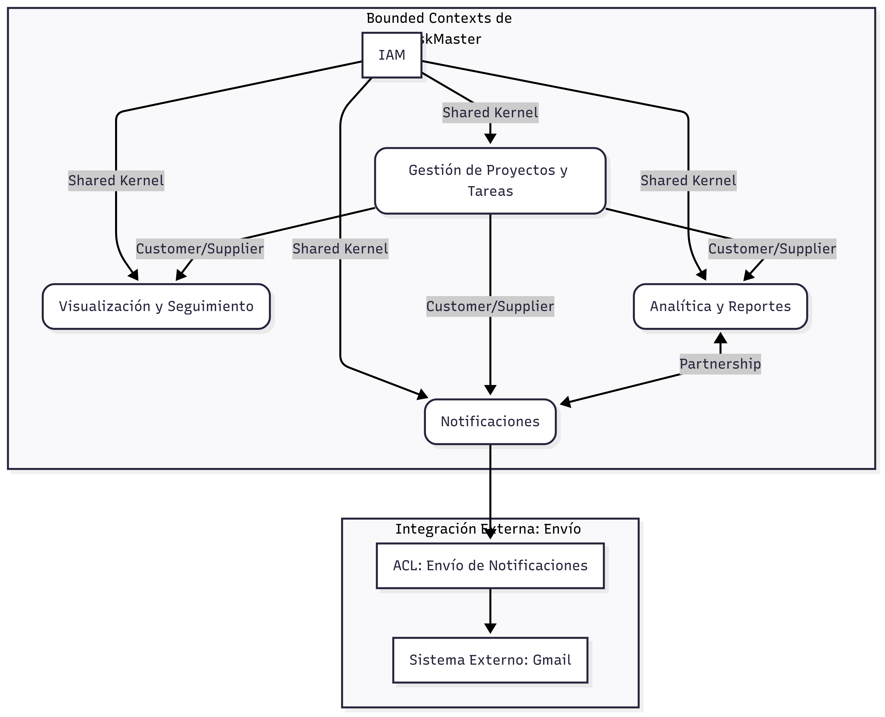

#### 2.5.3. Software Architecture

##### 2.5.3.1. Software Architecture Context Level Diagrams

##### 2.5.3.2. Software Architecture Container Level Diagrams

##### 2.5.3.3. Software Architecture Deployment Diagrams

### 2.6. Tactical-Level Domain-Driven Design

