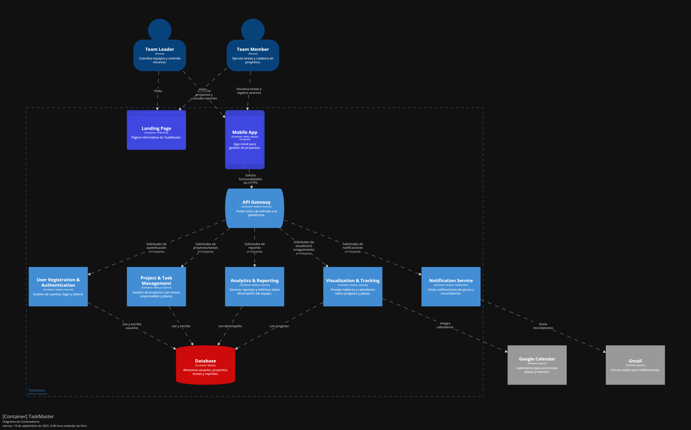
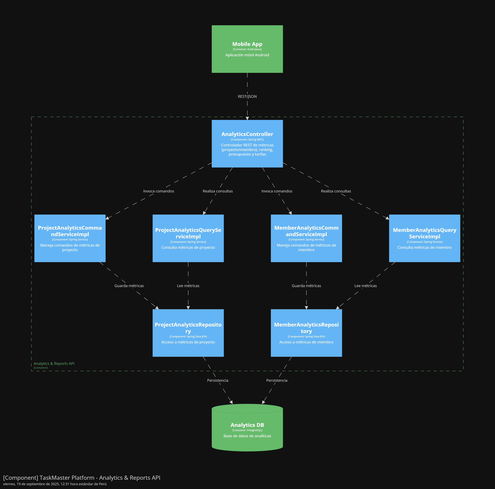

<h3 align ="center">
Universidad Peruana de Ciencias Aplicadas
</h3>
<p align="center">
  
</p>


<h3 align="center">
Nombre del curso: Aplicaciones para Dispositivos Móviles
  <br> <br>
Carrera: Ingeniería de Software
  <br> <br>
Nombre del profesor: Eduardo Martin Reyes Rodriguez
  <br> <br>
NRC: 1813
  <br> <br>
"Informe de Trabajo Final"
  <br> <br>
Nombre de la Startup: WorkHub
  <br> <br>
Nombre del Producto: TaskMaster
  <br> <br>
<div align="center">
 <br> <br> --Integrantes--

| <div style="width:300px">Alumno</div> | <div style="width:125px">Código</div> |
|:-------------------------------------------:|:-------------------------------------------:|
|Bejarano Martínez Alvaro Leandro| U202311640|
|Luquillas Asto Omar| U20211G641|
|Olivera Barzola Eric Marlon |U202315032|
|Sandoval Paiva Valentino |U20211a962|
|Sarmiento Medina Loreley |U202310005|
Septiembre de 2025
</h3>
</div>

## Registro de Versiones del Informe

| Versión | Fecha      | Autor                            | Descripción de modificación                                                                                                                                                                                                                                                                                                                                                                                                                                                                                                                                                                                                                                                                                                                                                                                                          |
| ------- | ---------- | -------------------------------- | ------------------------------------------------------------------------------------------------------------------------------------------------------------------------------------------------------------------------------------------------------------------------------------------------------------------------------------------------------------------------------------------------------------------------------------------------------------------------------------------------------------------------------------------------------------------------------------------------------------------------------------------------------------------------------------------------------------------------------------------------------------------------------------------------------------------------------------ |
| TB1     | 08/09/2025 | Valentino Sandoval               | **Competidores**: Análisis de los competidores directos e indirectos en el mercado. **Análisis Competitivo**: Estudio detallado de las estrategias de los competidores y cómo diferenciarse. **Estrategia y tácticas frente a competidores**: Definición de estrategias y tácticas para enfrentar la competencia. **Diseño de entrevistas**: Diseño y estructuración de las entrevistas para obtener información de los stakeholders clave. **User Stories**: Colaboración en la creación de las historias de usuario junto con Erick. **Software Architecture Deployment Diagrams**: Colaboración con Omar en la creación de diagramas de despliegue para la infraestructura. **Bounded Context: IAM**: Desarrollo del Bounded Context IAM, incluyendo la creación de las capas de dominio, interfaz, aplicación e infraestructura. |
| TB1     | 08/09/2025 | Erick Olivera                    | **Solution Profile**: Creación del perfil de la solución propuesta para el problema identificado. **Lean UX Process**: Definición y estructura del proceso Lean UX utilizado para validar las ideas del producto. **User Stories**: Creación de historias de usuario junto con Valentino, para estructurar las funcionalidades del sistema. **Impact Mapping**: Creación del mapa de impacto para definir las prioridades de desarrollo. **Product Backlog**: Desarrollo y priorización del Product Backlog con las funcionalidades necesarias.                                                                                                                                                                                                                                                                                      |
| TB1     | 08/09/2025 | Loreley Sarmiento                | **Startup Profile**: Desarrollo del perfil de la startup, incluyendo su misión y visión. **Lean UX Canvas**: Creación del Lean UX Canvas para estructurar el producto. **Empathy Mapping**: Desarrollo de un mapa de empatía para comprender mejor a los usuarios. **Requirements specification**: Elaboración de la especificación de los requisitos del producto. **Strategic-Level Domain-Driven Design**: Participación en el diseño de alto nivel del dominio.                                                                                                                                                                                                                                                                                                                                                                  |
| TB1     | 08/09/2025 | Omar Luquillas                   | **Lean UX Assumptions**: Definición de las suposiciones clave sobre los usuarios y sus necesidades. **Software Architecture**: Definición de la arquitectura de software para el sistema. **Bounded Context: Gestión de Proyectos y Tareas**: Creación del Bounded Context para la gestión de proyectos y tareas. **Domain Layer**: Implementación de la capa de dominio para la gestión de la lógica del negocio. **Infrastructure Layer**: Desarrollo de la infraestructura para la gestión de datos.                                                                                                                                                                                                                                                                                                                              |
| TB1     | 08/09/2025 | Alvaro Bejarano                  | **Competidores**: Análisis de competidores directos e indirectos en el mercado. **Estrategia y tácticas frente a competidores**: Definición de la estrategia para competir en el mercado. **Needfinding**: Investigación sobre las necesidades de los usuarios. **User Persona**: Creación de los perfiles de usuario para entender sus características y necesidades. **User Task Matrix**: Creación de la matriz de tareas de los usuarios.                                                                                                                                                                                                                                                                                                                                                                                                                  
| TP      | 10/10/2025 | **Loreley Sarmiento**  | **Front-end :** construcción de vistas móviles (wireframes → mockups → implementación), componentes de navegación, estados y validaciones; integración visual con la paleta/typography; soporte en consumo básico de API (listas y creación). Preparó y enlazó el prototipo Figma* y ajustó responsiveness. |
| TP      | 10/10/2025 | **Valentino Sandoval** | **Backend (co-lider):** implementación de controladores y servicios clave; Swagger y documentación técnica.  Landing**: diseño, implementación y deploy en GitHub Pages. Configuración de pipelines de despliegue y apoyo en pruebas de integración. Revisión general del informe y evidencias.                       |
| TP      | 10/10/2025 | **Omar Luquillas**     | **Backend (co-lider):** arquitectura, entidades/ repositorios, configuración de BD y variables de entorno; CI/CD en Render, pruebas unitarias e integración; definición de GitFlow y versionado semántico. Soporte de performance y monitoreo básico de servicios.                                                                 |
| TP      | 10/10/2025 | **Erick Olivera**      | **Documentación y QA:** SCM (herramientas/entorno), guía de estilos de código, registro de endpoints; redacción de SEO/Meta tags, navegación y búsqueda. Testing funcional en Postman, validación de respuestas y soporte en deploy (verificación de URLs y estados).                                                              |
| TP      | 10/10/2025 | **Álvaro Bejarano**    | **Product Design & contenido:** arquitectura de información, etiquetado y navegación; consolidación de **Style Guidelines** (paleta/typography); curaduría de imágenes/evidencias y **Registro de Versiones**. Coordinó entrevistas y resúmenes para validación.                                                                           |
                                                                                                                                                                                                                                                                         


## Project Report Collaboration Insights

|  URL del repositorio del reporte  |
| :-----------------------------------: |
| [https://github.com/CC238-Aplicaciones-Moviles/Report-Repository.git](https://github.com/CC238-Aplicaciones-Moviles/Report-Repository.git) |

TB1:

REPORT: 


- Bejarano Martínez Alvaro Leandro: 37
- Luquillas Asto Omar: 12
- Olivera Barzola Eric Marlon: 21
- Sandoval Paiva Valentino: 9
- Sarmiento Medina Lorele: 81

  
TP:

REPORT: 


- Bejarano Martínez Alvaro Leandro: 58
- Luquillas Asto Omar: 16
- Olivera Barzola Eric Marlon: 32
- Sandoval Paiva Valentino: 11
- Sarmiento Medina Lorele: 86
- 
## Contenido

- [Student Outcome](#student-outcome)

- [Objetivos SMART](#objetivos-SMART)

- [Capítulo I: Presentación](#capítulo-i-presentacion)
  - [1.1. Startup Profile](#11-startup-profile)
    - [1.1.1. Descripción de la Startup](#111-descripción-de-la-startup)
    - [1.1.2. Perfiles de integrantes del equipo](#112-perfiles-de-integrantes-del-equipo)
  - [1.2. Solution Profile](#12-solution-profile)
    - [1.2.1. Antecedentes y problemática](#121-antecedentes-y-problemática)
    - [1.2.2. Lean UX Process](#122-lean-ux-process)
      - [1.2.2.1. Lean UX Problem Statements](#1221-lean-ux-problem-statements)
      - [1.2.2.2. Lean UX Assumptions](#1222-lean-ux-assumptions)
      - [1.2.2.3. Lean UX Hypothesis Statements](#1223-lean-ux-hypothesis-statements)
      - [1.2.2.4. Lean UX Canvas](#1224-lean-ux-canvas)
  - [1.3. Segmentos Objetivo](#13-segmentos-objetivo)
- [Capítulo II: Requirements Elicitation & Analysis](#capítulo-ii-requirements-elicitation--analysis)
  - [2.1. Competidores](#21-competidores)
    - [2.1.1. Análisis competitivo](#211-análisis-competitivo)
    - [2.1.2. Estrategias y tácticas frente a competidores](#212-estrategias-y-tácticas-frente-a-competidores)
  - [2.2. Entrevistas](#22-entrevistas)
    - [2.2.1. Diseño de entrevistas](#221-diseño-de-entrevistas)
    - [2.2.2. Registro de entrevistas](#222-registro-de-entrevistas)
    - [2.2.3. Análisis de entrevistas](#223-análisis-de-entrevistas)
  - [2.3. Needfinding](#23-needfinding)
    - [2.3.1. User Personas](#231-user-personas)
    - [2.3.2. User Task Matrix](#232-user-task-matrix)
    - [2.3.3. User Journey Mapping](#233-user-journey-mapping)
    - [2.3.4. Empathy Mapping](#234-empathy-mapping)
    - [2.3.5. Ubiquitous Language](#235-ubiquitous-language)
  - [2.4. Requirements specification](#24-requirements-specification)
    - [2.4.1. User Stories](#241-user-stories)
    - [2.4.2. Impact Mapping](#242-impact-mapping)
    - [2.4.3. Product Backlog](#243-product-backlog)
  - [2.5. Strategic-Level Domain-Driven Design](#25-strategic-level-domain-driven-design)
     - [2.5.1. EventStorming](#251-eventstorming)
       - [2.5.1.1. Candidate Context Discovery](#2511-candidate-context-discovery)
       - [2.5.1.2. Domain Message Flows Modeling](#2512-domain-message-flows-modeling)
       - [2.5.1.3. Bounded Context Canvases](#2513-bounded-context-canvases)
    - [2.5.2. Context Mapping](#252-context-mapping)
    - [2.5.3. Software Architecture](#253-software-architecture)
      - [2.5.3.1. Software Architecture Context Level Diagrams](#2531-software-architecture-context-level-diagrams)
      - [2.5.3.2. Software Architecture Container Level Diagrams](#2532-software-architecture-container-level-diagrams)
      - [2.5.3.3. Software Architecture Deployment Level Diagrams](#2533-software-architecture-deployment-level-diagrams)
  - [2.6. Tactical-Level Domain-Driven Design](#26-tactical-level-domain-driven-design)
    - [2.6.1. Bounded Context: Registro y Autenticación de Usuario](#261-bounded-context-registro-y-autenticación-de-usuario)
      - [2.6.1.1. Domain Layer](#2611-domain-layer)
      - [2.6.1.2. Interface Layer](#2612-interface-layer)
      - [2.6.1.3. Application Layer](#2613-application-layer)
      - [2.6.1.4. Infrastructure Layer](#2613-infrastructure-layer)
      - [2.6.1.5. Bounded Context Software Architecture Component Level Diagrams](#2613-bounded-context-software-architecture-component-level-diagrams)
      - [2.6.1.6. Bounded Context Software Architecture Code Level Diagrams](#2613-bounded-context-software-architecture-code-level-diagrams)
          - [2.6.1.6.1. Bounded Context Domain Layer Class Diagrams](#2613-bounded-context-domain-layer-class-diagrams)
          - [2.6.1.6.2. Bounded Context Database Design Diagrams](#2613-bounded-context-database-design-diagrams)
    - [2.6.2. Bounded Context: Analítica y Reportes](#262-bounded-context-analítica-y-reportes)
      - [2.6.2.1. Domain Layer](#2621-domain-layer)
      - [2.6.2.2. Interface Layer](#2622-interface-layer)
      - [2.6.2.3. Application Layer](#2623-application-layer)
      - [2.6.2.4. Infrastructure Layer](#2624-infrastructure-layer)
      - [2.6.2.5. Bounded Context Software Architecture Component Level Diagrams](#2625-bounded-context-software-architecture-component-level-diagrams)
      - [2.6.2.6. Bounded Context Software Architecture Code Level Diagrams](#2626-bounded-context-software-architecture-code-level-diagrams)
          - [2.6.2.6.1. Bounded Context Domain Layer Class Diagrams](#26261-bounded-context-domain-layer-class-diagrams)
          - [2.6.2.6.2. Bounded Context Database Design Diagrams](#26262-bounded-context-database-design-diagrams)
    - [2.6.3. Bounded Context: Visualización y Seguimiento](#263-bounded-context-visualización-y-seguimiento)
      - [2.6.3.1. Domain Layer](#2631-domain-layer)
      - [2.6.3.2. Interface Layer](#2632-interface-layer)
      - [2.6.3.3. Application Layer](#2633-application-layer)
      - [2.6.3.4. Infrastructure Layer](#2634-infrastructure-layer)
      - [2.6.3.5. Bounded Context Software Architecture Component Level Diagrams](#2635-bounded-context-software-architecture-component-level-diagrams)
      - [2.6.3.6. Bounded Context Software Architecture Code Level Diagrams](#2636-bounded-context-software-architecture-code-level-diagrams)
          - [2.6.3.6.1. Bounded Context Domain Layer Class Diagrams](#26361-bounded-context-domain-layer-class-diagrams)
          - [2.6.3.6.2. Bounded Context Database Design Diagrams](#26362-bounded-context-database-design-diagrams)
    - [2.6.4. Bounded Context:  Gestión de Proyectos y Tareas](#264-bounded-context-gestión-de-proyectos-y-tareas)
      - [2.6.4.1. Domain Layer](#2641-domain-layer)
      - [2.6.4.2. Interface Layer](#2642-interface-layer)
      - [2.6.4.3. Application Layer](#2643-application-layer)
      - [2.6.4.4. Infrastructure Layer](#2644-infrastructure-layer)
      - [2.6.4.5. Bounded Context Software Architecture Component Level Diagrams](#2645-bounded-context-software-architecture-component-level-diagrams)
      - [2.6.4.6. Bounded Context Software Architecture Code Level Diagrams](#2646-bounded-context-software-architecture-code-level-diagrams)
          - [2.6.4.6.1. Bounded Context Domain Layer Class Diagrams](#26461-bounded-context-domain-layer-class-diagrams)
          - [2.6.4.6.2. Bounded Context Database Design Diagrams](#26462-bounded-context-database-design-diagrams)
    - [2.6.5. Bounded Context: Notificaciones](#265-bounded-context-notificaciones)
      - [2.6.5.1. Domain Layer](#2651-domain-layer)
      - [2.6.5.2. Interface Layer](#2652-interface-layer)
      - [2.6.5.3. Application Layer](#2653-application-layer)
      - [2.6.5.4. Infrastructure Layer](#2654-infrastructure-layer)
      - [2.6.5.5. Bounded Context Software Architecture Component Level Diagrams](#2655-bounded-context-software-architecture-component-level-diagrams)
      - [2.6.5.6. Bounded Context Software Architecture Code Level Diagrams](#2656-bounded-context-software-architecture-code-level-diagrams)
          - [2.6.5.6.1. Bounded Context Domain Layer Class Diagrams](#26561-bounded-context-domain-layer-class-diagrams)
          - [2.6.5.6.2. Bounded Context Database Design Diagrams](#26562-bounded-context-database-design-diagrams)
- [Capítulo III: Solution UI/UX Design](#capítulo-iii-solution-uiux-design)
  - [3.1. Product design](#31-product-design)
    - [3.1.1. Style Guidelines](#311-style-guidelines)
      - [3.1.1.1. General Style Guidelines](#3111-general-style-guidelines)
    - [3.1.2. Information Architecture](#312-information-architecture)
      - [3.1.2.1. Organization Systems](#3121-organization-systems)
      - [3.1.2.2. Labelling Systems](#3122-labelling-systems)
      - [3.1.2.3. SEO Tags and Meta Tags](#3123-seo-tags-and-meta-tags)
      - [3.1.2.4. Searching Systems](#3124-searching-systems)
      - [3.1.2.5. Navigation Systems](#3125-navigation-systems)
    - [3.1.3. Landing Page UI Design](#313-landing-page-ui-design)
      - [3.1.3.1. Landing Page Wireframe](#3131-landing-page-wireframe)
      - [3.1.3.2. Landing Page Mock-up](#3132-landing-page-mock-up)
    - [3.1.4. Mobile Applications UX/UI Design](#314-mobile-applications-uxui-design)
      - [3.1.4.1. Mobile Applications Wireframes](#3141-mobile-applications-wireframes)
      - [3.1.4.2. Mobile Applications Wireflow Diagrams](#3142-mobile-applications-wireflow-diagrams)
      - [3.1.4.3. Mobile Applications Mock-ups](#3143-mobile-applications-mock-ups)
      - [3.1.4.4. Mobile Applications User Flow Diagrams](#3144-mobile-applications-user-flow-diagrams)
      - [3.1.4.5. Mobile Applications Prototyping](#3145-mobile-applications-prototyping)
- [Capítulo IV: Product Implementation & Validation](#capítulo-iv-product-implementation--validation)
  - [4.1. Software Configuration Management](#41-software-configuration-management)
    - [4.1.1. Software Development Environment Configuration](#411-software-development-environment-configuration)
    - [4.1.2. Source Code Management](#412-source-code-management)
    - [4.1.3. Source Code Style Guide & Conventions](#413-source-code-style-guide--conventions)
    - [4.1.4. Software Deployment Configuration](#414-software-deployment-configuration)
  - [4.2. Landing Page & Mobile Application Implementation](#42-landing-page--mobile-application-implementation)
    - [4.2.1. Sprint n](#421-sprint-n)
      - [4.2.1.1. Sprint Planning n](#4211-sprint-planning-n)
      - [4.2.1.2. Sprint Backlog n](#4212-sprint-backlog-n)
      - [4.2.1.3. Development Evidence for Sprint Review](#4213-development-evidence-for-sprint-review)
      - [4.2.1.4. Testing Suite Evidence for Sprint Review](#4214-testing-suite-evidence-for-sprint-review)
      - [4.2.1.5. Execution Evidence for Sprint Review](#4215-execution-evidence-for-sprint-review)
      - [4.2.1.6. Services Documentation Evidence for Sprint Review](#4216-services-documentation-evidence-for-sprint-review)
      - [4.2.1.7. Software Deployment Evidence for Sprint Review](#4217-software-deployment-evidence-for-sprint-review)
      - [4.2.1.8. Team Collaboration Insights during Sprint](#4218-team-collaboration-insights-during-sprint)
  - [4.3. Validation Interviews](#43-validation-interviews)
    - [4.3.1. Diseño de Entrevistas](#431-diseño-de-entrevistas)
    - [4.3.2. Registro de Entrevistas](#432-registro-de-entrevistas)
    - [4.3.3. Evaluaciones según heurísticas](#433-evaluaciones-según-heurísticas)
- [Conclusiones](#conclusiones)
- [Bibliografía](#bibliografía)
- [Anexos](#anexos)

## Student Outcome
El curso contribuye al cumplimiento del Student Outcome ABET:
**ABET - EAC - Student Outcome 7 Criterio**: La capacidad de adquirir y aplicar nuevos conocimientos según sea
necesario, utilizando estrategias deaprendizaje apropiadas.
En elsiguiente cuadro se describe las accionesrealizadas y enunciados de conclusiones por parte del grupo, que permiten sustentar el haber alcanzado los criterios especificos.

| Criterio específico                                                                                                                     | Acciones realizadas                                                                                                                                                                                                         | Conclusiones                                                                                                                                                                                                                                                                                                                        |
| --------------------------------------------------------------------------------------------------------------------------------------- | --------------------------------------------------------------------------------------------------------------------------------------------------------------------------------------------------------------------------- | ----------------------------------------------------------------------------------------------------------------------------------------------------------------------------------------------------------------------------------------------------------------------------------------------------------------------------------- |
| Actualiza conceptos y conocimientos necesarios para su desarrollo profesional y en especial para su proyecto en soluciones de software. | - **Bejarano Martínez, Álvaro Leandro – TB1**<br>Reconocí la necesidad del aprendizaje permanente al profundizar en EventStorming, Candidate Context Discovery, Domain Message Flows Modeling y Bounded Context Canvases, entendiendo su valor en el diseño inicial de soluciones de software  TP1: Reconocí la necesidad del aprendizaje permanente al profundizar en EventStorming, Candidate Context Discovery, Domain Message Flows Modeling y Bounded Context Canvases, entendiendo su valor en el diseño inicial de soluciones de software. En el TP1 participé en la definición de las Style Guidelines y la arquitectura de la información, organizando los sistemas de navegación y etiquetado  .<br>- **Luquillas Asto, Omar – TB1**<br>Reconocí la necesidad del aprendizaje permanente al trabajar con Context Mapping y Software Architecture en sus niveles Context, Container y Deployment, lo que me permitió comprender cómo estructurar sistemas complejos  TP1: Reconocí la necesidad del aprendizaje permanente al trabajar con Context Mapping y Software Architecture en sus niveles Context, Container y Deployment, lo que me permitió comprender cómo estructurar sistemas complejos. En el TP1 me encargué de los sistemas de búsqueda y SEO Tags, además de la configuración del entorno de desarrollo y el control de versiones. .<br>- **Olivera Barzola, Eric Marlon – TB1**<br>Reconocí la necesidad del aprendizaje permanente al desarrollar el Bounded Context: Registro y Autenticación de Usuario, aplicando capas de Domain, Interface, Application e Infrastructure, además de diagramas de componentes, clases y base de datos  TP1: Reconocí la necesidad del aprendizaje permanente al desarrollar el Bounded Context: Registro y Autenticación de Usuario, aplicando capas de Domain, Interface, Application e Infrastructure, además de diagramas de componentes, clases y base de datos. En el TP1 diseñé los wireframes y mockups de la landing page, además del prototipo de la aplicación móvil..<br>- **Sandoval Paiva, Valentino – TB1**<br>Reconocí la necesidad del aprendizaje permanente al participar en el diseño del Bounded Context: Analítica y Reportes y Visualización y Seguimiento, construyendo las capas de arquitectura, componentes, diagramas de clases y de base de datos  TP1: Reconocí la necesidad del aprendizaje permanente al participar en el diseño del Bounded Context: Analítica y Reportes y Visualización y Seguimiento, construyendo las capas de arquitectura, componentes, diagramas de clases y de base de datos. En el TP1 trabajé en los user flows y wireflows de la aplicación móvil, y colaboré en la configuración del despliegue del software..<br>- **Sarmiento Medina, Loreley – TB1**<br>Reconocí la necesidad del aprendizaje permanente al aplicar la arquitectura en los Bounded Contexts de Gestión de Proyectos y Tareas y Notificaciones, trabajando sus capas de software, diagramas de componentes, clases y base de datos. TP1:  | La elaboración del proyecto permitió reforzar y aplicar conceptos clave en arquitectura de software, metodologías ágiles y diseño de soluciones, fortaleciendo competencias técnicas que son directamente aplicables en la formación profesional y en la práctica de proyectos reales en soluciones de software.        TP1: Nos permitió integrar conocimientos teóricos y prácticos sobre diseño centrado en el usuario, arquitectura de la información y desarrollo ágil, fortaleciendo la capacidad del equipo para transformar requerimientos conceptuales en interfaces funcionales y coherentes.            |
| Reconoce la necesidad del aprendizaje permanente para el desempeño profesional y el desarrollo de proyectos en soluciones de software.  | - **Bejarano Martínez, Álvaro Leandro – TB1**<br>Me di cuenta de lo importante que es seguir aprendiendo mientras trabajaba en el Bounded Context de Registro y Autenticación, porque tuve que investigar y aplicar nuevos enfoques para resolver problemas de seguridad y acceso TP1: aprendí sobre la definición de estilos visuales y coherencia de diseño en la interfaz..<br>- **Luquillas Asto, Omar – TB1**<br>Comprendí la necesidad de aprender de forma constante al desarrollar el Bounded Context de Analítica y Reportes, ya que cada avance me exigió actualizarme para interpretar datos y presentarlos de manera útil TP1: reforcé mis conocimientos en etiquetado semántico, SEO y configuración de entornos de trabajo colaborativos..<br>- **Olivera Barzola, Eric Marlon – TB1**<br>Reconocí que el aprendizaje nunca termina al diseñar el Bounded Context de Visualización y Seguimiento, pues tuve que explorar nuevas formas de mostrar información de manera clara y comprensible TP1 adquirí experiencia en la elaboración de mockups y prototipos interactivos..<br>- **Sandoval Paiva, Valentino – TB1**<br>Noté lo esencial que es seguir aprendiendo al elaborar el Bounded Context de Gestión de Proyectos y Tareas, porque enfrenté retos que me llevaron a investigar y aplicar ideas que no conocía antes. TP1 reforcé mis conocimientos en diseño de interacción móvil y documentación de despliegues.<br>- **Sarmiento Medina, Loreley – TB1**<br>Valoré la importancia del aprendizaje permanente al trabajar en el Bounded Context de Notificaciones, ya que tuve que adaptarme a nuevas formas de diseño para que la comunicación en el sistema fuera efectiva .TP1: aprendí sobre la documentación técnica, planificación de sprints y la validación de software a través de pruebas sistemáticas. | Durante el desarrollo del proyecto se evidenció la importancia de la investigación continua y la adaptación a nuevas herramientas y enfoques, lo que refuerza la necesidad de mantener un aprendizaje constante para enfrentar los retos que plantea el mercado tecnológico y asegurar la mejora continua en el ámbito profesional. TP1: Se evidenció el crecimiento del equipo en el manejo de herramientas de diseño, gestión del código y despliegue de software. A través de la planificación por sprints, la definición de guías de estilo |                                                                                                                                                          

<hr>

## Objetivos SMART

<h3> Eric Marlon Olivera Barzola

- **Objetivo 1: Publicar una aplicación móvil propia en la Play Store**
  - **Específico:** Desarrollar y publicar una aplicación móvil propia en la Google Play Store.  
  - **Medible:** La app estará disponible públicamente en la tienda con al menos una versión funcional y descargable.  
  - **Alcanzable:** Contar con los recursos de aprendizaje, guías y tiempo necesario para desarrollarla en un año.  
  - **Relevante:** Publicar una app incrementará la experiencia práctica en desarrollo móvil y dará visibilidad a las habilidades adquiridas.  
  - **Tiempo:** Cumplirlo en un plazo máximo de 12 meses desde hoy.  

- **Objetivo 2: Obtener una certificación en desarrollo móvil**
  - **Específico:** Obtener una certificación oficial en desarrollo móvil (Android o iOS).  
  - **Medible:** Conseguir el documento o credencial oficial que acredite la certificación.  
  - **Alcanzable:** Existen certificaciones reconocidas que pueden prepararse con estudio constante y práctica en proyectos.  
  - **Relevante:** La certificación mejorará el perfil profesional y aumentará las oportunidades en el mercado laboral tecnológico.  
  - **Tiempo:** Completarlo en un plazo máximo de 18 meses.  


<h3> Loreley Sarmiento Medina

- **Objetivo 1: Convertirme en desarrolladora mobile certificada**
  - **Específico:** Obtener una certificación en desarrollo de aplicaciones móviles (Android/iOS) y crear al menos 2 aplicaciones publicadas en tiendas oficiales.  
  - **Medible:** Publicar 2 aplicaciones móviles funcionales y obtener al menos 500 descargas en conjunto.  
  - **Alcanzable:** Dedicar 10 horas semanales a cursos especializados y práctica de programación mobile.  
  - **Relevante:** Permitirá fortalecer mi perfil profesional y abrir oportunidades laborales en el sector tecnológico.  
  - **Tiempo:** Lograr la certificación y publicación de apps dentro de los 24 meses posteriores a la graduación.  

- **Objetivo 2: Desarrollar una solución de IA aplicada a ciencia de datos**
  - **Específico:** Diseñar y poner en marcha una IA que procese y analice grandes volúmenes de datos para generar modelos predictivos aplicables a proyectos de negocio.  
  - **Medible:** Construir un prototipo funcional con al menos 3 modelos predictivos validados con datasets reales.  
  - **Alcanzable:** Participar en un programa de especialización en IA y destinar 12 horas semanales a investigación y desarrollo.  
  - **Relevante:** Permitirá integrar el análisis de datos con inteligencia artificial para la toma de decisiones estratégicas.  
  - **Tiempo:** Completar el prototipo en un plazo máximo de 2 años después de la graduación.

<h3> Valentino Sandoval Paiva

- **Objetivo 1: Convertirme en ingeniero de software especializado en automoción y Fórmula 1**
  - **Específico:** Obtener una certificación en desarrollo de software aplicado a la industria automotriz, especialmente en el análisis de datos de telemetría y sistemas de control en tiempo real utilizados en vehículos de alto rendimiento (Fórmula 1, McLaren, etc.).
  - **Medible:** Completar un curso especializado, desarrollar un proyecto de software que simule un sistema de telemetría de un vehículo de carrera, y obtener al menos 2 recomendaciones de expertos en el sector.
  - **Alcanzable:** Dedicar 10 horas semanales a estudiar materiales y realizar prácticas en el desarrollo de sistemas de telemetría y control de vehículos, completando un proyecto personal en un plazo de 12 meses.
  - **Relevante:** Este objetivo fortalecerá mi perfil profesional en un campo altamente demandado por las principales marcas de autos de lujo y las competiciones de la Fórmula 1, ayudándome a ingresar en este sector competitivo.
  - **Tiempo:** Completar la certificación y el proyecto en los próximos 18 meses después de la graduación.

- **Objetivo 2: Desarrollar sistemas de análisis de datos en tiempo real para vehículos de alto rendimiento**
  - **Específico:** Diseñar y construir una plataforma de software para procesar y analizar en tiempo real los datos de rendimiento de vehículos, con aplicaciones en la telemetría y simulación de escenarios de carrera, como se usa en la Fórmula 1.
  - **Medible:** Crear una plataforma funcional capaz de procesar datos de telemetría en tiempo real y generar reportes de rendimiento con al menos 3 métricas clave, como velocidad, temperatura de los frenos y consumo de combustible.
  - **Alcanzable:** Participar en un bootcamp de programación avanzada en sistemas de análisis de datos y dedicar 12 horas semanales a la investigación y desarrollo de la plataforma de software.
  - **Relevante:** El desarrollo de sistemas para la Fórmula 1 y vehículos de alto rendimiento es esencial para mejorar la eficiencia y el rendimiento de los autos, un área clave de innovación dentro de la ingeniería automotriz.
  - **Tiempo:** Tener la plataforma funcional y validada en un plazo de 24 meses después de la graduación.

<h3> Omar Luquillas Asto

- **Objetivo 1: Aprender desarrollo de aplicaciones móviles híbridas**
  - **Específico:** Construir apps móviles usando frameworks híbridos como Flutter o React Native.
  - **Medible:** Publicar al menos 2 apps funcionales en Google Play o App Store, con funcionalidades como login, CRUD y notificaciones.
  - **Alcanzable:** Dedicar 8-10 horas semanales a cursos y práctica, desarrollando proyectos propios.
  - **Relevante:** Permite combinar conocimientos de web y móvil, aumentando oportunidades laborales.
  - **Tiempo:** Lograrlo en un plazo de 12-18 meses.

- **Objetivo 2: Mejorar competencias en ciberseguridad**
  - **Específico:** Aprender a proteger aplicaciones web y móviles frente a ataques comunes (XSS, SQL Injection, CSRF).
  - **Medible:** Completar un curso certificado de seguridad informática y aplicar medidas de seguridad en al menos 2 proyectos propios.
  - **Alcanzable:** Dedicar 6 horas semanales a teoría y práctica de ciberseguridad.
  - **Relevante:** La seguridad es esencial para cualquier desarrollador y mejora la calidad profesional de los proyectos.
  - **Tiempo:** Alcanzar este objetivo en 10-12 meses.

<h3> *Alvaro Leandro Bejarano Martíenez*

- **Objetivo 1:**
- Obtener una certificación internacional en inteligencia artificial aplicada a desarrollo de software en los primeros 12 meses posteriores a mi graduación, con el fin de fortalecer mi perfil profesional y postular a posiciones bien remuneradas en empresas tecnológicas.
- **Objetivo 2:**
  - Participar en al menos un curso especializado en bases de datos avanzadas en el extranjero dentro de los primeros dos años después de egresar, para ampliar mi experiencia académica y aplicar dichos conocimientos en proyectos de investigación y desarrollo innovadores.


## Capítulo I: Presentación  
### 1.1. Startup Profile  

En muchas empresas, los proyectos se gestionan de manera desordenada utilizando múltiples herramientas desconectadas como Excel, correos y chats. Esto genera duplicidad de esfuerzos, falta de visibilidad del progreso y dificultades para controlar los recursos financieros. Frente a esta realidad, nace nuestra startup, una organización que busca transformar la forma en que los equipos trabajan y colaboran, brindándoles soluciones tecnológicas que simplifiquen la gestión de proyectos.

Nuestra propuesta surge también de la necesidad de que la gestión empresarial sea más accesible y flexible, especialmente en un entorno donde los profesionales están cada vez más conectados desde sus dispositivos móviles. Por ello, creemos firmemente que la gestión de proyectos debe poder realizarse desde la palma de la mano, sin depender únicamente de un escritorio u oficina.

#### 1.1.1. Descripción de la Startup  

Nuestra empresa se dedica al desarrollo de soluciones digitales que transformen la manera en que los equipos gestionan sus proyectos y recursos. Nos enfocamos en pequeñas y medianas empresas que necesitan herramientas accesibles y efectivas, evitando la complejidad y los altos costos de otras alternativas.

Por ello, desarrollamos TaskMaster, una plataforma digital de gestión de proyectos colaborativos empresariales diseñada para optimizar la organización, asignación y supervisión de tareas en equipos de trabajo. Integra herramientas visuales como tableros Kanban, calendarios y métricas de desempeño, además de un módulo financiero que permite controlar presupuestos, gastos y pagos en tiempo real.

**Objetivo:**
Brindar a las empresas una solución centralizada que facilite la planificación, ejecución y control de proyectos, mejorando la eficiencia, la colaboración entre equipos y la gestión de recursos.

**Misión**
Facilitar a las organizaciones la gestión de proyectos mediante una plataforma intuitiva y colaborativa que integre tanto la productividad del equipo como el control financiero, impulsando la eficiencia y la transparencia.

**Visión**
Convertirnos en la organización líder en Latinoamérica en el desarrollo de soluciones móviles de gestión de proyectos empresariales, reconocida por su capacidad de simplificar la colaboración y aportar valor estratégico en la toma de decisiones.

#### 1.1.2. Perfiles de integrantes del equipo  
|                             | Miembros del equipo        | Código de Estudiante |          Descripción            |
|------------------| ----------------------------------------------- | ----------------- | ---------------------- |
|      |Eric Marlon Olivera Barzola | U202315032 |   Soy Eric Marlon Olivera Barzola, estudiante de Ingeniería de Software del séptimo ciclo, con un interés particular en la ciberseguridad. A lo largo de mi formación he adquirido experiencia en diferentes lenguajes de programación como C#, C++ y Java. Me motiva desarrollar soluciones que no solo sean funcionales, sino que también transmitan confianza y seguridad a los usuarios.  |
|      |Omar Luquillas Asto         | U20211G641 | Soy estudiante de la carrera de Ingeniería de Software. Elegí esta carrera porque me apasiona la tecnología, el desarrollo de software y la programación. Tengo conocimientos en lenguajes de programación como C++, Python y Java. Me considero una persona investigadora, ya que me gusta aprender cosas nuevas y siempre estoy en busca de soluciones creativas e innovadoras que generen un impacto positivo en la vida de las personas. Además, valoro el trabajo en equipo, soy responsable y me comprometo a cumplir con mis tareas de manera eficiente. |
|      | Valentino Sandoval Paiva                           |  U20211A962     |    Soy Valentino Sandoval, tengo 20 años y soy estudiante de la carrera de Ingeniería de Software. Tengo conocimiento en lenguajes de programación como python y c++, y bases de datos como SQLServer y MongoDB. Desde pequeño me sentí atraído por la tecnología, por lo que me decidí a estudiar la carrera, además disfruto de jugar videojuegos con amigos en mi tiempo libre.     |
|      | Alvaro Leandro Bejarano Martínez       | U202311640 |     Mi nombre es Alvaro Leandro Bejarano Martínez, estudiante de la carrera Ingeniería de Software y me destaco por mi perseverancia, organización y capacidad para trabajar en equipo. Me esfuerzo por mantener un ambiente estructurado dentro del grupo, donde cada miembro se sienta valorado y sus ideas sean escuchadas y respetadas. Mi compromiso es fomentar la colaboración efectiva, asegurando que cada contribución se integre de manera ordenada y alineada con los objetivos comunes del equipo.|
|      | Loreley Sarmiento Medina   | U202310005 | Me interesa el desarrollo frontend, principalmente con Angular, creando interfaces dinámicas y centradas en el usuario. Utilizo herramientas como GitHub para organizar proyectos y colaborar en equipo, y me motiva aprender constantemente nuevas tecnologías que fortalezcan mis capacidades técnicas.Además, destaco por mis habilidades blandas, como el trabajo en equipo, la adaptabilidad y la comunicación efectiva, que me permiten integrarme fácilmente en proyectos multidisciplinarios. Soy una persona responsable, proactiva y creativa, cualidades que me impulsan a asumir retos y aportar soluciones que sumen al desarrollo integral del producto. |


### 1.2. Solution Profile 

En muchas empresas, los proyectos se gestionan de manera desordenada utilizando múltiples herramientas desconectadas (Excel, correos, chats). Esto genera duplicidad de esfuerzos, falta de visibilidad del progreso y dificultades para controlar los recursos financieros asociado.

- **La solución debe abordar principalmente:**

  - Elaboración de la gestión de proyectos: unificar tareas, cronogramas y comunicación en un solo espacio.
  - Colaboración en tiempo real: permitir que los miembros actualicen avances y reciban notificaciones inmediatas.
  - Asignación de responsabilidades: con roles definidos (jefes de proyecto y miembros).
  - Seguimiento del progreso: mediante tableros visuales y calendarios.


- **Restricciones y Alcance**

  - Restricciones técnicas: la plataforma debe ser accesible desde dispositivos móvile, con una interfaz intuitiva y adaptable.
  - Alcance inicial: orientada a pequeñas y medianas empresas que requieren optimizar la gestión de proyectos sin recurrir a soluciones costosas y complejas.
  - Limitación funcional inicial: el módulo financiero se centrará en presupuestos y pagos básicos, con posibilidad de ampliación en futuras versiones.


#### 1.2.1. Antecedentes y problemática  

En el entorno empresarial actual, las organizaciones suelen depender de múltiples herramientas dispersas —como hojas de cálculo, correos electrónicos, aplicaciones de mensajería y sistemas separados para finanzas o planificación— lo que genera una gestión de proyectos fragmentada. Esta dispersión provoca una pérdida considerable de tiempo, disminución de productividad y, en muchos casos, pérdida de ingresos. Un informe de Quickbase (2023) encontró que los sistemas fragmentados son responsables de graves impactos en la eficiencia organizacional y los resultados financieros. Además, Atlassian (2024) observa que el 56 % de los trabajadores del conocimiento sufren flujos de trabajo desconectados por variaciones en la forma de seguimiento del trabajo, lo que obstaculiza la visibilidad y la colaboración eficaz.

**1. What / ¿QUÉ?**

¿Cuál es el problema?<br><br>
Las empresas utilizan múltiples herramientas desconectadas como Excel, correos, mensajería instantánea para gestionar proyectos. Esto genera fragmentación, duplicidad de información, retrasos y pérdida de visibilidad sobre el progreso y los costos.

¿Cuál es la relación con la persona en cuestión?<br><br>
Los líderes de proyecto enfrentan dificultad para coordinar tareas y controlar recursos, mientras que los colaboradores gastan tiempo buscando información y actualizando manualmente avances en distintas plataformas.

**2. When / ¿CUÁNDO?**

¿Cuándo sucede el problema?<br><br>
De forma constante durante el ciclo de vida de los proyectos, especialmente en la planificación, el seguimiento de avances y el control financiero.

¿Cuándo utiliza el cliente el producto?<br><br>
El cliente (líder o miembro de equipo) utiliza TaskMaster diariamente, tanto en la asignación/ejecución de tareas como en la revisión de métricas y reportes.

**3. Where / ¿DÓNDE?**

¿Dónde está el cliente cuando usa el producto?<br><br>
En entornos de oficina, en modalidad híbrida o trabajo remoto. El producto se usa principalmente desde computadoras y dispositivos móviles.

¿Dónde surge el problema?<br><br>
En la dispersión digital: cuando la información está repartida en varias aplicaciones no integradas.

**4. Who / ¿QUIÉN?**

¿Quiénes se ven involucrados en el problema?<br>

Jefes de proyecto → responsables de coordinar equipos y controlar resultados.
Miembros de equipo → encargados de ejecutar tareas y reportar avances.


¿Cuáles son las causas del problema?<br>
  - Uso de demasiadas aplicaciones sin integración.
  - Dependencia de procesos manuales.
  - Falta de visibilidad centralizada en la gestión de proyectos.

**5. Why / ¿POR QUÉ?**
¿Por qué sucede el problema? 

Porque las empresas suelen adoptar herramientas aisladas que resuelven problemas específicos (calendarios, chats, finanzas, gestión de tareas), pero no integran toda la operación en un mismo ecosistema.

Esto genera duplicidad, trabajo extra y decisiones basadas en información incompleta.

**6. How / ¿CÓMO?**

¿En qué condiciones los clientes usan nuestro producto? <br><br>
En entornos de proyectos colaborativos, con equipos distribuidos, necesidad de comunicación rápida y presión por cumplir plazos y presupuestos.

¿Cómo se diferencia el problema del estado normal (óptimo)? <br><br>
En un estado óptimo, la gestión debería ser fluida, centralizada y con datos actualizados en tiempo real. Actualmente, existe fricción por la fragmentación de sistemas.

**7. How Much / ¿CUÁNTO?**

¿Cuántos problemas se dan en un día, una semana o un mes? <br><br>
Según Quickbase (2023), el 70 % de los empleados pierde hasta 20 horas por semana debido a sistemas fragmentados. Esto equivale a medio tiempo laboral desperdiciado por cada trabajador.

¿Cuánto dinero están implicando? <br><br>
Atlassian (2024) reporta que las organizaciones con ecosistemas desconectados tienen un 37 % menos probabilidad de cumplir sus metas de ingresos. Además, Forrester (2024) encontró que el 76 % de las PMOs usan cinco o más herramientas por proyecto, generando pérdidas de hasta un 23 % del tiempo semanal en tareas redundantes.


#### 1.2.2. Lean UX Process  

Según Pragma (2021), el proceso Lean UX es la mezcla de metodologías ágiles y temas de usabilidad, donde se prioriza la experiencia de usuario por la creación de un producto. Teniendo en cuenta ello, hemos elaborado nuestro Lean UX process basándonos en sus cuatro pilares principales: problem statements, assumptions, hypothesis y canvas.

##### 1.2.2.1. Lean UX Problem Statements

**Problem Statement #1 – Jefes de Proyecto**

Nuestra plataforma busca brindar a los jefes de proyecto una herramienta centralizada que integre la asignación de tareas, el seguimiento de avances y la gestión financiera, garantizando mayor control y visibilidad en sus proyectos.Hemos identificado que los jefes de proyecto enfrentan dificultades para coordinar equipos cuando la información está dispersa en múltiples herramientas (hojas de cálculo, correos, chats y sistemas financieros independientes). Esta situación provoca retrasos, duplicación de esfuerzos, falta de transparencia en el uso de recursos y complicaciones en la toma de decisiones.

Ante este desafío, surge la pregunta clave: ¿Cómo podemos garantizar que los jefes de proyecto tengan un espacio centralizado para coordinar equipos, supervisar avances y controlar finanzas de manera eficiente y en tiempo real?

**Problem Statement #2 – Miembros de Equipo**

Nuestra plataforma busca ofrecer a los miembros de equipo un espacio único y sencillo donde puedan visualizar sus tareas, plazos y prioridades, colaborando de forma más ágil y organizada.
Hemos identificado que los colaboradores suelen perder tiempo al cambiar entre diferentes canales de comunicación y hojas de cálculo, lo que genera confusión en responsabilidades, olvidos de plazos y baja productividad. Esta dispersión afecta el rendimiento individual y colectivo, además de impactar negativamente en la satisfacción y el clima laboral.

Ante este desafío, surge la pregunta clave: ¿Cómo podemos brindar a los miembros de equipo una herramienta unificada que simplifique la organización de tareas, reduzca la confusión y fomente la colaboración efectiva en los proyectos?

##### 1.2.2.2. Lean UX Assumptions

**Business Assumptions (Suposiciones de Negocio)**

- Creo que mis clientes tienen la necesidad de: Centralizar la gestión de proyectos en una sola plataforma, evitando el uso disperso de herramientas como Excel, correos y chats.
- Estas necesidades se pueden resolver con: Una plataforma digital colaborativa que integre tableros Kanban, calendarios, asignación de tareas, métricas de desempeño y un módulo financiero básico.
- Mis clientes iniciales son (o serán): Pequeñas y medianas empresas con equipos de desarrollo o áreas de proyectos que buscan mejorar la organización y el control de sus recursos.
- El valor principal que los clientes quieren obtener de mi servicio es: Mayor eficiencia y visibilidad en la planificación y ejecución de proyectos.
Beneficios adicionales que también pueden obtener: Mejor colaboración entre miembros, reducción de errores, control de presupuestos y reportes para decisiones estratégicas.
- Adquiriré a la mayoría de mis clientes a través de: Estrategias de marketing digital (redes sociales, LinkedIn), demostraciones gratuitas de la plataforma y recomendaciones entre contactos en el sector empresarial.
- Ganaré dinero mediante: Un modelo de licenciamiento, con una versión gratuita limitada y planes de pago según el tamaño de la empresa o número de miembros y sus necesidades.
- Mi principal competencia en el mercado será: Algunas competencias serán las plataformas similares como Trello, Asana, o Jira.
Los superaremos debido a: Un enfoque en la integración financiera simple, precios más accesibles para pymes y una interfaz intuitiva que no requiera mucha capacitación.
- Mi mayor riesgo de producto es: Que las empresas perciban a TaskMaster como una herramienta redundante frente a soluciones ya conocidas.
Lo resolveremos mediante: Diferenciación en la propuesta de valor (finanzas integradas + simplicidad) y versiones de prueba gratuitas para demostrar beneficios reales.
- Otras suposiciones que, si resultan falsas, harán que nuestro proyecto fracase:
  - Que las pymes estén dispuestas a pagar por una solución digital en lugar de continuar con herramientas gratuitas.
  - Que los usuarios puedan adoptar rápidamente la plataforma sin necesidad de largos procesos de capacitación.

**User Assumptions (Suposiciones de Usuario)**

- ¿Quién es el usuario?: Nuestros usuarios serán líderes o gerentes de empresas como Product Owners, Scrum Masters o jefes de proyectos y los miembros de equipos de desarrollo o colaboradores en proyectos empresariales.
- ¿Dónde encaja nuestro producto en su trabajo o vida?: Dentro del entorno laboral, como herramienta diaria de planificación, asignación y seguimiento de tareas.
- ¿Qué problemas resuelve nuestro producto?: Nuestro producto resuelve los siguientes problemas.
  -	La dispersión de información entre múltiples canales.
  -	La falta de visibilidad sobre el progreso del proyecto.
  -	Las dificultades para controlar recursos financieros y plazos.
- ¿Cuándo y cómo se usa nuestro producto?: Se utiliza de forma continua durante la jornada laboral, principalmente desde computadoras o dispositivos móviles, para registrar avances, asignar tareas y revisar métricas de desempeño.
- ¿Qué características son importantes?: Las características más importantes de nuestro producto son.
  -	Seguimiento del progreso mediante tableros Kanban.
  -	Asignación clara de tareas y roles.
  -	Colaboración en tiempo real.
  -	Reportes de progreso y métricas.
  -	Módulo financiero básico (presupuestos y pagos).
- ¿Cómo debería verse y comportarse nuestro producto?: Debe tener una interfaz moderna, intuitiva y fácil de aprender, con navegación clara, diseño adaptable (responsive) y elementos visuales que permitan identificar avances y pendientes de un vistazo.

##### 1.2.2.3. Lean UX Hypothesis Statements

Hypothesis Statement 01:

- Creemos que centralizar las tareas, cronogramas y comunicación en una sola plataforma para pymes aumentará la eficiencia de sus equipos de trabajo.
- Sabremos que estamos en lo correcto cuando veamos que más del 70 % de los usuarios reporten menos uso de herramientas externas como Excel o chats dispersos.

Hypothesis Statement 02:

- Creemos que implementar tableros Kanban y calendarios interactivos para líderes de proyectos mejorará la visibilidad del progreso.
- Sabremos que estamos en lo correcto cuando recibamos retroalimentación positiva en encuestas y un aumento en la frecuencia de consulta de estos módulos.

Hypothesis Statement 03:

- Creemos que ofrecer un módulo financiero básico (presupuestos y pagos) para gerentes facilitará el control de recursos.
- Sabremos que estamos en lo correcto cuando observemos que al menos el 60 % de los clientes activos utilizan regularmente el módulo financiero.

Hypothesis Statement 04:

- Creemos que una interfaz intuitiva y fácil de usar acelerará la adopción de la plataforma.
- Sabremos que estamos en lo correcto cuando nuevos usuarios completen su primera tarea en menos de 10 minutos de uso.

Hypothesis Statement 05:

- Creemos que ofrecer una versión de prueba gratuita aumentará la tasa de conversión a clientes de pago.
- Sabremos que estamos en lo correcto cuando al menos el 30 % de los usuarios de prueba pasen a un plan de suscripción.

Hypothesis Statement 06:

- Creemos que integrar métricas de desempeño para líderes de proyectos mejorará la toma de decisiones estratégicas.
- Sabremos que estamos en lo correcto cuando los usuarios reporten mayor confianza al presentar reportes a sus superiores.

Hypothesis Statement 07:

- Creemos que la posibilidad de asignar roles claros (jefe de proyecto, miembro) aumentará la organización interna.
- Sabremos que estamos en lo correcto cuando disminuya el número de tareas duplicadas o sin responsable asignado.

Hypothesis Statement 08:

- Creemos que permitir el acceso desde dispositivos móviles incrementará la frecuencia de uso diario.
- Sabremos que estamos en lo correcto cuando veamos que más del 50 % de las sesiones provienen de smartphones o tablets.

Hypothesis Statement 09:

- Creemos que un precio accesible y escalable atraerá a pequeñas y medianas empresas frente a competidores más costosos.
- Sabremos que estamos en lo correcto cuando los clientes comparen TaskMaster favorablemente con Asana o Jira en entrevistas cualitativas.

Hypothesis Statement 10:

- Creemos que brindar reportes automáticos de avance reducirá la carga administrativa de los líderes.
- Sabremos que estamos en lo correcto cuando los usuarios indiquen que ya no necesitan generar reportes manuales en Excel.

Hypothesis Statement 11:

- Creemos que el diseño visual atractivo y moderno motivará un uso más constante de la plataforma.
- Sabremos que estamos en lo correcto cuando los usuarios activos se conecten al menos 3 veces por semana.

Hypothesis Statement 12:

- Creemos que los recordatorios automáticos de vencimientos ayudarán a reducir retrasos en los proyectos.
- Sabremos que estamos en lo correcto cuando el porcentaje de tareas finalizadas en fecha aumente mes a mes.

Hypothesis Statement 13:

- Creemos que el soporte técnico rápido y accesible aumentará la satisfacción del cliente.
- Sabremos que estamos en lo correcto cuando la calificación promedio de soporte sea superior a 4/5.

Hypothesis Statement 14:

- Creemos que la segmentación de proyectos por áreas o departamentos facilitará la organización en empresas con varios equipos.
- Sabremos que estamos en lo correcto cuando las empresas medianas gestionen más de 2 proyectos simultáneamente en la plataforma.

Hypothesis Statement 15:

- Creemos que la seguridad en el manejo de datos financieros incrementará la confianza de los clientes.
- Sabremos que estamos en lo correcto cuando no tengamos reportes de incidentes graves y los usuarios destaquen positivamente la seguridad en encuestas.

##### 1.2.2.4. Lean UX Canvas


### 1.3. Segmentos Objetivo

**Segmento Objetivo 1: Líder o Gerente de Empresa**

Este segmento corresponde a profesionales que ocupan cargos de liderazgo dentro de organizaciones del sector tecnológico o empresarial, tales como gerentes de proyectos, jefes de innovación o líderes de área. Su rol principal consiste en tomar decisiones estratégicas, gestionar recursos y coordinar equipos en proyectos de desarrollo ágil.

- **Características Demográficas:**

En general, suelen encontrarse en el rango de edad de 30 a 50 años, cuentan con estudios universitarios o de posgrado, y residen principalmente en centros urbanos como Lima, Arequipa o Trujillo, donde se concentra la mayor cantidad de empresas con proyectos tecnológicos.

- **Información Estadística de Sustento:**

Según el Informe del INEI (2023), el 65 % de las empresas medianas y grandes del Perú se ubican en Lima Metropolitana, siendo estas las que mayormente adoptan metodologías de gestión de proyectos ágiles. Asimismo, un estudio de Everis y EY (2022) señala que más del 40 % de las empresas peruanas del sector financiero y tecnológico ya han implementado roles asociados a Scrum Master y Product Owner, lo que refleja la creciente relevancia de este segmento para proyectos de desarrollo ágil.


**Segmento Objetivo 2: Equipo de Desarrollo de Proyectos**

Este segmento está conformado por profesionales que se desempeñan como programadores, diseñadores, analistas de sistemas o testers. Su rol es implementar soluciones técnicas, colaborar en la construcción de software y adaptarse a metodologías ágiles bajo la guía de los líderes de proyecto.

- **Características Demográficas:**

En su mayoría, son profesionales jóvenes entre 22 y 35 años, muchos de ellos egresados recientes o estudiantes de los últimos ciclos de carreras de ingeniería de software, sistemas o afines. Están ubicados principalmente en Lima y en regiones con polos tecnológicos como Cusco, Arequipa y La Libertad. Se caracterizan por un alto nivel de adopción tecnológica y el uso frecuente de herramientas colaborativas.

- **Información Estadística de Sustento:**

De acuerdo con el Banco Interamericano de Desarrollo (BID, 2021), en el Perú se proyecta una demanda de más de 30,000 profesionales de tecnologías de la información hacia el 2025. Asimismo, la Encuesta Nacional de Innovación en la Industria (INEI, 2022) señala que un 37 % de las empresas que desarrollan proyectos de innovación tecnológica han incorporado equipos de desarrollo de software en su estructura, lo cual evidencia la importancia de este grupo como segmento objetivo.

## Capítulo II: Requirements Elicitation & Analysis
### 2.1. Competidores  

En esta sección se expone un análisis de los principales competidores de WorkHub, poniendo el foco en aquellos que operan bajo modelos de negocio digitales similares o que, aunque no coincida por completo, ofrecen productos o servicios que se solapan parcialmente con nuestra propuesta. Se consideran tanto los competidores directos, que actúan en el mismo segmento de mercado, como los indirectos, que abarcan ámbitos relacionados con la organización de tareas, la planificación de actividades y la gestión colaborativa de equipos.

**1. Wrike**

**Descripción:**

Wrike es una plataforma de gestión de proyectos y trabajo colaborativo diseñada para equipos de distintos tamaños. Permite planificar, priorizar y dar seguimiento a tareas en tiempo real, con funcionalidades orientadas a mejorar la visibilidad del flujo de trabajo y la comunicación entre los miembros del equipo.

**Características principales:**
- Organización de proyectos mediante diagramas de Gantt, tableros Kanban, calendarios y listas.

- Creación de tareas, subtareas y dependencias para una planificación detallada.

- Colaboración centralizada con comentarios, menciones, archivos adjuntos y aprobaciones en línea.

- Automatización de flujos de trabajo y recordatorios para reducir tareas repetitivas.

- Reportes personalizables con métricas de desempeño y paneles de control en tiempo real.

- Integraciones con más de 400 herramientas, incluyendo Slack, Salesforce, Microsoft Teams y Google Workspace.

- Aplicación móvil con acceso a tareas, notificaciones y actualización de proyectos desde cualquier lugar.

**2. Trello**

**Descripción:**

Trello es una herramienta de gestión de proyectos basada en tableros Kanban, diseñada para facilitar la organización visual de tareas y proyectos. Su interfaz intuitiva y flexible lo convierte en una opción popular para equipos que buscan simplicidad y colaboración en tiempo real.

**Características principales:**

- Tableros, listas y tarjetas para organizar proyectos y tareas de forma visual.

- Personalización de tarjetas con etiquetas, fechas de vencimiento, checklists y archivos adjuntos.

- Colaboración en equipo mediante comentarios, menciones y notificaciones.

- Automatización de tareas con Butler (reglas, recordatorios y acciones automáticas).

- Integraciones con herramientas como Slack, Google Drive, Jira, Dropbox y más.

- Plantillas predefinidas para distintos tipos de proyectos y flujos de trabajo.

- Aplicación móvil con acceso completo a tableros y colaboración en cualquier lugar.

**3. ClickUp**

**Descripción:**

ClickUp es una plataforma de productividad y gestión de proyectos todo en uno que busca centralizar tareas, documentos, comunicación y seguimiento de objetivos en un solo lugar. Está pensada para equipos que necesitan una solución flexible y personalizable, adaptándose tanto a proyectos simples como a flujos de trabajo complejos.

**Características principales:**

- Organización de proyectos mediante listas, tableros Kanban, calendarios, cronogramas y diagramas de Gantt.

-Gestión detallada de tareas con subtareas, prioridades, dependencias y asignaciones múltiples.

- Colaboración en tiempo real con comentarios, menciones, chat integrado y documentos compartidos.

- Paneles de control e informes personalizables para monitorear productividad y avances.

- Funcionalidades de seguimiento de tiempo y estimaciones de esfuerzo.

- Automatización de procesos para reducir tareas repetitivas.

- Amplia integración con herramientas como Slack, GitHub, Zoom, Google Workspace, entre otras.

- Aplicación móvil y de escritorio con sincronización completa para trabajar desde cualquier dispositivo.

#### 2.1.1. Análisis competitivo  

| **Categoría** | **Nombre de las Startups o Empresas** | **Nuestra Startup** | **Competidor 1** | **Competidor 2** | **Competidor 3** |
|---------------|----------------------------------------|-------------|-----------|------------|-------------|
| **Perfil** | Overview | **WorkHub**   | **Wrike**  | **Trello**  | **ClickUp**  |
|  | Ventaja competitiva (valor para el cliente) | Interfaz intuitiva y sencilla, diseñada para ser usada antes, durante y después del ciclo de vida del desarrollo de software. | Análisis predictivos, automatización avanzada y colaboración en tiempo real para mejorar productividad y visibilidad de proyectos. | Interfaz visual e intuitiva, ideal para equipos pequeños y startups que buscan simplicidad. | Plataforma altamente personalizable, integra gestión de tareas, tiempo y recursos en un solo lugar. |
| **Perfil de Marketing** | Mercado Objetivo | Startups de tecnología que buscan eficiencia y colaboración en equipos de desarrollo. | Empresas medianas y grandes con proyectos complejos que requieren integración avanzada. | Equipos pequeños y startups que necesitan gestión visual y simple de proyectos. | Startups, pymes y empresas que buscan una solución flexible y completa de gestión. |
|  | Estrategias de Marketing | Marketing digital dirigido a comunidades tecnológicas, pruebas gratuitas y asociaciones estratégicas. | Posicionamiento como herramienta robusta y flexible, demostraciones personalizadas y enfoque en integraciones. | Estrategia enfocada en simplicidad y accesibilidad, resaltando su facilidad de uso e integraciones populares. | Estrategia como alternativa económica y todo-en-uno, con fuerte enfoque en personalización y escalabilidad. |
| **Perfil del Producto** | Productos y servicios | Plataforma colaborativa en tiempo real, con edición simultánea de documentos y un espacio de trabajo unificado. | Herramientas de gestión de proyectos completas: planificación, ejecución, paneles de control, cronogramas de Gantt y flujos automatizados. | Tableros Kanban para gestión visual de proyectos, con listas, etiquetas y archivos adjuntos. | Gestión de tareas, seguimiento de tiempo, automatización de flujos y colaboración integrada. |
|  | Precios y Costos | Planes escalables desde versión gratuita para startups en etapas iniciales. | Plan gratuito limitado + planes premium desde $9.80 por usuario/mes. | Plan gratuito limitado + planes premium desde $5 por usuario/mes. | Plan gratuito robusto + planes pagos desde $5 por usuario/mes. |
|  | Canales de distribución (Web y/o Móvil) | SaaS en la nube accesible desde navegador, con integraciones como Slack y Google Workspace. | Distribución vía web oficial, apps móviles y con integraciones (Microsoft Teams, Salesforce). | Distribución vía web oficial y apps móviles (iOS, Android). | Distribución vía web, apps móviles y extensiones para navegador. |
| **Análisis SWOT** | Fortalezas | Innovación en colaboración en tiempo real, enfoque en startups. | Funcionalidad robusta, integraciones empresariales, análisis predictivo. | Interfaz simple e intuitiva, accesibilidad amplia, múltiples integraciones. | Altamente personalizable, buena relación calidad-precio, integración fuerte. |
|  | Debilidades | Base de usuarios inicial limitada. | Curva de aprendizaje pronunciada. | Pocas funciones avanzadas para proyectos complejos. | Puede ser abrumador por tantas funciones. |
|  | Oportunidades | Expansión en mercados emergentes y nuevas tecnologías. | Nuevas funciones de IA y expansión global. | Nuevas integraciones y funciones para equipos grandes. | Crecimiento global, mejoras en automatización e inteligencia artificial. |
|  | Amenazas | Competencia con herramientas más establecidas y necesidad de mantenerse actualizado. | Competencia de herramientas más accesibles y económicas. | Competencia con herramientas más completas al mismo costo. | Competencia con plataformas con base de usuarios fiel. |


#### 2.1.2. Estrategias y tácticas frente a competidores  

Nuestra estrategia se basará en potenciar nuestras fortalezas y capitalizar las debilidades de la competencia, mientras aprovechamos las oportunidades del mercado y mitigamos las amenazas identificadas.

**Fortalezas propias y cómo las aprovecharemos:**

- **Interfaz intuitiva y colaboración en tiempo real:** destacaremos estas características como diferenciadores frente a competidores más complejos como Wrike y ClickUp, posicionándonos como la opción más ágil y accesible para startups tecnológicas.

- **Enfoque en startups:** dirigiremos nuestras campañas de marketing digital hacia comunidades tecnológicas, incubadoras y hubs de innovación, donde nuestro producto puede generar mayor impacto inicial.


**Debilidades de la competencia y tácticas para aprovecharlas:**

- La curva de aprendizaje de Wrike y la complejidad de ClickUp representan una barrera para nuevos usuarios; en contraste, resaltaremos nuestra simplicidad y eficiencia.

- Trello, aunque intuitivo, tiene limitaciones en funciones avanzadas, lo que nos permite diferenciarnos con un sistema que combina facilidad de uso con integraciones relevantes.

**Oportunidades del mercado y acciones concretas:**

- Aprovecharemos el crecimiento de las startups tecnológicas y de los equipos distribuidos, ofreciendo planes escalables y accesibles, desde versiones gratuitas hasta opciones premium.

- Incorporaremos integraciones con herramientas ampliamente utilizadas (Slack, Google Workspace, Microsoft Teams), fortaleciendo la conectividad con el ecosistema digital de nuestros clientes.

- Implementaremos mejoras continuas basadas en retroalimentación, con especial foco en automatización de tareas y en el desarrollo de funcionalidades innovadoras que mantengan vigente nuestra propuesta.

**Amenazas y medidas de mitigación:**

- Frente a la fuerte competencia de plataformas consolidadas, mantendremos precios flexibles y competitivos que atraigan a equipos en crecimiento.

- Para contrarrestar la lealtad de usuarios hacia otras herramientas, nos enfocaremos en ofrecer una experiencia de usuario excepcional y soporte cercano, creando una comunidad que impulse la fidelización.

- Adoptaremos un enfoque proactivo de innovación para mantenernos al día con las tendencias del sector y responder rápidamente a cambios en las demandas del mercado.

Con este enfoque integral, WorkHub podrá diferenciarse en el mercado, consolidar su presencia entre startups y escalar progresivamente hacia segmentos más amplios, garantizando relevancia y competitividad sostenida.

### 2.2. Entrevistas  
#### 2.2.1. Diseño de entrevistas  

**Segmentos encontrados:**

- Líder o Gerente de Empresa (Product Owner y Scrum Master)

- Equipo de Desarrollo de proyectos

Antes de poder realizar las entrevistas, consideramos prudente poder concretar un análisis previo para poder realizar las entrevistas de una mejor manera. Es por ello, que para cada uno de nuestros segmentos proponemos estas preguntas para poder conocer un poco más sobre nuestro público objetivo.

Preguntas :

preguntas ordenadas para entrevistar a los dos segmentos objetivos de la startup **"TASKMASTER"**:

**Segmento: Líder o Gerente de Empresa (Product Owner y Scrum Master)**

**Principales:**

1. **Introducción al Rol**: ¿Podría describir su rol en la empresa y las principales responsabilidades que tiene en el área e?

2. **Contexto Empresarial**: ¿Cuál es el enfoque principal de su empresa en términos de productos o servicios de software?

3. **Crecimiento y Desafíos**: ¿Cuáles son los mayores desafíos que enfrenta su empresa actualmente en términos de crecimiento y gestión de proyectos?

4. **Experiencias Pasadas**: ¿Ha tenido alguna experiencia negativa con las herramientas actuales de gestión de proyectos que utiliza?

5. **Necesidades Específicas**: ¿Qué características considera esenciales en una herramienta de gestión de proyectos para apoyar el crecimiento y la eficiencia de su equipo?

6. **Colaboración y Comunicación**: ¿Cómo maneja actualmente la colaboración y la comunicación entre los diferentes equipos dentro de su empresa?

7. **Evaluación de Soluciones Actuales**: ¿Siente que las herramientas actuales limitan su capacidad para innovar y liderar en su sector?

8. **Visión Futura**: ¿Cómo imagina la evolución de sus procesos de gestión de proyectos en los próximos 5 años?

9. **Interés en Nuevas Soluciones**: ¿Qué tan abierto estaría a explorar y adoptar una nueva herramienta de gestión de proyectos que ofrezca características avanzadas y personalizables?

10. **Experiencia con Proveedores Externos**: ¿Cuál ha sido su experiencia al trabajar con proveedores externos de soluciones de software? ¿Qué busca en un socio estratégico?

11. **Expectativas a Largo Plazo**: ¿Qué expectativas tendría para una colaboración a largo plazo con una empresa que ofrezca soluciones de gestión de proyectos?

12. **Adaptabilidad y Personalización**: ¿Qué tan importante es para usted que una herramienta de gestión se adapte específicamente a las necesidades y procesos de su empresa?

13. **Consideraciones de Seguridad**: ¿Qué preocupaciones o requisitos de seguridad tiene al implementar nuevas herramientas de software?

14. **Disposición a Colaborar**: Si encuentra que una herramienta cumple con sus expectativas, ¿estaría dispuesto a colaborar con la empresa desarrolladora para ajustar la herramienta a las necesidades emergentes de su equipo?

**Complementarias:**

1. **Integración con Herramientas Existentes**: ¿Qué tan importante es para usted que la nueva herramienta de gestión de proyectos se integre sin problemas con las herramientas de software que ya utiliza su equipo?

2. **Medición del Éxito del Proyecto**: ¿Cuáles son los indicadores clave que utiliza para medir el éxito de un proyecto? ¿Cómo una nueva herramienta podría ayudar a mejorar estos indicadores?

3. **Gestión de Riesgos**: ¿Cómo maneja actualmente los riesgos en los proyectos de desarrollo de software? ¿Qué características le gustaría ver en una herramienta de gestión para facilitar este proceso?

4. **Personalización de Flujos de Trabajo**: ¿Qué tan crucial es para usted la capacidad de personalizar los flujos de trabajo dentro de una herramienta de gestión de proyectos?

5. **Soporte y Actualizaciones**: ¿Qué expectativas tiene respecto al soporte técnico y la frecuencia de actualizaciones de una herramienta de gestión de proyectos?

**Segmento: Equipo de Desarrollo de proyectos**

**Principales:**

1. **Introducción al Rol**: ¿Podría compartirnos un poco sobre su rol en el equipo de desarrollo y las tareas diarias que realiza?

2. **Contexto del Equipo**: ¿Cómo describiría la estructura de su equipo y el tipo de proyectos en los que trabajan habitualmente?

3. **Desafíos en el Desarrollo**: ¿Cuáles son los principales desafíos que enfrenta su equipo en la gestión del flujo de trabajo y la colaboración?

4. **Experiencias Pasadas**: ¿Han tenido alguna experiencia negativa con las herramientas actuales que utilizan para la gestión de proyectos?

5. **Necesidades Específicas**: ¿Qué funcionalidades cree que le facilitarían a su equipo la colaboración y la gestión del trabajo diario?

6. **Impacto en la Productividad**: ¿Cómo afecta la falta de herramientas adecuadas en la eficiencia y productividad del equipo?

7. **Visibilidad y Supervisión**: ¿Qué tan importante es para su equipo tener visibilidad sobre el progreso de los proyectos y el trabajo de cada miembro?

8. **Satisfacción con Soluciones Actuales**: ¿Sienten que las herramientas actuales limitan su capacidad de entregar proyectos de alta calidad en tiempo y forma?

9. **Visión Futura**: ¿Cómo imagina que podrían mejorar los procesos de desarrollo con una herramienta que optimice la gestión y la colaboración?

10. **Evaluación de Nuevas Soluciones**: ¿Qué factores considera cruciales al evaluar una nueva herramienta de gestión para su equipo?

11. **Experiencia con Proveedores Externos**: ¿Han trabajado anteriormente con proveedores de herramientas de software? ¿Cómo fue esa experiencia?

12. **Expectativas a Largo Plazo**: ¿Qué espera de una colaboración a largo plazo con un proveedor de soluciones de gestión de proyectos?

13. **Personalización y Flexibilidad**: ¿Qué tan importante es para su equipo que una herramienta de gestión sea flexible y personalizable según sus necesidades?

14. **Disposición a Adoptar Nuevas Herramientas**: Si una nueva herramienta satisface las necesidades del equipo, ¿estaría dispuesto a adoptarla y colaborar con la empresa desarrolladora para su mejora continua?

**Complementarias:**

1. **Interfaz de Usuario**: ¿Qué tan importante es para usted que la interfaz de la herramienta de gestión sea intuitiva y fácil de usar? ¿Cómo influiría esto en la adopción por parte del equipo?

2. **Colaboración entre Equipos**: ¿Cómo podría una nueva herramienta de gestión mejorar la colaboración no solo dentro de su equipo, sino también con otros departamentos de la empresa?

3. **Manejo de Prioridades**: ¿Cómo maneja actualmente su equipo las prioridades de tareas y proyectos? ¿Qué funcionalidades en una herramienta de gestión podrían facilitar este proceso?

4. **Capacitación y Adaptación**: ¿Qué tan fácil o difícil le resulta a su equipo adaptarse a nuevas herramientas? ¿Qué tipo de soporte o capacitación considera necesario para una transición exitosa?

5. **Retroalimentación Continua**: ¿Cómo se maneja actualmente la retroalimentación dentro del equipo? ¿Qué tan útil sería una herramienta que facilite la retroalimentación continua sobre el progreso y la calidad del trabajo?

#### 2.2.2. Registro de entrevistas  


**Segmento 1:** **Líder o Gerente de Empresa (Product Owner y Scrum Master)**

| **ENTREVISTA 1** | |
|------------------|----------------------------|
| **Nombre entrevistado** |  Juan de la Cruz  |
| **Edad** | 25 |
| **Profesión** | Ingeniero de Software |
| **Departamento** | Lima  |
| **Inicio del video** | 0:08 |
| **Fin del video** | 8:30 |
| **Link del video** | https://goo.su/SUO1 |
| **Foto entrevista** |  |
| **Resumen** | La entrevista con Juan de la Cruz, lidel del Grupo JPSP, reveló aspectos clave sobre la gestión de proyectos y el impacto de las herramientas que existen actualmente. El destacó que su principal responsabilidad es supervisar al equipo de desarrollo para cumplir con los plazos y estándares de calidad, mientras maneja el crecimiento rápido y los desafíos de integración tecnológica. Aunque también menciono que ha tenido experiencias mixtas con las herramientas actuales, principalmente debido a problemas de integración y personalización, considera esencial que las nuevas soluciones ofrezcan flexibilidad, integración fluida y capacidades avanzadas. La incorporación de tecnologías emergentes es vista como crucial para mejorar la eficiencia y la toma de decisiones. Además, se busca una solución que facilite la colaboración y la comunicación centralizada, y que esté dispuesta a adaptarse a las necesidades cambiantes del equipo. El entrevistado enfatiza la importancia de la seguridad y prioriza a los proveedores que brindan soporte confiable y pueden adaptar sus soluciones a los requisitos individuales. En el futuro, se espera una evolución hacia mayor automatización y herramientas que se adapten rápidamente a los cambios en los proyectos. |

| **ENTREVISTA 2** | |
|------------------|----------------------------|
| **Nombre entrevistado** | Carlos Medina Domingues |
| **Edad** | 54 |
| **Profesión** | Ingeniero de Sistemas  |
| **Departamento** | Lima |
| **Inicio del video** | 8:31 |
| **Fin del video** | 23:14 |
| **Link del video** | https://goo.su/SUO1 |
| **Foto entrevista** |  |
| **Resumen** | Durante la entrevista, Carlos, gerente de desarrollo de aplicaciones y servicios en Atentus, explicó que trabaja principalmente de forma remota, coordinando equipos con empleados en distintas partes del mundo. Para la gestión utiliza metodologías ágiles como Agile y Scrum, junto con herramientas como Jira para organizar sprints y el product backlog. Destacó que una de sus principales necesidades es que las herramientas de gestión puedan integrarse con sistemas ya existentes, ya que ninguna empresa empieza desde cero y resulta esencial migrar progresivamente sin afectar la operatividad. También recalcó la importancia de que estas herramientas sean capaces de adaptarse a los horarios y dinámicas de trabajo de un equipo global, pues la coordinación en contextos remotos es clave. Finalmente, resaltó que, en un mercado altamente competitivo, es necesario innovar constantemente, y afirmó estar abierto a probar nuevas soluciones siempre que aporten valor y se ajusten a las necesidades reales de la empresa. |

| **ENTREVISTA 3** | |
|------------------|----------------------------|
| **Nombre entrevistado** | Alejandro David Bejarano Medina |
| **Edad** | 55 |
| **Profesión** | Ingeniero Electrico  |
| **Departamento** | Lima |
| **Inicio del video** | 23:15 |
| **Fin del video** | 30:57 |
| **Link del video** | https://goo.su/SUO1 |
| **Foto entrevista** |  |
| **Resumen** | El entrevistado, líder de empresa orientada principalmente a las ventas y servicios, destacó que actualmente enfrentan limitaciones al gestionar sus procesos de forma manual con herramientas básicas como Office, lo que retrasa la eficiencia y dificulta la innovación. Entre los principales desafíos mencionó la competencia en un mercado en crecimiento y la necesidad de optimizar la gestión de proyectos y servicios. Considera esencial contar con un sistema integral que abarque tanto la parte administrativa como todo el ciclo de servicios, con características avanzadas, personalizables y seguras, que restrinjan accesos indebidos. Además, valora la integración con herramientas existentes, la colaboración fluida entre equipos y el cumplimiento de plazos de entrega por parte de socios estratégicos. Ve la adopción de una nueva herramienta como clave para un cambio total en los próximos años, permitiendo un mejor control en tiempo real de actividades, inversiones y logística, lo cual impactaría directamente en la competitividad y crecimiento de la empresa. |

| **Duración total de las entrevistas** | 30:57  |
|---------------------------------------|---|
| **Link general del video**            | https://goo.su/SUO1  |


**Segmento 2: Equipo de Desarrollo de proyectos**

| **ENTREVISTA 1** |  |
|------------------|----------------------------|
| **Nombre entrevistado** | Eric Espinoza Perez |
| **Edad** | 24 |
| **Profesión** | Ingeniero de Sistemas |
| **Departamento** | Lima |
| **Inicio del video** |  31:00|
| **Fin del video** | 38:17 |
| **Link del video** | https://goo.su/SUO1 |
| **Foto entrevista** |  |
| **Resumen** | El entrevistado, de 24 años y parte de un equipo de desarrollo de proyectos multidisciplinario en psicología, señaló que su rol se centra en analizar necesidades, coordinar entregables y apoyar la organización del flujo de trabajo. Su equipo trabaja en proyectos digitales con participación de desarrolladores, diseñadores y administradores, pero enfrenta dificultades en la gestión debido a la dispersión de información entre múltiples canales (correos, chats, hojas de cálculo), lo que provoca retrasos, duplicidad de esfuerzos y una menor eficiencia en la colaboración. Además, mencionó experiencias negativas con herramientas poco intuitivas y rígidas, que limitan la capacidad de cumplir plazos con calidad. En cuanto a necesidades, destacó la importancia de contar con una plataforma centralizada que integre tableros visuales, calendarios compartidos, notificaciones claras. |

| **ENTREVISTA 2** | |
|------------------|----------------------------|
| **Nombre entrevistado** | Jhon Chuchon |
| **Edad** | 22 |
| **Profesión** | Ingeniero de Software |
| **Departamento** | Lima |
| **Inicio del video** | 38:18 |
| **Fin del video** | 48:47  |
| **Link del video** | https://goo.su/SUO1 |
| **Foto entrevista** |  |
| **Resumen** | El entrevistado forma parte de un equipo de desarrollo de proyectos, donde apoya en la programación de módulos y pruebas de nuevas funcionalidades. Su equipo está conformado por programadores juniors y seniors, diseñadores UX, QA testers y analistas de requerimientos, trabajando bajo metodologías ágiles. Entre los principales desafíos mencionó la comunicación, ya que al trabajar de forma remota no siempre están conectados al mismo tiempo, así como los cambios repentinos de prioridades que generan desorden al pausar tareas en curso. Sobre herramientas anteriores como Trello, Slack, Excel y Drive, señaló que fueron un dolor de cabeza porque la información estaba dispersa y en ocasiones se duplicaban tareas por falta de claridad. Considera que sería de gran ayuda contar con una plataforma unificada que les permita ahorrar tiempo, ser más eficientes, automatizar procesos con alertas, y que además sea fácil de aprender, rápida, ligera e integrable con aplicaciones externas. |

| **ENTREVISTA 3** | |
|------------------|----------------------------|
| **Nombre entrevistado** | Andres Santos Espinoza |
| **Edad** | 20 |
| **Profesión** | Ingeniero de Software |
| **Departamento** | Lima |
| **Inicio del video** | 48:48 |
| **Fin del video** | 55:22 |
| **Link del video** | https://goo.su/SUO1 |
| **Foto entrevista** |  |
| **Resumen** |El entrevistado, miembro de un equipo multidisciplinario de desarrollo de proyectos digitales, desempeña tareas de programación, pruebas, análisis y coordinación del flujo de trabajo. Señaló que los principales desafíos son la comunicación remota y los cambios repentinos de prioridades, lo que genera desorden y retrasos. Su experiencia con herramientas como Trello, Slack, Excel y Drive fue negativa por la dispersión de información y duplicidad de tareas. Considera clave contar con una plataforma unificada, intuitiva, ligera y flexible, que integre tableros visuales, calendarios, notificaciones claras y automatización con alertas. Resaltó que la falta de herramientas adecuadas disminuye la productividad y limita la calidad de las entregas, mientras que una solución optimizada mejoraría la eficiencia, la visibilidad del progreso y la colaboración entre áreas, siempre que sea fácil de adoptar y permita personalización y soporte continuo.  |

| **Duración total de las entrevistas** | 55:22  |
|---------------------------------------|---|
| **Link general del video**            | https://goo.su/SUO1  |


#### 2.2.3. Análisis de entrevistas  

**Análisis Segmento 1:** **Líder o Gerente de Empresa (Product Owner y Scrum Master)**

Las entrevistas con líderes de empresas destacan una urgente necesidad de modernizar las herramientas de gestión de proyectos. Un 75% de los entrevistados enfatiza la importancia de integrar tecnologías emergentes, mientras que 85% considera que estas herramientas deben ser intuitivas y adaptables a diversos dispositivos.

La mayoría de los líderes, aproximadamente 67%, ha tenido experiencias mixtas con las soluciones actuales, citando problemas de integración y personalización. La flexibilidad y una buena relación costo-beneficio son cruciales, con un 70% de los encuestados indicando que las nuevas soluciones deben adaptarse a las necesidades del equipo. Además, la seguridad de los datos es prioritaria para el 80%, quienes buscan proveedores confiables.

Los líderes están enfocados en encontrar herramientas modernas que no solo mejoren la eficiencia y la colaboración, sino que también respondan a las cambiantes demandas de los proyectos. La integración de la IA y la personalización de las herramientas son vistas como esenciales para el éxito futuro en sus organizaciones.

**Análisis Segmento 2: Equipo de Desarrollo de proyectos**

Las entrevistas con integrantes de equipos de desarrollo de proyectos revelan desafíos significativos con las herramientas de gestión actuales. Un 78% menciona la falta de flexibilidad y adaptabilidad, lo que limita la colaboración y la eficiencia. Estas herramientas son a menudo percibidas como poco intuitivas y difíciles de personalizar. Los entrevistados coinciden en que es crucial contar con herramientas innovadoras con una interfaz de usuario mejorada y seguimiento constante del progreso. Un 70% sostiene que las soluciones ideales deben ser precisas y adaptables a distintos modelos de negocio. Fabricio destaca que la falta de herramientas innovadoras afecta la colaboración. Agustín señala que herramientas como GitHub son poco intuitivas y que la comunicación podría mejorar con mejores programas de gestión. Rodrigo menciona que la falta de seguimiento y flexibilidad ralentiza el trabajo y espera que futuras herramientas integren tecnologías emergentes. En resumen, los equipos de desarrollo buscan soluciones que mejoren la eficiencia y la colaboración, priorizando la adaptabilidad y la facilidad de uso.

### 2.3. Needfinding  
#### 2.3.1. User Personas

A continuación, se presentan las User Personas que representan a nuestros dos segmentos principales.

**Semento 1: Líderes de projecto:**


**Semento 2: Equipo de Desarrollo de Proyectos:**


#### 2.3.2. User Task Matrix  

**Semento 1: Líderes de projecto:**

<table>
  <thead>
    <tr>
      <th>Actividades</th>
      <th colspan="2">Suno Quispe Huaman</th>
    </tr>
    <tr>
      <th></th>
      <th>Frecuencia</th>
      <th>Importancia</th>
    </tr>
  </thead>
  <tbody>
    <tr>
      <td>Supervisar avance de proyectos en tiempo real</td>
      <td>Diario</td>
      <td>Alta</td>
    </tr>
    <tr>
      <td>Asignar tareas y definir roles</td>
      <td>Diario/Semanal</td>
      <td>Alta</td>
    </tr>
    <tr>
      <td>Revisar reportes financieros (presupuestos, pagos básicos)</td>
      <td>Semanal</td>
      <td>Alta</td>
    </tr>
    <tr>
      <td>Coordinar comunicación entre áreas y equipos</td>
      <td>Diario</td>
      <td>Alta</td>
    </tr>
    <tr>
      <td>Generar reportes de progreso para la dirección</td>
      <td>Semanal/Mensual</td>
      <td>Alta</td>
    </tr>
    <tr>
      <td>Personalizar flujos de trabajo según el proyecto</td>
      <td>Según necesidad</td>
      <td>Media</td>
    </tr>
    <tr>
      <td>Recibir alertas de retrasos o riesgos en proyectos</td>
      <td>Diario</td>
      <td>Alta</td>
    </tr>
    <tr>
      <td>Evaluar desempeño del equipo mediante métricas</td>
      <td>Mensual</td>
      <td>Media</td>
    </tr>
  </tbody>
</table>


**Semento 2: Equipo de Desarrollo de Proyectos:**

<table>
  <thead>
    <tr>
      <th>Actividades</th>
      <th colspan="2">Diego Ramírez Tejeda</th>
    </tr>
    <tr>
      <th></th>
      <th>Frecuencia</th>
      <th>Importancia</th>
    </tr>
  </thead>
  <tbody>
    <tr>
      <td>Visualizar tareas asignadas en tableros Kanban</td>
      <td>Diario</td>
      <td>Alta</td>
    </tr>
    <tr>
      <td>Registrar avances y actualizar estado de tareas</td>
      <td>Diario</td>
      <td>Alta</td>
    </tr>
    <tr>
      <td>Revisar plazos en calendarios compartidos</td>
      <td>Diario/Semanal</td>
      <td>Alta</td>
    </tr>
    <tr>
      <td>Colaborar con otros miembros mediante comentarios/chat</td>
      <td>Diario</td>
      <td>Alta</td>
    </tr>
    <tr>
      <td>Recibir notificaciones de cambios en prioridades</td>
      <td>Diario</td>
      <td>Alta</td>
    </tr>
    <tr>
      <td>Gestionar prioridades personales de trabajo</td>
      <td>Diario/Semanal</td>
      <td>Alta</td>
    </tr>
    <tr>
      <td>Revisar entregables del equipo para asegurar calidad</td>
      <td>Semanal</td>
      <td>Media</td>
    </tr>
    <tr>
      <td>Adaptarse a nuevas herramientas o procesos internos</td>
      <td>Según necesidad</td>
      <td>Media</td>
    </tr>
    <tr>
      <td>Acceder a tutoriales o soporte técnico de la herramienta</td>
      <td>Según necesidad</td>
      <td>Media</td>
    </tr>
  </tbody>
</table>


#### 2.3.3. User Journey Mapping  

**Semento 1: Líderes de projecto:**


**Semento 2: Equipo de Desarrollo de Proyectos:**


#### 2.3.4. Empathy Mapping
El Empathy Map nos permite identificar las emociones, pensamientos y acciones de nuestros usuarios, para comprender mejor sus necesidades y motivaciones. Con este propósito, se elaboraron los siguientes cuadros para los segmentos objetivo definidos:


**Semento 1: Líderes de projecto:**
<br>
<br>


<br>
<br>

**Semento 2: Equipo de Desarrollo de Proyectos:**

<br>
<br>


<br>
<br>

#### 2.3.5 Ubiquitous Language  

En el nuestro proyecto, es fundamental contar con un lenguaje común que nos permita comunicarnos de manera clara y sin ambigüedades. Por ello, hemos definido un Ubiquitous Language, compuesto por términos clave que utilizaremos para describir tareas, roles y procesos. De esta forma, aseguramos que todos los involucrados compartan la misma comprensión y podamos trabajar de manera más organizada y eficiente.

| Término (Inglés)        | Traducción (Español)   | Definición                                                                 |
|--------------------------|------------------------|----------------------------------------------------------------------------|
| Project                 | Proyecto               | Conjunto de actividades planificadas con un objetivo específico, un tiempo definido y recursos asignados. |
| Task                    | Tarea                  | Actividad puntual asignada a un miembro del equipo, con fecha de inicio y vencimiento. |
| Task Board              | Tablero de tareas      | Vista visual tipo Trello que organiza y gestiona las tareas asignadas según su estado (pendiente, en progreso, completada). |
| Kanban Board            | Tablero Kanban         | Herramienta visual que organiza las tareas en columnas según su estado (pendiente, en progreso, completada). |
| Milestone               | Hito                   | Evento clave dentro del proyecto que marca un avance importante o un entregable crítico. |
| Budget                  | Presupuesto            | Estimación financiera destinada a la ejecución de un proyecto, que incluye gastos, pagos y recursos. |
| Expense                 | Gasto                  | Registro de salida de dinero asociada a un proyecto. |
| Team Member             | Miembro de equipo      | Profesional responsable de ejecutar tareas asignadas dentro del proyecto. |
| Team Leader             | Líder de proyecto      | Persona encargada de coordinar al equipo, supervisar el progreso y garantizar el cumplimiento de plazos y recursos. |
| Collaboration           | Colaboración           | Interacción en tiempo real entre los miembros del equipo para avanzar en el desarrollo del proyecto. |
| Progress Tracking       | Seguimiento del progreso | Monitoreo continuo de tareas, métricas y resultados para evaluar el avance del proyecto. |
| Notification            | Notificación           | Mensaje automático que informa a los usuarios sobre actualizaciones, vencimientos o cambios relevantes en el proyecto. |
| Report                  | Reporte                | Documento o visualización que muestra el estado de un proyecto, métricas de desempeño y cumplimiento de objetivos. |
| Project Dashboard       | Tablero del proyecto   | Vista de métricas y estadísticas globales del proyecto, accesible por el Team Leader. |
| Member Dashboard        | Tablero del miembro    | Vista de métricas y estadísticas individuales de los miembros, accesible por el Team Leader. |
| Progress Report         | Reporte de avance      | Documento solicitado por un Team Member que muestra su propio progreso en las tareas asignadas. |
| User List               | Lista de usuarios      | Vista que muestra todos los usuarios que forman parte de un proyecto, incluyendo su rol y estado de participación. |
| Personal Calendar       | Calendario personal    | Vista individual del calendario de un miembro, con sus tareas, fechas límite y hitos asignados. |
| Role                    | Rol                    | Función asignada dentro del proyecto (ejemplo: líder, miembro, supervisor). |
| Deadline                | Fecha límite           | Día y hora máxima en la que debe completarse una tarea o entregable. |
| Workspace               | Espacio de trabajo     | Área digital dentro de la plataforma donde un equipo gestiona sus proyectos y tareas. |
| Sprint                  | Iteración / Sprint     | Periodo corto de trabajo (1-4 semanas) en el que se completan entregables definidos dentro de metodologías ágiles. |
| Backlog                 | Lista de pendientes    | Conjunto priorizado de tareas, historias de usuario o requerimientos que deben desarrollarse en el proyecto. |
| User Story              | Historia de usuario    | Descripción breve y clara de una funcionalidad desde la perspectiva del usuario final. |
| Deliverable             | Entregable             | Resultado tangible o intangible que debe ser completado y entregado en el marco de un proyecto. |
| Dependency              | Dependencia            | Relación entre tareas o actividades en la que una no puede comenzar o finalizar hasta que otra se haya completado. |
| Project Board           | Tablero de proyectos   | Vista que muestra todos los proyectos en los que participa un usuario, con información resumida como nombre, estado, fecha límite y rol asignado. |


### 2.4. Requirements specification
En esta sección se definen los requisitos del producto digital a partir del análisis de la información obtenida. Se incluyen diferentes herramientas como User Stories, Impact Map y Product Backlog, que permiten organizar y priorizar las necesidades de los usuarios y del negocio.

#### 2.4.1. User Stories

| **EPIC(ID)** | **Título**                              | **Descripción**                                                                                                                                                        |
| ------------ | --------------------------------------- | ---------------------------------------------------------------------------------------------------------------------------------------------------------------------- |
| **EP01**     | **Landing Page**                        | Como visitante, quiero acceder a una página de inicio clara que explique los beneficios de TaskMaster, para evaluar si es adecuado para mis necesidades.               |
| **EP02**     | **Registro y autentificacion de usuario** | Como trabajador, quiero registrarme y verificar mi identidad para acceder a TaskMaster, garantizando que solo personal autorizado pueda acceder a las funcionalidades. |
| **EP03**     | **Gestión de Proyectos y Tareas**       | Como líder de equipo, quiero gestionar proyectos y asignar tareas a los miembros del equipo para distribuir el trabajo de manera organizada.                           |
| **EP04**     | **Visualización y Seguimiento**         | Como miembro del equipo, quiero poder ver el progreso de mis tareas en tiempo real para estar al tanto de mis responsabilidades.                                       |
| **EP05**     | **Analítica y Reportes**                | Como líder de equipo, quiero generar y visualizar reportes de desempeño del equipo para mejorar la productividad y tomar decisiones basadas en datos.                  |
| **EP06**     | **Notificaciones**                      | Como miembro del equipo, quiero recibir notificaciones sobre tareas asignadas, actualizaciones y fechas límite, para mantenerme informado y priorizar mi trabajo.      |
| **EP07**     | **Integraciones Técnicas**              | Como desarrollador, quiero implementar un backend con servicios CRUD (crear, leer, actualizar y eliminar) para proyectos, tareas, usuarios y reportes, de modo que la lógica central de TaskMaster esté estructurada y mantenible  |
| **EP08**     | **Investigación y Validación Técnica**  | Como miembro del equipo de desarrollo, quiero validar la seguridad de TaskMaster mediante pruebas técnicas para garantizar la protección de los datos de los usuarios. |


| **Story ID** | **User**  | **Priority** | **Epic** | **Title**                                        | **Description**                                                                                                                                                           | **Acceptance Criteria**                                                                                                                                                                                                                                                                                                                                                                                                                             |
| ------------ | --------- | ------------ | -------- | ------------------------------------------------ | ------------------------------------------------------------------------------------------------------------------------------------------------------------------------- | --------------------------------------------------------------------------------------------------------------------------------------------------------------------------------------------------------------------------------------------------------------------------------------------------------------------------------------------------------------------------------------------------------------------------------------------------- |
| **US01**     | Visitante | High         | EP01     | Información general sobre TaskMaster             | Como visitante, quiero entender rápidamente los beneficios y características de TaskMaster, para evaluar si se ajusta a mis necesidades.                                  | **ESCENARIO 01:** **DADO** que el visitante accede a la página principal, **CUANDO** hace scroll hacia la sección **Características clave**, **Y** el sistema carga la información correspondiente, **Y** las animaciones se activan al entrar en pantalla, **ENTONCES** el sistema muestra una lista visual destacada con las funciones principales de la aplicación, **Y** el visitante puede identificar fácilmente los beneficios del producto. |
| **US02**     | Visitante | High         | EP01     | Llamado a la acción para descargar la aplicación | Como visitante, quiero tener un botón de registro claro y accesible para descargar la aplicación.                                                                         | **ESCENARIO 01:** **DADO** que el visitante accede a la landing page, **CUANDO** visualiza el botón de registro ubicado en la parte superior o inferior, **Y** el botón está resaltado visualmente, **Y** hace clic sobre él, **ENTONCES** el sistema redirige al visitante a la tienda de aplicaciones correspondiente, **Y** se abre la página de descarga de TaskMaster.                                                                         |
| **US03**     | Visitante | Medium       | EP01     | Testimonios de usuarios                          | Como visitante, quiero ver testimonios de usuarios reales de TaskMaster para confiar en su efectividad.                                                                   | **ESCENARIO 01:** **DADO** que el visitante se encuentra en la página de inicio, **CUANDO** baja hasta la sección de **Testimonios**, **Y** el sistema carga las reseñas de usuarios, **Y** las imágenes y textos se muestran correctamente, **ENTONCES** el sistema presenta los testimonios con texto y fotos de usuarios reales, **Y** genera confianza en la efectividad de la aplicación.                                                      |
| **US04**     | Visitante | Medium       | EP01     | Muestra de planes y precios                      | Como visitante, quiero ver las opciones de planes y precios de TaskMaster para poder elegir el más adecuado.                                                              | **ESCENARIO 01:** **DADO** que el visitante accede a la página principal, **CUANDO** navega hasta la sección de **Planes de suscripción**, **Y** los datos de los planes están disponibles, **Y** el usuario visualiza la comparación entre ellos, **ENTONCES** el sistema muestra los distintos planes con sus características, **Y** cada plan incluye un botón para comparar o seleccionar.                                                      |
| **US05**     | Visitante | Low          | EP01     | Adaptabilidad móvil                              | Como usuario móvil, quiero navegar la landing page sin problemas, para acceder a la información desde cualquier dispositivo.                                              | **ESCENARIO 01:** **DADO** que el usuario accede desde un dispositivo móvil, **CUANDO** hace clic en el ícono del menú principal, **Y** el sistema detecta el tamaño de pantalla reducido, **Y** activa la versión responsive, **ENTONCES** se despliegan las opciones principales en un panel lateral, **Y** el fondo se oscurece para mejorar el contraste.                                                                                       |
| **US06**     | Visitante | Low          | EP01     | Navegación mediante encabezado                   | Como usuario, quiero un menú de navegación claro en el encabezado, para acceder fácilmente a las diferentes secciones de la página.                                       | **ESCENARIO 01:** **DADO** que el visitante explora la plataforma informativa, **CUANDO** utiliza las opciones de navegación del encabezado, **Y** selecciona una sección, **Y** el encabezado permanece visible durante el desplazamiento, **ENTONCES** el sistema redirige al usuario a la sección seleccionada, **Y** mantiene accesible el menú para navegación continua.                                                                       |
| **US07**     | Visitante | Medium       | EP01     | Misión y visión                                  | Como visitante interesado, quiero conocer la visión y misión de la empresa, para entender sus objetivos a largo plazo y su proyección de futuro.                          | **ESCENARIO 01:** **DADO** que el visitante navega por la sección **Sobre la empresa**, **CUANDO** busca información sobre las metas futuras y actuales, **Y** la sección se despliega correctamente, **Y** el contenido es legible, **ENTONCES** el sistema muestra claramente la declaración de **Misión y Visión**, **Y** permite al visitante comprender los objetivos de la empresa.                                                           |
| **US08**     | Visitante | High         | EP01     | About the Team                                   | Como visitante quiero acceder a la sección About the Team para conocer quiénes son los integrantes y su rol en el proyecto.                                               | **ESCENARIO 01:** **DADO** que el visitante accede a la landing page, **CUANDO** hace scroll o selecciona el enlace **About the Team**, **Y** el sistema carga la información del equipo, **Y** las imágenes y textos se renderizan correctamente, **ENTONCES** se muestra una sección con nombres, fotos, roles y una breve descripción de cada integrante, **Y** el visitante puede conocer quiénes conforman el equipo.                          |
| **US09**     | Visitante | Low          | EP01     | Pie de página                                    | Como visitante quiero visualizar un pie de página con enlaces a secciones clave para encontrar fácilmente información adicional y mantenerme conectado con la plataforma. | **ESCENARIO 01:** **DADO** que el visitante llega al final de la landing page, **CUANDO** visualiza el pie de página, **Y** el sistema carga los enlaces de contacto, políticas y redes sociales, **Y** el visitante hace clic sobre uno de ellos, **ENTONCES** el sistema redirige a la sección o recurso correspondiente, **Y** mantiene visible el pie de página en futuras visitas.                                                             |
| **US10**     | Visitante                 | High         | EP02     | Registro de usuario                         | Como visitante quiero registrarme en la plataforma proporcionando mis datos básicos para crear una cuenta y acceder a las funcionalidades de TaskMaster.                                                                            | **ESCENARIO 01:** **DADO** que un visitante proporciona datos válidos en el formulario de registro, **CUANDO** completa todos los campos requeridos, **Y** presiona el botón de registro, **Y** el sistema valida que la información sea correcta, **ENTONCES** se crea una nueva cuenta en la plataforma, **Y** el usuario obtiene acceso a las funcionalidades básicas. <br><br> **ESCENARIO 02:** **DADO** que un visitante intenta registrarse con un correo ya existente, **CUANDO** completa el formulario de registro, **Y** el sistema detecta la duplicidad del correo, **Y** valida los datos ingresados, **ENTONCES** el sistema rechaza la acción, **Y** muestra un mensaje informando que el correo ya está en uso.                                                                                                                                                                                                                                                             |
| **US11**     | Team Member / Team Leader | High         | EP02     | Inicio de sesión                            | Como usuario registrado quiero autenticarme con mis credenciales para acceder a mi cuenta y gestionar mis proyectos.                                                                                                                | **ESCENARIO 01:** **DADO** que un usuario proporciona credenciales válidas, **CUANDO** solicita autenticación, **Y** el sistema valida correctamente los datos, **Y** verifica que la cuenta esté activa, **ENTONCES** se concede el acceso al sistema, **Y** el usuario puede gestionar sus proyectos. <br><br> **ESCENARIO 02:** **DADO** que un usuario proporciona credenciales inválidas, **CUANDO** solicita autenticación, **Y** el sistema verifica los datos, **Y** detecta inconsistencias, **ENTONCES** el sistema rechaza la acción, **Y** muestra un mensaje informando que los datos no son correctos.                                                                                                                                                                                                                                                                                                                                                                         |
| **US12**     | Team Member / Team Leader | Medium       | EP02     | Recuperación de contraseña                  | Como usuario registrado quiero restablecer mi contraseña en caso de olvido para poder acceder nuevamente a la plataforma.                                                                                                           | **ESCENARIO 01:** **DADO** que un usuario solicita restablecer su contraseña con un correo válido, **CUANDO** ingresa su correo electrónico en la sección de recuperación, **Y** el sistema valida que esté registrado, **Y** genera un enlace o código de recuperación, **ENTONCES** el sistema envía el método de restablecimiento, **Y** el usuario puede actualizar su contraseña. <br><br> **ESCENARIO 02:** **DADO** que un usuario solicita restablecer su contraseña con un correo no registrado, **CUANDO** el sistema valida la información ingresada, **Y** no encuentra coincidencias, **Y** verifica la inexistencia de la cuenta, **ENTONCES** el sistema rechaza la acción, **Y** muestra un mensaje informando que no existe cuenta asociada.                                                                                                                                                                                                                                |
| **US13**     | Team Member / Team Leader | Low          | EP02     | Cierre de sesión                            | Como usuario registrado quiero finalizar mi sesión para garantizar la seguridad de mi cuenta en cualquier dispositivo.                                                                                                              | **ESCENARIO 01:** **DADO** que un usuario tiene una sesión activa, **CUANDO** solicita cerrar sesión, **Y** el sistema recibe la solicitud, **Y** verifica las credenciales activas, **ENTONCES** invalida el token de autenticación, **Y** finaliza la sesión correctamente. <br><br> **ESCENARIO 02:** **DADO** que un usuario no tiene una sesión activa, **CUANDO** solicita cerrar sesión, **Y** el sistema valida el estado de autenticación, **Y** detecta la ausencia de sesión, **ENTONCES** el sistema rechaza la acción, **Y** muestra un mensaje indicando que no hay sesión activa.                                                                                                                                                                                                                                                                                                                                                                                             |
| **US14**     | Team Leader               | High         | EP02     | Invitación de usuarios con código de acceso | Como Team Leader, quiero invitar a los usuarios a través de un código de acceso para que se registren y luego puedan ser asignados a tareas dentro de los proyectos, asegurando que solo los usuarios autorizados puedan colaborar. | **ESCENARIO 01:** **DADO** que el Team Leader genera un código de acceso único, **CUANDO** el usuario recibe el código, **Y** ingresa a la plataforma, **Y** lo introduce durante el registro, **ENTONCES** el sistema valida el código, **Y** permite que el usuario se una al proyecto. <br><br> **ESCENARIO 02:** **DADO** que el usuario se ha unido al proyecto mediante el código, **CUANDO** el Team Leader desea asignar tareas, **Y** selecciona participantes del proyecto, **Y** revisa la lista de usuarios válidos, **ENTONCES** el sistema solo muestra a los usuarios que ingresaron con un código de invitación, **Y** permite asignarles tareas. <br><br> **ESCENARIO 03:** **DADO** que el Team Leader intenta invitar a un usuario mediante un código, **CUANDO** el código es inválido o ha caducado, **Y** el sistema verifica su estado, **Y** detecta la invalidez, **ENTONCES** el sistema notifica que el código no es válido, **Y** evita el registro del usuario. |
| **US015**    | Team Leader | High         | EP03     | Registro de nuevos proyectos            | Como líder de equipo quiero crear un nuevo proyecto para organizar las tareas y asignar responsables de manera estructurada.                        | **ESCENARIO 01:** **DADO** que el líder accede a la opción *Crear Proyecto*, **CUANDO** completa los campos requeridos (nombre, descripción y fechas), **Y** revisa que toda la información esté correcta, **Y** presiona el botón *Guardar*, **ENTONCES** el sistema registra el nuevo proyecto en la base de datos, **Y** lo muestra automáticamente en el tablero del líder. <br><br> **ESCENARIO 02:** **DADO** que el líder intenta crear un proyecto sin nombre, **CUANDO** hace clic en *Guardar*, **Y** el sistema valida los campos obligatorios, **Y** detecta que el campo nombre está vacío, **ENTONCES** el sistema muestra un mensaje de error, **Y** no permite continuar con el registro. |
| **US016**    | Team Leader | High         | EP03     | Asignación de usuarios a proyectos      | Como líder de equipo quiero asignar usuarios a un proyecto para que puedan colaborar en sus tareas y actividades.                                   | **ESCENARIO 01:** **DADO** que el líder abre la opción *Asignar Usuarios*, **CUANDO** selecciona varios usuarios del listado, **Y** confirma la acción, **Y** guarda los cambios, **ENTONCES** el sistema asocia a los usuarios seleccionados con el proyecto, **Y** les envía una notificación de incorporación. <br><br> **ESCENARIO 02:** **DADO** que el líder intenta asignar a un usuario que ya pertenece al proyecto, **CUANDO** guarda los cambios, **Y** el sistema valida duplicados, **Y** detecta coincidencia, **ENTONCES** el sistema evita la duplicación, **Y** mantiene la lista correcta de participantes.                                                                             |
| **US017**    | Team Leader | High         | EP03     | Asignar tareas para los usuarios        | Como líder de equipo quiero asignar tareas específicas a los miembros para distribuir la carga de trabajo de forma clara.                           | **ESCENARIO 01:** **DADO** que el líder selecciona una tarea en el tablero, **CUANDO** asigna un usuario responsable, **Y** guarda los cambios, **Y** el sistema valida la existencia del usuario, **ENTONCES** el sistema registra la asignación, **Y** muestra el nombre del responsable en el tablero. <br><br> **ESCENARIO 02:** **DADO** que el líder intenta asignar una tarea a un usuario inexistente, **CUANDO** confirma la acción, **Y** el sistema busca el usuario, **Y** no encuentra coincidencias, **ENTONCES** el sistema muestra un mensaje de error, **Y** no guarda la asignación.                                                                                                    |
| **US018**    | Team Leader | Medium       | EP03     | Establecer prioridad de tareas          | Como líder de equipo quiero asignar prioridades a las tareas dentro de un proyecto para garantizar que las tareas más importantes se hagan primero. | **ESCENARIO 01:** **DADO** que el usuario agrega una nueva tarea, **CUANDO** selecciona una prioridad entre alta, media o baja, **Y** guarda la tarea, **Y** el sistema valida la selección, **ENTONCES** el sistema ordena las tareas del tablero según su nivel de prioridad, **Y** mantiene la organización visual según el valor asignado.                                                                                                                                                                                                                                                                                                                                                            |
| **US019**    | Team Member | High         | EP03     | Notificaciones de tareas asignadas      | Como miembro del equipo, quiero recibir una notificación cuando se me asigna una nueva tarea, para estar al tanto de mis responsabilidades.         | **ESCENARIO 01:** **DADO** que el líder asigna una tarea a un miembro del equipo, **CUANDO** la asignación se confirma, **Y** el sistema registra la tarea, **Y** asocia al responsable, **ENTONCES** el sistema envía una notificación dentro de la aplicación, **Y** también un correo electrónico informando la nueva asignación.                                                                                                                                                                                                                                                                                                                                                                      |
| **US020**    | Team Leader | Medium       | EP03     | Modificación de fechas límite de tareas | Como líder de equipo quiero modificar la fecha límite de las tareas para ajustar los plazos según las necesidades del proyecto.                     | **ESCENARIO 01:** **DADO** que el líder accede a una tarea existente, **CUANDO** modifica la fecha límite, **Y** guarda los cambios, **Y** el sistema valida que la nueva fecha sea posterior a la actual, **ENTONCES** el sistema actualiza la fecha límite de la tarea, **Y** notifica al usuario asignado. <br><br> **ESCENARIO 02:** **DADO** que el líder intenta establecer una fecha límite anterior a la fecha actual, **CUANDO** confirma el cambio, **Y** el sistema compara ambas fechas, **Y** detecta que la nueva es inválida, **ENTONCES** el sistema muestra un mensaje de error, **Y** mantiene la fecha original sin cambios.                                                           |
| **US021**    | Team Member | Medium       | EP03     | Modificación de la prioridad de tareas  | Como miembro del equipo quiero modificar la prioridad de una tarea para organizar mejor el trabajo según su urgencia e importancia.                 | **ESCENARIO 01:** **DADO** que el usuario accede a la configuración de una tarea, **CUANDO** cambia la prioridad a alta, media o baja, **Y** confirma la acción, **Y** el sistema valida la modificación, **ENTONCES** el sistema actualiza la prioridad de la tarea, **Y** reordena el tablero según el nuevo criterio. <br><br> **ESCENARIO 02:** **DADO** que el usuario intenta guardar una tarea sin seleccionar prioridad, **CUANDO** confirma la acción, **Y** el sistema valida los campos, **Y** detecta ausencia de selección, **ENTONCES** el sistema asigna por defecto la prioridad “Media”, **Y** guarda la tarea exitosamente.                                                             |
| **US022**    | Team Member | Medium       | EP03     | Actualización de estado de tareas       | Como miembro del equipo quiero actualizar el estado de una tarea a completada o pendiente para reflejar con precisión su progreso.                  | **ESCENARIO 01:** **DADO** que un miembro del equipo accede a una tarea asignada, **CUANDO** marca la tarea como completada, **Y** el sistema guarda el cambio, **Y** actualiza el estado, **ENTONCES** el sistema cambia el estado de la tarea a “Completada”, **Y** refleja el cambio visualmente en el tablero. <br><br> **ESCENARIO 02:** **DADO** que un miembro del equipo accede a una tarea, **CUANDO** la desmarca como completada, **Y** el sistema procesa la acción, **Y** actualiza el registro, **ENTONCES** el sistema cambia su estado a “Pendiente”, **Y** lo muestra actualizado en el tablero.                                                                                         |
| **US023**    | Team Member | High         | EP04     | Ver progreso de tareas en tiempo real | Como miembro del equipo, quiero ver el progreso de las tareas asignadas en tiempo real para tener una visión clara del estado de los proyectos. | **ESCENARIO 01:** DADO que el usuario accede al tablero de tareas, **CUANDO** consulta las tareas listadas, **Y** visualiza sus estados actuales, **Y** hay cambios en tiempo real, **ENTONCES** el sistema muestra los indicadores de estado (Pendiente, En progreso, Completada) **Y** actualiza los avances automáticamente.<br><br>**ESCENARIO 02:** DADO que un miembro del equipo cambia el estado de una tarea (por ejemplo, de “En progreso” a “Completada”), **CUANDO** guarda el cambio, **Y** el sistema procesa la actualización, **Y** el tablero está visible, **ENTONCES** el progreso se refleja en tiempo real **Y** todos los usuarios visualizan el cambio inmediatamente. |
| **US024**    | Team Leader | High         | EP04     | Ver métricas de rendimiento           | Como líder de equipo, quiero ver métricas de rendimiento de cada tarea y miembro para evaluar el progreso y la productividad.                   | **ESCENARIO 01:** DADO que el líder accede a la sección de métricas, **CUANDO** solicita un reporte de desempeño, **Y** selecciona un proyecto, **Y** el sistema recopila los datos, **ENTONCES** se genera un gráfico o reporte con tareas completadas, retrasadas y porcentaje de avance **Y** se muestran los resultados en pantalla.<br><br>**ESCENARIO 02:** DADO que el líder selecciona un periodo específico (por ejemplo, mensual), **CUANDO** el sistema filtra los datos, **Y** recalcula las métricas, **Y** prepara el reporte, **ENTONCES** se muestran las métricas de rendimiento correspondientes **Y** se actualiza la vista con el nuevo rango temporal.                   |
| **US025**    | Team Member | Medium       | EP04     | Visualizar calendario de tareas       | Como miembro del equipo, quiero ver un calendario con mis tareas y sus fechas límite, para organizar mejor mis entregas.                        | **ESCENARIO 01:** DADO que el miembro tiene tareas con fechas límite, **CUANDO** consulta el calendario del proyecto, **Y** el sistema carga las tareas, **Y** existen plazos definidos, **ENTONCES** se muestran las tareas distribuidas en el calendario **Y** se visualizan sus fechas correctamente.<br><br>**ESCENARIO 02:** DADO que el miembro del equipo consulta el calendario, **CUANDO** pasa el cursor sobre una tarea, **Y** el sistema detecta la interacción, **Y** carga la información asociada, **ENTONCES** se muestra un resumen rápido de la tarea (nombre y fecha límite) **Y** se mantiene visible mientras el cursor permanezca sobre el evento.                      |
| **US026**    | Team Leader | High         | EP05     | Generar reporte de desempeño por miembro | Como líder de equipo, quiero generar un reporte de desempeño por cada miembro del equipo para identificar áreas de mejora.                    | **ESCENARIO 01:** DADO que el líder selecciona la opción **“Generar reporte de desempeño”**, **CUANDO** el sistema procesa la solicitud, **Y** recopila las métricas de cada miembro, **Y** calcula el estado de sus tareas (completadas, en progreso y retrasadas), **ENTONCES** el sistema muestra un reporte detallado **Y** permite visualizar los resultados por integrante.<br><br>**ESCENARIO 02:** DADO que el líder solicita el reporte de desempeño, **CUANDO** el sistema finaliza la generación del documento, **Y** valida los datos, **Y** presenta las opciones de exportación, **ENTONCES** el sistema permite exportar el reporte en formato **PDF o Excel** **Y** mantiene la integridad de los datos.                                    |
| **US027**    | Team Leader | High         | EP05     | Reporte de tareas cumplidas y retrasadas | Como líder de equipo, quiero recibir un reporte de tareas cumplidas y retrasadas para saber qué aspectos del proyecto necesitan más atención. | **ESCENARIO 01:** DADO que el líder accede a la sección de reportes, **CUANDO** selecciona **“Reporte de tareas cumplidas y retrasadas”**, **Y** el sistema filtra la información de los proyectos activos, **Y** organiza los datos por estado, **ENTONCES** se genera un reporte con el desglose de tareas cumplidas y retrasadas **Y** se muestra en pantalla para su análisis.<br><br>**ESCENARIO 02:** DADO que el reporte se encuentra generado, **CUANDO** el líder selecciona la opción de exportar, **Y** el sistema prepara el archivo, **Y** verifica el formato seleccionado, **ENTONCES** el sistema permite exportar el reporte en **PDF o Excel** **Y** conserva la estructura visual del documento.                                         |
| **US028**    | Team Member | Medium       | EP05     | Visualizar resumen semanal de avances    | Como miembro del equipo, quiero ver un resumen semanal de mis avances para tener claridad sobre mi progreso en las tareas.                    | **ESCENARIO 01:** DADO que el usuario accede a la **sección de reportes**, **CUANDO** selecciona la opción **“Resumen semanal”**, **Y** el sistema obtiene las tareas completadas, en progreso y pendientes, **Y** calcula los resultados del periodo, **ENTONCES** el sistema muestra un resumen con las métricas semanales **Y** refleja visualmente el progreso del usuario.<br><br>**ESCENARIO 02:** DADO que el usuario selecciona un periodo específico (por ejemplo, de lunes a viernes), **CUANDO** el sistema ajusta el rango de fechas, **Y** filtra las tareas correspondientes, **Y** recalcula las métricas, **ENTONCES** el sistema actualiza el reporte con los datos del periodo elegido **Y** muestra la información ajustada en pantalla. |
| **US029**    | Team Member | High         | EP06     | Notificación de tarea asignada            | Como miembro del equipo, quiero recibir una notificación cuando se me asigne una nueva tarea para estar al tanto de mis responsabilidades.                                    | **ESCENARIO 01:** DADO que un **Team Leader asigna una nueva tarea**, **CUANDO** la asignación se confirma, **Y** el sistema valida al usuario destinatario, **Y** la tarea se registra correctamente, **ENTONCES** el sistema envía una **notificación dentro de la app y por correo electrónico** al miembro asignado **Y** actualiza su bandeja de notificaciones.<br><br>**ESCENARIO 02:** DADO que un **Team Leader asigna una tarea**, **CUANDO** revisa la **bandeja de notificaciones**, **Y** el sistema sincroniza la información, **Y** carga los datos más recientes, **ENTONCES** se muestra la tarea asignada **Y** el nombre del miembro responsable.                                                                |
| **US030**    | Team Member | High         | EP06     | Notificación de fecha límite cercana      | Como miembro del equipo, quiero recibir una notificación cuando la fecha límite de una tarea esté cerca para poder priorizarla.                                               | **ESCENARIO 01:** DADO que una **tarea tiene una fecha límite próxima**, **CUANDO** la fecha límite esté a **menos de 24 horas**, **Y** el sistema verifique la programación activa, **Y** detecte la proximidad temporal, **ENTONCES** el sistema envía una **notificación dentro de la app y por correo electrónico** **Y** marca la tarea como “próxima a vencer”.<br><br>**ESCENARIO 02:** DADO que una **tarea está cerca de su fecha límite**, **CUANDO** el **Team Leader ingresa al tablero de tareas**, **Y** el sistema sincroniza los plazos, **Y** filtra las tareas urgentes, **ENTONCES** el sistema **resalta las tareas próximas a vencer** **Y** envía una notificación de recordatorio.                           |
| **US031**    | Team Leader | High         | EP06     | Notificación de tarea completada          | Como líder de equipo, quiero recibir una notificación cuando un miembro complete una tarea asignada para hacer un seguimiento del progreso.                                   | **ESCENARIO 01:** DADO que un **Team Member marca una tarea como completada**, **CUANDO** el sistema procesa el cambio de estado, **Y** actualiza la base de datos, **Y** registra la acción del usuario, **ENTONCES** el sistema **envía una notificación dentro de la app y por correo electrónico** al **Team Leader** **Y** muestra la tarea como completada.<br><br>**ESCENARIO 02:** DADO que un **Team Member ha completado una tarea**, **CUANDO** el **Team Leader ingresa al tablero**, **Y** el sistema actualiza el estado de las tareas, **Y** valida el progreso, **ENTONCES** el tablero **refleja la tarea como completada** **Y** el líder recibe una **notificación de progreso**.                                |
| **US032**    | Team Member | Medium       | EP06     | Notificación de nuevo mensaje en proyecto | Como miembro del equipo, quiero recibir notificaciones cuando se agregue un nuevo mensaje en un proyecto para mantenerme actualizado.                                         | **ESCENARIO 01:** DADO que **un nuevo mensaje es agregado en el proyecto**, **CUANDO** el **Team Leader o un miembro** lo envía, **Y** el sistema procesa la comunicación, **Y** la guarda en el canal del proyecto, **ENTONCES** el sistema **envía una notificación dentro de la app y por correo electrónico** **Y** actualiza el historial de mensajes.<br><br>**ESCENARIO 02:** DADO que el **Team Leader envía un mensaje**, **CUANDO** el **Team Member ingresa a la plataforma**, **Y** el sistema carga las notificaciones pendientes, **Y** marca los mensajes recientes, **ENTONCES** el sistema muestra una **notificación de “nuevo mensaje”** **Y** cambia su estado a “leído” al visualizarlo.                       |
| **US033**    | Team Member | Medium       | EP06     | Notificación de actualización de tareas   | Como miembro del equipo, quiero recibir notificaciones cuando se actualice una tarea asignada (como cambio de fecha, prioridad o estado) para estar informado de los cambios. | **ESCENARIO 01:** DADO que el **Team Leader actualiza una tarea**, **CUANDO** el **Team Member accede al proyecto**, **Y** el sistema verifica las modificaciones, **Y** registra el cambio, **ENTONCES** el sistema **envía una notificación dentro de la app y por correo electrónico** **Y** resalta las tareas actualizadas en la interfaz.<br><br>**ESCENARIO 02:** DADO que el **Team Leader actualiza una tarea** (por ejemplo, cambia la fecha o la prioridad), **CUANDO** el líder **revisa el tablero**, **Y** el sistema sincroniza las actualizaciones, **Y** genera indicadores visuales, **ENTONCES** las tareas modificadas se **resaltan automáticamente** **Y** se muestra una **notificación visual** al usuario. |
| **TS01** | Developer | High      | EP08  | Validación de seguridad en la API                | Como desarrollador, quiero verificar que la API de TaskMaster esté segura para proteger los datos de los usuarios.                                         | **DADO** que el equipo de desarrollo realiza pruebas de seguridad sobre la API, **CUANDO** se envían solicitudes con credenciales y datos sensibles, **Y** el sistema procesa dichas solicitudes, **Y** aplica protocolos de encriptación, **ENTONCES** las credenciales deben mantenerse protegidas, **Y** no debe haber filtraciones de información. |
| **TS02** | Developer | High      | EP08  | Optimización del rendimiento de la base de datos | Como desarrollador, quiero mejorar el rendimiento de las consultas en la base de datos para que TaskMaster funcione más rápido.                            | **DADO** que el sistema tiene múltiples consultas activas, **CUANDO** se ejecutan pruebas de carga, **Y** se aplican optimizaciones en los índices y consultas SQL, **Y** se eliminan cuellos de botella, **ENTONCES** el tiempo de respuesta de la base de datos disminuye, **Y** la aplicación responde de manera más eficiente.                     |
| **TS03** | Developer | Alta      | EP08  | Gestión de Proyectos                             | Como desarrollador, quiero implementar la creación, modificación y eliminación de proyectos, para mantener la información organizada y coherente.          | **DADO** que un usuario envía una solicitud válida para crear un proyecto, **CUANDO** la API procesa la petición, **Y** valida los datos, **Y** registra el proyecto en la base de datos, **ENTONCES** el sistema devuelve la información del nuevo proyecto, **Y** confirma su creación exitosa.                                                      |
| **TS04** | Developer | Alta      | EP08  | Gestión de Tareas                                | Como desarrollador, quiero implementar operaciones para registrar, actualizar estados o prioridades, y eliminar tareas, para reflejar el flujo de trabajo. | **DADO** que un usuario modifica el estado o prioridad de una tarea, **CUANDO** la API recibe y procesa la solicitud, **Y** actualiza la información en la base de datos, **Y** mantiene la integridad de los datos, **ENTONCES** el sistema refleja el nuevo estado en la interfaz, **Y** confirma la actualización al usuario.                       |
| **TS05** | Developer | Media     | EP08  | Administración de Usuarios                       | Como desarrollador, quiero implementar el manejo de alta, edición y baja de usuarios, para que roles y permisos se mantengan alineados con los proyectos.  | **DADO** que un administrador solicita eliminar un usuario, **CUANDO** la API procesa la petición, **Y** verifica que el usuario no tenga proyectos activos, **Y** actualiza su estado a inactivo, **ENTONCES** el usuario pierde acceso al sistema, **Y** sus permisos quedan deshabilitados.                                                         |
| **TS06** | Developer | Media     | EP08  | Manejo de Reportes                               | Como desarrollador, quiero implementar la generación, actualización y almacenamiento de reportes, para que los líderes accedan a información consistente.  | **DADO** que un líder solicita un reporte de desempeño, **CUANDO** la API procesa la petición, **Y** consulta las métricas más recientes, **Y** genera el archivo en formato descargable, **ENTONCES** el sistema devuelve el reporte actualizado, **Y** lo almacena para futuras referencias.                                                         |
| **SS1** | Team Member | High      | EP09  | Integración con herramientas de comunicación | Como miembro del equipo, quiero que TaskMaster se integre con Slack para recibir actualizaciones sobre mis tareas, para mantenerme al tanto de los cambios importantes sin tener que acceder continuamente a la plataforma. | **DADO** que el usuario vincula su cuenta de Slack con TaskMaster, **CUANDO** una tarea es asignada o actualizada, **Y** el sistema detecta el cambio, **Y** envía la notificación correspondiente, **ENTONCES** Slack muestra la alerta en el canal indicado, **Y** el usuario se mantiene informado sin ingresar al sistema.             |
| **SS2** | Team Member | High      | EP09  | Integración con Google Calendar              | Como miembro del equipo, quiero que TaskMaster sincronice mis tareas con Google Calendar para no olvidar mis plazos.                                                                                                        | **DADO** que el usuario conecta su cuenta de Google Calendar con TaskMaster, **CUANDO** se crean o modifican tareas con fechas límite, **Y** el sistema valida la autenticación con Google, **Y** ejecuta la sincronización, **ENTONCES** las tareas aparecen en su calendario, **Y** se actualizan automáticamente ante cualquier cambioo. |


#### 2.4.2. Impact Mapping
Segmento Team leader

Segmento Team member


#### 2.4.3. Product Backlog

| Orden | Código US | Título                                               | Story Points |
|-------|-----------|------------------------------------------------------|--------------|
| 1     | US014     | Invitación de usuarios con código de acceso           | 8 |
| 2     | US015     | Registro de nuevos proyectos                          | 8 |
| 3     | US016     | Asignación de usuarios a proyectos                    | 8 |
| 4     | US017     | Asignar Tareas para los usuarios                      | 8 |
| 5     | US019     | Notificaciones de tareas asignadas                    | 8 |
| 6     | US023     | Ver progreso de tareas en tiempo real                 | 8 |
| 7     | US024     | Ver métricas de rendimiento                           | 8 |
| 8     | US026     | Generar reporte de desempeño por miembro              | 8 |
| 9     | US027     | Reporte de tareas cumplidas y retrasadas              | 8 |
| 10    | US029     | Notificación de tarea asignada                        | 8 |
| 11    | US030     | Notificación de fecha límite cercana                  | 8 |
| 12    | US031     | Notificación de tarea completada                      | 8 |
| 13    | TS01      | Validación de seguridad en la API                     | 8 |
| 14    | TS02      | Optimización del rendimiento de la base de datos      | 8 |
| 15    | TS03      | Gestión de Proyectos (implementación en backend)      | 8 |
| 16    | TS04      | Gestión de Tareas (implementación en backend)         | 8 |
| 17    | SS1       | Integración con herramientas de comunicación (Slack)  | 8 |
| 18    | SS2       | Integración con Google Calendar                       | 8 |
| 19    | US010     | Registro de usuario                                   | 8 |
| 20    | US011     | Inicio de sesión                                      | 8 |
| 21    | US012     | Recuperación de contraseña                            | 5 |
| 22    | US018     | Establecer prioridad de tareas                        | 5 |
| 23    | US020     | Modificación de fechas límite de tareas               | 5 |
| 24    | US021     | Modificación de la prioridad de tareas                | 5 |
| 25    | US022     | Actualización de estado de tareas                     | 5 |
| 26    | US025     | Visualizar calendario de tareas                       | 5 |
| 27    | US028     | Visualizar resumen semanal de avances                 | 5 |
| 28    | US032     | Notificación de nuevo mensaje en proyecto             | 5 |
| 29    | US033     | Notificación de actualización de tareas               | 5 |
| 30    | TS05      | Administración de Usuarios (backend)                  | 5 |
| 31    | TS06      | Manejo de Reportes (backend)                          | 5 |
| 32    | US013     | Cierre de sesión                                      | 3 |
| 33    | US05      | Adaptabilidad móvil                                   | 3 |
| 34    | US06      | Navegación mediante Encabezado                        | 3 |
| 35    | US09      | Pie de página                                         | 3 |
| 36    | US01      | Información general sobre TaskMaster                  | 8 |
| 37    | US02      | Llamado a la acción para descargar la aplicación      | 8 |
| 38    | US08      | About the team                                        | 8 |
| 39    | US03      | Testimonios de usuarios                               | 5 |
| 40    | US04      | Muestra de planes y precios                           | 5 |
| 41    | US07      | Misión y visión                                       | 5 |


### 2.5. Strategic-Level Domain-Driven Design

En esta sección se explica el enfoque utilizado para la toma de decisiones estratégicas en el desarrollo del sistema mediante Domain-Driven Design (DDD). El propósito fue identificar límites naturales del dominio y organizar la solución en Bounded Contexts. Para ello se aplicaron herramientas como Event Storming, que facilitó la exploración de eventos y flujos clave, y el Bounded Context Canvas, que permitió definir objetivos, responsabilidades y relaciones de cada contexto. Este proceso aseguró una visión clara y alineada entre negocio y tecnología.

#### 2.5.1. EventStorming

En esta sección contamos cómo llevamos a cabo la dinámica de EventStorming para tener una primera mirada al dominio. La sesión duró entre 1 y 2 horas, lo que nos ayudó a mantener el foco y aprovechar el tiempo sin que se vuelva pesado. Durante este espacio pudimos identificar los eventos más importantes, quiénes participan y qué acciones los detonan, logrando un mapa general que luego podremos detallar con más calma.

Durante la sesion se inicio una lluvia de ideas, estas ideas fueron escritas con pos-it naranjas, los cuales identificamos como eventos que pasaran en nuestra aplciacion:


##### 2.5.1.1. Candidate Context Discovery
Tras concluir la sesión de Event Storming, el equipo llevó a cabo un análisis de los eventos obtenidos para continuar con los Candidate Context. Este trabajo consistió en agrupar los eventos clave del negocio que indiquen cambios de estado entre diferentes partes del proceso de negocio según sus relaciones y dependencias, identificando patrones que marcan el inicio o fin de procesos clave en la aplicación.

En esta sección se presentan los flujos principales del negocio, que servirán como base para identificar los pivotal events y, a partir de ellos, delimitar los Bounded Contexts que estructurarán el dominio de manera más clara.


Una vez definidos y colocados los procesos principales en el tablero de Event Storming, se procedió a identificar e insertar los pain points o puntos de dolor.
Estos representan las fricciones, dudas y frustraciones que experimentan los usuarios y participantes dentro del flujo.


Una vez mapeados los distintos eventos de dominio, se procedió a destacar aquellos que representan hitos clave en el flujo de negocio. Estos eventos pivotales marcan el inicio o cierre de situaciones críticas, y permiten al equipo comprender cuáles son los puntos más sensibles del sistema. Su identificación resultó esencial, ya que en torno a ellos suelen girar múltiples interacciones e intereses de distintos actores.


Posteriormente, se identificaron los comandos que dan origen a los eventos, así como los actores responsables de dispararlos. Los actores pueden ser usuarios, sistemas externos o dispositivos que inician acciones dentro del flujo. Este ejercicio permitió clarificar quién inicia los cambios y cómo estos se reflejan en la dinámica del sistema, garantizando una alineación con los objetivos de negocio.


En esta etapa se reconocieron las políticas, entendidas como reacciones automáticas o manuales a determinados eventos de dominio. Asimismo, se definieron los invariantes de negocio, es decir, las reglas que deben cumplirse obligatoriamente para que un comando pueda ser procesado. Este análisis permitió visibilizar tanto las restricciones que aseguran la coherencia del sistema como las acciones derivadas de los eventos, generando mayor claridad en las condiciones de operación.


Se identificaron los modelos de lectura necesarios para apoyar la toma de decisiones dentro del sistema. Estos modelos representan el estado de la información consolidada en un momento dado y sirven como insumos para validar invariantes, generar reportes o alimentar interfaces de usuario. Su definición fue clave para asegurar que los distintos actores dispongan de la información adecuada y actualizada en cada punto del proceso.


Después de identificar los agregados en la sesión de Event Storming, analizamos cómo se relacionan entre ellos y también con los sistemas externos. A partir de esto, fuimos agrupando aquellos que tenían vínculos más cercanos y separamos los que apenas interactuaban, marcando así límites de consistencia más claros. 


##### 2.5.1.2. Domain Message Flows Modeling

Como paso siguiente, se trabajó en la interconexión de los bounded contexts identificados previamente, enfocándonos en reconocer los eventos que sirven como enlace y permiten la comunicación entre los distintos contextos.

Gestión de proyectos y tareas y Notificaciones:
Cada vez que se crea, modifica, elimina o cambia el estado/fecha de una tarea, se genera una notificación automática para los usuarios involucrados, asegurando visibilidad inmediata de los cambios.


Gestión de proyectos y tareas y Analítica y Reportes:
Los cambios en asignación de tareas, prioridades y estados alimentan la capa de analítica, donde se generan estadísticas de desempeño tanto a nivel de proyecto como de cada miembro del equipo.


Gestión de proyectos y tareas y Visualización y Seguimiento:
Al asignar tareas y actualizar su estado, la información se refleja en herramientas de visualización como tableros o calendarios, facilitando el monitoreo del progreso en tiempo real.


Analítica y Reportes y Visualización y Seguimiento:
Las métricas obtenidas de proyectos y miembros se proyectan en dashboards y reportes visuales, ofreciendo una vista consolidada del avance y de las áreas que requieren atención.


Analítica y Reportes y Notificaciones:
Cuando una tarea es completada o vence su fecha límite, se envía una notificación al responsable o al líder de equipo, permitiendo reaccionar oportunamente a los hitos cumplidos o incumplidos.


Registro,autentifacion de usuario y Gestión de proyectos y tareas:
Cuando un usuario se registra e inicia sesión correctamente, obtiene acceso para crear proyectos, asignar tareas y participar en la gestión de actividades dentro del sistema.


Gestión de proyectos y tareas y Visualización y Seguimiento:
Cada vez que se asigna un miembro, se crea una tarea o se actualiza su estado, esta información se refleja en tableros y calendarios, lo que permite a los usuarios dar seguimiento en tiempo real al progreso del proyecto.


##### 2.5.1.3. Bounded Context Canvases

Con el fin de estructurar el dominio del sistema y delimitar responsabilidades claras, se diseñaron los Bounded Context Canvases que representan las principales áreas funcionales de la solución. Cada bounded context define su propósito, los mensajes que intercambia con otros contextos, el lenguaje ubicuo que emplea y las decisiones de negocio que gobiernan su comportamiento.

La separación en bounded contexts permite reducir la complejidad, facilitar la escalabilidad y mantener la coherencia del modelo, garantizando que cada parte del sistema responda a objetivos específicos sin generar dependencias innecesarias.

En este proyecto, los bounded contexts identificados fueron los siguientes:

-Registro y Autenticación de Usuario (IAM): encargado de la validación de identidades y la asignación de roles.

-Gestión de Proyectos y Tareas: núcleo operativo que organiza proyectos, tareas y asignaciones.

-Notificaciones: responsable de generar y distribuir avisos en tiempo real ante eventos relevantes.

-Visualización y Seguimiento: orientado a mostrar el estado de las tareas y proyectos en tableros y calendarios.

-Analítica y Reportes: especializado en el procesamiento de datos y generación de métricas e informes.

Cada uno de estos bounded contexts se detalla a continuación a través de su canvas, explicando su descripción, clasificación estratégica, roles, comunicaciones entrantes y salientes, lenguaje ubicuo y decisiones de negocio clave.

### *Gestión de Proyectos y Tareas*
Es el núcleo operativo del sistema, ya que gestiona la creación, organización y asignación de proyectos y tareas. Permite a los Team Leaders definir plazos, prioridades y responsables, mientras que los Team Members pueden marcar tareas como completadas. Además, emite eventos clave como “tarea creada” o “tarea vencida”, que sirven como insumo para los bounded contexts de Visualización y Seguimiento, Analítica y Reportes y Notificaciones.


### *Analítica y Reportes*
Este bounded context se encarga de recopilar y procesar los datos generados en los proyectos y tareas para transformarlos en métricas y reportes. Su propósito principal es ofrecer a los Team Leaders una visión global del estado de los proyectos y a los Team Members un seguimiento de su propio rendimiento. Este contexto asegura la confiabilidad de la información, recalculando estadísticas automáticamente al recibir eventos de tareas completadas o vencidas, y enviando resultados hacia Notificaciones para mantener informados a los usuarios.


### *Visualización y Seguimiento*
Su objetivo es ofrecer a los miembros del equipo una vista clara del estado de las tareas y proyectos mediante tableros y calendarios sincronizados. Este bounded context recibe eventos de Gestión de Proyectos y Tareas (como tareas vencidas o completadas) y los organiza en interfaces visuales para facilitar el monitoreo. Además, se comunica con Analítica y Reportes para mostrar estadísticas y con Notificaciones para resaltar cambios críticos en el estado de las tareas.


### *Registro y Autenticación de Usuario*
Este bounded context asegura la autenticación y gestión de identidades. Permite el registro, inicio de sesión, validación de credenciales y asignación de roles a los usuarios. Su propósito es garantizar que solo usuarios válidos interactúen con el sistema y que cada acción pueda asociarse a un rol definido (Team Leader o Team Member). Se conecta con Gestión de Proyectos y Tareas, ya que solo un usuario autenticado puede crear o unirse a un proyecto.


### *Notificaciones*
Este bounded context actúa como un canal de comunicación entre el sistema y los usuarios. Recibe eventos de cambios importantes (como una tarea eliminada, un cambio de fecha límite o la asignación de un miembro) y los transforma en notificaciones enviadas en tiempo real. Su propósito es garantizar la transparencia y la trazabilidad de las acciones realizadas en los proyectos y tareas. Se conecta directamente con Gestión de Proyectos y Tareas y Visualización y Seguimiento, asegurando que los usuarios siempre estén informados.


#### 2.5.2. Context Mapping

El Context Mapping es un proceso clave dentro de la metodología Domain-Driven Design (DDD), utilizado para mapear y visualizar las interacciones y relaciones estructurales entre los diferentes bounded contexts en un sistema. Un bounded context es una delimitación clara en la que un modelo específico tiene validez y significado, y dentro de esa área, las reglas de negocio y los datos son gestionados de forma coherente.

En el caso de **TaskMaster**, nuestra aplicación de gestión de proyectos, el Context Mapping nos permite entender cómo las distintas áreas funcionales del sistema se interconectan. A través de esta visualización, podemos identificar dependencias entre los diferentes dominios, lo que facilita la toma de decisiones sobre la arquitectura y las integraciones de nuestra plataforma. Además, permite entender de manera más clara las responsabilidades de cada contexto y cómo interactúan entre sí.

Se identificaron los siguientes bounded context en el sistema: 

1. Registro y autentificacion de usuario

- Este contexto se encarga de la autenticación y autorización de los usuarios, garantizando que solo las personas autorizadas puedan acceder a las funcionalidades de TaskMaster.

2. Gestión de Proyectos y Tareas

- Se encarga de la creación y gestión de proyectos y tareas, asignando responsables, plazos y prioridades, y permitiendo la distribución organizada del trabajo entre los miembros del equipo.

3. Visualización y Seguimiento

- Permite la visualización de tareas y proyectos a través de diferentes interfaces, como tableros, calendarios, y métricas, para facilitar el seguimiento en tiempo real del progreso y cumplimiento de las fechas de entrega.

4. Analítica y Reportes

- Genera reportes de desempeño y productividad del equipo, utilizando datos de proyectos y tareas, para facilitar la toma de decisiones basadas en datos.

5. Notificaciones

- Maneja el envío de notificaciones a los usuarios, incluyendo tareas asignadas, actualizaciones, y recordatorios sobre fechas límite, asegurando que los miembros del equipo estén informados en tiempo real.

| **Destino (Downstream)**          | **Origen (Upstream)**             | **Tipo de Relación**     | **Comentario**                                                                                                                                                                                               |
| --------------------------------- | --------------------------------- | ------------------------ | ------------------------------------------------------------------------------------------------------------------------------------------------------------------------------------------------------------ |
| **Visualización y Seguimiento**   | **Gestión de Proyectos y Tareas** | **Customer/Supplier**    | El contexto de Gestión de Proyectos y Tareas es proveedor de datos de tareas y proyectos, que son consumidos por el contexto de Visualización y Seguimiento.                                                 |
| **Analítica y Reportes**          | **Gestión de Proyectos y Tareas** | **Customer/Supplier**    | Los datos de proyectos y tareas generados en el contexto de Gestión de Proyectos se consumen en Analítica y Reportes para generar informes de desempeño.                                                     |
| **Notificaciones**                | **Gestión de Proyectos y Tareas** | **Customer/Supplier**    | Las actualizaciones de tareas y proyectos en el contexto de Gestión de Proyectos y Tareas generan notificaciones que son enviadas a los usuarios por el contexto de Notificaciones.                          |
| **Notificaciones**                | **Visualización y Seguimiento**   | **Customer/Supplier**    | El contexto de Visualización y Seguimiento puede generar notificaciones para informar a los usuarios sobre el progreso de tareas y cambios en el estado de los proyectos.                                    |
| **Gestión de Proyectos y Tareas** | **Registro y autentificacion de usuario**                           | **Partnership**          | Ambos contextos colaboran estrechamente. Registro y autentificacion de usuario gestiona el acceso de los usuarios, mientras que Gestión de Proyectos y Tareas asegura que las tareas y proyectos sean asignados solo a usuarios autorizados.   |
| **Analítica y Reportes**          | **Notificaciones**                | **Partnership**          | El contexto de Notificaciones puede usar los reportes generados en Analítica y Reportes para crear alertas o notificaciones sobre el desempeño del equipo.                                                   |
| **Registro y autentificacion de usuario**                           | **Todos los Contextos**           | **Shared Kernel**        | La información sobre usuarios, roles y autenticación se comparte entre todos los contextos para garantizar el acceso controlado a las funcionalidades del sistema.                                           |
| **Integraciones Técnicas**        | **Gestión de Proyectos y Tareas** | **Anticorruption Layer** | Si TaskMaster se integra con sistemas externos (por ejemplo, CRM o herramientas de gestión de proyectos), el Anticorruption Layer garantiza que los datos externos no alteren el modelo interno del sistema. |


#### 2.5.3. Software Architecture

En esta sección se presenta de forma breve la arquitectura del sistema TaskMaster: su organización en bounded contexts y contenedores, las responsabilidades principales de cada uno y cómo se comunican entre sí y con sistemas externos. El diseño usa un API Gateway como punto de entrada, servicios independientes para cada dominio (proyectos, visualización/seguimiento, reportes, notificaciones y autenticación) y una base de datos común, buscando modularidad, escalabilidad y facilidad de mantenimiento para el equipo de desarrollo.

##### 2.5.3.1. Software Architecture Context Level Diagrams

En el nivel de contexto se representa de manera general cómo el sistema TaskMaster se relaciona con los usuarios y con otros sistemas externos. En este diagrama se puede observar que los principales actores son el líder de equipo y el integrante de equipo, quienes interactúan con la plataforma a través de la aplicación móvil y la landing page. Además, el sistema mantiene comunicación con servicios externos como Gmail para el envío de notificaciones y Google Calendar para la gestión de plazos y eventos. Este nivel nos ayuda a entender la interacción global del software sin entrar en detalles técnicos complejos.


##### 2.5.3.2. Software Architecture Container Level Diagrams

En el nivel de contenedores se desglosan los principales componentes internos de TaskMaster, mostrando cómo está organizado el sistema a nivel tecnológico. Aquí se incluyen la aplicación móvil desarrollada en Kotlin con Jetpack Compose, la Landing Page, el API Gateway como punto central de comunicación, y los diferentes servicios que conforman los bounded contexts, tales como la gestión de proyectos y tareas, visualización y seguimiento, reportes, notificaciones, registro y autenticación de usuarios. Cada uno de estos contenedores cumple una función específica y se conecta entre sí a través de APIs y una base de datos común, lo que garantiza la integración y el correcto funcionamiento de la plataforma.



##### 2.5.3.3. Software Architecture Deployment Diagrams

El diagrama de despliegue representa cómo los principales componentes del sistema TaskMaster se distribuyen en el entorno de producción. En este caso, la aplicación móvil se ejecuta en dispositivos Android de los usuarios, mientras que los servicios principales del backend están alojados en la nube dentro de un clúster de contenedores Node.js. Finalmente, la base de datos se encuentra en un servidor dedicado, asegurando el almacenamiento persistente de la información del sistema. Esta organización permite una arquitectura escalable, separando la lógica de negocio de la capa de presentación y del almacenamiento de datos.


### 2.6. Tactical-Level Domain-Driven Design

#### 2.6.1. Bounded Context: Registro y autentificacion de usuario

##### 2.6.1.1. Domain Layer

La Domain Layer es el núcleo que orquesta y gestiona las reglas de negocio relacionadas con la autenticación y autorización de usuarios en la plataforma TaskMaster. En este contexto, las entidades como User, Role, y EmailAddress, junto con los servicios y métodos de validación, permiten gestionar la identidad de los usuarios, sus roles, y la verificación de credenciales.

**Objetivo:**

La capa de dominio tiene como objetivo representar las entidades y servicios fundamentales del dominio de la identidad y acceso, cubriendo desde la creación de cuentas hasta la autenticación y autorización para asegurar que solo usuarios autorizados puedan acceder a las funcionalidades del sistema.

**1. Aggregate: User**

**Descripción:**

 El agregado User actúa como la raíz del modelo y encapsula todos los datos y comportamientos relacionados con un usuario del sistema. Esta entidad representa la cuenta de un usuario y contiene las credenciales, roles y la información necesaria para la autenticación. En la base de datos, se representa con la tabla users.

| **Atributo** | **Tipo**  | **Descripción**                                       |
| ------------ | --------- | ----------------------------------------------------- |
| `id`         | Int      | Identificador único del usuario (autogenerado).       |
| `username`   | String    | Nombre de usuario único para identificar al usuario.  |
| `password`   | String    | Contraseña de acceso del usuario.                     |
| `roles`      | Set<Role> | Conjunto de roles asignados al usuario. (TEAM_MEMBER, TEAM_LEADER).              |
| `email`      | String    | Dirección de correo electrónico validada del usuario. |
| `createdAt`  | Date      | Fecha de creación del usuario.                        |
| `updatedAt`  | Date      | Fecha de última actualización del usuario.            |

**Métodos:**
- addRoles(List<Role> roles): Añade un conjunto de roles al usuario, retornando el usuario con los roles actualizados.

- getAuthorities(): Retorna el conjunto de roles del usuario, implementando la interfaz GrantedAuthority, permitiendo la integración con Spring Security para la autorización de acceso.

- isAccountNonExpired(): Retorna true si la cuenta del usuario no ha expirado.

- isAccountNonLocked(): Retorna true si la cuenta del usuario no está bloqueada.

- isCredentialsNonExpired(): Retorna true si las credenciales del usuario no han expirado.

- isEnabled(): Retorna true si la cuenta está habilitada.

- getUsername(): Retorna el nombre de usuario.

- getPassword(): Retorna la contraseña del usuario.

**2. Value Object: EmailAddress**

**Descripción:**

 El objeto de valor EmailAddress representa una dirección de correo electrónico válida. Es un objeto embebido que valida y maneja los datos relacionados con la dirección de correo.

| **Atributo** | **Tipo** | **Descripción**                                                                          |
| ------------ | -------- | ---------------------------------------------------------------------------------------- |
| `email`      | String   | Dirección de correo electrónico validada (máx. 50 caracteres, formato válido de correo). |


**Métodos:**
- EmailAddress(String email): Constructor que recibe un correo electrónico y lo valida según las restricciones del formato y longitud.

- EmailAddress(): Constructor por defecto que inicializa el objeto con un valor null.

**3. Value Object: Role**

**Descripción:**

El objeto de valor Role define los roles de los usuarios en TaskMaster. Los roles son TEAM_MEMBER y TEAM_LEADER, y están representados como valores enumerados. Los roles son fundamentales para determinar los permisos y el acceso dentro de la plataforma.

| Atributo | Tipo       | Descripción                                              |
|----------|------------|----------------------------------------------------------|
| name     | RoleEnum   | Nombre del rol, representado como un valor enumerado (TEAM_MEMBER, TEAM_LEADER). |

**Métodos:**
- `getStringName()`: Retorna el nombre del rol como una cadena de texto.
- `getDefaultRole()`: Retorna el rol predeterminado del sistema, en este caso TEAM_MEMBER.
- `toRoleFromName(String name)`: Convierte el nombre de un rol en una instancia del objeto Role.
- `validateRoleSet(List<Role> roles)`: Valida un conjunto de roles, retornando el rol predeterminado (TEAM_MEMBER) si el conjunto está vacío o nulo.
- `getAuthority()`: Retorna el nombre del rol, implementando la interfaz GrantedAuthority para la integración con Spring Security.

**4. Entity: Role**

**Descripción:**
La entidad Role representa los roles de un usuario dentro del sistema y define los permisos y responsabilidades asociados. Se utiliza para realizar las comprobaciones de seguridad y autorización en las funcionalidades del sistema.

| Atributo | Tipo       | Descripción                                              |
|----------|------------|----------------------------------------------------------|
| id       | int       | Identificador único del rol.                             |
| name     | String     | Nombre del rol, definido como un valor de enumeración (TEAM_MEMBER, TEAM_LEADER). |

**Métodos:**
- `getStringName()`: Retorna el nombre del rol como una cadena de texto.
- `getDefaultRole()`: Devuelve el rol predeterminado del sistema (TEAM_MEMBER).
- `toRoleFromName(String name)`: Convierte el nombre de un rol en una instancia de la entidad Role.
- `validateRoleSet(List<Role> roles)`: Valida un conjunto de roles y retorna el rol predeterminado si no se encuentra ningún rol.
- `getAuthority()`: Devuelve el nombre del rol, implementando la interfaz GrantedAuthority para la integración con Spring Security.

**5. Domain Service: AuthenticationService**

**Descripción:**
El servicio AuthenticationService encapsula las reglas de negocio relacionadas con la autenticación, validando las credenciales del usuario y gestionando los procesos de inicio de sesión, cierre de sesión y recuperación de contraseñas.

**Métodos:**
- `authenticate(String username, String password)`: Valida las credenciales del usuario y autentica al mismo.
- `logout(User user)`: Finaliza la sesión del usuario, invalidando el token de acceso o sesión.
- `resetPassword(String email)`: Inicia el proceso de recuperación de contraseña, enviando un enlace de restablecimiento al correo electrónico registrado.

**6. Repository: UserRepository**

**Descripción:**
El UserRepository es una abstracción para la persistencia de los usuarios en la base de datos, permitiendo realizar operaciones CRUD de manera efectiva.

**Métodos:**
- `save(User user)`: Guarda un nuevo usuario o actualiza uno existente en la base de datos.
- `findByUsername(String username)`: Recupera un usuario por su nombre de usuario.
- `findByEmail(String email)`: Recupera un usuario por su correo electrónico.
- `findById(Long id)`: Recupera un usuario por su identificador único.

**En la Domain Layer de TaskMaster**, hemos definido los roles como TEAM_MEMBER y TEAM_LEADER dentro de un modelo de Domain-Driven Design (DDD). Estas entidades y objetos de valor representan las reglas de negocio fundamentales del sistema de autenticación y autorización. La clase User se asocia con los roles, y se valida el acceso y las credenciales a través de servicios como AuthenticationService y repositorios como UserRepository.

### 2.6.1.2. Interface Layer

La Interface Layer es la capa que expone los endpoints de la aplicación, permitiendo la interacción entre los usuarios y el sistema. Los controladores son responsables de recibir las peticiones, validarlas y coordinar con los servicios correspondientes para ejecutar las acciones solicitadas. En esta capa, no se implementan reglas de negocio, sino que se coordina la comunicación entre las solicitudes de los usuarios y la lógica del dominio.

**Controlador: AuthenticationController**

**Descripción:**
El `AuthenticationController` maneja los endpoints relacionados con la autenticación de los usuarios. Este controlador es responsable del inicio de sesión (signIn), el registro de nuevos usuarios (signUp), y otros procesos relacionados con la autenticación.

| Método   | Ruta                             | Descripción                                                                                  |
|----------|----------------------------------|----------------------------------------------------------------------------------------------|
| signIn   | POST /api/v1/authentication/sign-in  | Maneja la solicitud de inicio de sesión. Recibe un objeto `SignInResource` y llama al servicio de autenticación. Si la autenticación es exitosa, devuelve un recurso de usuario autenticado. Si falla, retorna un error 401. |
| signUp   | POST /api/v1/authentication/sign-up  | Maneja la solicitud de registro de nuevos usuarios. Recibe un objeto `SignUpResource`, lo convierte en un comando, y llama al servicio para registrar al usuario. Si es exitoso, devuelve el recurso de usuario creado. Si hay un error, retorna un error 400. |

**Dependencias:**
- `UserCommandService`: Servicio que maneja los comandos de creación y autenticación de usuarios.
- `SignInCommandFromResourceAssembler`: Utilidad para convertir el recurso de inicio de sesión en un comando.
- `SignUpCommandFromResourceAssembler`: Utilidad para convertir el recurso de registro en un comando.
- `AuthenticatedUserResourceFromEntityAssembler`: Utilidad para convertir el usuario autenticado en un recurso.
- `UserResourceFromEntityAssembler`: Utilidad para convertir el usuario registrado en un recurso.

**Controlador: RolesController**

**Descripción:**
El `RolesController` maneja los endpoints relacionados con la gestión de roles. Los roles, en este caso, son `TEAM_MEMBER` y `TEAM_LEADER`, y se usan para determinar los permisos de acceso dentro del sistema.

| Método       | Ruta                           | Descripción                                                                         |
|--------------|--------------------------------|-------------------------------------------------------------------------------------|
| getAllRoles  | GET /api/v1/roles              | Maneja la solicitud para obtener todos los roles. Llama al servicio de consultas, obtiene la lista de roles y los convierte en recursos para la respuesta. Devuelve una lista de recursos de roles. |

**Dependencias:**
- `RoleQueryService`: Servicio encargado de manejar las consultas relacionadas con roles.
- `GetAllRolesQuery`: Consulta que se utiliza para obtener todos los roles.
- `RoleResourceFromEntityAssembler`: Utilidad para convertir las entidades de roles en recursos para enviarlos en la respuesta.

**Controlador: UsersController**

**Descripción:**
El `UsersController` maneja los endpoints relacionados con la gestión de usuarios. Permite obtener todos los usuarios, obtener un usuario específico por su ID, y actualizar ciertos datos del usuario, como el estado de verificación del apoderado.

| Método                    | Ruta                                | Descripción                                                                                           |
|---------------------------|-------------------------------------|-------------------------------------------------------------------------------------------------------|
| getAllUsers               | GET /api/v1/users                   | Maneja la solicitud para obtener todos los usuarios. Llama al servicio de consultas y devuelve la lista de usuarios. |
| getUserById               | GET /api/v1/users/{userId}          | Maneja la solicitud para obtener un usuario específico por su ID. Si el usuario existe, lo convierte en un recurso y lo devuelve. Si no, retorna un error 404. |
| updateProofingApoderado   | PUT /api/v1/users/{userId}/update-proofing | Maneja la solicitud para actualizar el estado de verificación de un apoderado. Recibe un objeto `UpdateProofingApoderadoResource` y lo convierte en un comando para actualizar el estado. Si la operación es exitosa, devuelve un mensaje de éxito. |

**Dependencias:**
- `UserQueryService`: Servicio encargado de manejar las consultas relacionadas con usuarios.
- `UserCommandService`: Servicio encargado de manejar los comandos relacionados con la gestión de usuarios.
- `GetAllUsersQuery`: Consulta que se utiliza para obtener todos los usuarios.
- `GetUserByIdQuery`: Consulta que se utiliza para obtener un usuario específico por su ID.
- `UpdateProofingApoderadoCommandFromResourceAssembler`: Utilidad para convertir el recurso de actualización de verificación en un comando.
- `UserResourceFromEntityAssembler`: Utilidad para convertir las entidades de usuario en recursos que se envían en la respuesta.

**Flujo de Trabajo:**
- **Autenticación**: Los usuarios pueden registrarse (signUp) o iniciar sesión (signIn) a través de la API, lo que invoca los servicios correspondientes para crear una cuenta o validar credenciales.
- **Gestión de Roles**: Los administradores pueden consultar los roles disponibles a través del endpoint de roles.
- **Gestión de Usuarios**: Los usuarios y administradores pueden consultar la lista de usuarios, obtener información específica de un usuario o actualizar ciertos datos como el estado de verificación de un apoderado.

En esta capa, los controladores son los encargados de recibir las solicitudes HTTP, dirigirlas a los servicios apropiados, y devolver una respuesta adecuada. Estos controladores no contienen reglas de negocio, sino que delegan el procesamiento a la capa de dominio o los servicios, actuando como una interfaz entre los usuarios y la lógica del negocio. Los controladores presentados permiten gestionar la autenticación de usuarios, la gestión de roles, y la administración de usuarios dentro del sistema TaskMaster.

### 2.6.1.3. Application Layer

La **Application Layer** es responsable de coordinar la lógica de negocio que se ejecuta en respuesta a los comandos y consultas. Aquí, los **Command Handlers** manejan la creación, actualización y eliminación de datos, mientras que los **Query Handlers** gestionan las consultas para obtener información del sistema. Además, esta capa garantiza que todas las verificaciones y reglas de negocio se implementen antes de que la información se procese o se persista.

**Servicio: UserCommandServiceImpl**

**Descripción:**
El `UserCommandServiceImpl` maneja los comandos relacionados con los usuarios, como el registro de nuevos usuarios, inicio de sesión, y la actualización del estado de verificación de apoderados. Este servicio coordina la creación de nuevos usuarios, la autenticación y la modificación de sus datos.

| Método                           | Descripción                                                                                                                                 |
|----------------------------------|---------------------------------------------------------------------------------------------------------------------------------------------|
| handle(SignUpCommand)           | Maneja el comando de registro de un nuevo usuario. Verifica la unicidad del nombre de usuario y correo electrónico. Si todo es válido, crea un nuevo usuario, lo guarda en el repositorio y devuelve el usuario creado. |
| handle(SignInCommand)           | Maneja el comando de inicio de sesión. Verifica las credenciales del usuario (nombre de usuario y contraseña). Si es válido, genera un token de autenticación y lo devuelve junto con los datos del usuario. |
| updateProofingApoderado(UpdateProofingApoderadoCommand) | Actualiza el estado de verificación de apoderado para un usuario. Verifica que el usuario tenga el rol adecuado y actualiza su estado en el repositorio. |

**Dependencias:**
- `UserRepository`: Repositorio encargado de la persistencia de los usuarios.
- `HashingService`: Servicio para la codificación y validación de contraseñas.
- `TokenService`: Servicio que genera tokens de autenticación para los usuarios.
- `RoleRepository`: Repositorio encargado de gestionar los roles de los usuarios.
- `User`: Entidad que representa a un usuario.
- `SignUpCommand`: Comando para registrar un nuevo usuario.
- `SignInCommand`: Comando para iniciar sesión con un usuario.
- `UpdateProofingApoderadoCommand`: Comando para actualizar el estado de verificación de apoderado.

**Servicio: UserQueryServiceImpl**

**Descripción:**
El `UserQueryServiceImpl` maneja las consultas relacionadas con los usuarios, permitiendo obtener información sobre los usuarios registrados. Este servicio es responsable de devolver los usuarios por su nombre, ID, o todos los usuarios registrados.

| Método                           | Descripción                                                                                               |
|----------------------------------|-----------------------------------------------------------------------------------------------------------|
| handle(GetUserByUsernameQuery)  | Maneja la consulta para obtener un usuario por su nombre de usuario. Devuelve un `Optional<User>` que puede estar vacío si no se encuentra el usuario. |
| handle(GetUserByIdQuery)        | Maneja la consulta para obtener un usuario por su ID. Devuelve un `Optional<User>` que puede estar vacío si no se encuentra el usuario. |
| handle(GetAllUsersQuery)        | Maneja la consulta para obtener todos los usuarios registrados. Devuelve una lista de objetos `User`. |

**Dependencias:**
- `UserRepository`: Repositorio encargado de la persistencia de los usuarios.
- `User`: Entidad que representa a un usuario.
- `GetUserByUsernameQuery`: Consulta para obtener un usuario por nombre de usuario.
- `GetUserByIdQuery`: Consulta para obtener un usuario por su ID.
- `GetAllUsersQuery`: Consulta para obtener todos los usuarios.

**Servicio: RoleCommandServiceImpl**

**Descripción:**
El `RoleCommandServiceImpl` maneja los comandos relacionados con los roles, incluyendo la creación y inicialización de roles. En este caso, nos aseguramos de que los roles esenciales como `TEAM_MEMBER` y `TEAM_LEADER` estén presentes en el sistema.

| Método                          | Descripción                                                                                     |
|---------------------------------|-------------------------------------------------------------------------------------------------|
| handle(SeedRolesCommand)        | Maneja el comando para inicializar los roles en el sistema. Verifica si los roles ya existen en el repositorio. Si no, los crea y los guarda. |
| handle(CreateRoleCommand)       | Maneja el comando para crear un nuevo rol. Verifica si el rol ya existe antes de crearlo. |

**Dependencias:**
- `RoleRepository`: Repositorio encargado de la persistencia de los roles.
- `Role`: Entidad que representa un rol en el sistema.
- `SeedRolesCommand`: Comando para inicializar los roles en el sistema.
- `CreateRoleCommand`: Comando para crear un nuevo rol en el sistema.

**Servicio: RoleQueryServiceImpl**

**Descripción:**
El `RoleQueryServiceImpl` maneja las consultas relacionadas con los roles, permitiendo obtener información sobre los roles existentes, como `TEAM_MEMBER` y `TEAM_LEADER`.

| Método                          | Descripción                                                                                 |
|---------------------------------|---------------------------------------------------------------------------------------------|
| handle(GetAllRolesQuery)        | Maneja la consulta para obtener todos los roles registrados en el sistema. Devuelve una lista de objetos `Role`. |
| handle(GetRoleByNameQuery)      | Maneja la consulta para obtener un rol por su nombre. Devuelve un `Optional<Role>` que puede estar vacío si no se encuentra el rol. |

**Dependencias:**
- `RoleRepository`: Repositorio encargado de la persistencia de los roles.
- `Role`: Entidad que representa un rol en el sistema.
- `GetAllRolesQuery`: Consulta para obtener todos los roles registrados.
- `GetRoleByNameQuery`: Consulta para obtener un rol por nombre.

**Flujos de Comandos y Consultas:**

**Comandos:**

- **Registro de usuario (SignUpCommand):**  
  El servicio `UserCommandServiceImpl` maneja el comando `SignUpCommand`, que crea un nuevo usuario verificando la unicidad del nombre de usuario y correo electrónico. Si los datos son válidos, el usuario es creado y almacenado en el repositorio.

- **Inicio de sesión (SignInCommand):**  
  El servicio `UserCommandServiceImpl` maneja el comando `SignInCommand`, que valida las credenciales del usuario (nombre de usuario y contraseña), genera un token de autenticación y lo devuelve junto con los datos del usuario.

- **Actualización de verificación de apoderado (UpdateProofingApoderadoCommand):**  
  Este comando es manejado por `UserCommandServiceImpl` y permite actualizar el estado de verificación de un apoderado para un usuario.

**Consultas:**

- **Obtener un usuario por nombre de usuario (GetUserByUsernameQuery):**  
  El servicio `UserQueryServiceImpl` maneja esta consulta y devuelve un usuario si se encuentra en el sistema, o un `Optional.empty()` si no se encuentra.

- **Obtener un usuario por ID (GetUserByIdQuery):**  
  Similar a la consulta anterior, esta consulta busca un usuario por su ID y devuelve un `Optional<User>`.

- **Obtener todos los usuarios (GetAllUsersQuery):**  
  Devuelve una lista con todos los usuarios registrados en el sistema.

##### 2.6.1.4. Infrastructure Layer

La capa de infraestructura gestiona la comunicación con sistemas externos, incluyendo la base de datos relacional. En este contexto, los repositorios se encargan de la persistencia de los datos del dominio, asegurando que la lógica de negocio en capas superiores no se acople a la tecnología de almacenamiento.

Esta capa alberga los componentes de repositorio, que son los responsables de mantener la persistencia de las entidades `User` y `Role` y de gestionar la relación entre ellas.


**Repositorio: UserRepository**

**Descripción**: Repositorio que maneja las operaciones de persistencia relacionadas con los usuarios en la base de datos.
| Método | Descripción |
| :--- | :--- |
| `save(User user)` | Guarda un nuevo usuario o actualiza uno existente en la base de datos. |
| `findByUsername(String username)` | Busca un usuario por su nombre de usuario. Devuelve un `Optional<User>` para manejar la posible ausencia del usuario. |
| `existsByUsername(String username)` | Verifica si un usuario con el nombre de usuario especificado ya existe en la base de datos. Devuelve un `boolean`. |
| `findById(Long id)` | Busca un usuario por su ID. Devuelve un `Optional<User>`. |
| `findAll()` | Devuelve una lista de todos los usuarios almacenados en la base de datos. |

**Dependencias**:
* **`User`**: Clase que representa la entidad del usuario en el sistema.

**Repositorio: RoleRepository**

**Descripción**: Repositorio que maneja las operaciones de persistencia relacionadas con los roles.
| Método | Descripción |
| :--- | :--- |
| `save(Role role)` | Guarda un nuevo rol o actualiza uno existente en la base de datos. |
| `findByName(String name)` | Busca un rol por su nombre (ej. "Team Leader"). Devuelve un `Optional<Role>`. |
| `findById(Long id)` | Busca un rol por su ID. Devuelve un `Optional<Role>`. |
| `findAll()` | Devuelve una lista de todos los roles almacenados en la base de datos. |

**Dependencias**:
* **`Role`**: Clase que representa un rol en el sistema.

**Repositorio: UserRoleRepository**

**Descripción**: Repositorio que gestiona la relación de asignación de roles entre usuarios y roles en la tabla de unión `User_Roles`.
| Método | Descripción |
| :--- | :--- |
| `assignRoleToUser(Long userId, Long roleId)` | Asigna un rol a un usuario, creando un nuevo registro en la tabla de unión. |
| `findRolesByUserId(Long userId)` | Devuelve una lista de todos los roles asignados a un usuario específico. |
| `findByUserIdAndRoleId(Long userId, Long roleId)` | Verifica si un usuario ya tiene un rol específico. |

**Dependencias**:
* **`User`**: Clase que representa la entidad del usuario.
* **`Role`**: Clase que representa la entidad del rol.
* **`UserRole`**: Clase que representa la relación entre un usuario y un rol.

##### 2.6.1.5. Bounded Context Software Architecture Component Level Diagrams


##### 2.6.1.6. Bounded Context Software Architecture Code Level Diagrams

###### 2.6.1.6.1. Bounded Context Domain Layer Class Diagrams

El diagrama de clases para la Capa de Dominio en el contexto delimitado de "Registro y autentificación de usuario" es el componente central que representa la estructura y la lógica de negocio del sistema. Este diagrama se centra en las entidades, objetos de valor e interfaces, así como en sus relaciones, con un alto nivel de detalle. El propósito principal es modelar con precisión las reglas de autenticación y autorización para asegurar la coherencia y la integridad de los datos, siguiendo los principios de Domain-Driven Design (DDD).

**1. Capa de Dominio (Domain Layer)**

Esta es el **corazón** del sistema y el lugar donde residen las **reglas de negocio**. Su propósito principal es modelar el negocio de manera precisa, encapsulando la lógica y el comportamiento de las entidades principales. En esta capa, las clases no tienen conocimiento de cómo se guardan o se presentan los datos; solo se preocupan por el negocio.

* **Agregados (Aggregates)**: Son clústeres de objetos que se tratan como una única unidad transaccional. En tu diagrama, **`User`** es el agregado principal, el cual asegura la integridad de los datos relacionados, como la información del usuario y sus roles.
* **Entidades (Entities)**: Objetos con una **identidad única y persistente** a lo largo del tiempo. **`Role`** es una entidad, ya que tiene un `id` y su propia existencia dentro del sistema.
* **Objetos de Valor (Value Objects)**: Objetos inmutables que no tienen una identidad única; se definen por sus atributos. **`EmailAddress`** y **`Roles`** (la enumeración) son ejemplos de objetos de valor, que describen una característica o cualidad de una entidad.

---

**2. Capa de Aplicación (Application Layer)**

Esta capa actúa como un **orquestador**. Recibe comandos y consultas de la capa de interfaz y coordina la ejecución de la lógica del negocio. Es el "intermediario" que traduce las peticiones de los usuarios en acciones del dominio, asegurando que las reglas de negocio se apliquen correctamente.

* **Servicios de Comando y Consulta**: Las implementaciones de `UserCommandService` y `UserQueryService` son responsables de las transacciones (escribir datos) y las consultas (leer datos), respectivamente. Estos servicios usan los repositorios para interactuar con el dominio.
* **Servicios Externos (Outbounded Services)**: Se utilizan para manejar operaciones técnicas que no forman parte de la lógica de negocio principal, como la encriptación de contraseñas (`HashingService`) o la generación de tokens (`TokenService`). Esta separación mantiene el dominio limpio de preocupaciones técnicas.

---

**3. Capa de Infraestructura (Infrastructure Layer)**

Esta capa se encarga de los detalles técnicos y de la **persistencia**. Proporciona las herramientas necesarias para que la capa de aplicación pueda ejecutar sus tareas.

* **Implementación de Repositorios**: Aquí se encuentran las clases concretas (`UserRepositoryImpl`, `RoleRepositoryImpl`) que implementan las interfaces de repositorio del dominio. Estas clases contienen la lógica para interactuar con la base de datos (por ejemplo, a través de SQL o una ORM), guardando y recuperando las entidades del dominio.

---

**4. Capa de Interfaces (Interfaces Layer)**

Esta es la **capa de presentación** y el **punto de entrada** de la aplicación. Se encarga de la comunicación con el mundo exterior. Su única responsabilidad es recibir las solicitudes y convertirlas en un formato que la capa de aplicación pueda entender.

* **Controladores**: Clases como `UsersController` y `AuthenticationController` son los **controladores REST** que exponen los _endpoints_ de la API. Reciben las peticiones HTTP y delegan la lógica a la capa de aplicación.
* **Recursos (Resources)**: Son objetos de transferencia de datos (DTOs) que representan la información de entrada y salida de la API. Por ejemplo, `SignInResource` contiene los datos necesarios para iniciar sesión.
* **Assemblers**: Son utilidades que convierten las entidades del dominio en objetos `Resource` y viceversa. Esto **desacopla** la API del modelo de dominio, lo que permite modificar el formato de la API sin afectar la lógica de negocio.


###### 2.6.1.6.2. Bounded Context Database Design Diagrams

El diagrama de base de datos para el **Bounded Context Registro y autentificacion de usuario** detalla el esquema relacional simplificado que soporta el registro y la asignación de roles de los usuarios. Este diseño se centra en la identidad y el acceso, encapsulando la lógica de negocio necesaria para estos procesos.

**Descripción del Diagrama**

* **Tabla `Users`**: Esta es la entidad principal que representa a un usuario en el sistema. Contiene el identificador único `id` (PK), el `username` (VARCHAR), el `password` hasheado (VARCHAR), un campo `proofing_apoderado` y metadatos de auditoría como `created_at` y `updated_at`. Para garantizar la unicidad y el manejo de la identidad, el `username` debe ser único. El campo `password` almacena la contraseña de forma segura (hasheada).

* **Tabla `Roles`**: Esta tabla define los roles predefinidos en la aplicación, como "Team Leader" y "Team Member". Contiene un `id` (PK) para identificar cada rol y un `name` (VARCHAR) que describe el rol.

* **Tabla de Unión `User_Roles`**: Esta tabla implementa la relación **muchos-a-muchos** entre `Users` y `Roles`. Permite que un usuario tenga múltiples roles y que un rol sea asignado a múltiples usuarios. La tabla incluye dos claves foráneas (`user_id` y `role_id`) que referencian las tablas `Users` y `Roles`, respectivamente. La combinación de estas dos claves forma una **clave primaria compuesta**, asegurando que un usuario no pueda tener el mismo rol asignado más de una vez.

**Relaciones Clave**

La conexión entre las tablas `Users` y `Roles` se visualiza a través de la tabla `User_Roles`. Las flechas del diagrama (crow's foot notation) ilustran esta cardinalidad:

* Una fila en la tabla `Users` puede estar asociada a muchas filas en la tabla `User_Roles`.
* Una fila en la tabla `Roles` puede estar asociada a muchas filas en la tabla `User_Roles`.


#### 2.6.2. Bounded Context: Analítica y Reportes
#### 2.6.1.1. Domain Layer
Este bounded context consume datos de:
- **Gestión de proyectos y tareas**: `projectId`, `fechas de inicio/fin`, `presupuesto`, `lista de Miembros de equipo`, `lista de Tareas del proyecto (estado, prioridad, overdue, assignedAt, completedAt)`.
- **Registro y autenticación**: `Miembros de equipo con costo por hora`.

Con esa información calcula y expone:
- **Estadísticas por Proyecto** (Project Dashboard, visible para el Team Leader).
- **Estadísticas por Miembro** (Member Dashboard, visible para el Team Leader).
- **Progress** (vista personal del Team Member).

A continuación se listan los **aggregates**, **entities**, **value objects** y **repositories**.

---

## 1. Aggregate: ProjectAnalytics
Reúne la información para entender el estado global del **Proyecto**: producción de tareas, tiempos promedio, uso de presupuesto y comparación de miembros.

**Atributos**

| Atributo        | Tipo                   | Visibilidad | Descripción |
|-----------------|------------------------|-------------|-------------|
| `projectId`     | int                    | Private     | Proyecto al que pertenecen las métricas. |
| `period`        | `DateRange`            | Private     | Rango de fechas considerado. |
| `taskStats`     | `TaskStats`            | Private     | Conteos por estado (incluye `overdue` y `total`). |
| `avgMetrics`    | List<`AverageMetric`>  | Private     | Horas promedio por estado o prioridad. |
| `budget`        | `BudgetUsage`          | Private     | Aprobado, usado y diferencia. |
| `members`       | List<`MemberSnapshot`> | Private     | Resumen por miembro (producción y costo). |
| `bestMemberId`  | int                    | Private     | Miembro destacado según criterio. |
| `worstMemberId` | int                    | Private     | Miembro con menor desempeño. |
| `rankingReason` | String                 | Private     | Motivo corto del ranking. |

**Métodos**

| Método                                                | Retorno | Descripción |
|-------------------------------------------------------|---------|-------------|
| `ingestTasks(List<Task> tasks)`                       | `void`  | Integra tareas del periodo y actualiza métricas. |
| `ingestMembers(List<MemberSnapshot> members)`         | `void`  | Sincroniza datos de miembros. |
| `updateBudget(Money approved, Money usedDelta)`       | `void`  | Ajusta el presupuesto aprobado y el usado. |
| `recalculateAverages()`                               | `void`  | Recalcula promedios por estado y prioridad. |
| `recalculateRanking(String criteria, String priorityCode, String statusCode)` | `void` | Determina `bestMemberId` y `worstMemberId`. |
| `reset()`                                             | `void`  | Limpia métricas derivadas para recalcular. |

**Reglas clave**
- Los conteos deben cuadrar con la suma de tareas por estado.
- El presupuesto usado no debe superar el presupuesto aprobado.

---

## 2. Aggregate: MemberAnalytics
Mide el desempeño de un Team Member en el proyecto.

**Atributos**

| Atributo      | Tipo                  | Visibilidad | Descripción |
|---------------|-----------------------|-------------|-------------|
| `projectId`   | int                   | Private     | Proyecto al que pertenece. |
| `memberId`    | int                   | Private     | Miembro evaluado. |
| `period`      | `DateRange`           | Private     | Rango de fechas considerado. |
| `taskStats`   | `TaskStats`           | Private     | Conteos por estado del miembro. |
| `avgMetrics`  | List<`AverageMetric`> | Private     | Horas promedio por estado o prioridad. |
| `hourlyRate`  | `Money`               | Private     | Tarifa por hora. |
| `spentHours`  | Float                 | Private     | Horas invertidas. |
| `cost`        | `Float`               | Private     | Costo total del miembro. |

**Métodos**

| Método                          | Retorno | Descripción |
|---------------------------------|---------|-------------|
| `ingestTasks(List<Task> tasks)` | `void`  | Integra tareas del miembro y actualiza métricas. |
| `setHourlyRate(Money rate)`     | `void`  | Define o ajusta la tarifa por hora. |
| `recalculateHours()`            | `float` | Recalcula horas invertidas. |
| `recalculateCost()`             | `Float` | Recalcula el costo total del miembro. |
| `recalculateAverages()`         | `void`  | Recalcula promedios por estado y prioridad. |
| `velocity()`                    | `float` | Velocidad del miembro. |
| `reset()`                       | `void`  | Limpia métricas derivadas para recalcular. |

**Reglas clave**
- El costo total debe ser coherente con `tarifa × horas`.
- Las horas invertidas no pueden ser negativas.

---

## 3. Value Object: DateRange
Ventana de tiempo usada para los cálculos.

| Atributo | Tipo      | Descripción |
|---------|-----------|-------------|
| `start` | LocalDate | Inicio del rango (incluido). |
| `end`   | LocalDate | Fin del rango (incluido). |

**Reglas clave**
- La fecha de inicio debe ser anterior o igual a la fecha de fin.

---

## 4. Value Object: TaskStats
Conteo rápido de cómo van las tareas.

| Atributo     | Tipo | Descripción |
|--------------|------|-------------|
| `total`      | Int  | Total de tareas. |
| `notStarted` | Int  | No iniciadas. |
| `inProgress` | Int  | En progreso. |
| `done`       | Int  | Completadas. |
| `overdue`    | Int  | Vencidas. |

**Reglas clave**
- El total debe coincidir con la suma de los estados.

---

## 5. Value Object: AverageMetric
Promedio de horas para un estado o prioridad.

| Atributo    | Tipo   | Descripción |
|-------------|--------|-------------|
| `dimension` | String | STATUS o PRIORITY. |
| `code`      | String | Código de estado o prioridad. |
| `avgHours`  | Float  | Horas promedio. |

---

## 6. Value Object: BudgetUsage
Cómo va el presupuesto del proyecto.

| Atributo   | Tipo    | Descripción |
|------------|---------|-------------|
| `approved` | `Float` | Presupuesto aprobado. |
| `used`     | `Float` | Suma de costos utilizados. |
| `variance` | `Float` | Diferencia entre aprobado y usado. |

---

## 7. Repository: ProjectAnalyticsRepository
Persistencia de `ProjectAnalytics`.

**Métodos**
- `findByProjectId(int projectId)` — Recupera las métricas del proyecto.  
- `save(ProjectAnalytics aggregate)` — Guarda o actualiza el agregado.

---

## 8. Repository: MemberAnalyticsRepository
Persistencia de `MemberAnalytics`.

**Métodos**
- `findByProjectIdAndMemberId(int projectId, int memberId)` — Recupera métricas de un miembro.  
- `save(MemberAnalytics aggregate)` — Guarda o actualiza el agregado.

---

En la Domain Layer de Analítica y Reportes, este modelo recibe tareas y miembros desde otros bounded contexts, calcula conteos, promedios, costos y presupuesto dentro de los **Aggregates** y persiste las métricas a través de los **Repositories** para que el frontend pueda visualizar dashboards (Project, Member y Progress) con datos confiables **sin historial ni descargas**.

#### 2.6.1.2. Interface Layer

La Interface Layer expone los endpoints HTTP (REST + JSON) que permiten al frontend **generar y consultar métricas vivas** para el Project Dashboard, Member Dashboard y la vista de Progress (personal).  
En esta capa no hay reglas de negocio: los controladores reciben las peticiones, validan formato, convierten recursos a comandos/consultas y delegan en los servicios de la Application Layer.

---

## Controlador: **AnalyticsController**

Gestiona métricas de **Proyecto** y **Miembro**, ranking y presupuesto.

### Métodos

| Método | Ruta | Descripción |
|---|---|---|
| `POST` | `/api/v1/projects/{projectId}/analytics/generate` | `generateProjectAnalytics()` — Dispara el cálculo/actualización de métricas del proyecto para un rango de fechas. |
| `GET`  | `/api/v1/projects/{projectId}/analytics` | `getProjectAnalytics()` — Retorna métricas actuales del proyecto (`ProjectAnalyticsDTO`) para un rango. |
| `POST` | `/api/v1/projects/{projectId}/ranking/recalculate` | `recalculateRanking()` — Recalcula `bestMemberId`, `worstMemberId` y `rankingReason` con criterio y filtros opcionales. |
| `GET`  | `/api/v1/projects/{projectId}/ranking` | `getProjectRanking()` — Devuelve el ranking actual del proyecto. |
| `PATCH`| `/api/v1/projects/{projectId}/budget` | `updateProjectBudget()` — Actualiza presupuesto aprobado/usado. |
| `POST` | `/api/v1/projects/{projectId}/members/{memberId}/analytics/generate` | `generateMemberAnalytics()` — Calcula/actualiza métricas del miembro para un rango. |
| `GET`  | `/api/v1/projects/{projectId}/members/{memberId}/analytics` | `getMemberAnalytics()` — Retorna métricas del miembro (`MemberAnalyticsDTO`). |
| `PATCH`| `/api/v1/projects/{projectId}/members/{memberId}/hourly-rate` | `setMemberHourlyRate()` — Define/actualiza la tarifa por hora del miembro. |

### Dependencias

- **Command Services**
  - `ProjectAnalyticsCommandService` — ejecuta *GenerateProjectAnalytics*, *RecalculateRanking*, *UpdateProjectBudget*.
  - `MemberAnalyticsCommandService` — ejecuta *GenerateMemberAnalytics* y *SetMemberHourlyRate*.
- **Query Services**
  - `ProjectAnalyticsQueryService` — obtiene `ProjectAnalytics`.
  - `MemberAnalyticsQueryService` — obtiene `MemberAnalytics`.
- **Assemblers (Resources ↔ DTOs/Commands)**
  - `GenerateProjectAnalyticsCommandFromResourceAssembler`
  - `RecalculateRankingCommandFromResourceAssembler`
  - `UpdateProjectBudgetCommandFromResourceAssembler`
  - `GenerateMemberAnalyticsCommandFromResourceAssembler`
  - `SetMemberHourlyRateCommandFromResourceAssembler`
  - `ProjectAnalyticsDTOAssembler`
  - `MemberAnalyticsDTOAssembler`
  - `RankingResponseAssembler`

---

## DTOs de Entrada/Salida 

- `DateRangeDTO { startDate, endDate }`
- `TaskStatsDTO { total, notStarted, inProgress, done, overdue }`
- `AverageMetricDTO[]` con elementos `{ dimension, code, avgHours }`
- `BudgetUsageDTO { approved, used, variance }`
- `MemberSnapshotDTO { memberId, taskStats, avgCompletionHours, spentHours, hourlyRate, cost }`
- `ProjectAnalyticsDTO { projectId, period, taskStats, avgMetrics, budget, members, bestMemberId, worstMemberId, rankingReason }`
- `MemberAnalyticsDTO { projectId, memberId, period, taskStats, avgMetrics, hourlyRate, spentHours, cost, velocity }`


#### 2.6.1.3. Application Layer: Analítica y Reportes

La Application Layer coordina la lógica que se ejecuta frente a **comandos** y **eventos**.  
Los CommandHandlers procesan solicitudes del usuario (generar/actualizar estadísticas, recalcular ranking, actualizar presupuesto/tarifa).  
Los EventHandlers reaccionan a cambios del sistema (tareas asignadas/completadas/vencidas, cambios de presupuesto o tarifa) para mantener las métricas al día.

---

### Servicio (CommandHandler): ProjectAnalyticsCommandServiceImpl

Atiende comandos relacionados al Proyecto: generación/actualización de métricas agregadas, ranking y presupuesto.

| Método | Descripción |
|---|---|
| `handle(GenerateProjectAnalyticsCommand)` | Calcula o refresca las métricas del proyecto para un periodo (conteos, promedios, costos por miembro) y persiste el resultado. |
| `handle(RecalculateRankingCommand)` | Recalcula `bestMemberId`, `worstMemberId` y `rankingReason` según el criterio/filtros solicitados y actualiza el agregado. |
| `handle(UpdateProjectBudgetCommand)` | Actualiza el presupuesto aprobado/usado y su varianza en las métricas del proyecto. |

---

### Servicio (CommandHandler): MemberAnalyticsCommandServiceImpl

Atiende comandos del Team Member dentro de un proyecto.

| Método | Descripción |
|---|---|
| `handle(GenerateMemberAnalyticsCommand)` | Calcula o refresca las métricas del miembro (conteos, promedios, horas, costo, velocidad) y las persiste. |
| `handle(SetMemberHourlyRateCommand)` | Actualiza la tarifa por hora del miembro y recalcula su costo acumulado para el periodo. |

---

### Servicio (EventHandler): AnalyticsEventHandler

Reacciona a eventos del BC de Gestión de Proyectos y Tareas para mantener las analíticas actualizadas.

| Método | Descripción |
|---|---|
| `handle(TaskAssignedEvent)` | Integra una nueva asignación de tarea; actualiza conteos del miembro y del proyecto. |
| `handle(TaskCompletedEvent)` | Registra una tarea completada; actualiza conteos y promedios de duración. |
| `handle(TaskMarkedOverdueEvent)` | Marca vencidas; ajusta métricas globales y del miembro. |
| `handle(DeadlineChangedEvent)` | Revalida vencimiento y recalcula promedios si corresponde. |
| `handle(ProjectBudgetChangedEvent)` | Sincroniza presupuesto aprobado/usado del proyecto. |
| `handle(MemberHourlyRateChangedEvent)` | Actualiza la tarifa del miembro y recalcula su costo. |

---

### Servicio (QueryHandler): ProjectAnalyticsQueryServiceImpl
Atiende consultas de métricas del Proyecto ya calculadas.

| Método | Descripción |
|---|---|
| `handle(GetProjectAnalyticsQuery)` | Retorna `ProjectAnalytics` del proyecto y periodo indicados (si existe). |
| `handle(GetProjectRankingQuery)` | Devuelve `bestMemberId`, `worstMemberId` y el `rankingReason` actuales del proyecto. |

*Dependencias:*  
- `ProjectAnalyticsRepository`

---

### Servicio (QueryHandler): MemberAnalyticsQueryServiceImpl

Atiende consultas de métricas del Team Member dentro de un proyecto.

| Método | Descripción |
|---|---|
| `handle(GetMemberAnalyticsQuery)` | Retorna `MemberAnalytics` para `projectId` y `memberId` en el periodo dado. |

*Dependencias:*  
- `MemberAnalyticsRepository`


#### 2.6.1.4. Infrastructure Layer: Analítica y Reportes

En la Infrastructure Layer se ubican las clases que interactúan con la base de datos u otros servicios necesarios para persistir y recuperar información clave **de métricas**.  
Aquí se implementan las interfaces de Repositories definidas en el Domain Layer.  

---

### Repository: ProjectAnalyticsRepositoryImpl

Implementación de acceso a datos para `ProjectAnalytics`.

| Método | Tipo de retorno | Visibilidad | Descripción |
|---|---|---|---|
| `findByProjectId(int projectId)` | `Optional<ProjectAnalytics>` | Public | Recupera las métricas agregadas del proyecto para su periodo activo o materializado. |
| `save(ProjectAnalytics aggregate)` | `void` | Public | Inserta o actualiza las métricas del proyecto (taskStats, avgMetrics, budget, ranking). |

---

### Repository: MemberAnalyticsRepositoryImpl

Implementación de acceso a datos para `MemberAnalytics`.

| Método | Tipo de retorno | Visibilidad | Descripción |
|---|---|---|---|
| `findByProjectIdAndMemberId(int projectId, int memberId)` | `Optional<MemberAnalytics>` | Public | Recupera las métricas del miembro dentro del proyecto. |
| `save(MemberAnalytics aggregate)` | `void` | Public | Inserta o actualiza las métricas del miembro (taskStats, avgMetrics, horas, costo, velocidad). |

##### 2.6.1.5. Bounded Context Software Architecture Component Level Diagrams



##### 2.6.1.6. Bounded Context Software Architecture Code Level Diagrams
A continuacion se mostraran como se interconectan los componentes a mayor detalle
###### 2.6.1.6.1. Bounded Context Domain Layer Class Diagrams

###### 2.6.1.6.2. Bounded Context Database Design Diagrams


####  2.6.3. Bounded Context:Visualización y Seguimiento

##### 2.6.3.1. Domain Layer

La capa de dominio constituye el núcleo de la aplicación, donde se definen las reglas y modelos que permiten ofrecer a los miembros del equipo una visión clara y organizada del estado de los proyectos y tareas.  
En este contexto, el agregado **VisualizationAggregate** actúa como la raíz que integra tanto los tableros de tareas como las vistas de calendario, garantizando que la información se muestre de forma coherente y en tiempo real.

**Objetivo:** Representar las entidades que permiten la visualización y seguimiento de las tareas y proyectos, asegurando que cada cambio en el estado de una tarea se refleje de manera precisa en tableros y calendarios sincronizados.

---

* **Aggregate: VisualizationAggregate**  
**Descripción:** Este agregado coordina la información proveniente de tableros y calendarios. Centraliza las actualizaciones recibidas de otros bounded contexts (como Gestión de Proyectos y Tareas) y asegura que las vistas se mantengan actualizadas.

|Atributo|Tipo|Descripción|
|:-|:-|:-|
|id|Long|Identificador único del agregado.|
|taskBoard|TaskBoard|Tablero asociado que agrupa tareas en diferentes estados.|
|calendarView|CalendarView|Vista de calendario con eventos relacionados a tareas y proyectos.|

|Método|Descripción|
|:-|:-|
|updateBoard(Task task)|Actualiza el tablero con el nuevo estado de la tarea.|
|updateCalendar(Task task)|Refleja en el calendario las fechas relevantes de la tarea.|
|synchronizeViews()|Asegura que tablero y calendario muestren información coherente.|

---

* **Entity: TaskBoard**  
**Descripción:** Representa un tablero visual donde se agrupan tareas y proyectos en columnas según su estado actual.

|Atributo|Tipo|Descripción|
|:-|:-|:-|
|boardId|Long|Identificador único del tablero.|
|name|String|Nombre asignado al tablero.|
|columns|List<TaskStatus>|Lista de columnas que agrupan tareas según su estado.|

|Método|Descripción|
|:-|:-|
|addColumn(String name)|Agrega una nueva columna al tablero.|
|moveTask(Task task, TaskStatus status)|Mueve una tarea de una columna a otra.|
|refreshBoard()|Refresca la visualización del tablero para reflejar cambios.|

---

* **Entity: CalendarView**  
**Descripción:** Representa una vista de calendario en la que se muestran fechas de inicio, vencimiento y progreso de las tareas.

|Atributo|Tipo|Descripción|
|:-|:-|:-|
|calendarId|Long|Identificador único de la vista calendario.|
|events|List<TimeFrame>|Lista de eventos que representan hitos o tareas con fechas clave.|

|Método|Descripción|
|:-|:-|
|addEvent(TimeFrame event)|Agrega un evento al calendario.|
|updateEvent(Task task)|Modifica las fechas de un evento existente.|
|highlightOverdueTasks()|Resalta visualmente las tareas vencidas.|

---

* **Value Object: TaskStatus**  
**Descripción:** Define el estado de una tarea dentro del flujo de seguimiento.

|Valor|Descripción|
|:-|:-|
|Pendiente|Tarea aún no iniciada.|
|En Progreso|Tarea actualmente en ejecución.|
|Completada|Tarea finalizada exitosamente.|
|Vencida|Tarea cuyo plazo expiró sin completarse.|

---

* **Value Object: TimeFrame**  
**Descripción:** Encapsula las fechas de inicio y vencimiento de una tarea o proyecto.

|Atributo|Tipo|Descripción|
|:-|:-|:-|
|startDate|Date|Fecha de inicio.|
|dueDate|Date|Fecha de vencimiento.|

|Método|Descripción|
|:-|:-|
|isOverdue()|Devuelve `true` si la fecha actual es posterior al vencimiento.|
|remainingDays()|Calcula los días restantes hasta la fecha de vencimiento.|

---

* **Domain Service: VisualizationService**  
**Descripción:** Gestiona la actualización de las vistas (tableros y calendarios) al procesar eventos provenientes de otros bounded contexts.

|Método|Descripción|
|:-|:-|
|processTaskUpdate(Task task)|Procesa un evento de actualización de tarea y actualiza las vistas correspondientes.|
|notifyCriticalChange(Task task)|Comunica a Notificaciones los cambios críticos (ej. tarea vencida).|

---

* **Repository Interfaces**  

- **ITaskBoardRepository**  
  Métodos:  
  - `saveBoard(TaskBoard board)`  
  - `getBoardById(Long id)`  
  - `updateBoard(TaskBoard board)`  

- **ICalendarRepository**  
  Métodos:  
  - `saveCalendar(CalendarView calendar)`  
  - `getCalendarById(Long id)`  
  - `updateCalendar(CalendarView calendar)`  


##### 2.6.3.2. Interface Layer

La capa de interfaz es la encargada de manejar la comunicación entre el usuario y el sistema, así como entre sistemas externos que envían o reciben eventos. Aquí se definen los controladores y consumidores responsables de recibir solicitudes, procesarlas y delegarlas a la capa de dominio.

**Objetivo:** Facilitar la interacción de los usuarios y sistemas externos con las funcionalidades de visualización y seguimiento, asegurando que las operaciones sobre tableros y calendarios se gestionen de forma clara y eficiente.

---

* **Controller: VisualizationController**  
**Descripción:** Expone endpoints REST para acceder y actualizar las vistas de tableros y calendarios de tareas.

|Método|Ruta|Descripción|
|:-|:-|:-|
|getBoard(Long boardId)|GET `/boards/{boardId}`|Obtiene el estado actual de un tablero.|
|getCalendar(Long calendarId)|GET `/calendars/{calendarId}`|Obtiene la vista del calendario asociado a un proyecto.|
|updateTaskStatus(Long taskId, TaskStatus status)|PUT `/tasks/{taskId}/status`|Actualiza el estado de una tarea en tablero y calendario.|
|refreshViews()|POST `/views/refresh`|Fuerza la sincronización entre tablero y calendario.|

---

* **Controller: TaskTrackingController**  
**Descripción:** Controlador orientado al seguimiento de tareas específicas. Permite consultar y visualizar su progreso.

|Método|Ruta|Descripción|
|:-|:-|:-|
|getTaskProgress(Long taskId)|GET `/tasks/{taskId}/progress`|Devuelve el progreso detallado de una tarea.|
|getOverdueTasks()|GET `/tasks/overdue`|Lista todas las tareas vencidas en el sistema.|
|getTeamOverview(Long projectId)|GET `/projects/{projectId}/overview`|Muestra el estado general del equipo en el proyecto.|

---

* **Consumer: TaskEventConsumer**  
**Descripción:** Clase encargada de recibir eventos de actualización de tareas provenientes del bounded context de Gestión de Proyectos y Tareas.

|Evento|Acción|
|:-|:-|
|TaskCreated|Agrega la tarea al tablero y al calendario.|
|TaskUpdated|Actualiza la información de la tarea en las vistas.|
|TaskCompleted|Marca la tarea como completada en tablero y calendario.|
|TaskOverdue|Resalta la tarea vencida y notifica cambios críticos.|

---

* **Consumer: NotificationConsumer**  
**Descripción:** Recibe eventos de Analítica y Reportes o de Notificaciones para reflejar cambios visuales en la interfaz de seguimiento.  

|Evento|Acción|
|:-|:-|
|StatisticsUpdatedEvent|Refresca la vista con estadísticas resumidas.|

##### 2.6.3.3. Application Layer

La capa de aplicación se encarga de coordinar los flujos de procesos del negocio relacionados con la visualización y el seguimiento.
**Objetivo:** Gestionar la lógica de orquestación de procesos, ejecutando comandos y reaccionando a eventos que afectan la visualización de tableros y calendarios, para mantener la información siempre actualizada y consistente.

---

* **Command Handler: UpdateTaskStatusHandler**  
**Descripción:** Maneja el comando para actualizar el estado de una tarea. Se asegura de que los cambios se reflejen tanto en el tablero como en el calendario.  

|Comando|Acción|
|:-|:-|
|UpdateTaskStatusCommand|Valida el cambio de estado de la tarea, lo aplica en el dominio y notifica la actualización a los consumidores visuales.|

---

* **Command Handler: RefreshBoardViewHandler**  
**Descripción:** Ejecuta la acción de refrescar las vistas de un tablero o calendario cuando se solicita manualmente.  

|Comando|Acción|
|:-|:-|
|RefreshBoardViewCommand|Solicita al dominio regenerar las vistas de tablero y calendario para reflejar datos actuales.|

---

* **Event Handler: TaskCreatedEventHandler**  
**Descripción:** Reacciona a la creación de una tarea proveniente del bounded context de Gestión de Proyectos y Tareas.  

|Evento|Acción|
|:-|:-|
|TaskCreatedEvent|Inicia la sincronización para agregar la tarea en las vistas de tablero y calendario.|

---

* **Event Handler: TaskCompletedEventHandler**  
**Descripción:** Gestiona el evento que indica que una tarea ha sido completada.  

|Evento|Acción|
|:-|:-|
|TaskCompletedEvent|Actualiza el tablero y calendario para marcar la tarea como completada y recalcula los indicadores visuales.|

---

* **Event Handler: TaskOverdueEventHandler**  
**Descripción:** Procesa el evento de tarea vencida y resalta el cambio en las vistas visuales.  

|Evento|Acción|
|:-|:-|
|TaskOverdueEvent|Marca la tarea como atrasada en el tablero, actualiza el calendario y emite notificaciones visuales.|


##### 2.6.3.4. Infrastructure Layer
**Objetivo:** Implementar los mecanismos técnicos de persistencia y comunicación externa que aseguren la consistencia y disponibilidad de la información visualizada en tableros y calendarios.

---

* **Repository: TaskViewRepositoryImpl**  
**Descripción:** Implementación concreta del repositorio definido en la capa de dominio. Se encarga de almacenar y recuperar el estado visual de las tareas para tableros y calendarios.  

|Método|Acción|
|:-|:-|
|save(TaskView taskView)|Guarda el estado actualizado de una vista de tarea en la base de datos.|
|findByProjectId(Long projectId)|Recupera todas las vistas de tareas asociadas a un proyecto específico.|
|updateStatus(Long taskId, String status)|Actualiza el estado de una tarea y lo refleja en la persistencia.|
|deleteByTaskId(Long taskId)|Elimina la vista de una tarea del repositorio.|

---

* **Repository: BoardViewRepositoryImpl**  
**Descripción:** Administra la persistencia de configuraciones y estados de los tableros de visualización.  

|Método|Acción|
|:-|:-|
|save(BoardView boardView)|Guarda la configuración actual de un tablero.|
|findByUserId(Long userId)|Recupera el tablero asociado a un usuario.|
|refresh(Long boardId)|Actualiza y sincroniza los datos del tablero desde la base de datos.|

---

* **MessageBroker Adapter: EventConsumer**  
**Descripción:** Clase que escucha los eventos provenientes de otros bounded contexts (como Gestión de Proyectos y Tareas) y los adapta para ser procesados por los Event Handlers en la Application Layer.  

|Evento recibido|Acción|
|:-|:-|
|TaskCreatedEvent|Convierte el mensaje recibido en un evento de dominio interno y lo pasa al Event Handler correspondiente.|
|TaskCompletedEvent|Adapta el evento para actualizar las vistas locales de las tareas.|
|TaskOverdueEvent|Procesa el mensaje y lo reenvía para resaltar tareas vencidas.|

---

* **Database Adapter: TaskViewEntity**  
**Descripción:** Clase de mapeo (ORM) que traduce los objetos de dominio como `TaskView` a entidades de persistencia en la base de datos relacional.  

|Atributo|Tipo|Descripción|
|:-|:-|:-|
|id|Long|Identificador único de la vista de tarea.|
|taskId|Long|Identificador de la tarea original.|
|status|String|Estado actual de la tarea (pendiente, en progreso, completada, vencida).|
|lastUpdated|Date|Fecha y hora de la última sincronización.|

##### 2.6.3.5. Bounded Context Software Architecture Component Level Diagrams


##### 2.6.3.6. Bounded Context Software Architecture Code Level Diagrams

###### 2.6.3.6.1. Bounded Context Domain Layer Class Diagrams


###### 2.6.3.6.2. Bounded Context Database Design Diagrams


#### 2.6.4. Bounded Context: Gestión de Proyectos y Tareas

##### 2.6.1.1. Domain Layer

El Domain Layer de este bounded context concentra las reglas de negocio esenciales relacionadas con la creación, asignación y seguimiento de proyectos y tareas. Esta capa se encarga de representar los conceptos fundamentales mediante aggregates, entities, value objects, domain services y repositories.

1. **Aggregate: Project**

**Descripción:**

El proyecto es la raíz de agregado, encargado de mantener la consistencia de su información interna y de las tareas que le pertenecen. A través del DateRange asegura que las fechas sean válidas y mediante su lista de tareas gestiona el ciclo de vida de estas.

| Atributo   | Tipo          | Descripción                                      |
|------------|---------------|--------------------------------------------------|
| projectId  | int           | Identificador único del proyecto.                |
| title      | String        | Nombre del proyecto.                             |
| description| String        | Descripción general.                             |
| dateRange  | DateRange     | Período de inicio y fin del proyecto.            |
| status     | String        | Estado del proyecto (activo, completado, cancelado). |
| tasks      | List<Task>    | Conjunto de tareas asociadas al proyecto.        |
| ownerId    | int           | Identificador del usuario responsable.           |

**Métodos:**

- addTask(Task task): Agrega una nueva tarea validando que esté dentro del rango de fechas.
- removeTask(int taskId): Elimina una tarea del proyecto.
- updateStatus(String newStatus): Cambia el estado del proyecto.
- getProgress(): Retorna el porcentaje de avance calculado en función de las tareas.

2. **Entity: Task**

**Descripción:**

Una tarea representa una unidad de trabajo dentro de un proyecto. Mantiene atributos como prioridad, estado y las fechas de asignación y finalización.

| Atributo       | Tipo           | Descripción                                                |
|----------------|----------------|------------------------------------------------------------|
| taskId         | int            | Identificador único de la tarea.                           |
| title          | String         | Nombre de la tarea.                                        |
| description    | String         | Detalle de la tarea.                                       |
| dueDate        | LocalDate      | Fecha límite para completarla.                             |
| priority       | PriorityLevel  | Nivel de prioridad.                                        |
| status         | TaskStatus     | Estado actual de la tarea.                                 |
| assignedUserId | int            | Identificador del usuario asignado.                        |
| assignedAt     | LocalDateTime  | Fecha y hora en que fue asignada.                          |
| completedAt    | LocalDateTime? | Fecha y hora en que fue completada (opcional).             |

**Métodos:**

- updateStatus(TaskStatus newStatus): Cambia el estado de la tarea.
- assignUser(int userId):  Asigna un responsable.
- markAsCompleted():  Marca la tarea como finalizada registrando completedAt.

3. **Value Object: TaskStatus**

**Descripción:**

Representa el estado de una tarea. Se define como un objeto de valor para mantener consistencia.

**Valores posibles:**

- TO_DO
- IN_PROGRESS
- DONE

4. **Value Object: PriorityLevel**

**Descripción:**

Define la importancia relativa de una tarea.

**Valores posibles:**

- HIGH
- MEDIUM
- LOW

5. **Value Object: DateRange**

**Descripción:**

Intervalo de fechas que determina el tiempo de duración de un proyecto.

| Atributo  | Tipo       | Descripción             |
|-----------|------------|-------------------------|
| startDate | LocalDate  | Fecha de inicio.        |
| endDate   | LocalDate  | Fecha de finalización.  |

**Reglas clave:**

- startDate debe ser anterior o igual a endDate.

6. **Domain Service: TaskAssignmentService**

**Descripción:**

Se encarga de validar y asignar una tarea a un usuario del proyecto, asegurando que el miembro pertenezca al equipo.

**Métodos:**

- assignTask(Task task, int userId): Asigna la tarea validando que el usuario pertenece al proyecto.

7. **Domain Service: ProjectProgressService**

**Descripción:**

Calcula el porcentaje de avance de un proyecto en función del estado de sus tareas.

**Métodos:**

- calculateProgress(Project project): Retorna el avance como un valor numérico.

8. **Repository: ProjectRepository**

**Descripción:**

Interfaz encargada de la persistencia de proyectos.

**Métodos:**

- save(Project project): Guarda o actualiza un proyecto.
- findById(int projectId): Busca un proyecto por su ID.
- findAll(): Lista todos los proyectos.
- delete(int projectId): Elimina un proyecto.

9. **Repository: TaskRepository**

**Descripción:**

Interfaz encargada de la persistencia de tareas.

**Métodos:**

- save(Task task): Guarda o actualiza una tarea.
- findById(int taskId): Busca una tarea por su ID.
- findByProject(int projectId): Obtiene todas las tareas de un proyecto.
- updateStatus(int taskId, TaskStatus newStatus): Cambia el estado de una tarea.
- delete(int taskId): Elimina una tarea.

##### 2.6.1.2. Interface Layer

La Interface Layer es la capa que expone los endpoints de la aplicación para la gestión de proyectos y tareas. Su principal función es permitir que los usuarios interactúen con el sistema mediante peticiones HTTP. En esta capa, los controladores reciben las solicitudes, las validan y se encargan de coordinar con los servicios de la capa de dominio para ejecutar las acciones requeridas. Es importante señalar que aquí no se implementan reglas de negocio, sino que se orquesta la comunicación entre la capa de presentación y la lógica del dominio.

**Controlador: ProjectsController**

**Descripción:**

El ProjectsController maneja los endpoints relacionados con la creación, actualización, consulta y eliminación de proyectos. A través de este controlador los usuarios pueden registrar nuevos proyectos, actualizar información, consultar detalles específicos o eliminar proyectos existentes.

| Método         | Ruta                           | Descripción                                                                                                                                 |
|----------------|--------------------------------|---------------------------------------------------------------------------------------------------------------------------------------------|
| createProject  | POST /api/v1/projects          | Permite registrar un nuevo proyecto en el sistema. Recibe un objeto `CreateProjectResource`, lo convierte en un comando y lo envía al servicio de comandos. |
| updateProject  | PUT /api/v1/projects/{projectId} | Permite actualizar los datos de un proyecto específico. Recibe un objeto `UpdateProjectResource` y llama al servicio para modificar el proyecto. |
| getAllProjects | GET /api/v1/projects           | Devuelve la lista completa de proyectos registrados en el sistema.                                                                          |
| getProjectById | GET /api/v1/projects/{projectId} | Obtiene los detalles de un proyecto específico identificado por su ID. Si no existe, retorna un error 404.                                  |
| deleteProject  | DELETE /api/v1/projects/{projectId} | Elimina un proyecto existente. Si la operación es exitosa, devuelve un mensaje de confirmación.                                               |

**Dependencias:**

| Dependencia                                  | Descripción                                                                                          |
|----------------------------------------------|------------------------------------------------------------------------------------------------------|
| ProjectCommandService                        | Servicio encargado de manejar los comandos relacionados con la creación, actualización y eliminación de proyectos. |
| ProjectQueryService                          | Servicio encargado de manejar las consultas relacionadas con proyectos.                              |
| CreateProjectCommandFromResourceAssembler    | Convierte recursos REST en comandos de creación de proyectos.                                        |
| UpdateProjectCommandFromResourceAssembler    | Convierte recursos REST en comandos de actualización de proyectos.                                  |
| ProjectResourceFromEntityAssembler           | Convierte entidades de proyecto en recursos REST para la respuesta.                                  |

**Controlador: TasksController**

**Descripción:**

El TasksController maneja los endpoints relacionados con la gestión de tareas dentro de los proyectos. A través de este controlador, los usuarios pueden registrar nuevas tareas, actualizarlas, consultar su información, marcarlas como completadas o eliminarlas.

| Método              | Ruta                                  | Descripción                                                                                  |
|---------------------|---------------------------------------|----------------------------------------------------------------------------------------------|
| createTask          | POST /api/v1/tasks                    | Permite registrar una nueva tarea en el sistema. Recibe un objeto CreateTaskResource y lo convierte en un comando. |
| updateTask          | PUT /api/v1/tasks/{taskId}            | Permite actualizar los datos de una tarea específica. Recibe un objeto UpdateTaskResource y llama al servicio para modificar la tarea. |
| getAllTasks         | GET /api/v1/tasks                     | Devuelve la lista completa de tareas existentes.                                             |
| getTaskById         | GET /api/v1/tasks/{taskId}            | Obtiene los detalles de una tarea específica por su ID. Si no existe, retorna un error 404.  |
| markTaskAsCompleted | PATCH /api/v1/tasks/{taskId}/complete | Marca una tarea como completada, actualizando su estado y fecha de finalización.             |
| deleteTask          | DELETE /api/v1/tasks/{taskId}         | Elimina una tarea existente del sistema.                                                     |

**Dependencias:**

| Dependencia                          | Descripción                                                                                   |
|--------------------------------------|-----------------------------------------------------------------------------------------------|
| TaskCommandService                   | Servicio encargado de manejar los comandos relacionados con la creación, actualización, eliminación y finalización de tareas. |
| TaskQueryService                     | Servicio encargado de manejar las consultas relacionadas con tareas.                          |
| CreateTaskCommandFromResourceAssembler | Convierte recursos REST en comandos de creación de tareas.                                    |
| UpdateTaskCommandFromResourceAssembler | Convierte recursos REST en comandos de actualización de tareas.                               |
| TaskResourceFromEntityAssembler      | Convierte entidades de tarea en recursos REST para la respuesta.                              |

##### 2.6.1.3. Application Layer

La Application Layer es la responsable de orquestar los procesos de negocio dentro del bounded context de Gestión de Proyectos y Tareas.
En esta capa se implementan los Command Handlers y Query/Event Handlers, los cuales se encargan de recibir comandos o consultas, coordinar con el dominio y los repositorios, y devolver respuestas o provocar cambios en el sistema.
Aquí no se aplican directamente las reglas de negocio (que pertenecen al dominio), sino que se gestionan los flujos de proceso, asegurando que cada acción se ejecute en el orden correcto y con las dependencias adecuadas.

**Clase: ProjectCommandServiceImpl**

**Descripción:**

Implementación del servicio de comandos para las operaciones de escritura relacionadas con proyectos. Gestiona la creación, actualización y eliminación de proyectos, coordinando con el agregado Project y el repositorio correspondiente.

| Método                          | Descripción                                                                                  |
|---------------------------------|----------------------------------------------------------------------------------------------|
| handle(CreateProjectCommand)     | Crea un nuevo proyecto con su información básica (nombre, descripción, rango de fechas).     |
| handle(UpdateProjectCommand)     | Actualiza los datos principales de un proyecto ya existente.                                 |
| handle(DeleteProjectCommand)     | Elimina un proyecto, siempre que no tenga dependencias críticas activas.                     |
| handle(AssignTaskToProjectCommand) | Asocia una tarea existente a un proyecto específico.                                        |

**Dependencias:**

| Dependencias                                             | Descripción                                                                                     |
|----------------------------------------------------------|-------------------------------------------------------------------------------------------------|
| ProjectRepository                                        | Repositorio encargado de acceder y persistir los datos de proyectos en la base de datos.       |
| TaskRepository                                           | Repositorio utilizado para validar y consultar tareas antes de asignarlas a proyectos.         |
| CreateProjectCommand                                     | Comando que representa la acción de crear un nuevo proyecto con su información básica.         |
| UpdateProjectCommand                                     | Comando que representa la acción de actualizar los datos de un proyecto existente.             |
| DeleteProjectCommand                                     | Comando que representa la acción de eliminar un proyecto del sistema.                          |
| AssignTaskToProjectCommand                               | Comando que representa la acción de asociar una tarea existente a un proyecto específico.      |

**Clase: TaskCommandServiceImpl**

**Descripción:**

Implementación del servicio de comandos para operaciones de escritura relacionadas con tareas. Gestiona la creación, actualización, asignación y finalización de tareas, coordinando con el repositorio y el agregado Task.

| Método                       | Descripción                                                                                     |
|-------------------------------|-------------------------------------------------------------------------------------------------|
| handle(CreateTaskCommand)     | Crea una nueva tarea vinculada a un proyecto y asigna un responsable.                           |
| handle(UpdateTaskCommand)     | Actualiza información de una tarea existente, incluyendo nombre, descripción y prioridad.      |
| handle(DeleteTaskCommand)     | Elimina una tarea del sistema.                                                                 |
| handle(CompleteTaskCommand)   | Marca una tarea como completada y registra la fecha y hora de finalización.                     |
| handle(AssignUserToTaskCommand)| Asigna un usuario específico a una tarea determinada.                                          |

**Dependencias:**

| Dependencia                                                         | Descripción                                                                                     |
|----------------------------------------------------------------------|-------------------------------------------------------------------------------------------------|
| TaskRepository                                                       | Repositorio encargado del acceso a los datos de tareas, permitiendo CRUD y consultas específicas. |
| ProjectRepository                                                    | Repositorio para validar la existencia de proyectos antes de crear o asignar tareas.            |
| NotificationService                                                  | Servicio encargado de enviar notificaciones a los usuarios cuando se asigna o completa una tarea. |
| CreateTaskCommand                                                    | Comando que representa la acción de crear una nueva tarea dentro del sistema.                  |
| UpdateTaskCommand                                                    | Comando que representa la acción de actualizar los datos de una tarea existente.               |
| DeleteTaskCommand                                                    | Comando que representa la acción de eliminar una tarea del sistema.                             |
| CompleteTaskCommand                                                  | Comando que representa la acción de marcar una tarea como completada y registrar su fecha de finalización. |
| AssignUserToTaskCommand                                              | Comando que representa la acción de asignar un usuario específico a una tarea determinada.     |

**Clase: ProjectQueryServiceImpl**

**Descripción:**

Implementación del servicio de consultas para obtener información de los proyectos. Gestiona consultas de lectura sin modificar el estado del sistema.

| Método                   | Descripción                                                      |
|---------------------------|------------------------------------------------------------------|
| handle(GetProjectByIdQuery) | Obtiene los detalles completos de un proyecto por su ID.        |
| handle(ListProjectsQuery)   | Devuelve todos los proyectos registrados en el sistema.         |
| handle(GetProjectTasksQuery)| Recupera todas las tareas vinculadas a un proyecto específico. |

**Dependencias:**

| Dependencia                         | Descripción                                                                 |
|-------------------------------------|-----------------------------------------------------------------------------|
| ProjectRepository                    | Repositorio encargado del acceso y manipulación de datos de proyectos.      |
| GetProjectByIdQuery                  | Consulta que permite obtener los detalles completos de un proyecto por su ID.|
| ListProjectsQuery                    | Consulta que devuelve todos los proyectos registrados en el sistema.       |
| GetProjectTasksQuery                 | Consulta que recupera todas las tareas asociadas a un proyecto específico. |

**Clase: TaskQueryServiceImpl**

**Descripción:**

Implementación del servicio de consultas para obtener información de las tareas. Facilita la recuperación de tareas por diferentes criterios.

| Método                          | Descripción                                                                 |
|---------------------------------|-----------------------------------------------------------------------------|
| handle(GetTaskByIdQuery)         | Devuelve los detalles de una tarea específica según su ID.                  |
| handle(ListTasksByProjectQuery)  | Recupera todas las tareas asociadas a un proyecto determinado.             |
| handle(ListTasksByUserQuery)     | Obtiene todas las tareas asignadas a un usuario específico.                 |

**Dependencias**

| Dependencia                        | Descripción                                                                 |
|-----------------------------------|-----------------------------------------------------------------------------|
| TaskRepository                     | Repositorio encargado de acceder y manipular los datos de las tareas.       |
| GetTaskByIdQuery                   | Consulta que permite obtener los detalles completos de una tarea por su ID. |
| ListTasksByProjectQuery            | Consulta que permite recuperar todas las tareas asociadas a un proyecto.   |
| ListTasksByUserQuery               | Consulta que permite obtener todas las tareas asignadas a un usuario específico. |

**Clase: TaskEventHandler**

**Descripción:**

Implementación de un manejador de eventos que responde a cambios en el estado de las tareas. Se utiliza para disparar acciones secundarias cuando una tarea se crea o se completa.

| Evento           | Descripción                                                                                  |
|-----------------|----------------------------------------------------------------------------------------------|
| onTaskCreated    | Al crearse una tarea, envía una notificación al usuario asignado.                             |
| onTaskCompleted  | Cuando una tarea se marca como completada, actualiza métricas del proyecto y envía confirmación. |

**Dependencias:**

| Dependencia         | Descripción                                                       |
|--------------------|-------------------------------------------------------------------|
| NotificationService | Envía notificaciones a los usuarios.                               |
| ProjectRepository   | Actualiza métricas relacionadas con el avance de proyectos.       |


##### 2.6.1.4. Infrastructure Layer

En el bounded context de Gestión de Proyectos y Tareas, la infraestructura se centra principalmente en el acceso a la base de datos interna, donde se almacenan las entidades principales (Project y Task).
En esta capa se definen las implementaciones concretas de los Repositories declarados en la capa de dominio. Estas implementaciones permiten realizar operaciones CRUD sobre proyectos y tareas, asegurando la persistencia de los datos y facilitando su recuperación cuando son requeridos por la capa de aplicación.

**Clase: ProjectRepository**

**Descripción:**

Repositorio encargado de la persistencia y gestión de datos relacionados con proyectos. Define las operaciones CRUD y consultas específicas para proyectos.

| Método         | Descripción                                                |
|----------------|------------------------------------------------------------|
| save(ProjectEntity)  | Persiste un nuevo proyecto o actualiza uno existente. |
| deleteById(Long)     | Elimina un proyecto por su identificador único.      |
| findById(Long)       | Recupera un proyecto completo a partir de su identificador. |
| findAll()            | Lista todos los proyectos registrados en el sistema. |

**Clase: TaskRepository**

**Descripción:**

Repositorio encargado de la persistencia y gestión de datos relacionados con tareas. Define las operaciones CRUD y consultas específicas para tareas.

| Método             | Descripción                                                   |
|-------------------|---------------------------------------------------------------|
| save(TaskEntity)   | Persiste una nueva tarea o actualiza una existente.          |
| deleteById(Long)   | Elimina una tarea por su identificador único.                |
| findById(Long)     | Recupera una tarea completa a partir de su identificador.    |
| findByProjectId(Long) | Obtiene todas las tareas asociadas a un proyecto específico. |
| findAll()          | Lista todas las tareas registradas en el sistema.            |

**Dependencias**

| Dependencia   | Descripción                                                                 |
|---------------|-----------------------------------------------------------------------------|
| ProjectEntity | Clase que representa a un proyecto y sus atributos principales.            |
| TaskEntity    | Clase que representa a una tarea con su respectiva relación a un proyecto. |
| Database      | Sistema de gestión de base de datos utilizado para almacenar y consultar la información persistente. |

##### 2.6.1.5. Bounded Context Software Architecture Component Level Diagrams


##### 2.6.1.6. Bounded Context Software Architecture Code Level Diagrams

###### 2.6.1.6.1. Bounded Context Domain Layer Class Diagrams


###### 2.6.1.6.2. Bounded Context Database Design Diagrams


#### 2.6.5. Bounded Context: Notificaciones

##### 2.6.5.1. Domain Layer

En el Domain Layer del contexto de Notificaciones, los agregados principales son Notification y User.
Estos representan los elementos clave para la gestión de mensajes dentro de la plataforma, asegurando que los usuarios sean alertados, informados o recordados sobre eventos relevantes.

Las notificaciones (Notification) encapsulan la información necesaria para ser entregadas (tipo, contenido, estado de lectura, timestamp), mientras que las preferencias del usuario (User) permiten personalizar la forma en que estas se reciben.
La lógica de negocio central se concentra en el NotificationService, responsable de validar y enviar notificaciones de acuerdo con las reglas y preferencias configuradas.

Justificación:
Separar la creación, validación y entrega de notificaciones permite un manejo modular y reutilizable, garantizando coherencia y consistencia en la experiencia del usuario. El uso de un servicio de dominio asegura que todas las notificaciones respeten las reglas definidas y se envíen conforme a la configuración de cada usuario. 

Aggregate: Notification

| Atributo            | Tipo                      | Visibilidad | Descripción |
|---------------------|---------------------------|-------------|-------------|
| `notificationId`    | Int                      | Private     | Identificador único de la notificación. |
| `userId`            | Long                      | Private     | ID del usuario destinatario. |
| `title`        | String        | Private     | Título de la notificación. |
| `message`    | String     | Private     | Contenido principal del mensaje. |
| `type`       | NotificationType   | Private     | Tipo de notificación (INFO, TASK, REMINDER, ALERT). |
| `timestamp`     | LocalDateTime | Private     | Fecha y hora en que fue creada. |

Métodos

| Atributo            | Tipo                      | Visibilidad | Descripción |
|---------------------|---------------------------|-------------|-------------|
| `send()`    | void                      | Public     | Inicia el envío de la notificación según el canal configurado. |
| `isRead()`            | Boolean                      | Public     | Verifica si la notificación fue leída. |

Value Object: NotificationType

| Atributo        | Tipo               | Descripción |
|-----------------|--------------------|-------------|
| `INFO`  | String             | Notificación informativa general. |
| `TASK`  | String             | Relacionado con tareas asignadas o completadas. |
| `REMINDER`  | String             | Recordatorio de eventos o plazos próximos. |
| `ALERT`        | String | Mensaje de advertencia o situación importante. |

##### 2.6.5.2. Interface Layer

La Interface Layer expone los endpoints REST (JSON) que permiten a la interfaz web y otros módulos enviar, consultar y actualizar notificaciones.
En esta capa no hay reglas de negocio: los controladores reciben las peticiones, validan datos de entrada y delegan a la Application Layer.

Controlador: NotificationController

| Método        | Ruta               | Descripción |
|-----------------|--------------------|-------------|
| `POST`  | `/api/v1/users/{userId}/notifications`             | `sendNotification()` Envía una nueva notificación al usuario. |
| `GET`  | `/api/v1/users/{userId}/notifications`             | `getUserNotifications()` Lista todas las notificaciones del usuario (opcionalmente filtradas por estado o rango de fechas). |
| `GET`  | `//api/v1/notifications/{notificationId}`             | `getNotificationById()` Recupera una notificación por su identificador. |
| `DELETE`  | `/api/v1/notifications/{notificationId}`             | `deleteNotification()` Elimina una notificación existente. |


##### 2.6.5.3. Application Layer

La Application Layer coordina la lógica que se ejecuta frente a comandos (enviar, leer, eliminar) y consultas (obtener notificaciones, preferencias).
Los CommandHandlers procesan solicitudes explícitas, mientras que los EventHandlers reaccionan a eventos de otros bounded contexts (por ejemplo, creación de tareas o asignaciones de grupo).

Servicio (CommandHandler): NotificationCommandServiceImpl

| Método          |  Descripción |
|-----------------|---------------|
| `handle(SendNotificationCommand)`          | Crea y envía una notificación según el tipo y las preferencias del usuario. |
| `handle(DeleteNotificationCommand)`           | Elimina una notificación del repositorio. |

Servicio (QueryHandler): NotificationQueryServiceImpl

| Método          |  Descripción |
|-----------------|---------------|
| `handle(GetUserNotificationsQuery)`          | Retorna todas las notificaciones de un usuario. |
| `handle(GetNotificationByIdQuery)`           | Recupera una notificación específica. |

EventHandlers

TaskAssignedEventHandler — Envía una notificación al usuario asignado a una tarea.

GroupJoinedEventHandler — Notifica al coordinador cuando un nuevo miembro se une a un grupo.

##### 2.6.5.4. Infrastructure Layer

La Infrastructure Layer contiene las implementaciones concretas para persistir notificaciones y preferencias, así como adaptadores de envío a servicios externos (correo, push, etc.).

| Método        | Retorno               | Descripción |
|-----------------|--------------------|-------------|
| `findByUserId(userId: Int)`  | `List<Notification>`             | Recupera todas las notificaciones de un usuario. |
| `findById(notificationId: Int)`  | `List<Notification>`             | Busca una notificación por su identificador. |
| `save(notification: Notification)`  | void            | Persiste una nueva notificación. |
| `delete(notificationId: Int)`  | void           | Elimina una notificación. |

##### 2.6.5.5. Bounded Context Software Architecture Component Level Diagrams


##### 2.6.5.6. Bounded Context Software Architecture Code Level Diagrams


###### 2.6.5.6.1. Bounded Context Domain Layer Class Diagrams


###### 2.6.5.6.2. Bounded Context Database Design Diagrams


### 3.1. Product design  

El diseño del producto de WorkHub se basa en un enfoque centrado en el usuario, priorizando la claridad visual, la accesibilidad y la eficiencia en la gestión colaborativa de proyectos. La interfaz busca ofrecer una experiencia intuitiva donde cada elemento, desde la navegación hasta la disposición de las tareas, responda a las necesidades reales de los equipos de trabajo. Este enfoque permite equilibrar estética y funcionalidad, garantizando una interacción fluida y coherente con los principios del diseño de experiencias digitales (Nielsen Norman Group, 2023).

#### 3.1.1. Style Guidelines  

El diseño de estilo de WorkHub se fundamenta en la coherencia visual y la identidad de marca, garantizando una experiencia estética uniforme en todos los componentes de la interfaz. Se aplicó una paleta cromática equilibrada que combina tonos neutros con acentos contrastantes para resaltar acciones clave, junto con una tipografía moderna y legible que refuerza la claridad comunicativa. Asimismo, se definieron márgenes, espaciados y jerarquías visuales consistentes para mantener armonía entre las vistas de proyectos, tareas y estadísticas. Estas guías de estilo buscan no solo reforzar la identidad visual de la plataforma, sino también mejorar la usabilidad y la comprensión del contenido por parte del usuario (Interaction Design Foundation, 2022).

##### 3.1.1.1. General Style Guidelines  

**Branding**

La identidad de TaskMaster refleja organización, colaboración y eficiencia. Su diseño combina colores cálidos y suaves que transmiten equilibrio y dinamismo, mientras que el logotipo y la interfaz proyectan una estética moderna y accesible. El branding busca conectar con jóvenes profesionales y estudiantes que valoran la simplicidad y la claridad en la gestión de proyectos.


**Color:**

Para WorkHub, una plataforma de gestión colaborativa de proyectos y tareas, la paleta de colores busca reflejar claridad, accesibilidad y profesionalismo. Los tonos principales transmiten confianza y simplicidad, mientras que los secundarios se aplican en fondos, estados y tipografía para mantener equilibrio visual y una experiencia coherente.

- Colores Primarios:
  
La paleta de colores primarios de TaskMaster representa la esencia visual de la aplicación. Combina tonos cálidos y profundos como el RedWine600 y el Coral300, que transmiten energía, compromiso y dinamismo, con matices suaves como Blush100, que equilibran la intensidad visual y aportan armonía. Estos colores se utilizan principalmente en elementos de acción, encabezados y fondos clave, reforzando la identidad de marca y asegurando una interfaz coherente y atractiva.


| Nombre | Hex | Descripción |
|---------|------|--------------|
| Brownish900 | #332A2A | Fondo oscuro y texto principal en modo oscuro. |
| Brownish800 | #452B2B | Fondo alternativo o contenedores secundarios en modo oscuro. |
| AlertRed | #D90404 | Color de alerta o error para mensajes importantes o botones críticos. |
| Blush100 | #F2D0D3 | Fondo claro o elementos de contraste suave en interfaces limpias. |
| Coral300 | #F27979 | Color de acento cálido para destacar botones o indicadores secundarios. |
| RedWine600 | #A62424 | Color principal de marca, utilizado en headers, íconos y botones primarios. |
| RedWine500 | #733030 | Variante más oscura para hover states o sombreados de elementos activos. |


- Colores Secundarios:

Los colores secundarios complementan la identidad principal de TaskMaster, proporcionando versatilidad y contraste en la interfaz. Incluyen tonos neutros como Black, White y LightGray, que aportan claridad y estructura, junto con acentos vibrantes como BrightRed, VividGreen, SunYellow y los tonos Lavender, que añaden dinamismo y ayudan a resaltar estados o categorías dentro de la aplicación.


| Nombre          | Hex     | Descripción                                                                  |
| --------------- | ------- | ---------------------------------------------------------------------------- |
| **Black**       | #000000 | Usado para texto principal, íconos o elementos que requieren alto contraste. |
| **White**       | #FFFFFF | Fondo base para mantener limpieza y legibilidad en la interfaz.              |
| **LightGray**   | #EFEFEF | Fondo neutro o separador visual entre secciones y tarjetas.                  |
| **BrightRed**   | #FF0000 | Indicador de error, advertencia o acciones críticas.                         |
| **VividGreen**  | #00FF09 | Representa éxito, confirmaciones o tareas completadas.                       |
| **SunYellow**   | #FFD900 | Utilizado para advertencias suaves o resaltado de información importante.    |
| **Lavender600** | #A06FC3 | Color de acento decorativo en componentes secundarios.                       |
| **Lavender500** | #AC89C4 | Variante más clara del acento, aplicada en fondos o detalles visuales.       |


**Typography**

La tipografía de TaskMaster refuerza su enfoque en la claridad y la modernidad. Se emplea Sulphur Point para títulos y encabezados, transmitiendo fuerza y presencia visual, mientras que MS Reference Sans Serif se utiliza para textos descriptivos y funcionales, garantizando legibilidad en cualquier tamaño o dispositivo. La jerarquía tipográfica está cuidadosamente definida para guiar la atención del usuario y mantener una experiencia visual equilibrada.


#### 3.1.2. Information Architecture  

La Arquitectura de la Información de TaskMaster se basa en una estructura jerárquica y organizada que permite al usuario acceder de manera intuitiva a las diferentes funciones del sistema. Como señalan Morville y Rosenfeld (2006), una buena arquitectura de la información “proporciona estructura, significado y contexto a los datos, facilitando su comprensión y uso eficiente”. En concordancia con este enfoque, TaskMaster organiza su contenido en secciones principales como proyectos, tareas, estadísticas y notificaciones, promoviendo una experiencia de navegación coherente, accesible y centrada en el usuario.

##### 3.1.2.1. Organization Systems  

En TaskMaster, se emplean diferentes sistemas de organización del contenido para garantizar una experiencia de uso clara, estructurada y enfocada en la productividad.

Organización Jerárquica: En la pantalla principal y en el panel de proyectos, se prioriza la información esencial, mostrando primero los proyectos activos, las tareas pendientes y los avances recientes. Esta jerarquía visual permite que los usuarios comprendan rápidamente el estado general de su trabajo y luego profundicen en detalles específicos de cada proyecto o tarea.

Organización Secuencial: Aplicada en los flujos de registro, creación de proyectos y asignación de tareas, donde el usuario avanza paso a paso siguiendo un orden lógico. Este enfoque facilita el aprendizaje inicial y evita errores durante la configuración o actualización de información.

Organización Matricial: Presente en la sección de tareas y estadísticas, donde el usuario puede filtrar y cruzar información por estado, prioridad, responsable o fecha límite. Esto permite visualizar los datos desde distintos enfoques, adaptándose a las necesidades de planificación y seguimiento de cada equipo.

En cuanto a los tipos de clasificación empleados:

Por proyecto: Todas las tareas, recursos y miembros se agrupan dentro de su respectivo proyecto, promoviendo la organización y el trabajo en equipo.

Por prioridad: Las tareas se categorizan según su nivel de urgencia o importancia, facilitando la gestión del tiempo y la toma de decisiones.

Cronológica: Las actividades y notificaciones se ordenan por fecha, lo que permite un control eficiente del progreso y las próximas entregas.


##### 3.1.2.2. Labelling Systems  

En TaskMaster, se implementó un sistema de etiquetas simple, directo y coherente con las funciones principales de la aplicación. El objetivo fue que los usuarios identifiquen rápidamente cada sección sin necesidad de aprendizaje previo, utilizando palabras cortas, comunes y de uso cotidiano.

Las etiquetas definidas son:

- Proyectos

- Calendario

- Notificaciones

- Tareas

- Perfil

- Membresías

Cada etiqueta fue seleccionada para reflejar de manera inmediata la acción o información que el usuario encontrará. Por ejemplo, en “Proyectos”, el usuario puede visualizar y gestionar todos sus proyectos activos; en “Calendario”, consultar plazos y entregas; mientras que “Notificaciones” concentra avisos sobre actualizaciones o colaboraciones recientes. Asimismo, se evitó el uso de tecnicismos o nombres abstractos, priorizando la claridad, consistencia y familiaridad con el lenguaje cotidiano del público objetivo.

##### 3.1.2.3. SEO Tags and Meta Tags  

Esta sección define cómo se implementarán las etiquetas de optimización para motores de búsqueda en el sitio web y cómo se optimizará la presencia de TaskMaster en la Play Store. El objetivo es mejorar la visibilidad de la plataforma, atraer tráfico orgánico y asegurar que tanto los usuarios como los motores de búsqueda comprendan de inmediato el propósito de la aplicación.

Para Landing Page Web:

- Title: TaskMaster - Gestiona tus proyectos de manera colaborativa y eficiente

- Meta Description: Plataforma colaborativa para planificar, asignar y controlar tareas en equipo. Gestiona proyectos, establece prioridades y visualiza el progreso en tiempo real con TaskMaster.

- Meta Keywords: gestión de proyectos, tareas colaborativas, productividad, trabajo en equipo, organización digital, app de gestión, seguimiento de tareas

- Meta Author: WorkHub - TaskMaster Team

Para Mobile App (Play Store):

- App Title: TaskMaster: Gestión de Proyectos y Tareas

- App Keywords: proyectos, tareas, colaboración, productividad, organización, planificación, trabajo en equipo, gestión ágil

- App Subtitle: Organiza, planifica y colabora con tu equipo desde una sola aplicación.

- App Description: TaskMaster es una aplicación diseñada para optimizar la gestión de proyectos y tareas en equipos de trabajo. Permite asignar responsabilidades, definir fechas límite, establecer prioridades y monitorear el progreso en tiempo real. Con una interfaz moderna y accesible, TaskMaster impulsa la productividad, mejora la comunicación y ayuda a mantener el control total de cada proyecto, desde la planificación hasta la ejecución. Ideal para estudiantes, profesionales y equipos que buscan trabajar de forma organizada y eficiente.

##### 3.1.2.4. Searching Systems  

Las funciones de búsqueda en TaskMaster se han diseñado para que los usuarios puedan encontrar rápidamente información relevante sin sentirse abrumados por la cantidad de datos disponibles. El objetivo es ofrecer una navegación eficiente, precisa y centrada en la productividad dentro de la aplicación. A continuación, se detallan las principales opciones de búsqueda y los filtros implementados, así como la forma en que se muestran los resultados.

Barra de búsqueda global:
En la pantalla principal de la aplicación se implementa una barra de búsqueda que permite localizar proyectos, tareas o notificaciones específicas. Esta barra se encuentra en la parte superior, accesible en todo momento, y utiliza sugerencias automáticas para agilizar la búsqueda.

Búsqueda de notificaciones:
En el módulo de Notificaciones, los usuarios pueden ingresar palabras clave para filtrar avisos relacionados con actualizaciones de tareas, cambios de estado o nuevas asignaciones. Los resultados se muestran de manera cronológica, priorizando las notificaciones más recientes y relevantes.

Búsqueda de tareas:
En la sección de Tareas, los usuarios pueden buscar tareas por nombre, estado o prioridad. Además, es posible filtrar por fecha límite o miembro asignado. Al seleccionar una tarea, se despliega una vista detallada con la descripción, progreso y responsable, permitiendo acceder a toda la información sin salir del módulo principal.

Búsqueda de proyectos:
En el módulo de Proyectos, se permite localizar proyectos activos o archivados ingresando su nombre o identificador. Los resultados muestran el nombre del proyecto, presupuesto, fechas de inicio y fin, y estado actual. Esta funcionalidad ayuda a los usuarios a acceder de manera inmediata al proyecto que desean gestionar.

Búsqueda de proyectos con tareas asignadas:
TaskMaster incluye un filtro combinado que permite visualizar proyectos que contienen tareas activas asignadas a un usuario específico. Esto facilita el seguimiento del trabajo individual y grupal, permitiendo a los líderes de proyecto identificar rápidamente qué miembros tienen responsabilidades en curso y en qué proyectos están involucrados.

##### 3.1.2.5. Navigation Systems  
La estructura de navegación de TaskMaster ha sido diseñada para ofrecer una experiencia de usuario intuitiva, fluida y coherente entre la versión web y la aplicación móvil. Su objetivo es facilitar el acceso a la información, garantizar una interacción eficiente y mantener una organización visual clara que optimice la productividad del usuario.

Landing Page (Web):

La barra de navegación principal, ubicada en la parte superior de la página, permite a los usuarios desplazarse rápidamente por las secciones informativas del sitio. Las secciones disponibles son:

- Características: Presenta las principales funcionalidades de la plataforma y sus ventajas competitivas.

- Beneficios: Explica cómo TaskMaster mejora la gestión de proyectos y la colaboración en equipo.

- Nosotros: Muestra la historia, misión y valores del equipo desarrollador de WorkHub.

- FAQ: Contiene preguntas frecuentes que resuelven dudas comunes sobre el uso de la plataforma.

- Contáctanos: Proporciona formularios y datos de contacto para soporte y consultas directas.

Aplicación Móvil:

En la versión móvil, la navegación se organiza mediante una barra inferior fija con iconos intuitivos que representan las secciones más utilizadas por los usuarios. Las opciones principales son:

- Proyectos: Permite visualizar, crear y gestionar proyectos activos.

- Calendario: Muestra las fechas de inicio, vencimiento y progreso de las tareas programadas.

- Tareas: Acceso directo a las tareas personales o asignadas dentro de los proyectos.

- Notificaciones: Centraliza los avisos sobre actualizaciones, asignaciones o cambios de estado.

- Perfil: Permite al usuario visualizar y editar su información personal, membresía y estadísticas.
  
#### 3.1.3. Landing Page UI Design  

El wireframe de la Landing Page de TaskMaster representa la estructura base y la distribución visual del sitio web antes de su diseño final. Su propósito es definir la jerarquía de la información, la ubicación de los elementos clave y el flujo de navegación que guiará al usuario desde su primera interacción. Este esquema permite visualizar de forma clara cómo se organizan las secciones principales como Características, Beneficios, Nosotros, FAQ y Contáctanos, garantizando una experiencia coherente, intuitiva y alineada con los objetivos de comunicación y promoción de la plataforma.

##### 3.1.3.1. Landing Page Wireframe  

En esta sección se presenta la estructura base de la página principal del proyecto, mostrando la disposición inicial de los elementos visuales y la jerarquía de contenido. El wireframe permite definir la arquitectura de información antes de aplicar estilos gráficos o componentes interactivos.

  
  
  

  
  
  

##### 3.1.3.2. Landing Page Mock-up  

El mock-up de la Landing Page muestra la propuesta visual final, incorporando colores, tipografía y estilo gráfico definidos en la guía de diseño. Este prototipo de alta fidelidad permite visualizar la apariencia y coherencia estética del sitio web antes de su desarrollo.

  
  
  
  
  
  


#### 3.1.4. Mobile Applications UX/UI Design  

Esta sección detalla el proceso de diseño de la experiencia (UX) y la interfaz de usuario (UI) de la aplicación móvil, enfocado en ofrecer una navegación intuitiva, coherente y funcional. Se abordan los lineamientos visuales, interacción y usabilidad general del sistema.

##### 3.1.4.1. Mobile Applications Wireframes  

Los wireframes representan la estructura funcional de cada pantalla de la aplicación móvil, definiendo la distribución de elementos y flujos de interacción básicos. Sirven como punto de partida para validar la organización visual y funcional del producto.

  

##### 3.1.4.2. Mobile Applications Wireflow Diagrams  

Los diagramas de wireflow integran los wireframes con los flujos de navegación, mostrando la relación entre pantallas y las acciones del usuario. Este recurso visual facilita la comprensión del recorrido del usuario dentro de la aplicación.

  
  
  
  
  
  
  
  


##### 3.1.4.3. Mobile Applications Mock-ups  

Los mock-ups presentan las pantallas finales de la aplicación móvil con el diseño visual completo, reflejando el estilo gráfico, paleta de colores, iconografía y tipografía definidos. Permiten apreciar la identidad visual del producto antes de su implementación.


##### 3.1.4.4. Mobile Applications User Flow Diagrams  

En esta parte se detallan los diagramas de flujo de usuario, donde se describen las rutas posibles dentro de la aplicación y las decisiones que puede tomar el usuario. Estos diagramas garantizan una navegación clara y alineada con los objetivos funcionales.


  
  
  
  
  
  
  
  


##### 3.1.4.5. Mobile Applications Prototyping  

En esta sección se presentan los prototipos interactivos desarrollados en Figma, que permiten simular la navegación y las interacciones principales de la aplicación móvil. Estos prototipos reflejan las decisiones de diseño, los criterios de usabilidad y la coherencia con la arquitectura de información definida. A continuación, se incluye el enlace al prototipo funcional en Figma para su exploración.
[https://www.figma.com/design/qVKsPHnPjsibpP8v8EV9y4/Android-Adaptive-Icon-Template--Community-?node-id=14673-2444&t=RlkgCrmkxokKxwlS-1](https://www.figma.com/design/qVKsPHnPjsibpP8v8EV9y4/Android-Adaptive-Icon-Template--Community-?node-id=14673-2444&t=RlkgCrmkxokKxwlS-1)

## Capítulo IV: Product Implementation & Validation  

### 4.1. Software Configuration Management  
#### 4.1.1. Software Development Environment Configuration  
En este apartado se describe la configuración del entorno de desarrollo de Task Master, establecida para garantizar la correcta integración, colaboración y trazabilidad de las actividades realizadas por los miembros del equipo.  
Se definen las herramientas, plataformas y productos de software utilizados a lo largo del ciclo de vida del desarrollo, desde la gestión del proyecto hasta el despliegue y la documentación técnica.

| Plataforma / Herramienta | Descripción | Enlace |
|---------------------------|--------------|---------|
| GitHub | Plataforma de control de versiones basada en Git que permite la colaboración entre desarrolladores, la gestión de ramas, control de cambios y automatización del despliegue continuo (CI/CD). | [https://github.com](https://github.com) |
| Render | Servicio de despliegue automatizado para backend y frontend. Facilita la integración continua, escalado automático y monitoreo del sistema en producción. | [https://render.com](https://render.com) |
| Figma | Herramienta colaborativa de diseño de interfaces, utilizada para la creación de wireframes, mockups y prototipos interactivos de Task Master. Permite trabajo simultáneo entre diseñadores y desarrolladores. | [https://www.figma.com](https://www.figma.com) |
| Mural | Plataforma colaborativa para sesiones de ideación, flujo de usuario (user flow) y mapas de tareas. Ideal para estructurar el diseño de experiencias y estrategias de interacción del usuario. | [https://www.mural.co](https://www.mural.co) |
| Lucidchart | Herramienta para la creación de diagramas UML, diagramas de flujo de tareas y modelos de procesos de Task Master. Facilita la documentación visual y el análisis técnico. | [https://lucidchart.com](https://lucidchart.com) |
| Vertabelo | Plataforma especializada para el modelado y documentación de bases de datos relacionales, utilizada para diseñar la estructura de datos del sistema de gestión de tableros, columnas y tareas. | [https://vertabelo.com](https://vertabelo.com) |
| Structurizr | Herramienta usada para representar la arquitectura C4 de Task Master (Contexto, Contenedor, Componente, Código), mostrando la relación entre los módulos principales (Gestión de Tareas, Tableros, Usuarios, Visualización). | [https://structurizr.com](https://structurizr.com) |
| C4 Model | Modelo conceptual que permite documentar las decisiones arquitectónicas del sistema de manera jerárquica y comprensible para todo el equipo. | [https://c4model.com](https://c4model.com) |
| Postman | Herramienta para pruebas y validación de APIs REST del backend de Task Master. Permite automatizar test cases, analizar respuestas y validar endpoints de integración. | [https://www.postman.com](https://www.postman.com) |
| Trello | Plataforma de gestión de proyectos que facilita la organización de tareas y entregables mediante tableros, listas y tarjetas. Se emplea para la planificación ágil (sprints, backlogs, revisiones). | [https://trello.com](https://trello.com) |
| UXPressia | Utilizada para la creación de User Personas y Customer Journey Maps, ayudando a entender las necesidades, frustraciones y objetivos de los usuarios que gestionan tareas dentro de la app. | [https://uxpressia.com](https://uxpressia.com) |
| Canva | Aplicación complementaria para el diseño visual de materiales gráficos, como banners, íconos e imágenes promocionales de la marca Task Master. | [https://www.canva.com](https://www.canva.com) |
| Firebase (opcional) | Plataforma en la nube utilizada para autenticación de usuarios y almacenamiento en tiempo real en etapas tempranas del desarrollo o pruebas del módulo de notificaciones. | [https://firebase.google.com](https://firebase.google.com) |


#### 4.1.2. Source Code Management 

En esta sección, el equipo de desarrollo de Task Master establece los medios y el esquema de organización aplicados para el seguimiento de modificaciones, utilizando GitHub como plataforma principal de control de versiones.  
De esta manera, se configuró un repositorio remoto en GitHub para almacenar el código fuente, documentar los cambios y colaborar de manera eficiente entre los miembros del equipo durante todo el ciclo de desarrollo.

Se utiliza GitHub como sistema centralizado para el versionado y la colaboración.  
Los repositorios oficiales del proyecto Task Master son los siguientes:

- Landing Page: `https://github.com/CC238-Aplicaciones-Moviles/TaskMaster-LandingPage`
- Movile App Application: `https://github.com/CC238-Aplicaciones-Moviles/AppMobile-TaskMaster`
- Backend Web Services: `https://github.com/CC238-Aplicaciones-Moviles/Backend-TaskMaster-`

Cada repositorio cuenta con flujos de trabajo independientes, integraciones de despliegue automático en Render y acciones de CI/CD configuradas en GitHub Actions.


#### Implementación de GitFlow

Para mantener una estructura organizada y evitar conflictos durante el desarrollo colaborativo, el equipo adopta la estrategia **GitFlow**, con ramas bien definidas para diferentes etapas y propósitos del proyecto.

**Ramas base:**

- **main**: Contiene la versión estable del código desplegada en producción.  
- **develop**: Incluye las últimas actualizaciones y desarrollos en curso que eventualmente serán fusionados a `main`.

**Feature branches:**

Cada nueva funcionalidad o módulo inicia desde `develop`.  
Convención de nombres: `feature/nombre-descriptivo`  
Ejemplo: `feature/task-calendar-sync`

**Release branches:**

Cuando el proyecto alcanza una versión candidata para producción, se crea una rama de liberación desde `develop`.  
Convención: `release/x.y.z` (siguiendo versionado semántico)

**Hotfix branches:**

Si se detecta un error crítico en producción, se crea una rama desde `main` para solucionarlo de inmediato.  


#### Versionado Semántico (Semantic Versioning)

El proyecto Task Master aplica **versionado semántico** (SemVer) siguiendo el formato **MAJOR.MINOR.PATCH**, asegurando coherencia entre las actualizaciones y compatibilidad entre versiones.

| Parte  | Significado |
|--------|--------------|
| MAJOR  | Cambios incompatibles o refactorizaciones críticas que alteran el funcionamiento existente. |
| MINOR  | Nuevas funcionalidades agregadas de forma retrocompatible. |
| PATCH  | Corrección de errores menores sin alterar funcionalidades existentes. |

**Tipos comunes de commits:**

- `feat`: nueva funcionalidad o módulo implementado  
- `fix`: corrección de errores  
- `docs`: cambios en documentación  
- `style`: ajustes de formato o estilo (sin afectar el código)  
- `refactor`: reestructuración de código sin alterar el comportamiento  
- `test`: creación o modificación de pruebas unitarias  
- `chore`: tareas de mantenimiento o actualización de dependencias  


#### 4.1.3. Source Code Style Guide & Conventions  

El equipo ha definido las siguientes convenciones de nombres y estilos de codificación para el proyecto LearnHive, aplicadas en los lenguajes HTML, CSS, JavaScript, TypeScript y Java. Todas las nomenclaturas están en inglés, buscando claridad, estandarización y buenas prácticas de desarrollo. Se han adoptado guías de estilo reconocidas y actualizadas para cada tecnología.

## HTML

- Guía adoptada: [W3C HTML Style Guide](https://www.w3.org/TR/html5/)
- Nomenclatura y convenciones:
  - Minúsculas para etiquetas y atributos: `<div class="container">`
  - Indentación: 2 espacios
  - Atributos entre comillas dobles: ``
  - Uso semántico de etiquetas: `<header>`, `<section>`, `<footer>`
  - Comentarios HTML: `<!-- This is a comment -->`

## CSS

- Guía adoptada: [Google HTML/CSS Style Guide](https://google.github.io/styleguide/htmlcssguide.html)
- Nomenclatura y convenciones:
  - `kebab-case` para clases e IDs  
    Ejemplo: `.main-header`, `#footer-section`
  - Agrupación de estilos por componente
  - Evitar el uso de `!important` salvo en casos necesarios
  - Indentación: 2 espacios

## JavaScript

- Guía adoptada: [Google JavaScript Style Guide](https://google.github.io/styleguide/jsguide.html)
- Nomenclatura y convenciones:
  - `camelCase` para variables y funciones  
    Ejemplo: `let Name = 'Luis';`, `function calculateAverage() {}`
  - `PascalCase` para clases  
    Ejemplo: `class DashboardManager {}`
  - Evitar `snake_case`
  - Usar `const` y `let` en lugar de `var`

## TypeScript

- Guía adoptada: [Google TypeScript Style Guide](https://google.github.io/styleguide/tsguide.html)
- Nomenclatura y convenciones:
  - `camelCase` para variables, funciones y propiedades  
    Ejemplo: `let isActive: boolean = true;`, `function getUserData() {}`
  - `PascalCase` para clases, interfaces, enums y tipos  
    Ejemplo: `class CourseCard {}`, `interface UserProfileDTO {}`, `enum Role { Member,Leader  }`
  - Tipado estricto (`strict: true`) habilitado
  - Interfaces nombradas con sufijo `DTO` o `Props`
  - Uso de modificadores `readonly`, `private`, `public`

## Java

- Guía adoptada: [Google Java Style Guide](https://google.github.io/styleguide/javaguide.html)
- Nomenclatura y convenciones:
  - `PascalCase` para clases  
    Ejemplo: `public class CourseService {}`
  - `camelCase` para variables, métodos y atributos  
    Ejemplo: `int totalCourses;`, `calculateProgress();`
  - Constantes en MAYÚSCULAS con `snake_case`  
    Ejemplo: `public static final int MAX_MEMBERS = 50;`
  - Paquetes en minúsculas separados por punto  
    Ejemplo: `com.taskmaster.backend.controller`

## Gherkin Conventions for Readable Specifications

- Guía adoptada: [Gherkin Syntax and Conventions](https://cucumber.io/docs/gherkin/reference/)
- Nomenclatura y convenciones:
  - Estructura:
    - Given: Define el contexto o estado inicial
    - When: Define la acción o evento que ocurre
    - Then: Define el resultado o expectativa
  - Ejemplo:
    ```gherkin
    Feature: Member dashboard access
      Scenario: Successful login with valid credentials
        Given the Member is on the login page
        When the member enters valid credentials
        Then the member should be redirected to the dashboard
    ```
  - Uso de tablas para datos:
    ```gherkin
    Given the following users exist:
      | username | password |
      | member1 | pass123  |
      | leader1 | pass456  |
    ```

## SQL / Data Modeling (Vertabelo)

- Guía adoptada: [SQL Style Guide](https://www.sqlstyle.guide/)
- Nomenclatura y convenciones:
  - Nombres en inglés, en singular
  - Prefijos según entidad o módulo
  - Palabras reservadas en mayúsculas
  - Relaciones consistentes entre tablas
  - Ejemplo:
    ```sql
    CREATE TABLE Member (
      member_id INT PRIMARY KEY,
      first_name VARCHAR(50),
      last_name VARCHAR(50),
      enrollment_date DATE
    );
    ```

## Kotlin / XML (Aplicativo móvil – Android Studio)

- Guía adoptada: [Android Kotlin Style Guide](https://developer.android.com/kotlin/style-guide)
- Nomenclatura y convenciones:
  - Código limpio, reutilizable y seguro
  - `camelCase` para variables y funciones  
    Ejemplo: `val userName: String = "Eric"`
  - `PascalCase` para clases y componentes de UI  
    Ejemplo: `class DashboardActivity : AppCompatActivity()`
  - XML en `snake_case`  
    Ejemplo: `<TextView android:id="@+id/student_name_text" />`
  - Comentarios claros y concisos


#### 4.1.4. Software Deployment Configuration  

## Despliegue del Frontend (Landing Page)

La landing page de Task Master fue desarrollada utilizando HTML, CSS y JavaScript, enfocándose en un diseño responsivo, limpio y rápido.  
El sitio se publica mediante GitHub Pages, lo que permite una distribución gratuita, confiable y accesible desde cualquier navegador.  
Durante el proceso de preparación para producción, se aplican optimizaciones de carga como la reducción de archivos CSS y JS, la organización modular del código y la compresión de imágenes en formatos .jpg, .png y .svg.  

## Despliegue del Backend (API – Spring Boot)

El backend de Task Master está implementado con Java y el framework Spring Boot, siguiendo principios de arquitectura modular y escalable.  Actualmente, el entorno de despliegue se realiza en la nube en Render.  
Se manejan variables de entorno para gestionar las credenciales y configuraciones sensibles, manteniendo la seguridad y trazabilidad del sistema.  
La API REST está diseñada para gestionar tareas, usuarios y tableros de forma eficiente, garantizando una comunicación estable con el frontend y la aplicación móvil.

## Configuración del Aplicativo Móvil (Android)

La versión móvil de Task Master fue desarrollada en Android Studio, empleando Kotlin para la lógica y XML para el diseño de interfaces.  
En la etapa actual, las pruebas se realizan mediante emuladores locales y dispositivos físicos, asegurando la compatibilidad con diferentes versiones del sistema operativo Android.  
El despliegue se gestiona mediante la generación de archivos .apk y su distribución interna para pruebas cerradas.  
El aplicativo mantiene sincronización con el backend en tiempo real, permitiendo a los usuarios gestionar tareas, recibir actualizaciones y visualizar su progreso desde el móvil.

## Protocolo de Pruebas y Validación

Antes de cada despliegue, se ejecuta un conjunto de pruebas funcionales y de integración que validan la comunicación entre los módulos del sistema.  
También se realizan pruebas de rendimiento, validaciones de interfaz y revisiones de experiencia de usuario para garantizar una interacción fluida y coherente entre las plataformas.  
Finalmente, cada versión se documenta y se etiqueta en el repositorio, siguiendo un control de versiones ordenado que facilita la trazabilidad y el mantenimiento del proyecto.


### 4.2. Landing Page & Mobile Application Implementation  
#### 4.2.1. Sprint 1  
Esta sección presenta los detalles de la primera reunión de planificación de Sprint del equipo para avanzar el desarrollo de **Task Master**.  
Durante esta sesión se definieron los objetivos principales del sprint, la capacidad del equipo y las historias de usuario priorizadas para esta primera iteración.  
Al ser el primer Sprint del proyecto, no se incluyen revisiones ni retrospectivas previas.  

El enfoque principal fue desarrollar la Landing Page informativa y estructurar los primeros módulos del backend.


##### 4.2.1.1. Sprint Planning 1  


| Elemento | Detalle |
|-----------|----------|
| Sprint # | Sprint 1 |
| Fecha | 1 de octubre de 2025 |
| Hora | 3:00 p.m. |
| Lugar | Virtual – Google Meet |
| Elaborado por | Luquillas Asto Omar |
| Participantes (Reunión de planificación) | Bejarano Martínez Álvaro Leandro, Luquillas Asto Omar, Olivera Barzola Eric Marlon, Sandoval Paiva Valentino, Sarmiento Medina Loreley |
| Resumen de la revisión anterior | Al ser el primer sprint, aún no se completa|
| Resumen de la retrospectiva anterior |Al ser el primer sprint, aún no se completa |
| Objetivo del Sprint | El objetivo de este sprint es establecer la base técnica y visual del proyecto Task Master, desarrollando la landing page y los módulos principales del backend para la gestión de usuarios y tareas. Se busca garantizar que los usuarios puedan gestionar sus primeras tareas. Resultado esperado: Desplegar la primera versión funcional del sistema. Impacto: Validar la propuesta de valor e iniciar pruebas internas. Usuarios objetivo: Personas interesadas en organizar sus actividades y proyectos. Evento clave: Los usuarios pueden registrarse, iniciar sesión y visualizar sus tareas dentro del sistema. |
| Velocidad del Sprint | El equipo puede atender hasta 30 Story Points. |
| Suma de Story Points | La suma de Story Points planificados para este sprint es de 30 Story Points. |

##### 4.2.1.2. Sprint Backlog 1 

El objetivo principal del Sprint 1 fue implementar las secciones principales de la Landing Page de Task Master y desarrollar las funcionalidades base del backend para la gestión de proyectos y tareas.  
Este sprint combinó tareas de diseño visual, estructura HTML, desarrollo en JavaScript y construcción de endpoints en Spring Boot.  


| Código US / TS | Título | Id de Tarea | Título de la Tarea | Descripción | Estimación (hrs) | Asignado a | Estado |
|----------------|---------|--------------|--------------------|--------------|------------------|-------------|---------|
| TS03 | Gestión de Proyectos (backend) | T03-1 | Crear entidades y repositorios | Diseñar entidades y repositorios para la gestión de proyectos en la base de datos. | 4 | Luquillas Asto Omar | Done |
| TS03 | Gestión de Proyectos (backend) | T03-2 | Implementar servicios y controladores | Crear los servicios y controladores REST para registrar y listar proyectos. | 4 | Bejarano Martínez Álvaro Leandro | In Progress |
| TS04 | Gestión de Tareas (backend) | T04-1 | Definir modelo de tareas | Crear entidad y relaciones con proyectos y usuarios. | 3 | Luquillas Asto Omar | Done |
| TS04 | Gestión de Tareas (backend) | T04-2 | Implementar endpoints CRUD | Programar endpoints para crear, actualizar y eliminar tareas. | 5 | Bejarano Martínez Álvaro Leandro | In Progress |
| US01 | Información general sobre Task Master | T01-1 | Diseñar sección principal (hero) | Crear la sección principal de la página con título, descripción y CTA. | 2 | Sarmiento Medina Loreley | Done |
| US01 | Información general sobre Task Master | T01-2 | Implementar HTML y CSS | Desarrollar la estructura visual en HTML y CSS. | 3 | Sandoval Paiva Valentino | Done |
| US02 | Llamado a la acción para descargar la aplicación | T02-1 | Crear sección CTA | Diseñar y programar la sección con botones de descarga. | 2 | Olivera Barzola Eric Marlon | Done |
| US02 | Llamado a la acción para descargar la aplicación | T02-2 | Enlazar con repositorios oficiales | Configurar los enlaces de descarga desde GitHub Pages o tiendas oficiales. | 1 | Olivera Barzola Eric Marlon | Done |
| US03 | Testimonios de usuarios | T03-1 | Diseñar carrusel visual | Crear una sección con testimonios animados de usuarios. | 2 | Sarmiento Medina Loreley | Done |
| US03 | Testimonios de usuarios | T03-2 | Implementar lógica de rotación JS | Crear animaciones con JavaScript para el desplazamiento automático. | 2 | Sandoval Paiva Valentino | Done |
| US04 | Muestra de planes y precios | T04-1 | Diseñar sección de precios | Crear estructura con diferentes planes (free y premium). | 3 | Sarmiento Medina Loreley | Done |
| US04 | Muestra de planes y precios | T04-2 | Implementar HTML y CSS | Desarrollar visualmente la sección. | 2 | Olivera Barzola Eric Marlon | Done |
| US05 | Adaptabilidad móvil | T05-1 | Implementar responsive design | Asegurar la compatibilidad móvil de toda la landing page. | 4 | Sandoval Paiva Valentino | In Progress |
| US05 | Adaptabilidad móvil | T05-2 | Ajustar fuentes y tamaños | Modificar tipografías y márgenes para pantallas pequeñas. | 2 | Olivera Barzola Eric Marlon | Done |
| US05 | Adaptabilidad móvil | T05-3 | Verificar compatibilidad en diferentes dispositivos | Probar en varios emuladores y dispositivos móviles. | 2 | Sarmiento Medina Loreley | To Do |
| US06 | Navegación mediante encabezado | T06-1 | Crear barra de navegación fija | Programar encabezado con comportamiento sticky y enlaces internos. | 2 | Olivera Barzola Eric Marlon | Done |
| US06 | Navegación mediante encabezado | T06-2 | Implementar animación de desplazamiento | Añadir efecto de desplazamiento suave al hacer clic en cada enlace. | 1 | Sandoval Paiva Valentino | Done |
| US06 | Navegación mediante encabezado | T06-3 | Integrar logotipo y enlaces a redes | Añadir logo y enlaces al menú principal. | 1 | Sarmiento Medina Loreley | Done |
| US07 | Misión y visión | T07-1 | Diseñar sección informativa | Crear la sección con los valores principales de Task Master. | 1 | Sarmiento Medina Loreley | Done |
| US07 | Misión y visión | T07-2 | Agregar iconografía representativa | Incorporar íconos que representen los valores del proyecto. | 1 | Sandoval Paiva Valentino | Done |
| US07 | Misión y visión | T07-3 | Adaptar estilo visual coherente | Alinear tipografía y colores con la identidad del sitio. | 2 | Olivera Barzola Eric Marlon | In Progress |
| US08 | About the team | T08-1 | Diseñar sección del equipo | Mostrar a los integrantes con nombre, rol e imagen. | 2 | Sarmiento Medina Loreley | Done |
| US08 | About the team | T08-2 | Implementar diseño con grid | Distribuir los perfiles con diseño limpio y adaptable. | 2 | Sandoval Paiva Valentino | Done |
| US08 | About the team | T08-3 | Añadir animaciones al pasar el cursor | Implementar efecto hover para mostrar información adicional. | 1 | Olivera Barzola Eric Marlon | In Progress |
| US09 | Pie de página | T09-1 | Crear footer informativo | Incluir enlaces de contacto, redes sociales y derechos reservados. | 1 | Sandoval Paiva Valentino | Done |
| US09 | Pie de página | T09-2 | Diseñar estilo visual uniforme | Aplicar coherencia con el resto del diseño de la página. | 1 | Sarmiento Medina Loreley | Done |
| US09 | Pie de página | T09-3 | Agregar enlace al correo de soporte | Incluir dirección de contacto para soporte técnico. | 1 | Olivera Barzola Eric Marlon | Done |

##### 4.2.1.3. Development Evidence for Sprint Review  


| Hash | Rama / Referencia | Mensaje | Descripción | Fecha |
|------|-------------------|----------|--------------|--------|
| 223ae06 | (HEAD -> feature/chapter-4, origin/feature/chapter-4) | feat: Add chapter 4.1 |  | 2025-10-10 |
| fe73d58 |  | Merge pull request #23 from CC238-Aplicaciones-Moviles/main | feat add: mock up images | 2025-10-10 |
| 8e8c13e |  | feat add: mock up images |  | 2025-10-10 |
| c585fa5 |  | feat add: chapter 3 until 3.1.4 |  | 2025-10-09 |
| d9d138d | (main) | add General Style Guidelines |  | 2025-10-09 |
| 75885bf |  | Merge branch 'main' of https://github.com/CC238-Aplicaciones-Moviles/Report-Repository | Merge | 2025-10-09 |
| 678dbb2 |  | Add general Style Guidelines |  | 2025-10-09 |
| 48a20dc |  | feat add: mock-up images |  | 2025-10-09 |
| 49f25ab |  | feat fix: wireframes images |  | 2025-10-09 |
| fedfe77 |  | feat add: wireframes images |  | 2025-10-09 |
| cdebd49 |  | feat add: General Style Guidelines images |  | 2025-10-09 |
| af97170 |  | feat add: product design |  | 2025-10-09 |
| 9f9a484 |  | feat add: secciones informe |  | 2025-10-09 |
| 2b7c963 |  | FEAT FIX: INDICE |  | 2025-10-09 |
| ee12430 | (origin/feature/chapter-3) | feat add: indice |  | 2025-10-09 |
| e88fc4d |  | feat fix: fix |  | 2025-09-19 |
| 7445916 |  | feat add: Conclusiones |  | 2025-09-19 |
| 628f44d |  | feat add: Interview Alejandro |  | 2025-09-19 |
| 9468d12 |  | feat add: DB notifications image |  | 2025-09-19 |
| d8bd2d6 |  | fix(document) |  | 2025-09-19 |
| 9efd889 |  | Add files via upload |  | 2025-09-19 |
| 841a73e |  | Add files via upload |  | 2025-09-19 |
| 3ace7a7 |  | feat: Revise student outcome criteria and actions |  | 2025-09-19 |
| e9941eb |  | Add files via upload |  | 2025-09-19 |
| 3d8ed1a |  | Merge pull request #21 from CC238-Aplicaciones-Moviles/feature/report1 | fix: links | 2025-09-19 |
| 562b536 |  | fix: links |  | 2025-09-19 |
| 647f57b |  | Add files via upload |  | 2025-09-19 |
| 165cf5e |  | Merge pull request #20 from CC238-Aplicaciones-Moviles/feature/report1 | fix: links | 2025-09-19 |
| 0986201 |  | fix: links |  | 2025-09-19 |
| c2666cd |  | Revise objectives for mobile app development and certification | Updated personal objectives with specific, measurable, achievable, relevant, and time-bound criteria for mobile app development and certification. | 2025-09-19 |
| fd4bfb6 |  | Merge pull request #19 from CC238-Aplicaciones-Moviles/feature/chapter-1 | Feature/chapter 1 | 2025-09-19 |
| abc5753 | (origin/feature/chapter-1) | Merge branch 'main' into feature/chapter-1 |  | 2025-09-19 |
| 0fb459d |  | Merge pull request #18 from CC238-Aplicaciones-Moviles/feature/chapter-2 | fix(document) | 2025-09-19 |
| 3712cc7 |  | fix(document) |  | 2025-09-19 |
| db9e4c3 |  | Merge pull request #17 from CC238-Aplicaciones-Moviles/feature/chapter-2 | Feature/chapter 2 | 2025-09-19 |
| 91e718a |  | fix(document) |  | 2025-09-19 |

BACKEND

| Hash | Rama / Referencia | Mensaje | Descripción | Fecha |
|------|-------------------|----------|--------------|--------|
| from CC238-Aplicaciones-Moviles/develop |  | feat: fix backend service |  | 2025-10-10 |
| 9d10bda | (origin/develop) | Merge branch 'master' into develop |  | 2025-10-10 |
| 91659de |  | feat: fix backend service |  | 2025-10-10 |
| 6f56fbd |  | Update database configuration to use environment variables |  | 2025-10-10 |
| 3415049 |  | primer commit |  | 2025-10-08 |
| 5b8ab1b |  | Primer commit en el nuevo repositorio |  | 2025-10-06 |


##### 4.2.1.4. Testing Suite Evidence for Sprint Review 

**Unit Tests**

Durante el desarrollo del sprint se implementaron pruebas unitarias orientadas a validar el correcto funcionamiento de las clases principales del backend. Estas pruebas se enfocaron en verificar los métodos responsables de la creación, actualización y eliminación de entidades dentro del sistema, garantizando que la lógica de negocio se ejecute de manera consistente. Además, se utilizaron frameworks de testing como JUnit y Mockito para simular dependencias y asegurar la cobertura individual de cada componente.

Prueba de las Test de creación de tareas:
              

              
Prueba de Test de creación de usuarios (IAM)
              


**Integration Tests**

En cuanto a las pruebas de integración, se realizaron con el objetivo de comprobar la correcta interacción entre los distintos módulos del sistema. Se validó el flujo completo desde el controlador hasta las capas de servicio y repositorio, asegurando la comunicación adecuada con la base de datos y los servicios REST. Estas pruebas permitieron detectar posibles fallos en la configuración de dependencias y en la transferencia de datos entre componentes.


**BDD Tests**

Finalmente, se desarrollaron pruebas de aceptación bajo el enfoque BDD (Behavior Driven Development), utilizando archivos .feature escritos en lenguaje Gherkin. Estas pruebas reflejan los escenarios definidos en las historias de usuario, permitiendo validar el comportamiento del sistema desde la perspectiva del usuario final. Cada escenario fue automatizado mediante pasos (Steps) programados, comprobando que las funcionalidades entregadas cumplen con los criterios de aceptación definidos en el sprint.


##### 4.2.1.5. Execution Evidence for Sprint Review  

En esta entrega, nuestro equipo ha desplegado con éxito la landing page. 
Enlace de la Landing Page: https://cc238-aplicaciones-moviles.github.io/TaskMaster-LandingPage 


Vistas de nuestra aplicación móvil: 


##### 4.2.1.6. Services Documentation Evidence for Sprint Review  

En esta sección, el equipo define los endpoints implementados en el desarrollo del Backend API:
Enlance del Backend: https://backend-taskmaster-1.onrender.com/swagger-ui/index.html

Sección Autentificación Y Roles


Sección de Tasks:


Sección de Users:


Sección de Projects:


##### 4.2.1.7. Software Deployment Evidence for Sprint Review  

Desing:

Accedemos a Figma: https://www.figma.com/login

En el apartado o creamos un nuevo proyecto o nos unimos a un proyecto


Deployment
Ingresamos a Github: https://www.github.com

Nos registramos o ingresamos a una cuenta

Ingresamos al repositorio que queremos publicar

Ingresamos a "Settings" y luego a "Pages"

Desplegamos la página y ya tendremos un link


Accedamos a Render

Ponemos nuestro repositorio de Backend

Lanzamos el web Services


##### 4.2.1.8. Team Collaboration Insights during Sprint  


#### 4.2.2. Sprint 2  
Esta sección presenta los detalles de la segunda reunión de planificación de Sprint del equipo para continuar con el desarrollo de **Task Master**.
Durante esta sesión se establecieron los objetivos técnicos y funcionales del segundo sprint, orientados a culminar la implementación del backend y avanzar con las interfaces móviles.
El enfoque principal fue finalizar el backend al 100%, desplegarlo en un entorno público y desarrollar las interfaces del Team Leader y Team Member en sus respectivas tecnologías.

El enfoque principal fue desarrollar la Landing Page informativa y estructurar los primeros módulos del backend.


##### 4.2.2.1. Sprint Planning 2  

| **Elemento** | **Detalle** |
|---------------|-------------|
| **Sprint #** | Sprint 2 |
| **Fecha** | 31 de octubre de 2025 |
| **Hora** | 3:00 p.m. |
| **Lugar** | Virtual – Google Meet |
| **Elaborado por** | Bejarano Martínez Álvaro Leandro |
| **Participantes (Reunión de planificación)** | Bejarano Martínez Álvaro Leandro, Luquillas Asto Omar, Olivera Barzola Eric Marlon, Sandoval Paiva Valentino, Sarmiento Medina Loreley |
| **Resumen de la revisión anterior** | Durante el Sprint 1 se completó exitosamente la landing page y se estableció la estructura base del backend, cumpliendo con los objetivos iniciales del proyecto. |
| **Resumen de la retrospectiva anterior** | Se identificó la necesidad de mejorar la comunicación entre los subgrupos de trabajo y optimizar la gestión del tiempo en el desarrollo paralelo de frontend y backend. |
| **Objetivo del Sprint** | El objetivo de este sprint es culminar al 100% el desarrollo del backend y desplegarlo en un sitio público para pruebas externas. En paralelo, se busca finalizar completamente la interfaz del **Team Leader**, desarrollada en **Kotlin (lógica)** y **XML (diseño)**, así como iniciar el primer avance de la interfaz del **Team Member**, desarrollada en **Flutter y Dart**.<br><br>**Resultado esperado:** Backend funcional y desplegado públicamente, con las interfaces móviles del Team Leader listas y el primer prototipo del Team Member operativo.<br><br>**Impacto:** Garantizar la integración entre backend y aplicación móvil, habilitando las primeras pruebas de usabilidad.<br><br>**Usuarios objetivo:** Líderes y miembros de equipos que gestionan tareas colaborativas dentro de la plataforma.<br><br>**Evento clave:** Acceso estable al backend en entorno público y visualización de la interfaz móvil funcional. |
| **Velocidad del Sprint** | El equipo puede atender hasta **32 Story Points**. |
| **Suma de Story Points** | La suma de Story Points planificados para este sprint es de **32 Story Points**. |

##### 4.2.2.1. Sprint Backlog 2  

Durante este sprint, el equipo concentró sus esfuerzos en la culminación del backend y el desarrollo de las interfaces móviles para los perfiles de Team Leader (en Kotlin/XML) y Team Member (en Flutter/Dart).
Las historias de usuario priorizadas estuvieron centradas en mejorar la experiencia visual, la interacción con los módulos principales y la conexión con los servicios backend ya desplegados.

| Código US / TS | Título                                       | Id de Tarea | Título de la Tarea                        | Descripción                                                                | Estimación (hrs) | Asignado a                       | Estado      |
| -------------- | -------------------------------------------- | ----------- | ----------------------------------------- | -------------------------------------------------------------------------- | ---------------- | -------------------------------- | ----------- |
| **US10**       | **Registro de usuarios**                     | T10-1       | Diseñar interfaz de registro              | Crear la pantalla de registro con validaciones de entrada en Kotlin/XML.   | 3                | Sandoval Paiva Valentino         | Done        |
|                |                                              | T10-2       | Implementar validaciones visuales         | Mostrar mensajes de error cuando los campos sean inválidos o estén vacíos. | 2                | Sandoval Paiva Valentino         | Done        |
| **US11**       | **Inicio de sesión**                         | T11-1       | Crear pantalla de inicio de sesión        | Diseñar la interfaz del login con campos y botones funcionales.            | 3                | Sandoval Paiva Valentino         | Done        |
|                |                                              | T11-2       | Implementar transición al panel principal | Añadir animación y navegación fluida al ingresar correctamente.            | 2                | Sarmiento Medina Loreley         | Done        |
| **US12**       | **Recuperación de contraseña**               | T12-1       | Diseñar vista de recuperación             | Crear pantalla para solicitar restablecimiento mediante correo.            | 3                | Luquillas Asto Omar              | Done        |
|                |                                              | T12-2       | Implementar confirmación visual           | Mostrar mensaje al enviar la solicitud correctamente.                      | 2                | Sarmiento Medina Loreley         | Done        |
| **US13**       | **Cierre de sesión**                         | T13-1       | Agregar botón de cierre                   | Colocar botón visible en menú principal y limpiar sesión activa.           | 2                | Bejarano Martínez Álvaro Leandro | Done        |
| **US14**       | **Ingreso mediante código de invitación**    | T14-1       | Crear campo de código de acceso           | Permitir ingresar un código para unirse a un proyecto.                     | 3                | Sandoval Paiva Valentino         | Done        |
|                |                                              | T14-2       | Validar código visualmente                | Mostrar mensaje de error si el código no es válido.                        | 2                | Sarmiento Medina Loreley         | Done        |
| **US15**       | **Registro de proyectos**                    | T15-1       | Diseñar formulario visual                 | Crear formulario con campos: nombre, descripción y equipo.                 | 3                | Sandoval Paiva Valentino         | Done        |
|                |                                              | T15-2       | Añadir botón de guardar                   | Implementar botón con retroalimentación visual.                            | 2                | Bejarano Martínez Álvaro Leandro | Done        |
| **US16**       | **Asignación de usuarios a proyectos**       | T16-1       | Crear lista desplegable de miembros       | Mostrar usuarios disponibles para asignar a un proyecto.                   | 3                | Sarmiento Medina Loreley         | Done        |
|                |                                              | T16-2       | Implementar selección múltiple            | Permitir seleccionar varios miembros desde la interfaz.                    | 2                | Sandoval Paiva Valentino         | Done        |
| **US17**       | **Asignación de tareas**                     | T17-1       | Diseñar vista de tareas asignadas         | Mostrar tareas pendientes y completadas del Team Member.                   | 3                | Sandoval Paiva Valentino         | Done        |
|                |                                              | T17-2       | Añadir opción de asignar nueva tarea      | Crear botón que permita agregar tareas nuevas visualmente.                 | 3                | Luquillas Asto Omar              | Done        |
| **US18**       | **Prioridad de tareas**                      | T18-1       | Implementar selector de prioridad         | Agregar opción de prioridad alta, media o baja con colores distintivos.    | 2                | Sarmiento Medina Loreley         | Done        |
| **US19**       | **Notificaciones de tareas asignadas**       | T19-1       | Crear panel de notificaciones             | Mostrar alertas visuales de tareas nuevas o actualizadas.                  | 3                | Bejarano Martínez Álvaro Leandro | Done        |
|                |                                              | T19-2       | Diseñar icono dinámico de notificaciones  | Actualizar contador visual en la barra superior.                           | 2                | Sandoval Paiva Valentino         | Done        |
| **US20**       | **Modificación de fechas límite**            | T20-1       | Agregar campo editable de fecha           | Permitir que el usuario cambie la fecha límite visualmente.                | 3                | Luquillas Asto Omar              | Done        |
| **US21**       | **Modificar prioridad de tareas**            | T21-1       | Crear botón de cambio de prioridad        | Cambiar prioridad directamente desde la lista de tareas.                   | 2                | Sandoval Paiva Valentino         | Done        |
| **US22**       | **Actualización de estado de tareas**        | T22-1       | Implementar control de estado             | Permitir marcar tareas como completadas o pendientes.                      | 3                | Sandoval Paiva Valentino         | Done        |
| **US23**       | **Ver progreso de tareas en tiempo real**    | T23-1       | Crear barra de progreso dinámica          | Mostrar avance en tiempo real del porcentaje de tareas completadas.        | 4                | Sarmiento Medina Loreley         | Done |
|                |                                              | T23-2       | Actualizar datos en tiempo real           | Refrescar la vista automáticamente al cambiar estados.                     | 3                | Bejarano Martínez Álvaro Leandro | Done |
| **US24**       | **Métricas de rendimiento**                  | T24-1       | Diseñar pantalla de métricas              | Mostrar estadísticas de productividad con gráficos.                        | 4                | Luquillas Asto Omar              | Done        |
| **US25**       | **Visualizar calendario de tareas**          | T25-1       | Implementar calendario interactivo        | Mostrar tareas según fecha límite mediante vista mensual.                  | 4                | Sandoval Paiva Valentino         | Done        |
| **US26**       | **Reporte de desempeño**                     | T26-1       | Crear pantalla de resumen                 | Mostrar tabla con desempeño individual y general.                          | 3                | Luquillas Asto Omar              | Done        |
|                |                                              | T26-2       | Diseñar exportación visual                | Generar visualización en PDF o pantalla resumen.                           | 2                | Sandoval Paiva Valentino         | Done        |
| **US27**       | **Reporte de tareas cumplidas y retrasadas** | T27-1       | Diseñar gráfico comparativo               | Mostrar gráfico de barras de tareas cumplidas vs retrasadas.               | 3                | Bejarano Martínez Álvaro Leandro | Done        |
| **US28**       | **Resumen semanal de avances**               | T28-1       | Crear tarjeta de resumen semanal          | Mostrar porcentaje de avance semanal por usuario.                          | 2                | Sandoval Paiva Valentino         | Done        |
| **US29**       | **Notificación de tarea asignada**           | T29-1       | Diseñar vista emergente de notificación   | Mostrar ventana emergente cuando se asigne una nueva tarea.                | 3                | Sarmiento Medina Loreley         | Done        |
| **US30**       | **Revisión de tareas completadas**           | T30-1       | Crear sección de revisión                 | Mostrar lista de tareas completadas con opción de comentarios.             | 3                | Sandoval Paiva Valentino         | Done        |
| **US31**       | **Historial de actividades**                 | T31-1       | Implementar registro visual de cambios    | Mostrar histórico de tareas editadas o eliminadas.                         | 3                | Luquillas Asto Omar              | Done        |
| **US32**       | **Gestión de roles**                         | T32-1       | Diseñar pantalla de roles                 | Permitir cambiar el rol de los miembros del equipo visualmente.            | 3                | Sarmiento Medina Loreley         | Done        |
| **US33**       | **Notificación de cambios importantes**      | T33-1       | Crear notificación global                 | Mostrar alerta visual cuando se edite o elimine un proyecto.               | 3                | Bejarano Martínez Álvaro Leandro | Done        |


##### 4.2.1.3. Development Evidence for Sprint Review  


BACKEND


##### 4.2.1.4. Testing Suite Evidence for Sprint Review 

**Unit Tests**

Durante el desarrollo del sprint se implementaron pruebas unitarias orientadas a validar el correcto funcionamiento de las clases principales del backend. Estas pruebas se enfocaron en verificar los métodos responsables de la creación, actualización y eliminación de entidades dentro del sistema, garantizando que la lógica de negocio se ejecute de manera consistente. Además, se utilizaron frameworks de testing como JUnit y Mockito para simular dependencias y asegurar la cobertura individual de cada componente.

Prueba de las Test de creación de tareas:
              

              
Prueba de Test de creación de usuarios (IAM)
              


**Integration Tests**

En cuanto a las pruebas de integración, se realizaron con el objetivo de comprobar la correcta interacción entre los distintos módulos del sistema. Se validó el flujo completo desde el controlador hasta las capas de servicio y repositorio, asegurando la comunicación adecuada con la base de datos y los servicios REST. Estas pruebas permitieron detectar posibles fallos en la configuración de dependencias y en la transferencia de datos entre componentes.


**BDD Tests**

Finalmente, se desarrollaron pruebas de aceptación bajo el enfoque BDD (Behavior Driven Development), utilizando archivos .feature escritos en lenguaje Gherkin. Estas pruebas reflejan los escenarios definidos en las historias de usuario, permitiendo validar el comportamiento del sistema desde la perspectiva del usuario final. Cada escenario fue automatizado mediante pasos (Steps) programados, comprobando que las funcionalidades entregadas cumplen con los criterios de aceptación definidos en el sprint.


##### 4.2.1.5. Execution Evidence for Sprint Review  

En esta entrega, nuestro equipo ha desplegado con éxito la landing page. 
Enlace de la Landing Page: https://cc238-aplicaciones-moviles.github.io/TaskMaster-LandingPage 


Vistas de nuestra aplicación móvil: 


##### 4.2.1.6. Services Documentation Evidence for Sprint Review  

En esta sección, el equipo define los endpoints implementados en el desarrollo del Backend API:
Enlance del Backend: https://backend-taskmaster-1.onrender.com/swagger-ui/index.html

Sección Autentificación Y Roles


Sección de Tasks:


Sección de Users:


Sección de Projects:


##### 4.2.1.7. Software Deployment Evidence for Sprint Review  

Desing:

Accedemos a Figma: https://www.figma.com/login

En el apartado o creamos un nuevo proyecto o nos unimos a un proyecto


Deployment
Ingresamos a Github: https://www.github.com

Nos registramos o ingresamos a una cuenta

Ingresamos al repositorio que queremos publicar

Ingresamos a "Settings" y luego a "Pages"

Desplegamos la página y ya tendremos un link


Accedamos a Render

Ponemos nuestro repositorio de Backend

Lanzamos el web Services


##### 4.2.1.8. Team Collaboration Insights during Sprint  


### 4.3. Validation Interviews  
#### 4.3.1. Diseño de Entrevistas  

### Segmento Objetivo #1: Miembros del Equipo (Team Members)

**Objetivo de la entrevista:**  
Evaluar la claridad visual, la facilidad de navegación y la comprensión de la interfaz de TaskMaster desde la perspectiva de los miembros del equipo. Se busca conocer qué tan intuitiva resulta la organización de tareas y cómo perciben la experiencia de uso en términos visuales y de estructura.

**Preguntas:**

1. ¿Qué impresión te dio la interfaz de TaskMaster al usarla por primera vez?  
2. ¿Qué tan fácil fue identificar las secciones principales de la plataforma (tablero, tareas, calendario, etc.)?  
3. ¿Te resultó clara la forma en que se presentan tus tareas y su estado de avance?  
4. ¿Qué opinas del diseño visual general (colores, íconos, tipografía, disposición de elementos)?  
5. ¿La distribución de la información te ayudó a entender rápidamente qué hacer dentro de la app?  
6. ¿Qué tan intuitiva te pareció la navegación entre pantallas o vistas de tareas?  
7. ¿Hubo algún elemento visual que te resultara confuso o poco visible?  
8. ¿Qué cambios harías en el diseño para sentir la interfaz más cómoda o atractiva?

---

### Segmento Objetivo #2: Líderes de Equipo (Team Leaders)

**Objetivo de la entrevista:**  
Explorar la percepción visual y la facilidad de comprensión del diseño de TaskMaster desde el punto de vista de los líderes. El enfoque está en cómo la interfaz apoya la organización visual del trabajo y la supervisión de tareas del equipo.

**Preguntas:**

1. ¿Cómo describirías la claridad visual del tablero de tareas y sus indicadores de progreso?  
2. ¿Qué tan fácil fue para ti identificar las tareas de cada miembro del equipo en la interfaz?  
3. ¿El diseño del dashboard te permitió entender de un vistazo el estado general del proyecto?  
4. ¿Qué opinas sobre el uso de colores y etiquetas para diferenciar prioridades o estados?  
5. ¿Consideras que los íconos y botones son lo suficientemente claros para cumplir su función?  
6. ¿Qué tan ordenada y equilibrada percibes la distribución visual del contenido en la plataforma?  
7. ¿Hubo algún elemento visual o layout que te confundiera al momento de gestionar tareas?  
8. ¿Qué mejoras visuales propondrías para facilitar la supervisión y gestión del equipo?


#### 4.3.2. Registro de Entrevistas  


### Segmento Objetivo #1: Miembros del Equipo (Team Members)

### Segmento Objetivo #1: Miembros del Equipo (Team Members)

| Entrevista 1: Segmento Líder | |
|----------------------------------------------|---------------------------------------------|
| **Nombre de Entrevistado**                   | Sebastian Calderon Real                     |
| **Edad**                                     | 25 años                                     |
| **Distrito**                                 | Pueblo Libre                                  |
| **Duración de la Entrevista**                | 4:46                                        |
| **Inicio de la Entrevista**                  | 0:03                                        |
| **Resumen**                   | En la entrevista Sebastian evidenció problemas visuales como bajo contraste, textos pequeños y botones poco visibles, además de una navegación confusa por el uso de colores y distribución de elementos|
| **Url**                    | .[link](https://upcedupe-my.sharepoint.com/personal/u202315032_upc_edu_pe/_layouts/15/stream.aspx?id=%2Fpersonal%2Fu202315032_upc_edu_pe%2FDocuments%2FEntrevistas%2FEntrevista-SegmentoObjetivo%2Emp4&referrer=StreamWebApp%2EWeb&referrerScenario=AddressBarCopied%2Eview%2E1ebbb400-a4d1-4878-b88b-3107bb2e342a)|


### Segmento Objetivo #2: Líderes de Equipo (Team Leaders)


| Entrevista 1: Segmento Líder | |
|----------------------------------------------|---------------------------------------------|
| **Nombre de Entrevistado**                   | Aleida Esmeralda Martínez Estela            |
| **Edad**                                     | 50 años                                     |
| **Distrito**                                 | Miraflores                                  |
| **Duración de la Entrevista**                | 6:46                                        |
| **Inicio de la Entrevista**                  | 0:03                                        |
| **Resumen**                   | La entrevista realizada a Aleida Martínez, representante del segmento líder, evidenció una percepción positiva del tablero de tareas. Destacó su claridad visual, la facilidad para identificar las tareas asignadas y la organización equilibrada del contenido. Mencionó que los colores e íconos son adecuados, aunque sugirió mejorar los contrastes y la alineación entre secciones. Finalmente, propuso incorporar gráficos o vistas rápidas que permitan visualizar de forma más clara el progreso del equipo y el estado general del proyecto. |
| **Url**                    | [https://upcedupe-my.sharepoint.com/:v:/g/personal/u202311640_upc_edu_pe/EdfIDGcTdEZFrbz78FU390IBBHeaSFZGgvhsyTPcRxUjbg?nav=eyJyZWZlcnJhbEluZm8iOnsicmVmZXJyYWxBcHAiOiJPbmVEcml2ZUZvckJ1c2luZXNzIiwicmVmZXJyYWxBcHBQbGF0Zm9ybSI6IldlYiIsInJlZmVycmFsTW9kZSI6InZpZXciLCJyZWZlcnJhbFZpZXciOiJNeUZpbGVzTGlua0NvcHkifX0&e=Qg8fsU](https://upcedupe-my.sharepoint.com/:v:/g/personal/u202311640_upc_edu_pe/EdfIDGcTdEZFrbz78FU390IBBHeaSFZGgvhsyTPcRxUjbg?nav=eyJyZWZlcnJhbEluZm8iOnsicmVmZXJyYWxBcHAiOiJPbmVEcml2ZUZvckJ1c2luZXNzIiwicmVmZXJyYWxBcHBQbGF0Zm9ybSI6IldlYiIsInJlZmVycmFsTW9kZSI6InZpZXciLCJyZWZlcnJhbFZpZXciOiJNeUZpbGVzTGlua0NvcHkifX0&e=Qg8fsU) |


| Entrevista 3: Segmento Líder | |
|----------------------------------------------|---------------------------------------------|
| **Nombre de Entrevistado**                   | Raúl Fernández López                        |
| **Edad**                                     | 52 años                                     |
| **Distrito**                                 | Surco                                       |
| **Duración de la Entrevista**                | 4:39                                        |
| **Inicio de la Entrevista**                  | 0:12                                        |
| **Resumen**                                  | La entrevista realizada a Raúl Fernández López, integrante del segmento líder, mostró una opinión favorable sobre la usabilidad de la aplicación. Destacó especialmente la opción inicial para recordar la contraseña, señalando que resulta muy práctica para los usuarios frecuentes. Además, mencionó que el cambio entre modo oscuro y modo claro le parece visualmente atractivo y funcional. Finalmente, resaltó la facilidad para acceder a las distintas opciones del sistema, lo que contribuye a una experiencia de navegación fluida y sencilla. |
| **Url**                    | [https://upcedupe-my.sharepoint.com/:v:/g/personal/u202311640_upc_edu_pe/EVHU4VEpkMpFmJE8VbY1YMMB8YRj43UwOTTN01qygp-J2Q?nav=eyJyZWZlcnJhbEluZm8iOnsicmVmZXJyYWxBcHAiOiJPbmVEcml2ZUZvckJ1c2luZXNzIiwicmVmZXJyYWxBcHBQbGF0Zm9ybSI6IldlYiIsInJlZmVycmFsTW9kZSI6InZpZXciLCJyZWZlcnJhbFZpZXciOiJNeUZpbGVzTGlua0NvcHkifX0&e=KrLmoL](https://upcedupe-my.sharepoint.com/:v:/g/personal/u202311640_upc_edu_pe/EVHU4VEpkMpFmJE8VbY1YMMB8YRj43UwOTTN01qygp-J2Q?nav=eyJyZWZlcnJhbEluZm8iOnsicmVmZXJyYWxBcHAiOiJPbmVEcml2ZUZvckJ1c2luZXNzIiwicmVmZXJyYWxBcHBQbGF0Zm9ybSI6IldlYiIsInJlZmVycmFsTW9kZSI6InZpZXciLCJyZWZlcnJhbFZpZXciOiJNeUZpbGVzTGlua0NvcHkifX0&e=KrLmoL)|


#### 4.3.3. Evaluaciones según heurísticas  


**Evaluación Heurística de TaskMaster**

Carrera: Ingeniería de Software  
Curso: Aplicaciones para Dispositivos Móviles  
Auditor: WorkHub Team  
Plataforma evaluada: TaskMaster – Aplicación Móvil y Landing Page


## Tareas evaluadas

- Comprender el propósito principal de TaskMaster al ingresar.  
- Navegar por la interfaz principal (inicio, tablero de tareas, equipos).  
- Identificar cómo crear y asignar tareas dentro de un proyecto.  
- Explorar la vista general de equipo (roles de líder y miembros).  
- Evaluar la claridad visual de los botones y menús.  
- Revisar la legibilidad del texto y el contraste de los colores.  
- Probar el flujo visual de registro y autenticación de usuarios.  
- Comprobar la consistencia gráfica entre la landing page y la móvil app.  
- Verificar la retroalimentación visual al realizar acciones (crear tarea, editar, eliminar).  
- Evaluar el diseño adaptable en diferentes resoluciones.  


## Tabla resumen de problemas detectados

| #  | Problema detectado                                                                 | Severidad | Heurística / Principio violado                   |
|----|-------------------------------------------------------------------------------------|-----------|-------------------------------------------------|
| 1  | El botón de llamado a la acción (Call to Action) es pequeño y poco visible          | 3         | Visibilidad del estado del sistema              |
| 2  | El tamaño del texto en algunas secciones es demasiado pequeño                      | 3         | Legibilidad / Accesibilidad visual              |
| 3  | Algunos colores del menú hacen que el usuario pierda la referencia de navegación    | 3         | Consistencia y estándares / Diseño visual       |
| 4  | Falta de retroalimentación visual al crear o eliminar una tarea                    | 2         | Visibilidad del estado del sistema              |
| 5  | En pantallas pequeñas, algunos componentes se superponen o pierden alineación       | 3         | Diseño adaptable / Consistencia visual          |
| 6  | No se destaca claramente la diferencia entre tareas completadas y pendientes        | 2         | Reconocer antes que recordar                    |
| 7  | La jerarquía visual entre títulos, botones y textos secundarios no es clara         | 2         | Estética y diseño minimalista                   |


## Descripción de problemas clave

### Problema #1: Botón de llamado a la acción demasiado pequeño  
Severidad: 3  
Heurística violada: Visibilidad del estado del sistema  
Descripción: El botón principal para registrarse o iniciar sesión en la landing page tiene un tamaño reducido y poca diferenciación visual respecto al fondo. Esto hace que el usuario no lo identifique como la acción principal.  
Recomendación: Aumentar el tamaño del botón y aplicar un color de contraste que refuerce su función principal, manteniendo coherencia con la identidad visual de TaskMaster.


### Problema #2: Tamaño de texto insuficiente  
Severidad: 3  
Heurística violada: Legibilidad / Accesibilidad visual  
Descripción: Algunos textos en secciones informativas y de descripción son demasiado pequeños, dificultando la lectura en monitores medianos o dispositivos móviles.  
Recomendación: Ajustar la tipografía a un tamaño mínimo de 16 px para textos generales y asegurar un contraste suficiente con el fondo.


### Problema #3: Colores de navegación confusos  
Severidad: 3  
Heurística violada: Consistencia y estándares / Diseño visual  
Descripción: En ciertas secciones, los colores seleccionados para los menús o pestañas activas no se distinguen claramente, lo que puede generar confusión sobre qué sección está activa.  
Recomendación: Redefinir la paleta de colores para estados activos e inactivos, utilizando tonos contrastantes que mantengan coherencia con la marca.


### Problema #4: Desajuste visual en pantallas pequeñas  
Severidad: 3  
Heurística violada: Diseño adaptable / Consistencia visual  
Descripción: Algunos componentes, como botones o cuadros de texto, se solapan en pantallas con resoluciones reducidas.  
Recomendación: Revisar el diseño responsive con breakpoints adecuados y pruebas visuales en distintos dispositivos para mantener la legibilidad y estructura.


### Problema #5: Falta de jerarquía visual clara  
Severidad: 2  
Heurística violada: Estética y diseño minimalista  
Descripción: La jerarquía entre títulos, subtítulos y botones no siempre es clara, lo que dificulta que el usuario identifique qué acción o información es prioritaria.  
Recomendación: Aplicar una estructura tipográfica coherente, con tamaños y pesos diferenciados para reforzar la lectura y el flujo visual.


# Conclusiones

- El desarrollo del proyecto permitió abordar de manera integral todas las etapas de diseño y análisis de una solución de software, comenzando por la definición del perfil de la startup, la problemática y el planteamiento de hipótesis con Lean UX, lo cual proporcionó una base sólida para alinear la propuesta con las necesidades reales del usuario.

- A través del requirements elicitation & analysis, se logró recopilar y analizar información clave mediante entrevistas, user personas, journeys y empatía, identificando de forma clara los requerimientos funcionales y no funcionales. Esto garantizó que la solución se enfoque en los problemas más relevantes para el segmento objetivo.

- La aplicación de Domain-Driven Design (DDD) en sus niveles estratégico y táctico permitió estructurar el sistema en bounded contexts bien definidos (Registro y Autenticación, Analítica y Reportes, Visualización y Seguimiento, Gestión de Proyectos y Tareas, y Notificaciones). Esto no solo facilitó la modularidad, sino que también promovió la escalabilidad y mantenibilidad de la solución.

- La construcción de diagramas de arquitectura de software en distintos niveles (contexto, contenedor, despliegue y componentes) aportó una visión clara de la interacción entre los elementos del sistema y de la manera en que se soportarán los requerimientos del negocio mediante infraestructura tecnológica apropiada.

- El trabajo en equipo fue esencial para lograr un entregable completo, integrando competencias diversas y fomentando la colaboración en la resolución de problemas, lo que refleja la importancia de la gestión ágil y multidisciplinaria en proyectos tecnológicos.


# Bibliografía
-Chandrasekaran, P. (2024, 9 agosto). Remote EventStorming in Practice. Domain-driven Design: A Practitioner’s Guide. 
[https://ddd-practitioners.com/2023/03/20/remote-eventstorming-workshop/](https://ddd-practitioners.com/2023/03/20/remote-eventstorming-workshop/)

-Ddd-Crew. (s. f.). GitHub - ddd-crew/bounded-context-canvas: A structured approach to designing and documenting each of your bounded contexts. GitHub. 
[https://github.com/ddd-crew/bounded-context-canvas](https://github.com/ddd-crew/bounded-context-canvas)

- Miro. (n.d.). *Miro | Bounded context Canvas*. Miro. Recuperado el 19 de septiembre de 2025, de [https://miro.com/app/board/uXjVJHX-IGk=/](https://miro.com/app/board/uXjVJHX-IGk=/)

- Miro. (n.d.). *Miro | Event storming*. Miro. Recuperado el 19 de septiembre de 2025, de
[https://miro.com/app/board/uXjVJIJqxgg=/](https://miro.com/app/board/uXjVJIJqxgg=/)

-Biblioteca UPC. (2024). Biblioteca virtual de la Universidad Peruana de Ciencias Aplicadas.
[https://biblioteca.upc.edu.pe](https://biblioteca.upc.edu.pe)

-Miro. (2024). Miro. Miro Corporation.
[https://miro.com](https://miro.com)

-LucidChart. (2024). LucidChart. Lucid Software Inc.
[https://www.lucidchart.com](https://www.lucidchart.com)

-Cohn, M. (2006). Historias de usuario: Un enfoque ágil. Pearson Educación.
[https://www.scrummanager.com/files/scrum_manager_historias_usuario.pdf](https://www.scrummanager.com/files/scrum_manager_historias_usuario.pdf)

-Pressman, R. S. (2010). Ingeniería de Software: Un enfoque práctico. McGraw-Hill.
[https://www.javier8a.com/itc/bd1/ld-Ingenieria.de.software.enfoque.practico.7ed.Pressman.PDF](https://www.javier8a.com/itc/bd1/ld-Ingenieria.de.software.enfoque.practico.7ed.Pressman.PDF)

-The C4 model for visualising software architecture. (2024).
[https://c4model.com/](https://c4model.com/).

-Structurizr. (2024).
[https://www.structurizr.com/ ](https://www.structurizr.com/)

-Nielsen Norman Group. (2023). 10 Usability Heuristics for User Interface Design. 
[https://www.nngroup.com](https://www.nngroup.com).

-Interaction Design Foundation. (2022). What is User Interface (UI) Design. 
[https://www.interaction-design.org](https://www.interaction-design.org)

# Anexos

